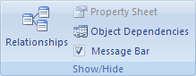

# Modifications non effectuées : risque de doublons dans champs index, clé principale ou relation interdisant les doublons. (Erreur 3022)

Vous avez tenté de dupliquer la valeur d'un champ correspondant à la clé primaire de la table sous-jacente ou à un index qui n'admet pas les doublons.
 

## Qu'est-ce qu'une clé primaire ?

Une clé primaire est un champ ou un ensemble de champs de votre table qui fournit à Microsoft Access un identifiant unique pour chaque ligne. Dans une base de données relationnelle, comme une base de données Access, vous répartissez les informations dans des tables distinctes en fonction du sujet. Vous utilisez ensuite des relations de table et des clés primaires pour indiquer à Access comment réassembler les informations. Access utilise des champs de clé primaire pour rapidement associer les données de plusieurs tables et les combiner de manière significative.
 

 
Un numéro d'identification unique comme un numéro d'ID, un numéro de série ou un code, est souvent utilisé comme clé primaire dans une table. Par exemple, si dans une table Clients, chaque client a un numéro d'ID client unique, le champ d'ID client est la clé primaire.
 

 
Il est déconseillé d'utiliser un nom ou une adresse comme clé primaire car ces informations sont susceptibles de changer.
 

 
Access vérifie que chaque enregistrement contient une valeur dans le champ de clé primaire et que cette valeur est toujours unique.
 

 

## Qu'est-ce qu'un index ?

Vous pouvez utiliser un index pour aider Access à trouver et trier plus rapidement les enregistrements. Un index stocke l'emplacement des enregistrements en fonction du ou des champs que vous avez choisi d'indexer. Une fois qu'Access a identifié l'emplacement d'un enregistrement dans l'index, il peut récupérer les données en allant directement à cet emplacement. Utiliser un index peut être considérablement plus rapide que parcourir tous les enregistrements en vue de trouver des données.
 

 
Si vous créez un index unique, Access ne vous autorise pas à entrer une nouvelle valeur dans le champ si cette valeur existe déjà pour ce même champ dans un autre enregistrement. Access crée automatiquement un identificateur unique pour les clés primaires.
 

 

## Solution

Pour résoudre ce problème, vous devez concevoir vos tables de manière à rendre impossible la saisie de valeurs dupliquées dans un champ de clé primaire ou dans un champ qui utilise un index unique.
 

 
Si le champ de clé primaire actuel doit pouvoir prendre en charge des valeurs dupliquées, vous devez supprimer la clé primaire actuelle et ajouter un champ NuméroAuto à votre table qui lui servira de clé primaire.
 

 

## Pour supprimer la clé primaire

Lorsque vous supprimez la clé primaire, les ou les champs qui servaient auparavant de clé primaire ne fournissent plus le moyen principal d'identifier un enregistrement. Toutefois, la suppression de la clé primaire ne supprime pas le ou les champs de votre table. En fait, la désignation de clé primaire est supprimée de ces champs. La suppression de la clé primaire supprime également l'index créé pour la clé primaire.
 

 

1. Avant de supprimer une clé primaire, vous devez vous assurer qu'elle ne participe à aucune relation de table. Si vous essayez de supprimer une clé primaire pour laquelle il existe des relations, Access vous avertit que vous devez commencer par supprimer la relation.
    
 
2. 
      - Si les tables qui participent à la relation de table sont ouvertes, fermez-les. Vous ne pouvez pas supprimer une relation de table entre des tables ouvertes.
    
 
  - Sous l'onglet  **Outils de base de données**, dans le groupe  **Afficher/masquer**, cliquez sur  **Relation**.
 

 

 

    
 
  - Si les tables qui participent à la relation de table ne sont pas visibles, sous l'onglet  **Schéma**, dans le groupe  **Relation**, cliquez sur  **Afficher la table**. Sélectionnez ensuite les tables à ajouter dans la boîte de dialogue  **Afficher la table**, cliquez sur  **Ajouter**, puis sur  **Fermer**.
    
 
  - Cliquez sur la ligne de la relation de table à supprimer (la ligne sélectionnée apparaît en gras), puis appuyez sur la touche Suppr.
    
 
  - Sous l'onglet  **Schéma**, dans le groupe  **Relations**, cliquez sur  **Fermer**.
 

 

 

    
 
3. Dans le volet de navigation, cliquez avec le bouton droit sur la table dont vous souhaitez supprimer la clé primaire, puis cliquez sur  **Mode création**.
    
 
4. Cliquez sur le sélecteur de ligne de la clé primaire active.
    
 
5. 
      - Si la clé primaire n'est constituée que d'un seul champ, cliquez sur le sélecteur de ligne de ce champ.
    
 
  - Si elle est constituée de plusieurs champs, cliquez sur le sélecteur de ligne de tout champ de la clé primaire.
    
 
6. Sous l'onglet  **Schéma**, dans le groupe  **Outils**, cliquez sur  **Clé primaire**.
 
-
    
 
 **RESSOURCES DE SUPPORT ACCESS**[Forum Access pour les développeurs sur MSDN](https://social.msdn.microsoft.com/Forums/office/fr-fr/home?forum=accessdev)[Aide Access sur support.office.com](https://support.office.com/search/results?query=Access)[Aide Access sur answers.microsoft.com](http://answers.microsoft.com/fr-fr/office/forum/access?page=1&amp;tab=question&amp;status=all&amp;auth=1)[Chercher des codes d'erreur Access spécifiques sur Bing](http://www.bing.com/)[Forums Access sur UtterAccess](http://www.utteraccess.com/forum/index.php?act=idx)[Wiki Access sur UtterAcess](http://www.utteraccess.com/forum/index.php?act=idx)[Centre d'aide pour les développeurs Access et la programmation VBA (FMS)](http://www.fmsinc.com/MicrosoftAccess/developer/)[Billets sur Access sur StackOverflow](http://stackoverflow.com/questions/tagged/ms-access)
 
