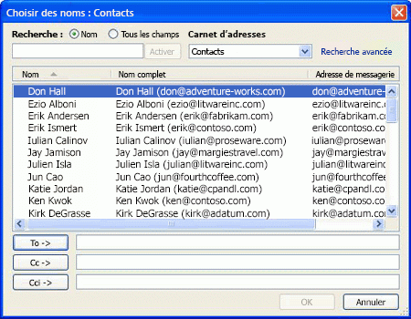

# Afficher les noms du Carnet d'adresses

Cette rubrique décrit le carnet d'adresses et explique comment afficher par programme les noms d'un carnet d'adresses dans la boîte de dialogue Carnet d'adresses Outlook.
 

Outlook gère une hiérarchie de carnets d'adresses pour une même session. Afin de permettre au fournisseur de transport de remettre un message, le destinataire doit avoir une entrée d'adresse dans l'un des carnets d'adresses de cette hiérarchie.
 

Un carnet d'adresses contient une ou plusieurs listes d'adresses. Chaque liste d'adresses est composée d'utilisateurs, de listes de distribution ou d'autres types d'entrées d'adresse. La liste d'adresses globale d'Exchange est un exemple de liste d'adresses. Dans l'interface utilisateur d'Outlook, vous pouvez ouvrir la boîte de dialogue Carnet d'adresses pour afficher et sélectionner des noms dans une liste d'adresses. Lorsque vous créez un élément de courrier ou de rendez-vous ou que vous affectez un élément de tâche, le Carnet d'adresses vous permet de sélectionner les destinataires.
 

Le Carnet d'adresses Outlook est une liste d'adresses ou un jeu de listes d'adresses créées automatiquement par Outlook. Par défaut, il contient une liste d'adresses pour les contacts présents dans votre dossier Contacts pourvu que celui-ci contienne au moins une entrée d'adresse de messagerie ou de numéro de télécopie. À mesure que vous créez d'autres dossiers dans le module Contacts, par défaut, chaque dossier devient également une liste d'adresses dans le Carnet d'adresses Outlook. Sous l'onglet  **Carnet d'adresses Outlook** de la boîte de dialogue **Propriétés** du dossier, vous pouvez activer ou désactiver **Afficher ce dossier sous forme de carnet d'adresses de messagerie**.
 
Du point de vue de la programmation, Outlook gère une collection d'objets  **[AddressLists](b8c5ce75-3030-0179-45bb-f44fe6628074.md)** pour la session en cours. Chaque objet **[AddressList](84611afe-48b1-185b-df4b-0f004e7436ff.md)** se compose d'une collection d'objets **[AddressEntries](db91b717-07c6-d1f2-c545-b766ee1f0c6b.md)**. Il existe différents types de listes d'adresses (tels qu'énumérés par **[OlAddressListType](60da59f7-8577-a91a-e4cd-7499be207b32.md)** ) et différents types d'entrées d'adresses (tels qu'énumérés par **[OlAddressEntryUserType](9f128fe4-9981-e06a-d69c-ca7cf9107fe9.md)** ). Lorsque vous ajoutez un dossier au module Contacts, vous pouvez utiliser la propriété **[Folder.ShowAsOutlookAB](bb74591b-a3ea-efbd-e7b2-f374f1974be8.md)** pour indiquer si ce dossier doit s'afficher en tant que liste d'adresses dans le Carnet d'adresses Outlook.
 
L'objet  **[Recipient](8cee4d79-ec55-52a4-710b-6456944ca86d.md)** est associé à un objet **[AddressEntry](d4a0a85e-8bab-bc56-57bc-d70c3c570c8e.md)** qui est défini par la propriété **[Recipient.Address](8e14f39a-0000-1039-bb0b-7726d7828a68.md)**. Vous pouvez également utiliser la propriété **[AddressEntry.AddressEntryUserType](082ff106-c7c8-a505-fc82-170540d851fe.md)** pour identifier le type du destinataire, par exemple s'il s'agit d'un élément Contact, d'un utilisateur Exchange ou d'une liste de distribution Exchange.
 
L'objet  **[SelectNamesDialog](1522736a-3cad-9f1c-4da9-b52a3a01731c.md)** permet d'afficher les noms d'une liste d'adresses dans une boîte de dialogue analogue à la boîte de dialogue **Sélectionner des noms** de l'interface utilisateur Outlook. La figure suivante est une illustration de la boîte de dialogue **Sélectionner des noms** avec le dossier Contacts affiché.
 

 
Cette boîte de dialogue permet aux utilisateurs de sélectionner des entrées dans une ou plusieurs listes d'adresses du Carnet d'adresses et de renvoyer les destinataires sélectionnés dans la propriété  **[SelectNamesDialog.Recipients](8b939af1-b266-55ad-f9ad-8802ac2e0930.md)**. Les propriétés et les méthodes de **SelectNamesDialog** vous permettent de contrôler les éléments suivants de la boîte de dialogue :
 

 

- liste d'adresses initiale à afficher dans la boîte de dialogue, et si cette liste d'adresses doit être la seule à s'afficher ;
    
 
- nombre de sélecteurs de destinataires, c'est-à-dire, si les trois intitulés  **À**, **Cc** et **Cci** doivent être affichés ;
    
 
- chaînes représentant le titre, les intitulés  **À**,  **Cc** et **Cci**, le cas échéant. Les titres et les intitulés longs sont tronqués sans que la boîte de dialogue soit redimensionnée dans la largeur ;
    
 
- si l'utilisateur peut sélectionner une ou plusieurs entrées d'adresse à la fois ;
    
 
- si les noms de destinataires doivent être résolus avant la fermeture de la boîte de dialogue ;
    
 
- tâches à exécuter si les noms de destinataires ne sont pas tous résolus.
    
 

 
Pour afficher la boîte de dialogue avec les noms d'une liste d'adresses :
 

 

1. Utilisez la méthode  **[GetSelectNamesDialog](883d90e0-b3cc-e76e-cbe6-cb271e9ccb37.md)** de la session en cours (indiquée par **[Application.Session](720b2849-fe01-afb3-363c-f3bf0cd7d872.md)** ) pour obtenir une instance de l'objet **SelectNamesDialog** pour la session en cours.
    
 
2. Utilisez la propriété  **[AddressLists](68b236db-f964-6f7f-6246-e79c6ada19e9.md)** de la session en cours pour obtenir la collection d'objets **AddressLists** pour la session en cours.
    
 
3. Par défaut, la boîte de dialogue est initialisée avec la liste d'adresses dont la propriété  **[AddressList.IsInitialAddressList](cc3f1f6a-7377-6db1-2f7c-3baf9a7361db.md)** a la valeur **True**. Si nécessaire, vous pouvez utiliser la propriété  **[SelectNamesDialog.InitialAddressList](19cfe6be-e6b5-62e0-741a-b196ef7bac77.md)** pour initialiser la boîte de dialogue avec un autre objet **AddressList** de la collection **AddressLists** à l'étape 2.
    
 
4. Utilisez  **[SelectNamesDialog.Display](a689dfca-e4f7-f1c0-03a1-71e7d7e310b7.md)** pour afficher la boîte de dialogue. Cette méthode renvoie une valeur **True** ou **False** en fonction de **[SelectNamesDialog.ForceResolution](f859e464-8d06-f44c-e388-f6b6427bec1a.md)** et de la réponse de l'utilisateur :
    
      - Cette méthode renvoie la valeur  **True** si **SelectNamesDialog.ForceResolution** est défini, si tous les noms sélectionnés sont résolus et si l'utilisateur clique sur **OK**.
    
 
  - Elle renvoie  **False** si **SelectNamesDialog.ForceResolution** est défini, mais que les noms de destinataires ne sont pas tous résolus.
    
 
  - Elle renvoie la valeur  **False** si **SelectNamesDialog.ForceResolution** n'est pas défini et que l'utilisateur clique sur **OK**.
    
 
  - Elle renvoie la valeur  **False** si l'utilisateur clique sur **Annuler** ou sur l'icône **Fermer**.
    
 
5. Si  **[SelectNamesDialog.Display](a689dfca-e4f7-f1c0-03a1-71e7d7e310b7.md)** renvoie **True**, obtenez les entrées d'adresses sélectionnées à l'aide de  **[SelectNamesDialog.Recipients](8b939af1-b266-55ad-f9ad-8802ac2e0930.md)**.
    
 

 

## Voir aussi

#### Concepts

 
[Procédure : identifier la liste d'adresses globales ou un ensemble de listes d'adresses avec un magasin](2cca6dc2-883d-b8cf-cd60-98614d2fb673.md)