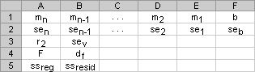
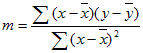
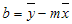

# WorksheetFunction.LinEst, méthode (Excel)

Calcule les statistiques pour une droite à l'aide de la méthode des « moindres carrés » pour calculer une droite qui correspond mieux à vos données et renvoie une matrice qui décrit la droite. Comme cette fonction renvoie une matrice de valeurs, elle doit être entrée sous forme de formule matricielle.
 

## Syntaxe

*expression* . **LinEst**( ***Arg1***, ***Arg2***, ***Arg3***, ***Arg4*** )
 

 
*expression* Variable représentant un objet **WorksheetFunction**.
 

 

### Paramètres

|**Nom**|**Obligatoire/Facultatif**|**Type de données**|**Description**|
|:-----|:-----|:-----|:-----|
| _Arg1_|Obligatoire|**Variante**|y_connus - ensemble de valeurs y que vous connaissez dans la relation y = mx + b.|
| _Arg2_|Facultatif|**Variante**|x_connus - ensemble de valeurs x facultatives que vous connaissez peut-être déjà dans la relation y = mx + b.|
| _Arg3_|Facultatif|**Variante**|Const - valeur logique indiquant si la constante b doit être forcée pour être égale à 0.|
| _Arg4_|Facultatif|**Variante**|Stats - valeur logique qui spécifie si des statistiques de régression supplémentaires doivent être renvoyées.|

### Valeur renvoyée

Variante
 

 

## Remarques

L'équation pour la droite est la suivante :
 

 
y = mx + b ou
 

 
y = m1x1 + m2x2 + ... + b (s'il y a plages de valeurs x)
 

 
où la valeur y dépendante est une fonction des valeurs x indépendantes. Les valeurs_m sont des coefficients correspondant à chaque valeur x et b est une valeur constante. Notez que x, y et m peuvent être des vecteurs. La matrice renvoyée par la fonction LINEST est {mn,mn-1,...,m1,b}. La fonction LINEST peut également renvoyer des statistiques de régression supplémentaires.
 

 

- Si la matrice y_connus comporte une seule colonne, chaque colonne de x_connus est interprétée comme une variable distincte.
    
 
- Si la matrice y_connus comporte une seule ligne, chaque ligne de x_connus est interprétée comme une variable distincte.
    
 

- La matrice x_connus peut inclure un ou plusieurs ensembles de variables. Si une seule variable est utilisée, les matrices y_connus et x_connus peuvent être des plages de valeurs de toute forme, tant que leurs dimensions sont égales. Si plusieurs variables sont utilisées, la matrice y_connus doit être un vecteur (c'est-à-dire, une plage de valeurs avec une hauteur d'une ligne ou une largeur d'une colonne).
    
 
- Si la matrice x_connus est omise, c'est la matrice {1,2,3,...} qui est supposée avoir la même taille que la matrice y_connus.
    
 

- Si la constante prend la valeur TRUE ou est omise, b est calculé normalement.
    
 
- Si la constante prend la valeur FALSE, b est égal à 0 et les valeurs m sont ajustées de sorte que y = m^x.
    
 

- Si stats prend la valeur TRUE, la fonction LINEST renvoie des statistiques de régression supplémentaires, afin que la matrice renvoyée soit {mn,mn-1,...,m1,b;sen,sen-1,...,se1,seb;r2,sey;F,df;ssreg,ssresid}.
    
 
- Si stats prend la valeur FALSE ou est omis, la fonction LINEST ne renvoie que les coefficients_m et la constante b.
    
 
Les statistiques de régression supplémentaires sont les suivantes :
 

 

|**Statistique**|**Description**|
|:-----|:-----|
|se1,se2,...,sen|Les valeurs d'erreur type pour les coefficients m1,m2,...,mn.|
|seb|La valeur d'erreur type pour la constante b (seb = #N/A lorsque const prend la valeur FALSE).|
|r2|Le coefficient de détermination. Compare les valeurs y estimées et réelles, et classe les valeurs de 0 à 1. Si la valeur est 1, il existe une corrélation parfaite dans l'échantillon (il n'y a pas de différence entre la valeur y estimée et la valeur y réelle). À l'autre extrême, si le coefficient de détermination est 0, l'équation de régression n'est pas utile pour prédire une valeur y. Pour plus d'informations sur le calcul der2, voir la section « Remarques » dans la suite de cette rubrique.|
|sey|L'erreur type pour l'estimation de y.|
|F|La statistique F ou valeur F observée. Utilisez la statistique F pour déterminer si la relation observée entre les variables dépendantes et les variables indépendantes est le fruit du hasard.|
|df|Les degrés de liberté. Utilisez les degrés de liberté pour vous aider à trouver les valeurs critiques F dans un tableau de statistiques. Comparez les valeurs trouvées dans le tableau à la statistique F renvoyée par la fonction LINEST pour déterminer un niveau de confiance pour le modèle.|
|ssreg|La somme des carrés de régression.|
|ssresid|La somme des carrés résiduelle. Pour plus d'informations sur le calcul de ssreg et ssresid, voir la section « Remarques » dans la suite de cette rubrique.|
L'illustration ci-dessous indique l'ordre dans lequel les statistiques de régression supplémentaires sont renvoyées.
 

 

 

 

 

 

 

- Vous pouvez décrire une droite avec la pente et l'intersection y : Pente (m) : Pour trouver la pente d'une droite, souvent désignée par m, prenez deux points sur la droite (x1,y1) et (x2,y2). La pente est égale à (y2 - y1)/(x2 - x1). Intersection y (b) : L'intersection y d'une droite, souvent désignée par b, est la valeur de y au point auquel la droite croise l'axe y. L'équation d'une droite est y = mx + b. Une fois que vous connaissez les valeurs de m et b, vous pouvez calculer les points sur la droite en insérant la valeur y ou x dans l'équation. Vous pouvez également utiliser la fonction TREND.
    
 
- Lorsque vous n'avez qu'une variable x indépendante, vous pouvez obtenir les valeurs de pente et d'intersection y directement en utilisant les formules suivantes : Pente :  =INDEX(LINEST(known_y's,known_x's),1) Intersection y : =INDEX(LINEST(known_y's,known_x's),2)
    
 
- La précision de la droite calculée par la fonction LINEST dépend du degré de nuage de points de vos données. Plus les données sont linéaires, plus le modèle LINEST est précis. La fonction LINEST utilise la méthode des moindres carrés pour déterminer l'ajustement des données. Lorsque vous ne disposez qu'une variable x indépendante, le calcul de m et de b se base sur les formules suivantes :
 

 
où x et y sont des moyennes de l'échantillon, c'est-à-dire x = AVERAGE(x_connus) et y = AVERAGE(y_connus).
    
 
- Les fonctions d'ajustement des droites et des courbes, LINEST et LOGEST, peuvent calculer la droite ou la courbe exponentielle la plus ajustée à vos données. Cependant, vous devez déterminer le résultat qui est le plus ajusté à vos données. Vous pouvez calculer TREND(y_connus,x_connus) pour une droite ou GROWTH(y_connus,x_connus) pour une courbe exponentielle. Ces fonctions, sans l'argument nouvel x, renvoient une matrice de valeurs y prévues sur cette droite ou cette courbe à vos points de données réels. Vous pouvez comparer les valeurs prévues avec les valeurs réelles. Vous pouvez les représenter graphiquement pour effectuer une comparaison visuelle.
    
 
- Lors de l'analyse de la régression, Microsoft Excel calcule pour chaque point la différence des carrés entre la valeur y estimée pour ce point et la valeur y réelle. La somme de ces différences de carrés est appelée somme des carrés résiduelle, ssresid. Microsoft Excel calcule alors la somme totale des carrés, sstotal. Lorsque const = TRUE ou est omis, la somme totale des carrés est la somme des différences des carrés entre les valeurs y réelles et la moyenne des valeurs y. Lorsque const = FALSE, la somme totale des carrés est la somme des carrés des valeurs y réelles (sans soustraire la valeur y moyenne de chaque valeur y individuelle). La somme de régression des carrés, ssreg, peut être obtenue avec la formule suivante : ssreg = sstotal - ssresid. Plus la somme des carrés résiduelle est petite, par rapport à la somme totale des carrés, plus la valeur du coefficient de détermination, r2, est grande. Cela indique à quel point l'équation qui résulte de l'analyse de régression explique la relation entre les variables. r2 est égal à ssreg/sstotal.
    
 
- Dans certains cas, une ou plusieurs colonnes X (considérons que X et Y sont en colonnes) peuvent ne comporter aucune valeur de prévision supplémentaire en présence des autres colonnes X. En d'autres termes, la suppression d'une ou de plusieurs colonnes X peut permettre d'obtenir des valeurs Y avec une précision égale. En pareil cas, ces colonnes X redondantes doivent être omises du modèle de régression. Ce phénomène est appelé « colinéarité » car toute colonne X redondante peut être exprimée sous forme de somme de dénominateurs des colonnes X non redondantes. La fonction LINEST recherche la colinéarité et supprime les colonnes X redondantes du modèle de régression lorsqu'elle les identifie. Les colonnes X supprimées sont reconnaissables dans le résultat de la fonction LINEST car elles possèdent un coefficient de 0 et un se de 0. Si une ou plusieurs colonnes sont supprimées parce qu'elles sont redondantes, df est affecté car df dépend du nombre de colonnes X effectivement utilisées pour des prévisions. Si df est modifié parce que des colonnes X sont supprimées, la valeur de sey et de F est également affectée. Dans la pratique, la colinéarité est relativement rare. Cependant, le phénomène de colinéarité est plus susceptible de se produire lorsque certaines colonnes X ne contiennent que des 0 et des 1 pour indiquer qu'un sujet d'une expérience appartient ou non à un groupe particulier. Si const = TRUE ou est omis, la fonction LINEST insère effectivement une colonne X supplémentaire comportant tous les 1 pour façonner l'intersection. Si une des colonnes contient un 1 pour chaque sujet masculin ou un 0 autrement, et que vous disposez également d'une colonne comportant un 1 pour chaque sujet féminin, ou 0 autrement, cette dernière colonne est redondante car les entrées peuvent être déduites en soustrayant les entrées de la colonne de l'indicateur Masculin des entrées de la colonne supplémentaires comportant tous les 1 ajoutés par la fonction LINEST.
    
 
- df est calculé de la manière suivante lorsque aucune colonne X n'est supprimée du modèle en raison de la colinéarité : s'il existe k colonnes de x_connus et que const = TRUE ou est omis, df = n - k - 1. Si const = FALSE, df = n - k. Dans les deux cas, chaque colonne X supprimée en raison de la colinéarité fait augmenter df de 1.
    
 
- Les formules qui renvoient des matrices doivent être saisies sous forme de formules matricielles.
    
 
- Lorsque vous entrez une constante matricielle comme x_connus comme argument, utilisez des virgules pour séparer les valeurs sur la même ligne et des points-virgules pour séparer les lignes. Les caractères de séparation peuvent être différents en fonction des paramètres régionaux et linguistiques définis dans  **Options régionales et linguistiques**, dans le  **Panneau de configuration**.
    
 
- Notez que les valeurs y prévues par l'équation de régression peuvent être incorrectes si elles se trouvent en dehors de la plage de valeurs y utilisées pour déterminer l'équation.
    
 
- L'algorithme sous-jacent utilisé dans la fonction LINEST est différent de l'algorithme sous-jacent utilisé dans les fonctions SLOPE et INTERCEPT. La différence entre ces algorithmes peut conduire à des résultats différents lorsque les données ne sont pas déterminées et qu'elles sont colinéaires. Par exemple, si les points de données de l'argument y_connus prennent la valeur 0 et que ceux de l'argument y_connus prennent la valeur 1 :
    
      - L'algorithme LINEST renvoie la valeur 0. Cet algorithme est conçu pour renvoyer des résultats raisonnables pour des données colinéaires, et dans ce cas, au moins une réponse est trouvée.
    
 
  - Les fonctions SLOPE et INTERCEPT renvoient une erreur #DIV/0!. L'algorithme des fonctions INTERCEPT et SLOPE est conçu pour ne rechercher qu'une seule réponse, et en l'occurrence, il peut y avoir plusieurs réponses.
    
 

## Voir aussi

#### Concepts

 
[Objet WorksheetFunction](7b1d5639-363d-632c-2cf0-2232562646b6.md)
#### Autres ressources

 
[Membres de l'objet WorksheetFunction](6811ca87-4b53-0bff-88c9-30bf7497879a.md)