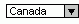

# ComboBox, objet (Access)

Cet objet correspond à un contrôle de zone de liste modifiable. Le contrôle Zone de liste modifiable combine les caractéristiques d'une zone de texte et d'une zone de liste. Vous pouvez utiliser une zone de liste modifiable lorsque vous voulez avoir la possibilité soit de saisir une valeur soit d'en sélectionner une dans une liste prédéfinie.


## Remarques


|||
|:-----|:-----|
|**Contrôle**:|**Outil**:|
|


|


|
En mode Formulaire, Microsoft Access n'affiche la liste que lorsque vous cliquez sur la flèche de la zone de liste modifiable.

Si vous avez activé les Assistants Contrôle avant de sélectionner l'outil Zone de liste modifiable, vous pourrez être aidé d'un Assistant pour créer la zone de liste modifiable. Pour activer et désactiver les Assistants Contrôle, cliquez sur l'outil  **Assistants Contrôle** dans la boîte d'outils.

Le paramétrage de la propriété  **LimitToList** détermine si vous pouvez entrer des valeurs ne se trouvant pas dans la liste.

La liste peut comprendre une ou plusieurs colonnes, accompagnées ou dépourvues d'en-têtes.

 **Lien fourni par :** Luke Chung,[FMS, Inc.](http://www.fmsinc.com/)


- [Conseils et techniques concernant l'utilisation et la validation des zones de liste modifiable](http://www.fmsinc.com/free/NewTips/Access/ComboBox/AccessComboBox.asp)
    
 **Liens fournis par :**
 Communauté[UtterAccess](http://www.utteraccess.com)


- [Zone de liste modifiable](http://www.utteraccess.com/wiki/index.php/Combo_Box)
    
- [Zones de liste modifiable en cascade](http://www.utteraccess.com/wiki/index.php/Cascading_Combo_Boxes)
    
- [Zones de liste modifiable en cascade : Démo](http://www.utteraccess.com/wiki/index.php/Cascading_Combo_Boxes:_Demo)
    
- [Zones de liste modifiable en cascade - Laisser des valeurs Null](http://www.utteraccess.com/wiki/index.php/Cascade_Combo_Leaving_Null_Values)
    
- [Formulaires : Remplir les contrôles/zones des texte en fonction de la sélection de zones de liste modifiable](http://www.utteraccess.com/wiki/index.php/Forms:_Populate_Controls/Text_Boxes_Based_on_Combobox_Selection)
    

## Exemple

L'exemple suivant montre comment utiliser plusieurs contrôles  **ComboBox** afin de fournir des critères pour une requête.

 **Exemple de code fourni par :**
 Communauté[UtterAccess](http://www.utteraccess.com)

Exemples


```
Private Sub cmdSearch_Click()
    Dim db As Database
    Dim qd As QueryDef
    Dim vWhere As Variant
    
    Set db = CurrentDb()
    
    On Error Resume Next
    db.QueryDefs.Delete "Query1"
    On Error GoTo 0
    
    vWhere = Null
    vWhere = vWhere &amp; " AND [PymtTypeID]=" + Me.cboPaymentTypes
    vWhere = vWhere &amp; " AND [RefundTypeID]=" + Me.cboRefundType
    vWhere = vWhere &amp; " AND [RefundCDMID]=" + Me.cboRefundCDM
    vWhere = vWhere &amp; " AND [RefundOptionID]=" + Me.cboRefundOption
    vWhere = vWhere &amp; " AND [RefundCodeID]=" + Me.cboRefundCode
    
    If Nz(vWhere, "") = "" Then
        MsgBox "There are no search criteria selected." &amp; vbCrLf &amp; vbCrLf &amp; _
        "Search Cancelled.", vbInformation, "Search Canceled."
        
    Else
        Set qd = db.CreateQueryDef("Query1", "SELECT * FROM tblRefundData WHERE " &amp; _
        Mid(vWhere, 6))
        
        db.Close
        Set db = Nothing
        
        DoCmd.OpenQuery "Query1", acViewNormal, acReadOnly
    End If
End Sub
```


L'exemple suivant montre comment définir la propriété  **RowSource** d'une zone de liste modifiable lors du chargement d'un formulaire. Lorsque le formulaire s'affiche, les éléments stockés dans le champ **Départements** de la liste modifiable **tblDepartment** apparaissent dans la liste modifiable **cboDept**.

 **Exemple de code fourni par :**
 Bill Jelen,[MrExcel.com](http://www.mrexcel.com/)


```
Private Sub Form_Load()
    Me.Caption = "Today is " &amp; Format$(Date, "dddd mmm-d-yyyy")
    Me.RecordSource = "tblDepartments"
    DoCmd.Maximize  
    txtDept.ControlSource = "Department"
    cmdClose.Caption = "&amp;Close"
    cboDept.RowSourceType = "Table/Query"
    cboDept.RowSource = "SELECT Department FROM tblDepartments"
End Sub
```


L'exemple suivant montre comment créer une zone de liste modifiable liée à une colonne tout en en affichant une autre. La définition de la propriété  **ColumnCount** sur 2 indique que la zone de liste modifiable **cboDept** affichera les deux premières colonnes de la source de données spécifiée par la propriété **RowSource**. La définition de la propriété **BoundColumn** sur 1 indique que la valeur stockée dans la première colonne sera renvoyée lorsque vous inspectez la valeur de la zone de liste modifiable.

La propriété  **ColumnWidths** spécifie la largeur des deux colonnes. En définissant la largeur de la première colonne sur **0in.**, la première colonne n'est pas affichée dans la zone de liste modifiable.

 **Exemple de code fourni par :**
 Bill Jelen,[MrExcel.com](http://www.mrexcel.com/)


```
Private Sub cboDept_Enter()
    With cboDept
        .RowSource = "SELECT * FROM tblDepartments ORDER BY Department"
        .ColumnCount = 2
        .BoundColumn = 1
        .ColumnWidths = "0in.;1in."
    End With
End Sub
```

L'exemple suivant montre comment ajouter un élément à une zone de liste modifiable liée.

 **Exemple de code fourni par :**[Référence du programmeur Microsoft Access 2010](http://www.wrox.com/WileyCDA/WroxTitle/Access-2010-Programmer-s-Reference.productCd-0470591668.mdl)


```
Private Sub cboMainCategory_NotInList(NewData As String, Response As Integer)

    On Error GoTo Error_Handler
    Dim intAnswer As Integer
    intAnswer = MsgBox("""" &amp; NewData &amp; """ is not an approved category. " &amp; vbcrlf _
        &amp; "Do you want to add it now?" _ vbYesNo + vbQuestion, "Invalid Category")

    Select Case intAnswer
        Case vbYes
            DoCmd.SetWarnings False
            DoCmd.RunSQL "INSERT INTO tlkpCategoryNotInList (Category) "
                &amp; _ "Select """ &amp; NewData &amp; """;"
            DoCmd.SetWarnings True
            Response = acDataErrAdded
        Case vbNo
            MsgBox "Please select an item from the list.", _
                vbExclamation + vbOKOnly, "Invalid Entry"
            Response = acDataErrContinue

    End Select

    Exit_Procedure:
        DoCmd.SetWarnings True
        Exit Sub

    Error_Handler:
        MsgBox Err.Number &amp; ", " &amp; Error Description
        Resume Exit_Procedure
        Resume

End Sub
```


## À propos des collaborateurs
<a name="AboutContributors"> </a>

Luke Chung est le fondateur et le président de FMS, Inc., l'un des principaux fournisseurs de solutions de base de données et d'outils de développement personnalisés.

UtterAccess est le premier forum d'aide et wiki de Microsoft Access. Cliquez ici pour le rejoindre.

Holy Macro! Books publie des livres divertissants pour les personnes qui utilisent Microsoft Office. Vous pouvez consulter le catalogue complet sur MrExcel.com.

Wrox Press est guidé par la philosophie de programmeur à programmeur. Les livres Wrox sont écrits par des programmeurs pour des programmeurs et la marque Wrox est synonyme de solutions de référence aux problèmes de programmation concrets.


## Voir aussi
<a name="AboutContributors"> </a>


#### Autres ressources


[Référence du modèle objet Access](http://msdn.microsoft.com/library/2de134a4-6c5c-d2a3-8377-f4dd973ba650%28Office.15%29.aspx)
[Membres de l'objet ComboBox](d0d83ca3-3698-295e-5335-7d0816557d6b.md)