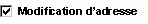

# CheckBox, objet (Access)

Cet objet correspond à une case à cocher dans un formulaire ou un état. Cette case à cocher est un contrôle indépendant qui affiche une valeur Oui/Non à partir d'une source d'enregistrement sous-jacente.

## Remarques

|||
|:-----|:-----|
|**Contrôle**:|**Outil**:|
|

|

|
Quand vous activez ou désactivez une case à cocher liée à un champ Oui/Non, Microsoft Access affiche la valeur dans la table sous-jacente en fonction de la propriété  **Format** (Oui/Non, **True** / **False** ou Actif/Inactif) du champ.

Vous pouvez aussi inclure des cases à cocher dans un groupe d'options pour afficher des valeurs à sélectionner.

## Voir aussi

#### Autres ressources

[Référence du modèle objet Access](http://msdn.microsoft.com/library/2de134a4-6c5c-d2a3-8377-f4dd973ba650%28Office.15%29.aspx)
[Membres de l'objet CheckBox](aeefeae7-4053-ec23-80ef-1da1099f54f0.md)