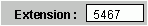

# Objet TextBox (Access)

Cet objet représente un contrôle de zone de texte sur un formulaire ou un rapport. Les zones de texte sont utilisées pour afficher les données à partir d'une source d'enregistrement, pour afficher les résultats d'un calcul ou pour accepter la saisie d'un utilisateur.


## Exemple

L'exemple suivant utilise un formulaire avec une zone de texte pour la saisie utilisateur. Le code affiche un message lorsque l'utilisateur saisit des données, puis appuie sur Retour.


```

Private Sub txtValue1_BeforeUpdate(Cancel As Integer)

MsgBox "The Text box is being updated."

End Sub

```


## Remarques

Les zones de texte peuvent être liées ou dissociées. Vous utilisez une zone de texte liée pour afficher les données d'un champ particulier. Vous utilisez une zone de texte dissociée pour afficher les résultats d'un calcul ou accepter la saisie d'un utilisateur (comme dans l'exemple de code ci-dessus).


|||
|:-----|:-----|
|**Contrôle**:|**Outil**:|
|


|


|

## Voir aussi


#### Autres ressources


[Référence du modèle objet Access](http://msdn.microsoft.com/library/2de134a4-6c5c-d2a3-8377-f4dd973ba650%28Office.15%29.aspx)
[Membres de l'objet TextBox](bb55abbc-902e-fc2d-bdff-063c55426cd0.md)