# Nouveautés d'Access pour les développeurs
Découvrez les fonctions disponibles dans Access 2013 qui facilitent la création, le déploiement et la gestion d'applications web de collaboration, locales ou dans le cloud.

## Introduction

Access 2013 propose un nouveau modèle d'application conçu dans un seul but : simplifier la programmation web de façon très similaire aux versions d'Access avec développement Windows. Access 2013 permet aux experts de créer rapidement une application utilisable dans le cadre de leur activité. En utilisant Microsoft SharePoint 2013 pour héberger la partie frontale de l'application, et Microsoft SQL Server 2012 comme technologie de stockage des données, Access 2013 permet de gérer et de faire évoluer plus facilement les applications Access. La compatibilité avec Office 365 et SQL Azure étend considérablement la portée des applications Access.

## Nouveau modèle d'application

Dans un environnement local, les applications Access 2013 sont hébergées par SharePoint 2013, et les données stockées dans SQL Server 2012. SharePoint 2013 assure l'authentification, les autorisations et la sécurité pour les applications Access 2013. Les tables, macros, requêtes et affichages principaux sont stockés dans une base de données SQL Server 2012.

La figure 1 donne une vue d'ensemble de l'architecture Access 2013.

**Figure 1. Architecture Access 2013**

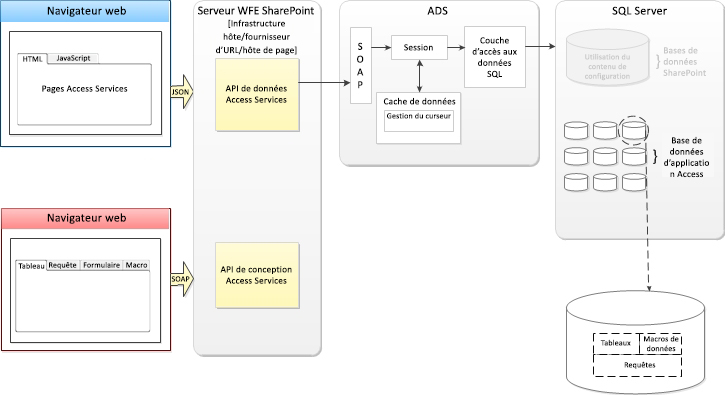Lors de la création d'une application Access, Access Services dans SharePoint Server 2013 crée une Base de données d'application pour stocker les données, requêtes, macros et affichages contenus dans l'application. La base de données système d'Access Services 2013 peut être configurée pour créer une nouvelle Base de données d'application sur un serveur SQL Server 2012 séparé.

L'utilisation de SQL Server 2012 pour le stockage des données permet de gérer et de faire évoluer les applications Access comme jamais auparavant. L'époque où il fallait reconcevoir et réimplémenter une application Access dans un environnement plus puissant est révolue.

Une application Access 2013 est en ligne dès que sa création est terminée. Vous pouvez décider de partager l'application avec d'autres utilisateurs, de la déployer dans le catalogue d'entreprise privé ou de la déployer dans Office Store.

## Views

Les affichages (appelés  _« formulaires »_ dans les bases de données du Bureau Access) permettent aux utilisateurs d'interagir avec votre application Access. Les affichages dans les applications Access 2013 contiennent un ensemble commun d'éléments d'interface utilisateur qui permettent de créer rapidement des applications.

Access 2013 est conçu pour vous permettre de créer des affichages fonctionnels avec un minimum d'intervention. Lorsque vous créez une table, Access crée automatiquement deux affichages. La figure 2 illustre une nouvelle table avec les vues automatiquement créées.

**Figure 2. Nouvelle table avec deux affichages**

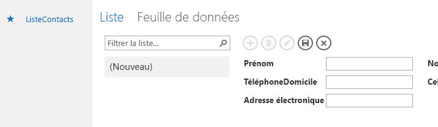Les affichages sont organisés en fonction des tables auxquelles ils sont liés dans le volet en mosaïque. Par défaut, chaque table est représentée par un élément de mosaïque dans ce volet. La figure 3 illustre la table Commandes sélectionnée dans le volet en mosaïque.

**Figure 3. Volet en mosaïque**

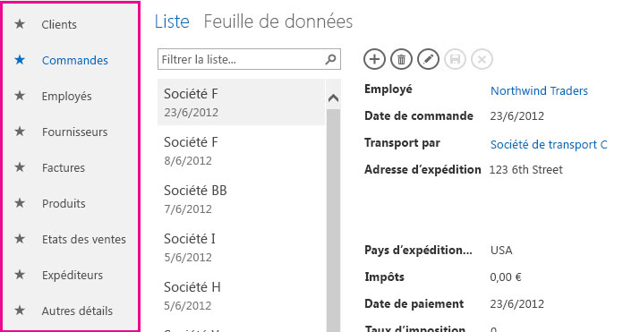Vous pouvez réorganiser les tables dans le volet en mosaïque. Vous pouvez modifier le nom affiché sur un élément de mosaïque sans que cela ait pour effet de renommer la table sous-jacente. En revanche, la suppression de l'élément de mosaïque a pour effet de supprimer la table.

Vous pouvez masquer les éléments de mosaïque que vous ne souhaitez pas afficher dans le navigateur web. Lorsque vous masquez un élément de mosaïque, vous pouvez encore modifier la table et les affichages sous-jacents dans Access. Bien que vous ne puissiez pas accéder directement aux affichages des éléments de mosaïque masqués, vous pouvez utiliser les actions de macro  **Changer de vue** ou **OuvrirFenêtreContextuelle** pour accéder à un affichage associé à un élément de mosaïque masqué. La figure 4 montre que les éléments de mosaïque Problèmes connexes et Commentaires sur le problème ont été masqués.

**Figure 4. Éléments de mosaïque masqués dans le concepteur de vues**

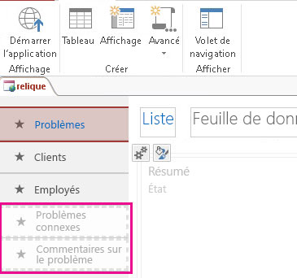Quand vous sélectionnez un élément de mosaïque, le Sélecteur d'affichage ouvre l'affichage correspondant. La Figure 5 montre l'affichage Feuilles de données des commandes sélectionné.

**Figure 5. Affichage Feuille de données des commandes actif**

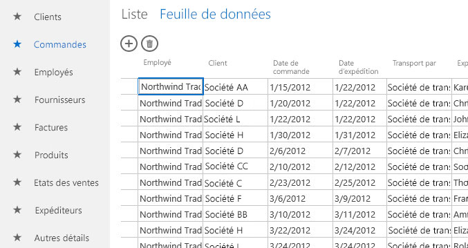Vous pouvez supprimer les affichages par défaut et ajouter des affichages personnalisés à tout élément de mosaïque.

### Types d'affichages

Vous pouvez créer dans votre application Access 2013 quatre types d'affichages : Détails de la liste, Feuille de données, Synthèse et Vide.

L'affichage Détails de la liste est de ceux qu'Access génère automatiquement lors de la création d'une table. Le principal élément qui caractérise un affichage Liste est le volet Liste du côté gauche de l'affichage. Ce volet permet de filtrer et de parcourir les enregistrements figurant dans l'affichage.

Le volet Liste permet d'afficher jusqu'à trois éléments de chaque enregistrement en définissant ses propriétés  **Principal**, **Secondaire** et **Miniature**. La figure 6 montre le volet Liste dans l'affichage Liste des employés configuré pour afficher les champs **NomComplet** et **Fonction**.

**Figure 6. Affichage Détails de la liste**

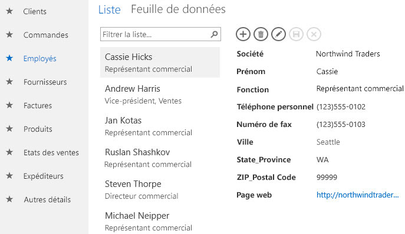La zone de recherche en haut du volet Liste filtre l'affichage en recherchant dans toutes les valeurs.

Feuille de données est l'autre type d'affichage généré automatiquement par Access lors de la création d'une table. L'affichage Feuille de données est utile pour ceux qui trouvent plus facile d'entrer, de trier et de filtrer des données comme ils le font dans une feuille de calcul. La figure 7 montre que l'affichage Feuille de données des commandes est filtré pour présenter les commandes en attente d'expédition.

**Figure 7. Affichage Feuille de données filtré**

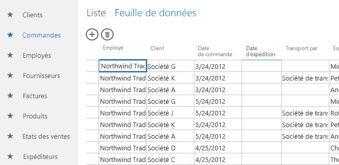L'affichage Synthèse permet de regrouper des enregistrements sur la base d'un champ, et d'éventuellement calculer une somme ou une moyenne. Le champ servant de base au regroupement affiche ses valeurs dans un affichage Liste. Lors de la sélection d'un groupe, l'enregistrement contenu dans le groupe s'affiche dans un contrôle d'éléments associés. Vous pouvez configurer le contrôle des éléments associés pour afficher jusqu'à quatre champs contenant des informations sur l'enregistrement. Vous pouvez spécifier une vue contextuelle si vous voulez afficher des détails sur l'élément. La figure 8 présente l'affichage  **Problèmes par État**, un affichage Synthèse qui groupe la table **Problèmes** sur le champ **État**.

**Figure 8. Affichage Synthèse**

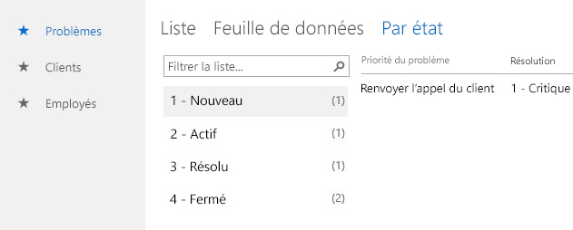Les affichages vides ne contiennent aucun élément lors de leur création. Ils sont utiles pour créer une vue contextuelle contenant un seul enregistrement lors de son ouverture. Vous pouvez également utiliser un affichage vide pour créer un menu général personnalisé pour permettre à l'utilisateur de naviguer dans votre application.

### Personnalisation d'un affichage

Le concepteur de vues Access 2013 ne permet pas une approche aussi précise que lorsque vous concevez des formulaires dans des bases de données client. L'affichage et ses contrôles dans les applications Access 2013 prennent en charge un ensemble plus réduit de contrôles, propriétés et événements.

Le Concepteur de vues se présente sous la forme d'une grille de tableau. Lorsque vous ajoutez, déplacez ou redimensionnez un contrôle sur un affichage, il s'aligne sur la grille invisible. Pour configurer une propriété d'un contrôle, sélectionnez celui-ci. Une ou plusieurs icônes s'affichent à côté du contrôle. La sélection d'une icône a pour effet d'afficher un menu contextuel contenant une catégorie de propriétés. Access affiche uniquement les propriétés pertinentes dans le contexte actuel. La figure 9 montre les propriétés  **Données** du contrôle **ProjectComboBox**.

**Figure 9. Menu contextuel Propriété**

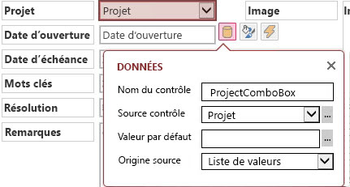Lorsque les affichages Détails de la liste, Feuilles de données et Vide sont liés à une source de données, ils contiennent une barre d'action. Celle-ci est une barre d'outils personnalisable qui s'affiche en haut de chaque affichage. Par défaut, la barre d'Action contient des boutons pour ajouter, modifier, enregistrer, supprimer et annuler des modifications. Vous pouvez ajouter des boutons pour exécuter des actions personnalisées. Vous pouvez également supprimer les boutons par défaut, ou masquer entièrement la barre d'actions.

### Nouveaux contrôles

Les applications Access 2013 prennent en charge deux contrôles nouveaux pour Access : le contrôle de saisie semi-automatique et le contrôle des éléments associés.

Le contrôle de saisie semi-automatique affiche une liste d'enregistrements correspondant à ce que vous entrez dans le champ. La figure 10 illustre un contrôle de saisie semi-automatique lié à une liste d'employés.

**Figure 10. Contrôle de saisie semi-automatique**

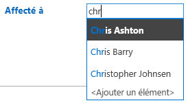À mesure que vous tapez, le contrôle de saisie semi-automatique affiche jusqu'à huit enregistrements correspondants. Le contrôle de saisie semi-automatique constitue une bonne alternative au contrôle de zone de liste déroulante lorsque la liste d'éléments est longue.

Le contrôle des éléments associés affiche un ensemble d'enregistrements de tables associées à la table sous-jacente de l'affichage. La figure 11 illustre un contrôle des éléments associés sur un affichage. Le contrôle est configuré avec deux onglets. Le premier affiche les problèmes ouverts par l'employé sélectionné. Le deuxième affiche les problèmes affectés à l'employé sélectionné.

**Figure 11. Contrôle des éléments associés**

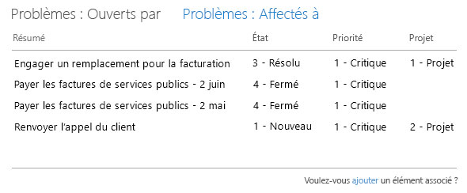Pour modifier les éléments d'un onglet Éléments associés, vous devez assigner un affichage à sa propriété  **Vue contextuelles**. L'affichage spécifié s'ouvre dans une fenêtre contextuelle lorsque vous sélectionnez un élément.

## Programmabilité des applications Access

La programmabilité des applications Access 2013 est assurée par un langage de macro personnalisé créé dans le client Access. Il existe deux types de macros : les macros d'interface utilisateur et les macros de données. Les macros d'interface utilisateur peuvent exécuter des actions qui affectent l'interface utilisateur de votre application, tandis que les macros de données peuvent fonctionner directement avec les enregistrements contenus dans l'application.

### Macros d'Interface utilisateur

Les macros d'interface utilisateur permettent d'exécuter des actions telles que l'ouverture d'un autre affichage, l'application d'un filtre ou la création d'un enregistrement. Les macros d'interface utilisateur « incorporées » sont associées directement à des objets d'interface utilisateur tels que des boutons de commande, des zones de liste modifiable ou l'objet bouton Barre d'action, tandis que les macros d'interface utilisateur « autonomes » sont contenues dans des objets macro.

Le tableau 1 répertorie les événements auxquels vous pouvez associer une macro d'interface utilisateur dans un contrôle ou un affichage.

 **Tableau 1. Événements pris en charge dans les macros d'interface utilisateur**

|**Type d'événement**|**Occurrence**|
|:-----|:-----|
|Après mise à jour|Après l'entrée ou la sélection de données dans un contrôle|
|Sur clic|Lors de la sélection d'un contrôle|
|Sur activation|Lors du déplacement vers un autre enregistrement dans la vue|
|Sur chargement|Lors de l'ouverture d'un affichage|
Le tableau 2 répertorie les événements pris en charge par chaque contrôle.

 **Tableau 2. Événements pris en charge par chaque contrôle**

|**Type de contrôle ou d'objet**|**Événements pris en charge**|
|:-----|:-----|
|Bouton de la barre d'action|Sur clic|
|Saisie semi-automatique|Après mise à jour, Sur clic|
|Bouton|Sur clic|
|Case à cocher|Après mise à jour|
|Zone de liste modifiable|Après mise à jour|
|Hyperlink|Après mise à jour, Sur clic|
|Image|Sur clic|
|Label|Sur clic|
|Chaîne multiligne|Après mise à jour, Sur clic|
|Zone de texte|Après mise à jour, Sur clic|
|Affichage|Sur activation, Sur chargement|
Réutilisez les macros d'interface utilisateur autonomes en les appelant à partir d'autres macros, ce qui vous aide à éviter la duplication de code. Les macros d'interface utilisateur autonomes sont visibles dans le volet de navigation, sous  **Macros**. Toutefois, vous ne pouvez pas les exécuter directement à partir du volet de navigation. Utilisez l'action  **ExécuterMacro** pour exécuter une macro d'interface utilisateur autonome à partir d'un macro d'interface utilisateur incorporée.

### Macros de données

Les macros de données permettent d'implémenter des règles d'entreprise au niveau de la couche de données. Contrairement aux macros d'interface utilisateur, les macros de données peuvent créer, modifier et supprimer des enregistrements.

Les macros de données « incorporées » sont associées à un événement de table. Les macros de données « autonomes » sont contenues dans des objets macro.

Le tableau 3 répertorie les événements auxquels vous pouvez associer une macro de données dans une table.

 **Tableau 3. Événements pris en charge dans les macros de données**

|**Type d'événement**|**Occurrence**|
|:-----|:-----|
|Lors de l'insertion|Se produit après l'ajout d'un nouvel enregistrement à la table|
|Lors de la mise à jour|Se produit après la modification d'un enregistrement existant|
|Lors de la suppression|Se produit lors de la suppression d'enregistrement|
La figure 12 illustre une macro de données imbriquée dans l'événement  **Lors de la mise à jour** de la table Problèmes. La macro de données vérifie qu'une résolution est sélectionnée lors de la résolution ou la clôture d'un problème.

**Figure 12. Macro de données incorporée dans l'événement Lors de la mise à jour**

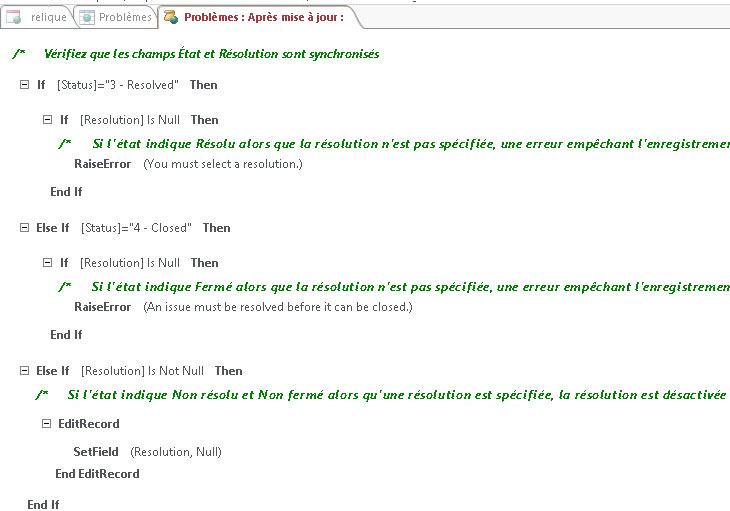Si aucune résolution n'est sélectionnée, l'action de la macro  **DéclencherErreur** est utilisée pour afficher un message d'erreur, et l'enregistrement n'est pas enregistré.

Les macros de données autonomes peuvent être appelées à partir de macros d'interface utilisateur et de macros de données à l'aide de l'action  **ExécuterMacroDonnées**. Les macros de données autonomes peuvent contenir un ou plusieurs paramètres. Dans la macro de données, utilisez l'action **SetReturnVar** pour définir une valeur renvoyée que la macro appelante peut utiliser pour déterminer l'action suivante.

## Publication de votre application Access

Access 2013 offre aux utilisateurs la possibilité de découvrir des solutions directement à partir d'un catalogue d'entreprise privé sur SharePoint 2013 ou le Office Store hébergé sur Office.com. Office Store offre un emplacement pratique pour les développeurs qui peuvent y télécharger des applications web Access destinées tant aux consommateurs qu'aux entreprises. En tant que développeur, quand vous chargez votre application sur Office Store, Microsoft exécute des contrôles de validation sur celle-ci. Si tous les tests sont réussis, le package d'application est encapsulé dans un fichier, et signé par Microsoft.

## Conclusion

Access 2013 introduit un nouveau modèle d'application qui permet aux experts de créer et partager rapidement des applications utilisables dans le cadre de leur activité. Un nouveau concepteur de vues interactif aide les utilisateurs ayant peu ou pas d'expérience de programmation à créer des applications. En utilisant SharePoint 2013 pour héberger l'application, et SQL Server 2012 pour stocker les données, les applications Access sont plus gérables et évolutives que jamais. La compatibilité avec Office 365 et SQL Azure étend considérablement la portée des applicationsAccess.

## Ressources supplémentaires

[Procédure : Création et personnalisation d'une application web dans Access](http://msdn.microsoft.com/library/628745f4-82e9-4838-9726-6f3e506a654f%28Office.15%29.aspx)

[Nouveautés d'Office 2013 pour les développeurs](http://msdn.microsoft.com/library/d76ae308-555e-4147-8900-956d3eb8ba23%28Office.15%29.aspx)

