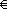

# Format Property - Number and Currency Data Types

Vous pouvez définir la propriété  **Format** sur les formats numériques prédéfinis ou sur les formats numériques personnalisés pour les types de données Numérique et Monétaire.


## Valeur

 **Formats prédéfinis**

Le tableau suivant présente les paramètres prédéfinis de la propriété  **Format** pour les nombres.


|**Valeur**|**Description**|
|:-----|:-----|
|Nombre général|(Par défaut) Affiche le nombre tel qu'il est entré.|
|Monnaie|Utilise le séparateur de milliers ; suit les paramètres spécifiés dans les paramètres régionaux de Windows pour les montants négatifs, les symboles décimaux et monétaires, et les décimales.|
|Euro|Utilise le symbole euro (
), quel que soit le symbole monétaire spécifié dans les paramètres régionaux de Windows.|
|Fixe|Affiche au moins un chiffre ; suit les paramètres spécifiés dans les paramètres régionaux de Windows pour les montants négatifs, les symboles décimaux et monétaires, et les décimales.|
|Standard|Utilise le séparateur de milliers ; suit les paramètres spécifiés dans les paramètres régionaux de Windows pour les montants négatifs, les symboles décimaux et les décimales.|
|Pourcentage|Multiplie la valeur par 100 et ajoute un signe de pourcentage (%) ; suit les paramètres spécifiés dans les paramètres régionaux de Windows pour les montants négatifs, les symboles décimaux et les décimales.|
|Scientifique|Utilise la notation scientifique standard.|
 **Formats personnalisés**

Les formats numériques personnalisés peuvent avoir une à quatre sections séparées par des points-virgules (;) comme séparateurs de liste. Chaque section contient la spécification de format pour un autre type de numéro.


|**Section**|**Description**|
|:-----|:-----|
|Première|Format des nombres positifs.|
|Seconde|Format des nombres négatifs.|
|Troisième|Format des valeurs égales à zéro.|
|Quatrième|Format des valeurs  **Null**.|
Par exemple, vous pouvez utiliser le format Monétaire personnalisé suivant :


```
$#,##0.00[Green];($#,##0.00)[Red];"Zero";"Null"
```

Ce format numérique contient quatre sections séparées par des points-virgules et utilise un format différent pour chaque section.

Si vous utilisez plusieurs sections sans spécifier un format pour chaque section, les entrées pour lesquelles il n'existe aucun format n'affichent rien ou affichent par défaut la mise en forme de la première section.

Vous pouvez créer des formats numériques personnalisés en utilisant les symboles suivants.


|**Symbole**|**Description**|
|:-----|:-----|
|. (point)|Séparateur décimal. Les séparateurs sont définis dans les paramètres régionaux de Windows.|
|, (virgule)|Séparateur de milliers.|
|0|Espace réservé à un chiffre. Affiche un chiffre ou 0.|
|#|Espace réservé à un chiffre. Affiche un chiffre ou rien.|
|$|Affiche le caractère littéral « $ ».|
|%|Pourcentage. La valeur est multipliée par 100 et un signe de pourcentage est ajouté.|
|E- ou e-|Notation scientifique avec un signe moins (-) en regard des exposants négatifs et rien en regard des exposants positifs. Ce symbole doit être utilisé avec d'autres symboles, comme dans 0,00E-00 ou 0,00E00.|
|E+ ou e+|Notation scientifique avec un signe moins (-) en regard des exposants négatifs et un signe plus (+) en regard des exposants positifs. Ce symbole doit être utilisé avec d'autres symboles, comme dans 0,00E+00.|

## Remarques

Vous pouvez utiliser la propriété  **DecimalPlaces** pour remplacer le nombre de décimales par défaut pour le format prédéfini spécifié pour la propriété **Format**.

Les formats Monétaire et Euro prédéfinis respectent les paramètres régionaux de Windows. Vous pouvez les remplacer en entrant votre propre format monétaire.


## Exemples

Voici des exemples de formats numériques prédéfinis.


|**Valeur**|**Données**|**Affichage**|
|:-----|:-----|:-----|
|Nombre général|3 456,789 -3 456,789 213,21 $|3 456,789 -3 456,789 213,21 $|
|Monétaire|3 456,789 -3 456,789|3 456,79 $ (3 456,79 $)|
|Fixe|3 456,789 -3 456,789 3,56645|3 456,79 -3 456,79 3,57|
|Standard|3 456,789|3 456,79|
|Pourcentage|3  0,45|300 %  45 %|
|Scientifique|3 456,789 -3 456,789|3,46E+03 -3,46E+03|
Voici des exemples de formats numériques personnalisés.


|**Valeur**|**Description**|
|:-----|:-----|
|0;(0);;"Null"|Affiche normalement les valeurs positives ; affiche les valeurs négatives entre parenthèses ; afficher le mot « Null » si la valeur est  **Null**.|
|+0.0;-0.0;0.0|Affiche un signe plus (+) ou moins (-) avec des nombres positifs ou négatifs ; affiche 0,0 si la valeur est égale à zéro.|
