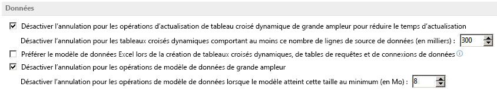

# À propos de l'objet de modèle PowerPivot dans Excel
Découvrez le modèle de complément PowerPivot et son modèle objet dans Excel.

## À propos de l'objet de modèle PowerPivot

Le complément PowerPivot permet de créer visuellement vos propres cubes. Un cube de données est un tableau de données défini en dimensions ou calques. L'objet  **Model** dans Excel implémenté par le complément PowerPivot constitue la base permettant de charger et de combiner des données source à partir de plusieurs sources pour une analyse des données sur le Bureau, y compris les bases de données relationnelles, les sources multidimensionnelles, les services cloud, les flux de données, les fichiers Excel, les fichiers texte et les données à partir du web. Excel intègre des sources de données supplémentaires et offre la possibilité de combiner des données provenant de différentes sources.

La création et la suppression du modèle PowerPivot (PPM) sont déclenchées par des actions exposées à l' utilisateur et ne peuvent pas être créées directement par le développeur.

## Relations définies

Dans cet article, nous faisons référence à la relation entre deux tables qui établit la façon dont les données doivent être corrélées.

Les relations permettent d'associer des données provenant de sources qui n'étaient pas liées précédemment. Chaque relation dispose d'une  _clé primaire_ et d'une _clé étrangère_. Les relations permettent aux données d'être associées dans un modèle unique. Cela permet :

- de filtrer des données dans une table en fonction des données d'une table liée et de filtrer des données en fonction de colonnes liées ;
    
- d'intégrer des colonnes provenant de plusieurs tables dans un tableau/graphique croisé dynamique ;
    
- de réduire la taille des classeurs, car les données ne sont pas répétées.
    

## Modèles uniques

Avec le complément PowerPivot, Excel crée un modèle unique dans le classeur auquel il peut ajouter des sources de données, et pour lequel il peut créer, modifier et associer des tables. Le classeur ne peut comporter qu'un seul modèle.

## Utilisation de sources de données OLAP

Lorsque vous vous connectez à une source de données OLAP comme Analysis Services et que vous créez des fonctions OLAP de tableaux/graphiques croisés dynamiques, de segments ou de cube, aucun modèle n'est créé. Les classeurs créés avec le complément PowerPivot peuvent être téléchargés vers SharePoint, chargés dans la mémoire sur le serveur et être accessibles par d'autres classeurs comme s'il s'agissait d'une instance normale de SQL Server Analysis Services.

## Déclenchement de la création d'un modèle PowerPivot

Par défaut, les fichiers XLSX dans Excel 2010 et Excel ne contiennent pas de PPM initialisé tant que cela n'est pas nécessaire. Certaines actions déclenchent la création d'un PPM s'il n'existe aucun modèle dans le classeur. Les sections suivantes décrivent les actions qui déclenchent la création d'un PPM lorsque le classeur n'en contient pas.

### Ajout d'une source de données non héritée

Chaque fois que vous importez certains types de données, un modèle est créé dans le classeur (s'il n'en existe pas déjà un). Celui-ci contient les propriétés de connexion, une représentation sous forme de tableau des sources de données du classeur et les relations entre elles. Cela inclut les sources de données internes, telles que les tables et les plages. Le tableau 1 répertorie les différentes sources de données pouvant être intégrées au PPM.

 **Tableau 1. Sources de données compatibles avec le modèle PowerPivot**

|**Source des données**|**Description**|**Aperçu de la table**|**Requête prise en charge**|
|:-----|:-----|:-----|:-----|
|Microsoft SQL Server|Déjà pris en charge dans Excel|Oui|Oui|
|Microsoft SQL Azure Data Market|Pris en charge en tant que nouvelle source de flux de données|Oui|Non|
|Microsoft SQL Server Parallel Data Warehouse|Pris en charge via le pilote OLE DB installé|Oui|Oui|
|Microsoft Access|Déjà pris en charge dans Excel|Oui|Oui|
|Oracle|Déjà pris en charge dans Excel|Oui|Oui|
|Teradata|Disponible si un pilote OLE DB ou ODBC est installé.|Non|Non|
|Sybase|Disponible si un pilote OLE DB ou ODBC est installé.|Non|Non|
|Informix|Disponible si un pilote OLE DB ou ODBC est installé.|Non|Non|
|IBM Db2|Disponible si un pilote OLE DB ou ODBC est installé.|Non|Non|
|Microsoft Analysis Services|Déjà pris en charge dans Excel|Oui|Oui|
|Rapport (SSRS)|Peut lire et utiliser des connexions, mais pas créer dans le client Excel|Oui|Non|
|Text|À partir de la boîte de dialogue Excel dans l'interface utilisateur du ruban|Oui|Non|
|Flux de données (OData)|Pris en charge en tant que nouvelle source de données|Oui|Oui|
|XML|Déjà pris en charge dans Excel|Non|Non|
|Listes SharePoint|Déjà pris en charge dans Excel. Excel utilise le fournisseur de  **flux de données** pour se connecter à SharePoint|Non|Non|
|SharePoint|Nouvelle fonctionnalité dans Excel|Oui|Oui|
|Tableaux Excel|Tableau défini par l'utilisateur dans Excel pour les nouvelles fonctionnalités de données. Une connexion de données de feuille de calcul est créée dans la table lors de sa création.|S/O|S/O|
|Plages Excel|Plage définie par l'utilisateur dans Excel pour les nouvelles fonctionnalités de données. Dans ce cas, une connexion de données de feuille de calcul est créée dans la plage uniquement si cette plage est utilisée par une fonctionnalité de données comme un graphique ou un tableau croisé dynamique.|S/O|S/O|

### Création d'un tableau croisé dynamique non OLAP dans Excel

Les nouveaux tableaux croisés dynamiques Excel, autres que ceux créés à partir d'une source de données OLAP, reposent sur un PPM. Ainsi, si le fichier n'en comporte pas, un PPM est créé dans le cadre de la création du tableau croisé dynamique. Cela inclut les éléments suivants :

- Utilisation de l'option d'insertion de tableau croisé dynamique
    
- Synthèse des données avec l'interface utilisateur de tableau croisé dynamique
    
- Création d'un tableau croisé dynamique reposant sur une source de données non OLAP via le modèle objet Microsoft Visual Basic pour Applications (VBA)
    

### Création d'un graphique croisé dynamique non OLAP dans Excel

Dans Excel, les tableaux et graphiques croisés dynamiques peuvent être dissociés. Par conséquent, lors de l'insertion d'un graphique croisé dynamique dans un classeur sans modèle, un PPM est créé.

### Collage de tableaux croisés dynamiques non OLAP dans Excel à partir d'un autre classeur

Lorsque vous copiez un tableau ou graphique croisé dynamique à partir d'un classeur reposant sur un PPM et que vous le collez dans un classeur qui n'en contient pas, un PPM est créé dans le classeur de destination. Une nouvelle source de données est ajoutée au modèle récemment créé en indiquant les données sous-jacentes du tableau/graphique croisé dynamique d'origine.

## Annulation de la création d'un modèle PowerPivot

Toutes les actions entraînant la création d'un PPM peuvent être annulées. Si ces actions sont sélectionnées dans le menu d'annulation, la création à proprement parler du modèle n'est pas annulée, mais rien n'y est ajouté. Par conséquent, il reste vide. Si le modèle est vide, il n'est pas enregistré avec le fichier lorsque vous enregistrez le classeur. Vous ne pouvez pas supprimer manuellement un modèle créé dans le classeur de manière explicite.

 **Remarque**  De même que dans Excel 2010, il existe une restriction relative à la taille des modèles pouvant être annulés. Lorsqu'un modèle atteint la taille limite, la fonctionnalité d'annulation pour les actions telles que l'actualisation n'est plus disponible. La limite actuelle pour les tableaux croisés dynamiques natifs est de 300 000 lignes. Avec 28 octets par cellule, cette limite représente environ 8 Mo de mémoire. Ces valeurs peuvent être définies à l'aide des  **options avancées** dans Excel comme indiqué dans la figure 1.

**Figure 1. Définir la taille pour les opérations d'annulation de grands modèles de données**

## Modèle de l'objet Model PowerPivot

Un classeur peut disposer d'un seul objet  **Model**. L'objet  **Model** représente l'objet de niveau supérieur contenant ses connexions, relations et tables.

Vous n'êtes pas en mesure de créer manuellement un modèle dans un classeur. La création du modèle est déclenchée par les actions décrites dans la section précédente de cet article. Si l'une de ces actions est effectuée via le modèle objet, un modèle est créé. Ce modèle objet permet de créer par programmation des relations entre les tables du modèle correspondant à des tables jointes, de combiner des tableaux croisés dynamiques, etc. Pour ce faire, vous devez pouvoir explorer le modèle pour rechercher les tables appropriées dans lesquelles rechercher les colonnes pouvant être utilisées pour créer la relation.

### Objet Model

L'objet  **Model** contient des références à des connexions du classeur, ainsi que des informations sur les tables et les relations contenues dans le PPM. Le tableau 2 répertorie les propriétés de l'objet **Model**.

 **Tableau 2. Propriétés de l'objet Model**

|**Propriété**|**Lecture/Écriture**|**Type**|**Description**|
|:-----|:-----|:-----|:-----|
|**Application**|Lecture seule|**Application**|Renvoie un objet qui représente l'application Microsoft Excel.|
|**Creator**|Lecture seule|**xlCreator**|Renvoie un entier 32 bits qui indique l'application dans laquelle l'objet indiqué a été créé.|
|**Parent**|Lecture seule|**Object**|Renvoie un  **Object** qui représente l'objet parent de l'objet **Model** spécifié.|
|**ModelTables**|Lecture seule|**ModelTable**|Collection de tables dans le PPM.|
|**ModelRelationships**|Lecture seule|**ModelRelationships**|Collection de relations entre les tables du PPM.|
|**DataModelConnection**|S/O|**WorkbookConnection**|Renvoie l'objet de connexion de classeur du modèle à partir de la collection de connexions du classeur liée au modèle.|
Méthode  **Model.AddConnection**

Ajoute une nouvelle connexion de classeur au modèle avec les mêmes propriétés que celles fournies comme argument. Cette méthode fonctionne uniquement sur les connexions externes non modèles et ne renvoie une erreur que si elle est appelée avec une connexion de modèle externe comme argument. Lorsque vous appelez cette méthode, une connexion de modèle est créée, portant le même nom que la connexion héritée avec un nombre entier à la fin pour en faire le nom unique. Le tableau 3 répertorie les paramètres de la méthode  **AddConnection**.

 **Tableau 3. Paramètres de la méthode Model.AddConnection**

|**Nom**|**Requis/Facultatif**|**Type**|**Description**|
|:-----|:-----|:-----|:-----|
| _ConnectionToDataSource_|Obligatoire|**WorkbookConnection**|Connexion du classeur|
Méthode  **Model.CreateModelWorkbookConnection**

Cette méthode renvoie un objet  **WorkbookConnection** de type **ModelConnection**. Une connexion de modèle liée à la table spécifiée est renvoyée. Ce type de connexion peut être utilisé uniquement par des tables de requête dans Excel. Le tableau 4 répertorie les paramètres de la méthode  **CreateModelWorkbookConnection**.

 **Tableau 4. Paramètres de la méthode Model.CreateModelWorkbookConnection**

|**Nom**|**Requis/Facultatif**|**Type**|**Description**|
|:-----|:-----|:-----|:-----|
| _ModelTable_|Obligatoire|**Variant**|Nom de table du modèle ou objet de table du modèle.|
Méthode  **Model.Initialize**

La méthode  **Initialize** de l'objet **Model** ne comporte aucun paramètre. Elle permet d'initialiser le PPM. Il s'agit de la méthode appelée par défaut lors de la première utilisation du modèle.

Méthode  **Model.Refresh**

La méthode  **Refresh** de l'objet **Model** ne comporte aucun paramètre. Elle permet d'actualiser toutes les sources de données associées au modèle, de traiter à nouveau le modèle entièrement et de mettre à jour toutes les fonctionnalités de données Excel associées à l'objet **Model**.

### Objet ModelChanges

Représente les modifications apportées au PPM. L'objet  **ModelChanges** contient des informations sur les modifications apportées au modèle de données lorsque l'événement **Workbook.ModelChange** se produit après une opération de modèle. Lorsque le modèle de données est modifié par Excel, plusieurs modifications peuvent être apportées au cours d'une même opération et l'objet **ModelChanges** inclut des informations sur toutes les modifications apportées dans une opération de modèle. Le tableau 5 répertorie les propriétés de l'objet **ModelChanges**.

 **Tableau 5. Propriétés de l'objet ModelChanges**

|**Propriété**|**Lecture/Écriture**|**Type**|**Description**|
|:-----|:-----|:-----|:-----|
|**Application**|Lecture seule|**Application**|Renvoie un objet qui représente l'application Microsoft Excel.|
|**ColumnsAdded**|Lecture seule|**ModelColumnNames**|Renvoie une collection  **ModelColumnNames** d'objets **ModelColumnName** qui représentent toutes les colonnes ajoutées dans le cadre d'une opération de modèle.|
|**ColumnsChanged**|Lecture seule|**ModelColumnChanges**|Renvoie une collection  **ModelColumnChanges** d'objets **ModelColumnChange** qui représentent les noms de tables et les noms de toutes les colonnes de table pour lesquelles le type de données a été modifié dans le cadre d'une opération de modèle.|
|**ColumnsDeleted**|Lecture seule|**ModelColumnNames**|Renvoie une collection  **ModelColumnNames** d'objets **ModelColumnName** qui représentent toutes les colonnes supprimées dans le cadre d'une opération de modèle.|
|**Creator**|Lecture seule|**xlCreator**|Renvoie un entier 32 bits qui indique l'application dans laquelle l'objet indiqué a été créé.|
|**MeasuresAdded**|Lecture seule|**ModelMeasureNames**|Renvoie une collection  **ModelMeasureNames** d'objets **ModelMeasureName** qui représentent toutes les mesures ajoutées dans le cadre d'une opération de modèle.|
|**Parent**|Lecture seule|**Object**|Renvoie un  **Object** qui représente l'objet parent de l'objet **ModelChanges** spécifié.|
|**RelationshipChange**|Lecture seule|**Boolean**|Lorsque la valeur est  **True**, une ou plusieurs relations du modèle ont été modifiées (ajoutées, supprimées ou modifiées) dans le cadre d'une opération de modèle. Lorsque la valeur est  **False**, aucune relation n'a été modifiée pendant l'opération.|
|**TableNamesChanged**|Lecture seule|**ModelTableNameChanges**|Renvoie une collection  **ModelTableNameChanges** d'objets **ModelTableNameChange** qui représentent les anciens et les nouveaux noms de toutes les tables qui ont été renommées dans le cadre d'une opération de modèle.|
|**TablesAdded**|Lecture seule|**ModelTableNames**|Renvoie une collection  **ModelTableNames** de noms de tables sous forme de chaînes qui représentent toutes les tables ayant été ajoutées au modèle dans le cadre d'une opération de modèle.|
|**TablesDeleted**|Lecture seule|**ModelTableNames**|Renvoie une collection  **ModelTableNames** de noms de tables sous forme de chaînes qui représentent toutes les tables ayant été supprimées du modèle dans le cadre d'une opération de modèle.|
|**TablesModified**|Lecture seule|**ModelTableNames**|Renvoie une collection  **ModelTableNames** de noms de tables sous forme de chaînes qui représentent toutes les tables ayant été actualisées ou recalculées dans le cadre d'une opération de modèle.|
|**UnknownChange**|Lecture seule|**Boolean**|Renvoie la valeur  **True** lorsqu'une modification non spécifiée a été apportée au modèle dans le cadre d'une transaction de modèle.|

### Collection ModelColumnChanges

Collection d'objets  **ModelColumnChange** qui représentent des colonnes dont le type de données a été modifié dans le PPM. Le tableau 6 répertorie les propriétés de la collection **ModelColumnChanges**.

 **Tableau 6. Propriétés de la collection ModelColumnChanges**

|**Propriété**|**Lecture/Écriture**|**Type**|**Description**|
|:-----|:-----|:-----|:-----|
|**Application**|Lecture seule|**Application**|Renvoie un objet qui représente l'application Microsoft Excel.|
|**Count**|Lecture seule|**Long**|Renvoie le nombre d'objets  **ModelColumnChange** dans la collection.|
|**Creator**|Lecture seule|**xlCreator**|Renvoie un entier 32 bits qui indique l'application dans laquelle l'objet indiqué a été créé.|
|**Parent**|Lecture seule|**Object**|Renvoie un  **Object** qui représente l'objet parent de l'objet **ModelColumnChanges** spécifié.|
Méthode  **ModelColumnChanges.Item**

Renvoie un objet unique à partir de la collection  **ModelColumnChanges**. Le tableau 7 répertorie les paramètres de la méthode  **Item**.

 **Tableau 7. Paramètres de la méthode ModelColumnChanges.Item**

|**Nom**|**Requis/Facultatif**|**Type**|**Description**|
|:-----|:-----|:-----|:-----|
| _Index_|Obligatoire|**Variant**|Numéro d'index ou nom de l'objet.|

### Objet ModelColumnChange

Objet qui représente une colonne dans une table du PPM pour laquelle le type de données a été modifié. Le tableau 8 répertorie les propriétés de l'objet  **ModelColumnChange**.

 **Tableau 8. Propriétés de l'objet ModelColumnChange**

|**Propriété**|**Lecture/Écriture**|**Type**|**Description**|
|:-----|:-----|:-----|:-----|
|**Application**|Lecture seule|**Application**|Renvoie un objet qui représente l'application Microsoft Excel.|
|**ColumnName**|Lecture seule|**String**|**String** qui représente le nom d'une colonne dont le type de données a été modifié.|
|**Creator**|Lecture seule|**xlCreator**|Renvoie un entier 32 bits qui indique l'application dans laquelle l'objet indiqué a été créé.|
|**Parent**|Lecture seule|**Object**|Renvoie un  **Object** qui représente l'objet parent de l'objet **ModelColumnChange** spécifié.|
|**TableName**|Lecture seule|**String**|**String** qui représente le nom d'une table dans le PPM pour laquelle le type de données d'une colonne a été modifié.|

### Collection ModelColumnNames

Collection d'objets  **ModelColumnName** représentant des colonnes de tables dans le PPM. Le tableau 9 répertorie les propriétés de la collection **ModelColumnNames**.

 **Tableau 9. Propriétés de la collection ModelColumnNames**

|**Propriété**|**Lecture/Écriture**|**Type**|**Description**|
|:-----|:-----|:-----|:-----|
|**Application**|Lecture seule|**Application**|Renvoie un objet qui représente l'application Microsoft Excel.|
|**Count**|Lecture seule|**Long**|Renvoie le nombre d'objets  **ModelColumnName** dans la collection.|
|**Creator**|Lecture seule|**xlCreator**|Renvoie un entier 32 bits qui indique l'application dans laquelle l'objet indiqué a été créé.|
|**Parent**|Lecture seule|**Object**|Renvoie un  **Object** qui représente l'objet parent de la collection **ModelColumnNames** spécifiée.|
Méthode  **ModelColumnNames.Item**

Renvoie un objet unique à partir de la collection  **ModelColumnNames**. Le tableau 10 répertorie les paramètres de la méthode  **Item**.

 **Tableau 10. Paramètres de la méthode ModelColumnNames.Item**

|**Nom**|**Requis/Facultatif**|**Type**|**Description**|
|:-----|:-----|:-----|:-----|
| _Index_|Obligatoire|**Variant**|Numéro d'index ou nom de l'objet.|

### Objet ModelColumnName

Objet qui représente le nom d'une colonne dans le PPM. Le tableau 11 répertorie les propriétés de l'objet  **ModelColumnName**.

 **Tableau 11. Propriétés de l'objet ModelColumnName**

|**Propriété**|**Lecture/Écriture**|**Type**|**Description**|
|:-----|:-----|:-----|:-----|
|**Application**|Lecture seule|**Application**|Renvoie un objet qui représente l'application Microsoft Excel.|
|**ColumnName**|Lecture seule|**String**|**String** qui représente le nom d'une colonne de la table identifiée par la propriété **TableName**.|
|**Creator**|Lecture seule|**xlCreator**|Renvoie un entier 32 bits qui indique l'application dans laquelle l'objet indiqué a été créé.|
|**Parent**|Lecture seule|**Object**|Renvoie un  **Object** qui représente l'objet parent de l'objet **ModelColumnName** spécifié.|
|**TableName**|Lecture seule|**String**|**String** qui représente le nom d'une table dans le PPM.|

### Objet ModelConnection

L'objet  **ModelConnection** contient des informations pour le nouveau type de connexion de modèle introduit dans Excel permettant d'interagir avec le PPM intégré. Le tableau 12 répertorie les propriétés de l'objet **ModelConnection**.

 **Tableau 12. Propriétés de l'objet ModelConnection**

|**Propriété**|**Lecture/Écriture**|**Type**|**Description**|
|:-----|:-----|:-----|:-----|
|**ADOConnection**|Lecture seule|**ADOConnection**|Permet de créer une connexion ouverte à une source de données. Permet aux compléments, tels que PowerViewer, de créer une connexion directe au moteur et donc au modèle de données.|
|**Application**|Lecture seule|**Application**|Renvoie un objet qui représente l'application Microsoft Excel.|
|**CommandText**|Lecture/Écriture|**Variant**|Renvoie ou définit la chaîne de commande pour la source de données spécifiée (table).|
|**CommandType**|Lecture/Écriture|**xlCmdType**|Renvoie ou définit l'une des constantes  **xlCmdType** spécifiant le type de commande.|
|**Creator**|Lecture seule|**xlCreator**|Renvoie un entier 32 bits qui indique l'application dans laquelle l'objet indiqué a été créé.|
|**Parent**|Lecture seule|**Object**|Renvoie un  **Object** qui représente l'objet parent de l'objet **ModelConnection** spécifié.|

### Collection ModelMeasureNames

La collection  **ModelMeasureNames** contient une collection d'objets **ModelMeasureName** dans le PPM. Le tableau 13 répertorie les propriétés de la collection **ModelMeasureNames**.

 **Tableau 13. Propriétés de la collection ModelMeasureNames**

|**Propriété**|**Lecture/Écriture**|**Type**|**Description**|
|:-----|:-----|:-----|:-----|
|**Application**|Lecture seule|**Application**|Renvoie un objet qui représente l'application Microsoft Excel.|
|**Count**|Lecture seule|**Long**|Renvoie le nombre d'objets  **ModelMeasureName** dans la collection.|
|**Creator**|Lecture seule|**xlCreator**|Renvoie un entier 32 bits qui indique l'application dans laquelle l'objet indiqué a été créé.|
|**Parent**|Lecture seule|**Object**|Renvoie un  **Object** qui représente l'objet parent de la collection **ModelMeasureNames** spécifiée.|
Méthode  **ModelMeasureNames.Item**

Renvoie un seul objet à partir de la collection  **ModelMeasureNames**. Le tableau 14 répertorie les paramètres de la méthode  **Item**.

 **Tableau 14. Paramètres de la méthode ModelMeasureNames.Item**

|**Nom**|**Requis/Facultatif**|**Type**|**Description**|
|:-----|:-----|:-----|:-----|
| _Index_|Obligatoire|**Variant**|Numéro d'index ou nom de l'objet.|

### Objet ModelMeasureName

Objet qui représente le nom d'une mesure dans le PPM. Le tableau 15 répertorie les propriétés de l'objet  **ModelMeasureName**.

 **Tableau 15. Propriétés de l'objet ModelMeasureName**

|**Propriété**|**Lecture/Écriture**|**Type**|**Description**|
|:-----|:-----|:-----|:-----|
|**Application**|Lecture seule|**Application**|Renvoie un objet qui représente l'application Microsoft Excel.|
|**MeasureName**|Lecture seule|**String**|**String** qui représente le nouveau nom d'une mesure qui a été ajoutée à l'objet **ModelTable** identifié par la propriété **TableName**.|
|**Creator**|Lecture seule|**xlCreator**|Renvoie un entier 32 bits qui indique l'application dans laquelle l'objet indiqué a été créé.|
|**Parent**|Lecture seule|**Object**|Renvoie un  **Object** qui représente l'objet parent de l'objet **ModelMeasureName** spécifié.|
|**TableName**|Lecture seule|**String**|**String** qui représente le nom d'une table dans le PPM.|

### Collection ModelRelationships

La collection  **ModelRelationships** contient une collection d'objets **ModelRelationship** dans le PPM. Le tableau 16 répertorie les propriétés de la collection **ModelRelationships**.

 **Tableau 16. Propriétés de la collection ModelRelationships**

|**Propriété**|**Lecture/Écriture**|**Type**|**Description**|
|:-----|:-----|:-----|:-----|
|**Application**|Lecture seule|**Application**|Renvoie un objet qui représente l'application Microsoft Excel.|
|**Count**|Lecture seule|**Long**|Renvoie le nombre d'objets  **ModelRelationship** dans la collection.|
|**Creator**|Lecture seule|**xlCreator**|Renvoie un entier 32 bits qui indique l'application dans laquelle l'objet indiqué a été créé.|
|**Parent**|Lecture seule|**Object**|Renvoie un  **Object** qui représente l'objet parent de la collection **ModelRelationships** spécifiée.|
Méthode  **ModelRelationships.Add**

Ajoute une relation à la collection  **ModelRelationships**. Le tableau 17 répertorie les paramètres de la méthode  **Add**.

 **Tableau 17. Paramètres de la méthode ModelRelationships.Add**

|**Nom**|**Requis/Facultatif**|**Type**|**Description**|
|:-----|:-----|:-----|:-----|
| _ForeignKeyColumn_|Obligatoire|**ModelTableColumn**|Objet  **ModelTableColumn** qui représente la colonne de la clé étrangère dans la table du côté plusieurs de la relation un-à-plusieurs.|
| _PrimaryKeyColumn_|Obligatoire|**ModelTableColumn**|Objet  **ModelTableColumn** qui représente la colonne de la clé primaire dans la table du côté un de la relation un-à-plusieurs.|
Méthode  **ModelRelationships.Item**

Renvoie un seul objet à partir de la collection  **ModelRelationships**. Le tableau 18 répertorie les paramètres de la méthode  **Item**.

 **Tableau 18. Paramètres de la méthode ModelRelationships.Item**

|**Nom**|**Requis/Facultatif**|**Type**|**Description**|
|:-----|:-----|:-----|:-----|
| _Index_|Obligatoire|**Variant**|Numéro d'index ou nom de l'objet.|

### Objet ModelRelationship

Représente une relation entre des objets  **ModelTableColumn**. Utilisé lors de la création par programmation de relations. Le tableau 19 répertorie les propriétés de l'objet  **ModelRelationship**.

 **Tableau 19. Propriétés de l'objet ModelRelationship**

|**Propriété**|**Lecture/Écriture**|**Type**|**Description**|
|:-----|:-----|:-----|:-----|
|**Active**|Lecture/Écriture|**Boolean**|Lorsque la valeur est  **True**, la relation est active.|
|**Application**|Lecture seule|**Application**|Renvoie un objet qui représente l'application Microsoft Excel.|
|**Creator**|Lecture seule|**xlCreator**|Renvoie un entier 32 bits qui indique l'application dans laquelle l'objet indiqué a été créé.|
|**ForeignKeyColumn**|Lecture seule|**ModelTableColumn**|Contient l'objet  **ModelTableColumn** qui représente la colonne de la clé étrangère du côté plusieurs de la relation un-à-plusieurs.|
|**ForeignKeyTable**|Lecture seule|**ModelTable**|Contient l'objet  **ModelTable** qui représente la table du côté plusieurs de la relation un-à-plusieurs.|
|**Parent**|Lecture seule|**Object**|Renvoie un objet de modèle  **Object** qui représente le modèle dans lequel se trouve l'objet **ModelRelationship**.|
|**PrimaryKeyColumn**|Lecture seule|**ModelTableColumn**|Contient l'objet  **ModelTableColumn** qui représente la colonne de la clé primaire dans la table du côté un de la relation un-à-plusieurs.|
|**PrimaryKeyTable**|Lecture seule|**ModelTable**|Contient l'objet  **ModelTable** qui représente la table du côté un de la relation un-à-plusieurs.|
Méthode  **ModelRelationship.Delete**

La méthode  **Delete** de l'objet **ModelRelationship** ne contient aucun paramètre. Elle permet de supprimer une relation.

### Collection ModelTables

La collection  **ModelTables** contient une collection d'objets **ModelTable** dans le PPM. Le tableau 20 répertorie les propriétés de la collection de **ModelTables**.

 **Tableau 20. Propriétés de la collection ModelTables**

|**Propriété**|**Lecture/Écriture**|**Type**|**Description**|
|:-----|:-----|:-----|:-----|
|**Application**|Lecture seule|**Application**|Renvoie un objet qui représente l'application Microsoft Excel.|
|**Count**|Lecture seule|**Long**|Renvoie le nombre d'objets  **ModelTable** dans la collection.|
|**Creator**|Lecture seule|**xlCreator**|Renvoie un entier 32 bits qui indique l'application dans laquelle l'objet indiqué a été créé.|
|**Parent**|Lecture seule|**Object**|Renvoie un  **Object** qui représente l'objet parent de la collection **ModelTables** spécifiée.|
Méthode  **ModelTables.Item**

Renvoie un seul objet à partir de la collection  **ModelTables**. Le tableau 21 répertorie les paramètres de la méthode Item.

 **Tableau 21. Paramètres de la méthode ModelTables.Item**

|**Nom**|**Requis/Facultatif**|**Type**|**Description**|
|:-----|:-----|:-----|:-----|
| _Index_|Obligatoire|**Variant**|Numéro d'index ou nom de l'objet.|

### Objet ModelTable

Représente une table dans l'objet  **Model**. L'objet  **ModelTable** est en lecture seule, ce qui signifie qu'il ne peut pas être créé ou modifié via le modèle objet. Il existe un objet **ModelTable** pour chaque table dans le modèle. Le tableau 22 répertorie les propriétés de l'objet **ModelTable**.

 **Tableau 22. Propriétés de l'objet ModelTable**

|**Propriété**|**Lecture/Écriture**|**Type**|**Description**|
|:-----|:-----|:-----|:-----|
|**Application**|Lecture seule|**Application**|Renvoie un objet qui représente l'application Microsoft Excel.|
|**Creator**|Lecture seule|**xlCreator**|Renvoie un entier 32 bits qui indique l'application dans laquelle l'objet indiqué a été créé.|
|**ModelTableColumns**|Lecture seule|**ModelTableColumns**|Collection d'objets  **ModelTableColumn** qui constituent l'objet **ModelTable**.|
|**Name**|Lecture seule|**String**|Renvoie le nom de l'objet  **ModelTable**.|
|**Parent**|Lecture seule|**Object**|Renvoie un  **Object** qui représente le modèle dans lequel se trouve l'objet **ModelTable**.|
|**RecordCount**|Lecture seule|**Integer**|Renvoie le nombre total de lignes pour l'objet  **ModelTable**.|
|**SourceName**|Lecture seule|**String**|Nom de table au niveau de la source de données. Si la table ne contient aucune source de données (créée dans le modèle), la propriété renvoie une erreur.|
|**SourceWorkbookConnection**|Lecture seule|**WorkbookConnection**|Renvoie la connexion de classeur à partir de laquelle provient l'objet  **ModelTable**.|
Méthode  **ModelTable.Refresh**

La méthode  **Refresh** de l'objet **ModelTable** ne contient aucun paramètre. Elle permet d'actualiser les connexions à la source de la table du modèle.

### Collection ModelTableColumns

La collection  **ModelTableColumns** contient une collection d'objets **ModelTableColumn** dans le PPM. Le tableau 23 répertorie les propriétés de la collection de **ModelTableColumns**.

 **Tableau 23. Propriétés de la collection ModelTableColumns**

|**Propriété**|**Lecture/Écriture**|**Type**|**Description**|
|:-----|:-----|:-----|:-----|
|**Application**|Lecture seule|**Application**|Renvoie un objet qui représente l'application Microsoft Excel.|
|**Count**|Lecture seule|**Long**|Renvoie le nombre d'objets  **ModelTableColumn** dans la collection.|
|**Creator**|Lecture seule|**xlCreator**|Renvoie un entier 32 bits qui indique l'application dans laquelle l'objet indiqué a été créé.|
|**Parent**|Lecture seule|**Object**|Renvoie un  **Object** qui représente l'objet parent de la collection **ModelTableColumns** spécifiée.|
Méthode  **ModelTableColumns.Item**

Renvoie un seul objet à partir de la collection  **ModelTableColumns**. Le tableau 24 répertorie les paramètres de la méthode  **Item**.

 **Tableau 24. Paramètres de la méthode ModelTableColumns.Item**

|**Nom**|**Requis/Facultatif**|**Type**|**Description**|
|:-----|:-----|:-----|:-----|
| _Index_|Obligatoire|**Variant**|Numéro d'index ou nom de l'objet.|

### Objet ModelTableColumn

Représente une colonne unique dans l'objet  **ModelTable**. Utilisé lors de la création par programmation de relations. Le tableau 25 répertorie les propriétés de l'objet  **ModelTableColumn**.

 **Tableau 25. Propriétés de l'objet ModelTableColumn**

|**Propriété**|**Lecture/Écriture**|**Type**|**Description**|
|:-----|:-----|:-----|:-----|
|**Application**|Lecture seule|**Application**|Renvoie un objet qui représente l'application Microsoft Excel.|
|**Creator**|Lecture seule|**xlCreator**|Renvoie un entier 32 bits qui indique l'application dans laquelle l'objet indiqué a été créé.|
|**DataType**|Lecture seule|**XlParameterDataType**|Renvoie le type de données de la colonne.|
|**Name**|Lecture seule|**String**|Renvoie le nom de l'objet  **ModelTableColumn**.|
|**Parent**|Lecture seule|**Object**|Renvoie un  **Object** qui représente l'objet parent de l'objet **ModelTableColumn** spécifié.|

### Collection ModelTableNames

La collection  **ModelTableNames** contient une collection d'objets **ModelTableName** dans le PPM. Le tableau 26 répertorie les propriétés de la collection **ModelTableNames**.

 **Tableau 26. Propriétés de la collection ModelTableNames**

|**Propriété**|**Lecture/Écriture**|**Type**|**Description**|
|:-----|:-----|:-----|:-----|
|**Application**|Lecture seule|**Application**|Renvoie un objet qui représente l'application Microsoft Excel.|
|**Count**|Lecture seule|**Long**|Renvoie le nombre d'objets  **ModelTableName** dans la collection.|
|**Creator**|Lecture seule|**xlCreator**|Renvoie un entier 32 bits qui indique l'application dans laquelle l'objet indiqué a été créé.|
|**Parent**|Lecture seule|**Object**|Renvoie un  **Object** qui représente l'objet parent de l'objet **ModelTableNames** spécifié.|
Méthode  **ModelTableNames.Item**

Renvoie un seul objet à partir de la collection  **ModelTableNames**. Le tableau 27 répertorie les paramètres de la méthode  **Item**.

 **Tableau 27. Paramètres de la méthode ModelTableNames.Item**

|**Nom**|**Requis/Facultatif**|**Type**|**Description**|
|:-----|:-----|:-----|:-----|
| _Index_|Obligatoire|**Variant**|Numéro d'index ou nom de l'objet.|

### Collection ModelTableNameChanges

La collection  **ModelTableNameChanges** contient une collection d'objets **ModelTableNameChange** dans le PPM. Le tableau 28 répertorie les propriétés de la collection **ModelTableNameChanges**.

 **Tableau 28. Propriétés de la collection ModelTableNameChanges**

|**Propriété**|**Lecture/Écriture**|**Type**|**Description**|
|:-----|:-----|:-----|:-----|
|**Application**|Lecture seule|**Application**|Renvoie un objet qui représente l'application Microsoft Excel.|
|**Count**|Lecture seule|**Long**|Renvoie le nombre d'objets  **ModelTableNameChange** dans la collection.|
|**Creator**|Lecture seule|**xlCreator**|Renvoie un entier 32 bits qui indique l'application dans laquelle l'objet indiqué a été créé.|
|**Parent**|Lecture seule|**Object**|Renvoie un  **Object** qui représente l'objet parent de la collection **ModelTableNameChanges** spécifiée.|
Méthode  **ModelTableNameChanges.Item**

Renvoie un seul objet à partir de la collection  **ModelTableNameChanges**. Le tableau 29 répertorie les paramètres de la méthode  **Item**.

 **Tableau 29. Paramètres de la méthode ModelTableNameChanges.Item**

|**Nom**|**Requis/Facultatif**|**Type**|**Description**|
|:-----|:-----|:-----|:-----|
| _Index_|Obligatoire|**Variant**|Numéro d'index ou nom de l'objet.|

### Objet ModelTableNameChange

Objet qui représente l'ancien et le nouveau nom d'une table qui a été renommée dans le PPM. Le tableau 30 répertorie les propriétés de l'objet  **ModelTableNameChange**.

 **Tableau 30. Propriétés de l'objet ModelTableNameChange**

|**Propriété**|**Lecture/Écriture**|**Type**|**Description**|
|:-----|:-----|:-----|:-----|
|**Application**|Lecture seule|**Application**|Renvoie un objet qui représente l'application Microsoft Excel.|
|**Creator**|Lecture seule|**xlCreator**|Renvoie un entier 32 bits qui indique l'application dans laquelle l'objet indiqué a été créé.|
|**Parent**|Lecture seule|**Object**|Renvoie un  **Object** qui représente le modèle dans lequel se trouve l'objet **ModelTableNameChange**.|
|**TableNameNew**|Lecture seule|**String**|Renvoie le nouveau nom de la table.|
|**TableNameOld**|Lecture seule|**String**|Renvoie l'ancien nom de la table.|

## Conclusion

Le complément PowerPivot permet de créer vos propres cubes au lieu d'utiliser ceux par défaut créés par Excel derrière les tables Power. Avec ce complément, les cubes apparaissent dans un contexte visuel et vous pouvez modifier les propriétés propres aux cubes. L'objet  **Model** contient des références à des connexions de classeur et à des informations sur les tables et les relations contenues dans le modèle PowerPivot.

## Ressources supplémentaires

- [Introduction au didacticiel PowerPivot pour Excel](http://technet.microsoft.com/fr-fr/library/gg413497.aspx)
    
- [Exemples de données du didacticiel PowerPivot pour Excel](http://powerpivotsdr.codeplex.com/releases/view/35438)
    
- [Utilisation de PowerPivot avec Excel 2010](http://blogs.office.com/b/microsoft-excel/archive/2009/10/23/using-powerpivot-with-excel-2010.aspx)
    
