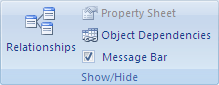
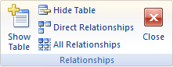

# 由于将在索引、主键或关系中创建重复的值，请求对表的更改没有成功。（错误 3022）

您尝试重复基础表的主键字段或一个不允许重复的索引字段中的值。

## 什么是主键？

主键是表中的一个字段或一组字段，利用主键，Microsoft Access 可为每个行提供一个唯一标识符。在关系数据库（如 Access 数据库）中，可将您的信息划分到多个单独的基于主题的表中。然后，您可以使用表关系和主键告知 Access 如何重新将信息组合在一起。Access 使用主键字段可快速将多个表中的数据关联起来，并按照某种有意义的方式组合这些数据。

通常，将唯一标识号（如 ID 号、序列号或代码）用作表中的主键。例如，您可能有一个"客户"表，其中每个客户均有一个唯一的客户 ID 号。客户 ID 字段就是主键。

例如，将名称或地址作为主键就是不恰当的选择。二者包含的信息可能会随时间而发生变化。

Access 确保每个记录在主键字段中都有一个值，并且该值始终是唯一的。

## 什么是索引？

可以使用索引来帮助 Access 更快地查找记录并对其进行排序。索引将基于您选择用来编制索引的一个或多个字段来存储记录的位置。Access 从索引中获取位置信息之后，可以通过直接移动到正确的位置来检索数据。通过这种方式，使用索引来查找数据会比通过扫描所有记录来查找数据要快得多。

创建唯一索引时，如果您在某个字段中输入的新值在其他记录的同一字段中已存在，则 Access 将不允许您输入该值。Access 会自动为主键创建唯一索引。

## 解决方案

若要解决此问题，您必须将表设计为消除在主键字段或使用唯一索引的字段中输入重复值的可能性。

如果当前主键字段需要支持重复值，则应删除当前主键并将自动编号字段添加到表中以用作其主键。

## 删除主键

在删除主键之后，先前用作主键的一个或多个字段将不再提供用于标识记录的主要方式。不过，删除主键并不会从表中删除字段，而是从这些字段中删除主键标志。此外，删除主键的同时会删除已为主键创建的索引。

1. 必须先确保主键未参与任何表关系，然后才能删除主键。如果您尝试删除现有关系中的主键，Access 会提示必须先删除相应的关系。
    
2. 
      - 如果参与表关系的表已打开，请关闭这些表。您无法删除已打开的表之间的表关系。
    
  - 在 **"数据库工具"**选项卡上的 **"显示/隐藏"**组中，单击 **"关系"**。

    
  - 如果参与表关系的表不可见，请在 **"设计"**选项卡上的 **"关系"**组中，单击 **"显示表"**。然后在 **"显示表"**对话框中选择要添加的表，单击 **"添加"**，然后单击 **"关闭"**。
    
  - 单击要删除的表关系中的表关系行（此行在选中时会变为粗体），然后按 Delete 键。
    
  - 在 **"设计"**选项卡上的 **"关系"**组中，单击 **"关闭"**。

    
3. 在导航窗格中，右键单击要从中删除主键的表，然后单击 **"设计视图"**。
    
4. 单击当前主键的行选择器。
    
5. 
      - 如果主键包含一个字段，则单击该字段的行选择器。
    
  - 如果主键包含多个字段，则单击主键中任一字段的行选择器。
    
6. 在 **"设计"**选项卡上的 **"工具"**组中，单击 **"主键"**。
将从先前指定为主键的一个或多个字段中删除键标记。
    
 **访问支持资源**[访问 MSDN 上的开发人员论坛](https://social.msdn.microsoft.com/Forums/office/zh-cn/home?forum=accessdev)[访问 support.office.com 上的帮助](https://support.office.com/search/results?query=Access)[访问 answers.microsoft.com 上的帮助](http://answers.microsoft.com/zh-cn/office/forum/access?page=1&amp;tab=question&amp;status=all&amp;auth=1)[在必应上搜索特定的访问错误代码](http://www.bing.com/)[访问 UtterAccess 上的论坛](http://www.utteraccess.com/forum/index.php?act=idx)[访问 UtterAcess 上的 wiki](http://www.utteraccess.com/forum/index.php?act=idx)[访问开发人员和 VBA 编程帮助中心 (FMS)](http://www.fmsinc.com/MicrosoftAccess/developer/)[访问 StackOverflow 上的帖子](http://stackoverflow.com/questions/tagged/ms-access)
