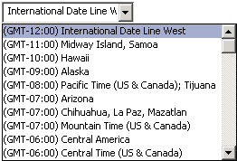

# OlkTimeZoneControl 对象 （Outlook）

支持从时区下拉列表进行选择的控件。

## 说明

在窗体设计器中首次使用此控件之前，应将 Microsoft Outlook 时区控件添加到控件工具箱中。您只能使用窗体设计器将此控件添加到 Outlook 窗体的窗体区域中；不能将此控件添加到 Visual Basic 编辑器中的 Visual Basic UserForm 对象上。

下面是时区控件的示例。时区数据可从 Windows 注册表项 HKEY_LOCAL_MACHINE\SOFTWARE\Microsoft\Windows NT\CurrentVersion\Time Zones 获取。

如果约会项目最初是使用已不存在的时区值创建的，则约会时间将转换为当前的当地时区。

## 另请参阅

#### 其他资源

[Outlook 对象模型引用](http://msdn.microsoft.com/library/73221b13-d8d8-99b8-3394-b95dbbfd5ddc%28Office.15%29.aspx)
[OlkTimeZoneControl 对象成员](350ded4c-0118-c278-dabe-c6139aeba1e9.md)