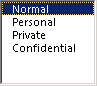

# OlkListBox 对象 （Outlook）

支持显示可滚动的项目列表的控件。

## 说明

在窗体设计器中首次使用此控件之前，应将 Microsoft Outlook 列表框控件添加到控件工具箱中。您只能使用窗体设计器将此控件添加到 Outlook 窗体的窗体区域中。

下面是在运行时已绑定到"敏感度"字段的列表框控件的一个示例。此控件支持 Microsoft Windows 主题。

有关 Outlook 控件的详细信息，请参阅[自定义窗体中的控件](http://msdn.microsoft.com/library/fcba1b34-c526-5d01-8644-cb8852bd2348%28Office.15%29.aspx)。有关以 C# 和 Visual Basic .NET 编写的、使用 Outlook 控件的加载项示例，请参阅 MSDN 上的代码示例下载。

## 另请参阅

#### 其他资源

[Outlook 对象模型引用](http://msdn.microsoft.com/library/73221b13-d8d8-99b8-3394-b95dbbfd5ddc%28Office.15%29.aspx)
[OlkListBox 对象成员](b8bed0b5-6994-1492-055e-4067b232f9c4.md)