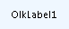

# OlkLabel 对象 （Outlook）

基本的标签控件，用于显示只读文本。

## 说明

在窗体设计器中首次使用此控件之前，应将 Microsoft Outlook 标签控件添加到控件工具箱中。您只能使用窗体设计器将此控件添加到 Outlook 窗体的窗体区域中。

下面是显示默认标题的运行时标签控件的一个示例。此控件支持 Microsoft Windows 主题。

此标签控件通常为另一个控件提供信息或者用作另一个控件的标签。

有关 Outlook 控件的详细信息，请参阅[自定义窗体中的控件](http://msdn.microsoft.com/library/fcba1b34-c526-5d01-8644-cb8852bd2348%28Office.15%29.aspx)。有关以 C# 和 Visual Basic .NET 编写的、使用 Outlook 控件的加载项示例，请参阅 MSDN 上的代码示例下载。

## 另请参阅

#### 其他资源

[OlkLabel 对象成员](fdab75ca-86a1-d3c3-b60c-b4dc3267cd6c.md)
[Outlook 对象模型引用](http://msdn.microsoft.com/library/73221b13-d8d8-99b8-3394-b95dbbfd5ddc%28Office.15%29.aspx)