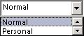

# OlkComboBox 对象 （Outlook）

一个控件，支持显示从所有选项下拉列表中选择的内容。

## 说明

在窗体设计器中首次使用此控件之前，应将 Microsoft Outlook 组合框控件添加到控件工具箱中。您只能使用窗体设计器将此控件添加到 Outlook 窗体的窗体区域中。

下面是绑定到"敏感度"字段的组合框控件的一个示例。此控件支持 Microsoft Windows 主题。

如果实现的 **[Click](a32e55f6-65ec-26d0-32a5-8549bf4b30d7.md)** 事件，但未实现的 **[DropButtonClick](9de7c7b5-da6e-825e-a7de-d4419fa8fbb4.md)** 事件，然后单击删除按钮将触发只 **Click** 事件。

有关 Outlook 控件的详细信息，请参阅[自定义窗体中的控件](http://msdn.microsoft.com/library/fcba1b34-c526-5d01-8644-cb8852bd2348%28Office.15%29.aspx)。有关以 C# 和 Visual Basic .NET 编写的、使用 Outlook 控件的加载项示例，请参阅 MSDN 上的代码示例下载。

## 另请参阅

#### 其他资源

[OlkComboBox 对象成员](618de9e2-f5b9-40d9-239e-95aeb9dce092.md)
[Outlook 对象模型引用](http://msdn.microsoft.com/library/73221b13-d8d8-99b8-3394-b95dbbfd5ddc%28Office.15%29.aspx)