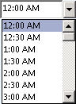

# OlkTimeControl 对象 （Outlook）

显示 Outlook 时间下拉菜单的控件。

## 说明

之前您使用此控件在窗体设计器中，第一次将Microsoft Outlook时控件添加到控件工具箱。只可将此控件添加到窗体区域的 Outlook 窗体中使用窗体设计器;无法将此控件添加到 Visual Basic **用户窗体** 对象在 Visual Basic 编辑器中。

时间控件具有几种不同的模式，通过在控件上的属性公开的。 它可以绑定到任何 **DateTime** 属性，并可绑定到同一属性与日期控件以提供同时选择日期和时间的能力。

下面是运行时的时间控件的一个示例。此控件支持 Microsoft Windows 主题。

如果实现的 **[Click](756b3a57-54c2-932d-e001-3e22baa9e8dd.md)** 事件，但未实现的 **[DropButtonClick](2c48055b-97ee-518c-f8c4-5e473c5436ca.md)** 事件，然后单击删除按钮将触发只 **Click** 事件。

如果将时间控件绑定到约会项目的开始时间或结束时间，则必须使用加载项来控制时间控件的启用和禁用。尤其是当用户将约会设置为全天事件时，必须使用代码禁用开始时间和结束时间的时间控件，并且只能在用户清除此设置时才能启用这些控件。

有关 Outlook 控件的详细信息，请参阅[自定义窗体中的控件](http://msdn.microsoft.com/library/fcba1b34-c526-5d01-8644-cb8852bd2348%28Office.15%29.aspx)。有关以 C# 和 Visual Basic .NET 编写的、使用 Outlook 控件的加载项示例，请参阅 MSDN 上的代码示例下载。

## 另请参阅

#### 其他资源

[OlkTimeControl 对象成员](4a9d0ec3-40b4-c40c-8774-ba8aa1f092e3.md)
[Outlook 对象模型引用](http://msdn.microsoft.com/library/73221b13-d8d8-99b8-3394-b95dbbfd5ddc%28Office.15%29.aspx)