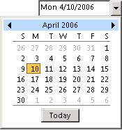

# OlkDateControl 对象 (Outlook)

一个控件，支持在任务和约会项目的检查器中使用下拉日期选取器来选择日期。

## 备注

之前您使用此控件在窗体设计器中，第一次将Microsoft Outlook日期控件添加到控件工具箱。只可将此控件添加到窗体区域的 Outlook 窗体中使用窗体设计器;无法将此控件添加到 Visual Basic **用户窗体** 对象在 Visual Basic 编辑器中。

下面是运行时日期控件的一个示例。此控件支持 Microsoft Windows 主题。

此控件可以绑定到任何内置或自定义的 **日期时间** 字段。 但是，控件不支持任何日期格式设置为该字段，也不支持在约会检查器中可用的选择范围行为。

如果实现的 **[Click](ec2483b8-0fe1-de86-dc01-9cafbde31e44.md)** 事件，但未实现的 **[DropButtonClick](425118d2-afa4-4582-1f89-857e5b7ae903.md)** 事件，然后单击删除按钮将触发只 **Click** 事件。

有关 Outlook 控件的详细信息，请参阅[自定义窗体中的控件](http://msdn.microsoft.com/library/fcba1b34-c526-5d01-8644-cb8852bd2348%28Office.15%29.aspx)。有关以 C# 和 Visual Basic .NET 编写的、使用 Outlook 控件的加载项示例，请参阅 MSDN 上的代码示例下载。

## 事件

|**名称**|
|:-----|
|[AfterUpdate](7086c185-99a2-94e1-6041-64c58869067f.md)|
|[BeforeUpdate](2347764e-dbd8-e622-ad5a-27795613abf5.md)|
|[更改](179e600a-8ce6-b1f4-176e-ac6aa68aaa8a.md)|
|[单击](ec2483b8-0fe1-de86-dc01-9cafbde31e44.md)|
|[DoubleClick](190ba56e-f4b2-ff11-0df9-1e98cdcef655.md)|
|[DropButtonClick](425118d2-afa4-4582-1f89-857e5b7ae903.md)|
|[输入](1e6c1905-d5f3-1063-1b7e-c62e54252e43.md)|
|[退出](6a8ec569-4e08-0400-95ad-934cbe2c20e4.md)|
|[KeyDown](8b24fba9-5af4-9519-8391-1a57fab6e39e.md)|
|[KeyPress](59b22d35-001a-4e99-3b71-d7f95a73d821.md)|
|[KeyUp](7776832b-fdb0-cd2b-efa3-97dab74065e6.md)|
|[MouseDown](df29431e-c8a6-e345-e9c3-4a4195e00d41.md)|
|[MouseMove](a4788848-a2dd-d19e-e969-fb353eddbfc7.md)|
|[MouseUp](abe4afac-3afd-7f08-3128-650f847c692c.md)|

## 方法

|**名称**|
|:-----|
|[DropDown](7668e185-ced8-6ca9-d89c-493f08d542c9.md)|

## 属性

|**名称**|
|:-----|
|[AutoSize](fdade84d-fa98-868c-4c76-34030242dc83.md)|
|[AutoWordSelect](cd26e65e-d25f-26e3-5b6c-736beefb0742.md)|
|[BackColor](9b4bf367-18c7-deea-dab6-09d2e53ad5e9.md)|
|[BackStyle](af73bf4f-4288-1679-4aff-26839e73c3c9.md)|
|[日期](f1c1a454-4c1f-7ae6-2fbd-f3875beb6cea.md)|
|[启用](ac687fc7-6e69-2020-25d3-facc24689633.md)|
|[EnterFieldBehavior](985b7c35-cdd7-a75b-309e-a6459beeab31.md)|
|[字体](c05993d6-9a33-648b-ec2e-d8c442c2ad6f.md)|
|[ForeColor](d949651c-96a0-a6a6-65f1-03e7c58bb7d0.md)|
|[HideSelection](74bd86f9-ab29-dc4a-0058-5f33abb2e9da.md)|
|[锁定](9f34809b-70e8-503e-e345-5eaa59ccf087.md)|
|[MouseIcon](4d2bf497-0e80-2494-4197-e746778da519.md)|
|[MousePointer](14ca0547-b43c-df9b-105c-ddb655629d34.md)|
|[ShowNoneButton](9a3cb14c-484c-a25a-e233-d99a14c31eb0.md)|
|[文本](fda479bc-c613-171f-4e81-efe9c548fd81.md)|
|[TextAlign](2050c4f9-b648-59a3-9171-dc31c49f3b51.md)|
|[值](df2c96d4-42d4-fd33-a55b-2162f65069b7.md)|

## 另请参阅

#### 其他资源

[OlkDateControl 对象成员](6bc09aee-2f4e-5042-a653-52c0c09068c5.md)
[Outlook 对象模型引用](http://msdn.microsoft.com/library/73221b13-d8d8-99b8-3394-b95dbbfd5ddc%28Office.15%29.aspx)