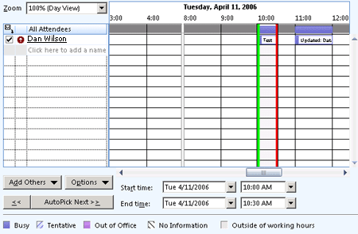
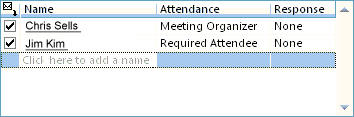

# OlkPageControl 对象 （Outlook）

显示页面内容的控件。

## 说明

之前您使用此控件在窗体设计器中，第一次将Microsoft Outlook页面控件添加到控件工具箱。只可将此控件添加到窗体区域的 Outlook 窗体中使用窗体设计器;无法将此控件添加到 Visual Basic **用户窗体** 对象在 Visual Basic 编辑器中。此控件支持 Microsoft Windows 主题。

目前，此控件支持两个 Outlook 页：忙/闲计划页和会议要求跟踪页。下面是在运行时显示忙/闲计划的一个页控件示例。

下面是在运行时显示会议要求跟踪页的一个页控件示例。

有关 Outlook 控件的详细信息，请参阅[自定义窗体中的控件](http://msdn.microsoft.com/library/fcba1b34-c526-5d01-8644-cb8852bd2348%28Office.15%29.aspx)。有关以 C# 和 Visual Basic .NET 编写的、使用 Outlook 控件的加载项示例，请参阅 MSDN 上的代码示例下载。

## 另请参阅

#### 其他资源

[OlkPageControl 对象成员](2d0e8592-192e-c4e7-430b-ba47ec088fc4.md)
[Outlook 对象模型引用](http://msdn.microsoft.com/library/73221b13-d8d8-99b8-3394-b95dbbfd5ddc%28Office.15%29.aspx)