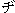
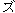

# Options.MatchFuzzyDZ Property (Word)

 **True** if Microsoft Word ignores the distinction between "
" and "
" and between "
" and "
" during a search. Read/write  **Boolean**.


## Syntax

 _表达式_. **MatchFuzzyDZ**

 _表达式_ An expression that returns an **[Options](873b7b99-3fe1-fd89-9ece-a9355cb827dc.md)** object.


## Example

This example sets Microsoft Word to ignore the distinction between "
" and "
" and between "
" and "
" during a search.


```
Options.MatchFuzzyDZ = True
```


## 另请参阅


#### 概念


[Options Object](873b7b99-3fe1-fd89-9ece-a9355cb827dc.md)
#### 其他资源


[Options Object Members](http://msdn.microsoft.com/library/76cd9dfe-6bbb-4c3d-0bfc-79a62bedd15e%28Office.15%29.aspx)