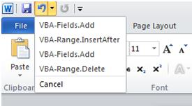
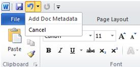

# 使用 UndoRecord 对象

最终用户在 Word 中工作，则队列中记录他们执行可撤消的操作，"撤消堆栈"— — 以便如果用户决定取消动作，Word 可以撤回所执行的操作并撤消它。撤消堆栈是通过 Word 用户界面上的撤消按钮，通过功能区每个操作被列为独立记录堆栈中可见。自动化还使用 Word 对象模型将这些"撤消记录"到撤消堆栈中，但使用的撤消堆栈使用很有问题。

开发人员有时会编写代码来执行一个逻辑任务，使用一系列的动作，其中每个操作被记录为撤消堆栈上的一个单独的条目。但是，即使最终用户可以分别撤消每项操作，有时它是合理的撤消作为一个整体并没有单独的任务的所有步骤。

例如，开发人员可以编写代码来执行插入 Word 文档的页脚的文档元数据，如下面的代码示例中所示的任务。


```
Sub AddDocMetadata() 
Dim rngFooter As Range 
 
    Set rngFooter = ActiveDocument.Sections(1) _ 
        .Footers(wdHeaderFooterPrimary).Range 
         
    With rngFooter 
        .Delete 
        .Fields.Add Range:=rngFooter, Type:=wdFieldFileName, Text:="\p" 
        .InsertAfter Text:=vbTab &amp; vbTab 
        .Collapse Direction:=wdCollapseStart 
        .Fields.Add Range:=rngFooter, Type:=wdFieldAuthor 
    End With     
End Sub 

```

结果撤消记录出现在撤消堆栈中的代码执行的操作。

如果最终用户然后需要回滚或撤消"插入元数据"任务，与任务关联的每个操作必须撤消单独 (通过按 CTRL + Z 或单击 **撤消**按钮上的下拉箭头，然后选择要撤消的操作)。在此情况下，最终用户若要仅部分撤消与单个任务，请在不需要的状态可能会导致文档关联的操作的一系列有可能。
Word 对象模型提供了一种方法来避免此问题，通过提供开发人员能够将一系列用来作为一个单元撤消的操作的自定义撤消记录到单个操作的链接。[UndoRecord](77bf9801-e940-e661-6bbe-20a8714d5dbd.md)对象的自定义撤消记录表示 Word 对象模型中。

## 使用 UndoRecord 对象

[UndoRecord](77bf9801-e940-e661-6bbe-20a8714d5dbd.md)是在 Word 的[应用程序](d1cf6f8f-4e88-bf01-93b4-90a83f79cb44.md)对象的属性。您创建的自定义撤消记录使用[UndoRecord](77bf9801-e940-e661-6bbe-20a8714d5dbd.md)对象的[StartCustomRecord](cd8d4337-4bbc-1943-6e0a-bc764861e886.md)和[EndCustomRecord](af11d231-f799-d592-2bc5-de08030b41e4.md)方法。请考虑下面的代码示例修改前面的示例包括一个自定义撤消记录。


```
Dim objUndo As UndoRecord 
 
Sub AddDocMetadata() 
Dim rngFooter As Range 
 
Set objUndo = Application.UndoRecord 
 
'Begin the custom undo record and provide a name for the record 
objUndo.StartCustomRecord ("Add Doc Metadata") 
     
 Set rngFooter = ActiveDocument.Sections(1) _ 
        .Footers(wdHeaderFooterPrimary).Range 
         
 With rngFooter 
        .Delete 
        .Fields.Add Range:=rngFooter, Type:=wdFieldFileName, Text:="\p" 
        .InsertAfter Text:=vbTab &amp; vbTab 
        .Collapse Direction:=wdCollapseStart 
        .Fields.Add Range:=rngFooter, Type:=wdFieldAuthor 
 End With 
 
'End the custom undo record 
objUndo.EndCustomRecord 
     
End Sub 

```

[StartCustomRecord](cd8d4337-4bbc-1943-6e0a-bc764861e886.md)方法开始记录包含在记录中的自定义撤消操作。您可以为自定义撤消记录名称作为参数的[StartCustomRecord](cd8d4337-4bbc-1943-6e0a-bc764861e886.md)方法，但这是可选的。如果不指定一个名称，Word 将使用 Visual Basic 名称的第一个记录的名称作为执行的命令。自定义撤消记录的名称是 **撤消**按钮旁边的下拉列表中的用户界面中显示的字符串。

[EndCustomRecord](af11d231-f799-d592-2bc5-de08030b41e4.md)方法停止记录的自定义撤消记录。通过[StartCustomRecord](cd8d4337-4bbc-1943-6e0a-bc764861e886.md)调用和[EndCustomRecord](af11d231-f799-d592-2bc5-de08030b41e4.md)调用之间的代码执行的所有操作都链接到一个[UndoRecord](77bf9801-e940-e661-6bbe-20a8714d5dbd.md)对象。创建一个自定义撤消记录，如前面的代码示例中所示的代码运行时的自定义撤消记录被列为撤消堆栈中一个条目。





## UndoRecord 对象成员

下表列出了[UndoRecord](77bf9801-e940-e661-6bbe-20a8714d5dbd.md)的其他重要成员。


|**名称**|**成员类型**|**说明**|
|:-----|:-----|:-----|
|**[CustomRecordLevel](e0636c02-b1fb-2f88-c8a5-b52c88b65530.md)**|属性|返回一个 **Long** ，指定当前处于活动状态的自定义撤消操作调用的数目。只读的。|
|**[CustomRecordName](97da07e1-3b9f-de7d-c2d8-af6af2bb2374.md)**|属性|返回一个 **字符串** ，指定撤消堆栈上，显示的项，当所有的自定义撤消操作已完成。只读的。|
|**[IsRecordingCustomRecord](08693e04-4a76-f7ab-9671-cdad35ac87ea.md)**|属性|返回一个 **boolean 类型的值** ，指定是否一个自定义撤消操作将被记录。只读的。|

## 最佳做法


- 关闭每个[EndCustomRecord](af11d231-f799-d592-2bc5-de08030b41e4.md)调用的自定义撤消记录。Word 将试图确定在何处结束记录，但它可能不是代码执行的所需位置。
    
- 从调用的自定义撤消记录中时，按正确的顺序调用[文档](8d83487a-2345-a036-a916-971c9db5b7fb.md)对象的[Undo](f9fd64c9-aeb9-b698-6318-beb1db653ee6.md)方法。调用[撤消](f9fd64c9-aeb9-b698-6318-beb1db653ee6.md)方法按照错误的顺序的自定义撤消记录内可以产生意外的代码执行的效果。下面的代码示例演示正在自定义撤消记录内部调用[Undo](f9fd64c9-aeb9-b698-6318-beb1db653ee6.md)方法。
    
  ```
  Sub UndoInUndoRecord() 
 
Set objUndo = Application.UndoRecord 
 
objUndo.StartCustomRecord ("New Paragraph") 
 
ActiveDocument.Content.InsertAfter Text:=" The end." 
ActiveDocument.Undo 
ActiveDocument.Content.InsertAfter Text:=" The end, again." 
ActiveDocument.Content.InsertAfter Text:=" The last end." 
 
objUndo.EndCustomRecord 
 
End Sub
  ```


    运行此代码时，每个操作之前 **撤消** 方法调用的自定义撤消记录中被撤消。自定义撤消记录后 **撤消** 方法调用放到撤消堆栈中的每个操作。
    
- 避免切换文档内的自定义撤消记录。下面的代码示例切换从一个文档到另一个自定义撤消记录内。
    
  ```
  Dim objUndo As UndoRecord 

Sub SwitchDocsInsideUndo() 
Set objUndo = Application.UndoRecord objUndo.StartCustomRecord ("New Paragraph") 

'Insert some text into the first document Documents(1).Content.InsertAfter "A new paragraph in doc1." 

'Switch documents to the second document 
'The custom undo record will terminate here Documents(2).Content.InsertAfter "A new paragraph in doc2." 

objUndo.EndCustomRecord 
End Sub
  ```


    运行此代码时， Word将终止自定义撤消记录，当代码开始写入第二个文档。完成该过程后，仅在第一个文档将具有一个自定义撤消记录名为"新段落"。
    
- 避免使用分页符时运行代码，包含在调试模式下的自定义撤消记录。当在 Visual Basic 编辑器中的调试模式下运行包含撤消记录的代码和代码遇到断点时，Word 将自动结束当前正在进行的所有自定义记录。
    
