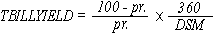

# WorksheetFunction.TBillYield Method (Excel)

Returns the yield for a Treasury bill.

## Syntax

 _表达式_. **TBillYield**( ** _Arg1_**, ** _Arg2_**, ** _Arg3_** )

 _表达式_ A variable that represents a **WorksheetFunction** object.

### Parameters

|**Name**|**Required/Optional**|**Data Type**|**Description**|
|:-----|:-----|:-----|:-----|
| _Arg1_|必需|**Variant**|Settlement - the Treasury bill's settlement date. The security settlement date is the date after the issue date when the Treasury bill is traded to the buyer.|
| _Arg2_|必需|**Variant**|Maturity - the Treasury bill's maturity date. The maturity date is the date when the Treasury bill expires.|
| _Arg3_|可选|**Variant**|Pr - the Treasury bill's price per $100 face value.|

### Return Value

Double

## Remarks

 **重要信息**  Dates should be entered by using the DATE function, or as results of other formulas or functions. For example, use DATE(2008,5,23) for the 23rd day of May, 2008. Problems can occur if dates are entered as text.

- Microsoft Excel stores dates as sequential serial numbers so they can be used in calculations. By default, January 1, 1900 is serial number 1, and January 1, 2008 is serial number 39448 because it is 39,448 days after January 1, 1900. Microsoft Excel for the Macintosh uses a different date system as its default.
    
     **注释**  Visual Basic for Applications (VBA) calculates serial dates differently than Excel. In VBA, serial number 1 is December 31, 1899, rather than January 1, 1900. 
- Settlement and maturity are truncated to integers.
    
- If settlement or maturity is not a valid date, TBILLYIELD returns the #VALUE! error value.
    
- If pr ? 0, TBILLYIELD returns the #NUM! error value.
    
- If settlement ? maturity, or if maturity is more than one year after settlement, TBILLYIELD returns the #NUM! error value.
    
- TBILLYIELD is calculated as follows:
where: DSM = number of days from settlement to maturity, excluding any maturity date that is more than one calendar year after the settlement date. 
    

## 另请参阅

#### 概念

[WorksheetFunction Object](7b1d5639-363d-632c-2cf0-2232562646b6.md)
#### 其他资源

[WorksheetFunction Object Members](http://msdn.microsoft.com/library/6811ca87-4b53-0bff-88c9-30bf7497879a%28Office.15%29.aspx)