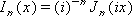

# WorksheetFunction.BesselI Method (Excel)

Returns the modified Bessel function, which is equivalent to the Bessel function evaluated for purely imaginary arguments.

## Syntax

 _表达式_. **BesselI**( ** _Arg1_**, ** _Arg2_** )

 _表达式_ A variable that represents a **WorksheetFunction** object.

### Parameters

|**Name**|**Required/Optional**|**Data Type**|**Description**|
|:-----|:-----|:-----|:-----|
| _Arg1_|必需|**Variant**|The value at which to evaluate the function.|
| _Arg2_|必需|**Variant**| The order of the Bessel function. If n is not an integer, it is truncated.|

### Return Value

Double

## Remarks

- If x is nonnumeric, BesselI returns the #VALUE! error value.
    
- If n is nonnumeric, BesselI generates an error value.
    
- If n < 0, BesselI generates an error value.
    
- The n-th order modified Bessel function of the variable x is:

    

## 另请参阅

#### 概念

[WorksheetFunction Object](7b1d5639-363d-632c-2cf0-2232562646b6.md)
#### 其他资源

[WorksheetFunction Object Members](http://msdn.microsoft.com/library/6811ca87-4b53-0bff-88c9-30bf7497879a%28Office.15%29.aspx)