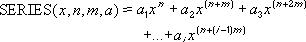

# WorksheetFunction.SeriesSum Method (Excel)

Returns the sum of a power series based on the formula:

## Syntax

 _表达式_. **SeriesSum**( ** _Arg1_**, ** _Arg2_**, ** _Arg3_**, ** _Arg4_** )

 _表达式_ A variable that represents a **WorksheetFunction** object.

### Parameters

|**Name**|**Required/Optional**|**Data Type**|**Description**|
|:-----|:-----|:-----|:-----|
| _Arg1_|必需|**Variant**|X - the input value to the power series.|
| _Arg2_|必需|**Variant**|N - the initial power to which you want to raise x.|
| _Arg3_|必需|**Variant**|M - the step by which to increase n for each term in the series.|
| _Arg4_|必需|**Variant**|Coefficients - a set of coefficients by which each successive power of x is multiplied. The number of values in coefficients determines the number of terms in the power series. For example, if there are three values in coefficients, then there will be three terms in the power series.|

### Return Value

Double

## Remarks

If any argument is nonnumeric, SERIESSUM returns the #VALUE! error value.

## 另请参阅

#### 概念

[WorksheetFunction Object](7b1d5639-363d-632c-2cf0-2232562646b6.md)
#### 其他资源

[WorksheetFunction Object Members](http://msdn.microsoft.com/library/6811ca87-4b53-0bff-88c9-30bf7497879a%28Office.15%29.aspx)