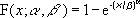
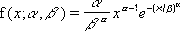
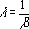

# WorksheetFunction.Weibull Method (Excel)

Returns the Weibull distribution. Use this distribution in reliability analysis, such as calculating a device's mean time to failure.

## 

 **重要信息**  This function has been replaced with one or more new functions that may provide improved accuracy and whose names better reflect their usage. This function is still available for compatibility with earlier versions of Excel. However, if backward compatibility is not required, you should consider using the new functions from now on, because they more accurately describe their functionality.For more information about the new function, see the [Weibull_Dist](17e5c39f-0808-2c84-a732-801fa0e342d8.md) method.

## Syntax

 _表达式_. **Weibull**( ** _Arg1_**, ** _Arg2_**, ** _Arg3_**, ** _Arg4_** )

 _表达式_ A variable that represents a **[WorksheetFunction](7b1d5639-363d-632c-2cf0-2232562646b6.md)** object.

### Parameters

|**Name**|**Required/Optional**|**Data Type**|**Description**|
|:-----|:-----|:-----|:-----|
| _Arg1_|必需|**Double**|X - the value at which to evaluate the function.|
| _Arg2_|必需|**Double**|Alpha - a parameter to the distribution.|
| _Arg3_|必需|**Double**|Beta - a parameter to the distribution.|
| _Arg4_|必需|**Boolean**|Cumulative - determines the form of the function.|

### Return Value

Double

## Remarks

- If x, alpha, or beta is nonnumeric, WEIBULL returns the #VALUE! error value.
    
- If x < 0, WEIBULL returns the #NUM! error value.
    
- If alpha ? 0 or if beta ? 0, WEIBULL returns the #NUM! error value.
    
- The equation for the Weibull cumulative distribution function is:

    
- The equation for the Weibull probability density function is:

    
- When alpha = 1, WEIBULL returns the exponential distribution with:

    

## 另请参阅

#### 概念

[WorksheetFunction Object](7b1d5639-363d-632c-2cf0-2232562646b6.md)
#### 其他资源

[WorksheetFunction Object Members](http://msdn.microsoft.com/library/6811ca87-4b53-0bff-88c9-30bf7497879a%28Office.15%29.aspx)