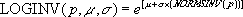

# WorksheetFunction.LogInv Method (Excel)

Use the lognormal distribution to analyze logarithmically transformed data.

 **重要信息**  This function has been replaced with one or more new functions that may provide improved accuracy and whose names better reflect their usage. This function is still available for compatibility with earlier versions of Excel. However, if backward compatibility is not required, you should consider using the new functions from now on, because they more accurately describe their functionality.For more information about the new function, see the [LogNorm_Inv](d8a3c416-c2c4-dc57-e1f0-1d05e9fec2a1.md) method.

## Syntax

 _表达式_. **LogInv**( ** _Arg1_**, ** _Arg2_**, ** _Arg3_** )

 _表达式_ A variable that represents a **[WorksheetFunction](7b1d5639-363d-632c-2cf0-2232562646b6.md)** object.

### Parameters

|**Name**|**Required/Optional**|**Data Type**|**Description**|
|:-----|:-----|:-----|:-----|
| _Arg1_|必需|**Double**|Probability - a probability associated with the lognormal distribution.|
| _Arg2_|必需|**Double**|Mean - the mean of ln(x).|
| _Arg3_|必需|**Double**|Standard_dev - the standard deviation of ln(x).|

### Return Value

Double

## Remarks

- If any argument is nonnumeric, LOGINV returns the #VALUE! error value.
    
- If probability <= 0 or probability >= 1, LOGINV returns the #NUM! error value.
    
- If standard_dev <= 0, LOGINV returns the #NUM! error value.
    
-  The inverse of the lognormal distribution function is:

    

## 另请参阅

#### 概念

[WorksheetFunction Object](7b1d5639-363d-632c-2cf0-2232562646b6.md)
#### 其他资源

[WorksheetFunction Object Members](http://msdn.microsoft.com/library/6811ca87-4b53-0bff-88c9-30bf7497879a%28Office.15%29.aspx)