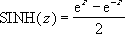

# WorksheetFunction.Sinh Method (Excel)

Returns the hyperbolic sine of a number.

## Syntax

 _表达式_. **Sinh**( ** _Arg1_** )

 _表达式_ A variable that represents a **WorksheetFunction** object.

### Parameters

|**Name**|**Required/Optional**|**Data Type**|**Description**|
|:-----|:-----|:-----|:-----|
| _Arg1_|必需|**Double**|Number is any real number.|

### Return Value

Double

## Remarks

The formula for the hyperbolic sine is: 

## 另请参阅

#### 概念

[WorksheetFunction Object](7b1d5639-363d-632c-2cf0-2232562646b6.md)
#### 其他资源

[WorksheetFunction Object Members](http://msdn.microsoft.com/library/6811ca87-4b53-0bff-88c9-30bf7497879a%28Office.15%29.aspx)