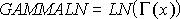
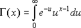

# WorksheetFunction.GammaLn Method (Excel)

Returns the natural logarithm of the gamma function, ?(x).

 **重要信息**  This function has been replaced with one or more new functions that may provide improved accuracy and whose names better reflect their usage. This function is still available for compatibility with earlier versions of Excel. However, if backward compatibility is not required, you should consider using the new functions from now on, because they more accurately describe their functionality.

For more information about the new function, see the [GammaLn_Precise](a428c7a2-452e-575d-7d16-fd9f5023755d.md) method.

## Syntax

 _表达式_. **GammaLn**( ** _Arg1_** )

 _表达式_ A variable that represents a **WorksheetFunction** object.

### Parameters

|**Name**|**Required/Optional**|**Data Type**|**Description**|
|:-----|:-----|:-----|:-----|
| _Arg1_|必需|**Double**|X - the value for which you want to calculate GAMMALN.|

### Return Value

Double

## Remarks

- If x is nonnumeric, GAMMALN returns the #VALUE! error value.
    
- If x ? 0, GAMMALN returns the #NUM! error value.
    
- The number e raised to the GAMMALN(i) power, where i is an integer, returns the same result as (i - 1)!.
    
- GAMMALN is calculated as follows:
where: 

    

## 另请参阅

#### 概念

[WorksheetFunction Object](7b1d5639-363d-632c-2cf0-2232562646b6.md)
#### 其他资源

[WorksheetFunction Object Members](http://msdn.microsoft.com/library/6811ca87-4b53-0bff-88c9-30bf7497879a%28Office.15%29.aspx)