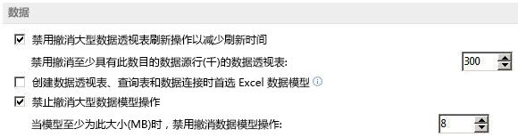

# 关于 Excel 中的 PowerPivot 模型对象
了解 Excel 中的 PowerPivot 加载项模型及其对象模型。

## 关于 PowerPivot Model 对象

PowerPivot 加载项使您可以直观地生成您自己的多维数据集。多维数据集是按维度或层定义的数据数组。PowerPivot 加载项在 Excel 中实施的  **Model** 对象提供了加载和合并多个数据源的源数据以在桌面上进行数据分析的基础，这些数据源包括关系数据库、多维源、云服务、数据源、Excel 文件、文本文件和 Web 中的数据。Excel 集成了额外的数据源并使您能够合并多个数据源中的数据。

PowerPivot 模型 (PPM) 的创建和删除由用户公开的操作触发，不能由开发人员直接创建。

## 定义的关系

在本文中，我们将两个表之间确定数据如何关联的连接称为关系。

关系将以前不相关的数据源联接在一起。每个关系都有一个 _主键_ 和一个 _外键_ 。通过关系，可以将数据联接在一起，形成单个模型。这可以实现以下操作：

- 按相关表中的数据筛选一个表中的数据 - 按相关列筛选数据
    
- 将多个表中的列集成到一个数据透视表/数据透视图
    
- 不重复数据，从而使工作簿保持较小的大小
    

## 仅单个模型

具有 PowerPivot 加载项的 Excel 可在工作簿中创建单个模型，它可在其中添加数据源、创建、修改和关联表。工作簿中只能有一个模型。

## 使用 OLAP 数据源

当连接到 OLAP 数据源（如 Analysis Services）并创建 OLAP 数据透视表、数据透视图、切片器或多维数据集函数时，不会创建任何模型。使用 PowerPivot 加载项创建的工作簿可以上载到 SharePoint、加载在服务器上的内容中并供其他工作簿访问，就好像它是 SQL Server Analysis Services 的普通实例一样。

## 触发 PowerPivot 模型的创建

默认情况下，Excel 2010 和 Excel 中的 XLSX 文件没有对 PPM 进行初始化，除非认为模型确有必要。如果工作簿中没有现有模型，某些操作会触发 PPM 的创建。以下各节介绍了当工作簿中不存在 PPM 时将触发其创建的操作。

### 添加新的非旧式数据源

只要您导入某些类型的数据，就会在工作簿中创建一个新模型（如果尚不存在），其中包含工作簿数据源的连接属性和表表示形式以及两者之间的关系。这包括范围和表等内部数据源。表 1 列出了可以集成到 PPM 中的不同数据源。

 **表 1. 与 PowerPivot 模型兼容的数据源**

|**数据源**|**说明**|**表预览**|**支持的查询**|
|:-----|:-----|:-----|:-----|
|Microsoft SQL Server|已在 Excel 中提供支持|可访问|可访问|
|Microsoft SQL Azure 数据市场|支持作为新的数据源|可访问|不可访问|
|Microsoft SQL Server 并行数据仓库|通过安装的 OLE DB 驱动程序提供支持|可访问|可访问|
|Microsoft Access|已在 Excel 中提供支持|可访问|可访问|
|Oracle|已在 Excel 中提供支持|可访问|可访问|
|Teradata|如果安装了 OLE DB 或 ODBC 驱动程序，则可用|不可访问|不可访问|
|Sybase|如果安装了 OLE DB 或 ODBC 驱动程序，则可用|不可访问|不可访问|
|Informix|如果安装了 OLE DB 或 ODBC 驱动程序，则可用|不可访问|不可访问|
|IBM Db2|如果安装了 OLE DB 或 ODBC 驱动程序，则可用|不可访问|不可访问|
|Microsoft Analysis Services|已在 Excel 中提供支持|可访问|可访问|
|报告 (SSRS)|可以读取和使用连接，但在 Excel 客户端中不能进行创作|可访问|不可访问|
|文本|从功能区 UI 中的 Excel 对话框|可访问|不可访问|
|数据源 (OData)|支持作为新的数据源|可访问|可访问|
|XML|已在 Excel 中提供支持|不可访问|不可访问|
|SharePoint 列表|已在 Excel 中提供支持。Excel 使用  **DataFeed** 提供程序连接到 SharePoint|不可访问|不可访问|
|SharePoint|Excel 中的新功能|可访问|可访问|
|Excel 表|Excel 中的用户定义的表，用于新的数据功能。创建表时，会创建到表的工作表数据连接。|N/A|N/A|
|Excel 范围|Excel 中的用户定义的范围，用于新的数据功能。在这种情况下，仅当图或数据透视表等数据功能使用范围时，才会创建到范围的工作表数据连接。|N/A|N/A|

### 新建 Excel 非 OLAP 数据透视表

新的 Excel 数据透视表（而不是从 OLAP 数据源创建的数据透视表）将基于 PPM，因此，如果文件中不存在 PPM，将在数据透视表创建操作中创建一个新的。这包括以下方面：

- 使用插入数据透视表用户界面
    
- 使用数据透视表用户界面汇总数据
    
- 通过 Microsoft Visual Basic for Applications (VBA) 对象模型创建的基于非 OLAP 数据源的数据透视表
    

### 新建 Excel 非 OLAP 数据透视图

在 Excel 中，数据透视表和数据透视图可以不再联接。因此，在没有模型的工作簿中插入数据透视图时，将会创建一个 PPM。

### 从另一个工作簿中粘贴 Excel 非 OLAP 数据透视表

将数据透视表或数据透视图从一个基于 PPM 的工作簿粘贴到另一个没有 PPM 的工作簿时，将在目标工作簿中创建一个新的 PPM。新数据源将添加到新创建的模型，指向源数据透视表/数据透视图的基础数据。

## 触发 PowerPivot 模型的创建

所有导致创建 PPM 的操作都可以撤消。如果从撤消菜单中选择这些操作，将不会撤消实际的模型创建，但不会向其添加任何内容，因此该模型将保留为空。保存工作簿时，如果模型为空，将不会在模型中保存文件。您并没有明确的方式来手动删除在工作簿中创建的模型。

 **注释**  与 Excel 2010 中类似，可以撤消的模型大小存在限制。当模型增加到此限制大小时，将不再提供对刷新等操作的撤消功能。本机数据透视表的当前限制是 300,000 行，在每单元格 28 字节时，此限制大约相当于 8MB 内存。这些值可以使用 Excel 中的"高级选项"设置，如图 1 中所示。

**图 1. 设置大型数据模型撤消操作的大小**

## PowerPivot Model 对象模型

工作簿可以有，也只能有一个  **Model** 对象。 **Model** 对象代表顶级对象，其中包含所有连接、关系和表。

您不能在工作簿中手动创建模型；模型创建将通过本文前一节中所述的操作触发。如果通过对象模型 (OM) 执行这些操作中的任一操作，将创建一个新模型。此 OM 的目的是以编程方式在模型表之间创建关系，从而产生联接的表、合并的数据透视表等。为了使您能够执行此操作，您必须能够浏览模型找到合适的表，然后在表内查找可用于创建关系的合适列。

### Model 对象

 **Model** 对象中存储了对工作簿连接的引用以及关于 PPM 内包含的表和关系的信息。表 5 列出了 **Model** 对象的属性。

 **表 2. Model 对象的属性**

|**属性**|**读/写**|**类型**|**描述**|
|:-----|:-----|:-----|:-----|
|**Application**|只读|**Application**|返回代表 Microsoft Excel 应用程序的对象。|
|**Creator**|只读|**xlCreator**|返回一个 32 位整数，表示在其中创建指定对象的应用程序。|
|**Parent**|只读|**Object**|返回代表指定  **Model** 对象的父对象的 **Object**。|
|**ModelTables**|只读|**ModelTable**|PPM 中的表的集合。|
|**ModelRelationships**|只读|**ModelRelationships**|PPM 表之间的关系的集合。|
|**DataModelConnection**|N/A|**WorkbookConnection**|从连接到模型的工作簿连接集合中返回模型工作簿连接对象。|
 **Model.AddConnection** 方法

向具有与作为参数提供的相同属性的模型中添加一个新的工作簿连接。此方法仅适用于非模型外部连接，如果将外部模型连接作为其参数进行调用，则会返回错误。调用此方法时，将创建一个新的模型连接，其命名与旧连接相同，结尾为一个整数，使名称独一无二。表 3 列出了  **AddConnection** 方法的参数。

 **表 3. Model.AddConnection 方法的参数**

|**名称**|**必需/可选**|**类型**|**描述**|
|:-----|:-----|:-----|:-----|
| _ConnectionToDataSource_|必需|**WorkbookConnection**|工作簿连接|
 **Model.CreateModelWorkbookConnection** 方法

调用此方法将返回  **ModelConnection** 类型的 **WorkbookConnection** 对象。将返回连接到指定表的模型连接。此连接类型仅供 Excel 中的查询表使用。表 4 列出了 **CreateModelWorkbookConnection** 方法的参数。

 **表 4. Model.CreateModelWorkbookConnection 方法的参数**

|**名称**|**必需/可选**|**类型**|**描述**|
|:-----|:-----|:-----|:-----|
| _ModelTable_|必需|**Variant**|模型表名或模型表对象。|
 **Model.Initialize** 方法

 **Model** 对象的 **Initialize** 方法没有参数。初始化 PPM。默认情况下，这在第一次使用模型时调用。

 **Model.Refresh** 方法

 **Model** 对象的 **Refresh** 方法没有参数。刷新与模型相关的所有数据源，完全重新处理模型并更新与 **Model** 对象相关的所有 Excel 数据功能。

### ModelChanges 对象

代表对 PPM 所做的更改。 **ModelChanges** 对象包含在执行模型操作后发生事件 **Workbook.ModelChange** 时，对数据模型所做更改的信息。当 Excel 更改数据模型时，可能在同一操作中进行多项更改，且 **ModelChanges** 对象将包含关于在一个模型操作中所做的所有更改的信息。表 5 列出了 **ModelChanges** 对象的属性。

 **表 5. ModelChanges 对象的属性**

|**属性**|**读/写**|**类型**|**描述**|
|:-----|:-----|:-----|:-----|
|**Application**|只读|**Application**|返回代表 Microsoft Excel 应用程序的对象。|
|**ColumnsAdded**|只读|**ModelColumnNames**|返回  **ModelColumnName** 对象的 **ModelColumnNames** 集合，这些对象代表作为模型操作一部分添加的所有列。|
|**ColumnsChanged**|只读|**ModelColumnChanges**|返回  **ModelColumnChange** 对象的 **ModelColumnChanges** 集合，这些对象代表作为模型操作一部分修改了其数据类型的所有表列的表名和列名。|
|**ColumnsDeleted**|只读|**ModelColumnNames**|返回  **ModelColumnName** 对象的 **ModelColumnNames** 集合，这些对象代表作为模型操作一部分被删除的所有列。|
|**Creator**|只读|**xlCreator**|返回一个 32 位整数，表示在其中创建指定对象的应用程序。|
|**MeasuresAdded**|只读|**ModelMeasureNames**|返回  **ModelMeasureNames** 对象的 **ModelMeasureName** 集合，这些对象代表作为模型操作一部分添加的所有度量。|
|**Parent**|只读|**Object**|返回代表指定  **ModelChanges** 对象的父对象的 **Object**。|
|**RelationshipChange**|只读|**Boolean**|如果为  **True**，表示模型中的一个或多个关系作为模型操作的一部分被更改（添加、删除或修改）；如果为  **False**，表示在操作中没有更改任何关系。|
|**TableNamesChanged**|只读|**ModelTableNameChanges**|返回  **ModelTableNameChange** 对象的 **ModelTableNameChanges** 集合，这些对象代表作为模型操作的一部分在模型中被重命名的所有表的旧名称和新名称。|
|**TablesAdded**|只读|**ModelTableNames**|返回表名称的  **ModelTableNames** 集合作为字符串，代表作为模型操作的一部分被添加到模型中的所有表。|
|**TablesDeleted**|只读|**ModelTableNames**|返回表名称的  **ModelTableNames** 集合作为字符串，代表作为模型操作的一部分从模型中删除的所有表。|
|**TablesModified**|只读|**ModelTableNames**|返回表名称的  **ModelTableNames** 集合作为字符串，代表作为模型操作的一部分被刷新或重新计算的所有表。|
|**UnknownChange**|只读|**Boolean**|如果在模型交易中对模型进行了非指定更改，则为  **True**。|

### ModelColumnChanges 集合

 **ModelColumnChange** 对象的集合，这些对象代表其数据类型在 PPM 中被更改的列。表 6 列出了 **ModelColumnChanges** 集合的属性。

 **表 6. ModelColumnChanges 集合的属性**

|**属性**|**读/写**|**类型**|**描述**|
|:-----|:-----|:-----|:-----|
|**Application**|只读|**Application**|返回代表 Microsoft Excel 应用程序的对象。|
|**Count**|只读|**Long**|返回集合中的  **ModelColumnChange** 对象数。|
|**Creator**|只读|**xlCreator**|返回一个 32 位整数，表示在其中创建指定对象的应用程序。|
|**Parent**|只读|**Object**|返回代表指定  **ModelColumnChanges** 对象的父对象的 **Object**。|
 **ModelColumnChanges.Item** 方法

返回  **ModelColumnChanges** 集合中的单个对象。表 7 列出了 **Item** 方法的参数。

 **表 7. ModelColumnChanges.Item 方法的参数**

|**名称**|**必需/可选**|**类型**|**描述**|
|:-----|:-----|:-----|:-----|
| _Index_|必需|**Variant**|对象的索引号或名称。|

### ModelColumnChange 对象

代表 PPM 中更改了其数据类型的表中的一列的对象。表 8 列出了  **ModelColumnChange** 对象的属性。

 **表 8. ModelColumnChange 对象的属性**

|**属性**|**读/写**|**类型**|**描述**|
|:-----|:-----|:-----|:-----|
|**Application**|只读|**Application**|返回代表 Microsoft Excel 应用程序的对象。|
|**ColumnName**|只读|**String**|代表更改了其数据类型的列的名称的  **String**。|
|**Creator**|只读|**xlCreator**|返回一个 32 位整数，表示在其中创建指定对象的应用程序。|
|**Parent**|只读|**Object**|返回代表指定  **ModelColumnChange** 对象的父对象的 **Object**。|
|**TableName**|只读|**String**|代表更改了其中一列数据类型的 PPM 中表的名称的  **String**。|

### ModelColumnNames 集合

代表 PPM 中表的列的  **ModelColumnName** 对象。表 9 列出了 **ModelColumnNames** 集合的属性。

 **表 9. ModelColumnNames 集合的属性**

|**属性**|**读/写**|**类型**|**描述**|
|:-----|:-----|:-----|:-----|
|**Application**|只读|**Application**|返回代表 Microsoft Excel 应用程序的对象。|
|**Count**|只读|**Long**|返回集合中的  **ModelColumnName** 对象数。|
|**Creator**|只读|**xlCreator**|返回一个 32 位整数，表示在其中创建指定对象的应用程序。|
|**Parent**|只读|**Object**|返回代表指定  **ModelColumnNames** 集合的父对象的 **Object**。|
 **ModelColumnNames.Item** 方法

返回  **ModelColumnNames** 集合中的单个对象。表 10 列出了 **Item** 方法的参数。

 **表 10. ModelColumnNames.Item 方法的参数**

|**名称**|**必需/可选**|**类型**|**描述**|
|:-----|:-----|:-----|:-----|
| _Index_|必需|**Variant**|对象的索引号或名称。|

### ModelColumnName 对象

代表 PPM 中某一列的名称的对象。表 11 列出了  **ModelColumnName** 对象的属性。

 **表 11. ModelColumnName 对象的属性**

|**属性**|**读/写**|**类型**|**描述**|
|:-----|:-----|:-----|:-----|
|**Application**|只读|**Application**|返回代表 Microsoft Excel 应用程序的对象。|
|**ColumnName**|只读|**String**|代表  **TableName** 属性标识的表中某一列的名称的 **String**。|
|**Creator**|只读|**xlCreator**|返回一个 32 位整数，表示在其中创建指定对象的应用程序。|
|**Parent**|只读|**Object**|返回代表指定  **ModelColumnName** 对象的父对象的 **Object**。|
|**TableName**|只读|**String**|代表 PPM 中某个表的名称的  **String**。|

### ModelConnection 对象

 **ModelConnection** 对象将包含 Excel 中引入以与集成 PPM 交互的新模型连接类型的信息。表 12 列出了 **ModelConnection** 对象的属性。

 **表 12. ModelConnection 对象的属性**

|**属性**|**读/写**|**类型**|**描述**|
|:-----|:-----|:-----|:-----|
|**ADOConnection**|只读|**ADOConnection**|用于创建到数据源的开放连接。启用加载项（例如 PowerViewer）以创建到引擎的直接链接，从而连接到数据模型。|
|**Application**|只读|**Application**|返回代表 Microsoft Excel 应用程序的对象。|
|**CommandText**|读/写|**Variant**|返回或设置指定数据源（表）的命令字符串。|
|**CommandType**|读/写|**xlCmdType**|返回或设置指定命令类型的  **xlCmdType** 常量之一。|
|**Creator**|只读|**xlCreator**|返回一个 32 位整数，表示在其中创建指定对象的应用程序。|
|**Parent**|只读|**Object**|返回代表指定  **ModelConnection** 对象的父对象的 **Object**。|

### ModelMeasureNames 集合

 **ModelMeasureNames** 集合包含 PPM 中 **ModelMeasureName** 对象的集合。表 13 列出了 **ModelMeasureNames** 集合的属性。

 **表 13. ModelMeasureNames 集合的属性**

|**属性**|**读/写**|**类型**|**描述**|
|:-----|:-----|:-----|:-----|
|**Application**|只读|**Application**|返回代表 Microsoft Excel 应用程序的对象。|
|**Count**|只读|**Long**|返回集合中的  **ModelMeasureName** 对象数。|
|**Creator**|只读|**xlCreator**|返回一个 32 位整数，表示在其中创建指定对象的应用程序。|
|**Parent**|只读|**Object**|返回代表指定  **ModelMeasureNames** 集合的父对象的 **Object**。|
 **ModelMeasureNames.Item** 方法

返回  **ModelMeasureNames** 集合中的单个对象。表 14 列出了 **Item** 方法的参数。

 **表 14. ModelMeasureNames.Item 方法的参数**

|**名称**|**必需/可选**|**类型**|**描述**|
|:-----|:-----|:-----|:-----|
| _Index_|必需|**Variant**|对象的索引号或名称。|

### ModelMeasureName 对象

代表 PPM 中某一度量的名称的对象。表 15 列出了  **ModelMeasureName** 对象的属性。

 **表 15. ModelMeasureName 对象的属性**

|**属性**|**读/写**|**类型**|**描述**|
|:-----|:-----|:-----|:-----|
|**Application**|只读|**Application**|返回代表 Microsoft Excel 应用程序的对象。|
|**MeasureName**|只读|**String**|代表添加到  **ModelTable** 对象（用 **TableName** 属性标识）的度量的新名称的 **String**。|
|**Creator**|只读|**xlCreator**|返回一个 32 位整数，表示在其中创建指定对象的应用程序。|
|**Parent**|只读|**Object**|返回代表指定  **ModelMeasureName** 对象的父对象的 **Object**。|
|**TableName**|只读|**String**|代表 PPM 中某个表的名称的  **String**。|

### ModelRelationships 集合

 **ModelRelationships** 集合包含 PPM 中 **ModelRelationship** 对象的集合。表 16 列出了 **ModelRelationships** 集合的属性。

 **表 16. ModelRelationships 集合的属性**

|**属性**|**读/写**|**类型**|**描述**|
|:-----|:-----|:-----|:-----|
|**Application**|只读|**Application**|返回代表 Microsoft Excel 应用程序的对象。|
|**Count**|只读|**Long**|返回集合中的  **ModelRelationship** 对象数。|
|**Creator**|只读|**xlCreator**|返回一个 32 位整数，表示在其中创建指定对象的应用程序。|
|**Parent**|只读|**Object**|返回代表指定  **ModelRelationships** 集合的父对象的 **Object**。|
 **ModelRelationships.Add** 方法

向  **ModelRelationships** 集合添加关系。表 17 列出了 **Add** 方法的参数。

 **表 17. ModelRelationships.Add 方法的参数**

|**名称**|**必需/可选**|**类型**|**描述**|
|:-----|:-----|:-----|:-----|
| _ForeignKeyColumn_|必需|**ModelTableColumn**|代表一对多关系多的一面的表中外键列的  **ModelTableColumn** 对象。|
| _PrimaryKeyColumn_|必需|**ModelTableColumn**|代表一对多关系一的一面的表中主键列的  **ModelTableColumn** 对象。|
 **ModelRelationships.Item** 方法

返回  **ModelRelationships** 集合中的单个对象。表 18 列出了 **Item** 方法的参数。

 **表 18. ModelRelationships.Item 方法的参数**

|**名称**|**必需/可选**|**类型**|**描述**|
|:-----|:-----|:-----|:-----|
| _Index_|必需|**Variant**|对象的索引号或名称。|

### ModelRelationship 对象

代表  **ModelTableColumn** 对象之间的关系。当以编程方式创建关系时使用。表 19 列出了 **ModelRelationship** 对象的属性。

 **表 19. ModelRelationship 对象的属性**

|**属性**|**读/写**|**类型**|**描述**|
|:-----|:-----|:-----|:-----|
|**Active**|读/写|**Boolean**|如果为  **True**，表示关系为活动状态。|
|**Application**|只读|**Application**|返回代表 Microsoft Excel 应用程序的对象。|
|**Creator**|只读|**xlCreator**|返回一个 32 位整数，表示在其中创建指定对象的应用程序。|
|**ForeignKeyColumn**|只读|**ModelTableColumn**|包含代表一对多关系多的一面外键列的  **ModelTableColumn** 对象。|
|**ForeignKeyTable**|只读|**ModelTable**|包含代表一对多关系多的一面的表的  **ModelTable** 对象。|
|**Parent**|只读|**Object**|返回  **Object** 模型对象，该对象代表 **ModelRelationship** 对象所位于的模型。|
|**PrimaryKeyColumn**|只读|**ModelTableColumn**|包含代表一对多关系一的一面的表中主键列的  **ModelTableColumn** 对象。|
|**PrimaryKeyTable**|只读|**ModelTable**|包含代表一对多关系一的一面的表的  **ModelTable** 对象。|
 **ModelRelationship.Delete** 方法

 **ModelRelationship** 对象的 **Delete** 方法没有参数。删除一个关系。

### ModelTables 集合

 **ModelTables** 集合包含 PPM 中 **ModelTable** 对象的集合。表 20 列出了 **ModelTables** 集合的属性。

 **表 20. ModelTables 集合的属性**

|**属性**|**读/写**|**类型**|**描述**|
|:-----|:-----|:-----|:-----|
|**Application**|只读|**Application**|返回代表 Microsoft Excel 应用程序的对象。|
|**Count**|只读|**Long**|返回集合中的  **ModelTable** 对象数。|
|**Creator**|只读|**xlCreator**|返回一个 32 位整数，表示在其中创建指定对象的应用程序。|
|**Parent**|只读|**Object**|返回代表指定  **ModelTables** 集合的父对象的 **Object**。|
 **ModelTables.Item** 方法

返回  **ModelTables** 集合中的单个对象。表 21 列出了 Item 方法的参数。

 **表 21. ModelTables.Item 方法的参数**

|**名称**|**必需/可选**|**类型**|**描述**|
|:-----|:-----|:-----|:-----|
| _Index_|必需|**Variant**|对象的索引号或名称。|

### ModelTable 对象

代表  **Model** 对象中的表。 **ModelTable** 对象为只读，这意味着它不能通过对象模型创建或编辑。模型中的每个表都具有 **ModelTable** 对象。表 22 列出了 **ModelTable** 对象的属性。

 **表 22. ModelTable 对象的属性**

|**属性**|**读/写**|**类型**|**描述**|
|:-----|:-----|:-----|:-----|
|**Application**|只读|**Application**|返回代表 Microsoft Excel 应用程序的对象。|
|**Creator**|只读|**xlCreator**|返回一个 32 位整数，表示在其中创建指定对象的应用程序。|
|**ModelTableColumns**|只读|**ModelTableColumns**|组成  **ModelTable** 对象的 **ModelTableColumn** 对象的集合。|
|**Name**|只读|**String**|返回  **ModelTable** 对象的名称。|
|**Parent**|只读|**Object**|返回  **Object**，该对象代表  **ModelTable** 对象所位于的模型。|
|**RecordCount**|只读|**Integer**|返回  **ModelTable** 对象的总行数。|
|**SourceName**|只读|**String**|位于数据源中的表的名称。如果表中没有任何数据源（在模型中创建），该属性将返回错误。|
|**SourceWorkbookConnection**|只读|**WorkbookConnection**|返回  **ModelTable** 对象从中发起的工作簿连接。|
 **ModelTable.Refresh** 方法

 **ModelTable** 对象的 **Refresh** 方法没有参数。刷新模型表源连接。

### ModelTableColumns 集合

 **ModelTableColumns** 集合包含 PPM 中 **ModelTableColumn** 对象的集合。表 23 列出了 **ModelTableColumns** 集合的属性。

 **表 23. ModelTableColumns 集合的属性**

|**属性**|**读/写**|**类型**|**描述**|
|:-----|:-----|:-----|:-----|
|**Application**|只读|**Application**|返回代表 Microsoft Excel 应用程序的对象。|
|**Count**|只读|**Long**|返回集合中的  **ModelTableColumn** 对象数。|
|**Creator**|只读|**xlCreator**|返回一个 32 位整数，表示在其中创建指定对象的应用程序。|
|**Parent**|只读|**Object**|返回代表指定  **ModelTableColumns** 集合的父对象的 **Object**。|
 **ModelTableColumns.Item** 方法

返回  **ModelTableColumns** 集合中的单个对象。表 24 列出了 **Item** 方法的参数。

 **表 24. ModelTableColumns.Item 方法的参数**

|**名称**|**必需/可选**|**类型**|**描述**|
|:-----|:-----|:-----|:-----|
| _Index_|必需|**Variant**|对象的索引号或名称。|

### ModelTableColumn 对象

代表  **ModelTable** 对象中的单个列。当以编程方式创建关系时使用。表 25 列出了 **ModelTableColumn** 对象的属性。

 **表 25. ModelTableColumn 对象的属性**

|**属性**|**读/写**|**类型**|**描述**|
|:-----|:-----|:-----|:-----|
|**Application**|只读|**Application**|返回代表 Microsoft Excel 应用程序的对象。|
|**Creator**|只读|**xlCreator**|返回一个 32 位整数，表示在其中创建指定对象的应用程序。|
|**DataType**|只读|**XlParameterDataType**|返回列的数据类型。|
|**Name**|只读|**String**|返回  **ModelTableColumn** 对象的名称。|
|**Parent**|只读|**Object**|返回代表指定  **ModelTableColumn** 对象的父对象的 **Object**。|

### ModelTableNames 集合

 **ModelTableNames** 集合包含 PPM 中 **ModelTableName** 对象的集合。表 26 列出了 **ModelTableNames** 集合的属性。

 **表 26. ModelTableNames 集合的属性**

|**属性**|**读/写**|**类型**|**描述**|
|:-----|:-----|:-----|:-----|
|**Application**|只读|**Application**|返回代表 Microsoft Excel 应用程序的对象。|
|**Count**|只读|**Long**|返回集合中的  **ModelTableName** 对象数。|
|**Creator**|只读|**xlCreator**|返回一个 32 位整数，表示在其中创建指定对象的应用程序。|
|**Parent**|只读|**Object**|返回代表指定  **ModelTableNames** 对象的父对象的 **Object**。|
 **ModelTableNames.Item** 方法

返回  **ModelTableNames** 集合中的单个对象。表 27 列出了 **Item** 方法的参数。

 **表 27. ModelTableNames.Item 方法的参数**

|**名称**|**必需/可选**|**类型**|**描述**|
|:-----|:-----|:-----|:-----|
| _Index_|必需|**Variant**|对象的索引号或名称。|

### ModelTableNameChanges 集合

 **ModelTableNameChanges** 集合包含 PPM 中 **ModelTableNameChange** 对象的集合。表 28 列出了 **ModelTableNameChanges** 集合的属性。

 **表 28. ModelTableNameChanges 集合的属性**

|**属性**|**读/写**|**类型**|**描述**|
|:-----|:-----|:-----|:-----|
|**Application**|只读|**Application**|返回代表 Microsoft Excel 应用程序的对象。|
|**Count**|只读|**Long**|返回集合中的  **ModelTableNameChange** 对象数。|
|**Creator**|只读|**xlCreator**|返回一个 32 位整数，表示在其中创建指定对象的应用程序。|
|**Parent**|只读|**Object**|返回代表指定  **ModelTableNameChanges** 集合的父对象的 **Object**。|
 **ModelTableNameChanges.Item** 方法

返回  **ModelTableNameChanges** 集合中的单个对象。表 29 列出了 **Item** 方法的参数。

 **表 29. ModelTableNameChanges.Item 方法的参数**

|**名称**|**必需/可选**|**类型**|**描述**|
|:-----|:-----|:-----|:-----|
| _Index_|必需|**Variant**|对象的索引号或名称。|

### ModelTableNameChange 对象

代表在 PPM 中被重命名的表的旧名称和新名称的对象。表 30 列出了  **ModelTableNameChange** 对象的属性。

 **表 30. ModelTableNameChange 对象的属性**

|**属性**|**读/写**|**类型**|**描述**|
|:-----|:-----|:-----|:-----|
|**Application**|只读|**Application**|返回代表 Microsoft Excel 应用程序的对象。|
|**Creator**|只读|**xlCreator**|返回一个 32 位整数，表示在其中创建指定对象的应用程序。|
|**Parent**|只读|**Object**|返回  **Object**，该对象代表  **ModelTableNameChange** 对象所位于的模型。|
|**TableNameNew**|只读|**String**|返回表的新名称。|
|**TableNameOld**|只读|**String**|返回表的旧名称。|

## 结论

PowerPivot 加载项使您可以构建自己的多维数据集，而无需使用 Excel 在 Power 表后台为您创建的默认多维数据集。使用此加载项，可以查看可视化上下文中的多维数据集并更改多维数据集特定的属性。 **Model** 对象中存储了对工作簿连接的引用以及关于 PowerPivot 模型内包含的表和关系的信息。

## 其他资源

- [PowerPivot for Excel 教程简介](https://technet.microsoft.com/zh-cn/library/gg413497.aspx)
    
- [PowerPivot for Excel 教程示例数据](http://powerpivotsdr.codeplex.com/releases/view/35438)
    
- [在 Excel 2010 中使用 PowerPivot](http://blogs.office.com/b/microsoft-excel/archive/2009/10/23/using-powerpivot-with-excel-2010.aspx)
    
