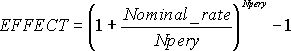

# WorksheetFunction.Effect Method (Excel)

Returns the effective annual interest rate, given the nominal annual interest rate and the number of compounding periods per year.

## Syntax

 _表达式_. **Effect**( ** _Arg1_**, ** _Arg2_** )

 _表达式_ A variable that represents a **WorksheetFunction** object.

### Parameters

|**Name**|**Required/Optional**|**Data Type**|**Description**|
|:-----|:-----|:-----|:-----|
| _Arg1_|必需|**Variant**|Nominal_rate - the nominal interest rate.|
| _Arg2_|必需|**Variant**|Npery - the number of compounding periods per year.|

### Return Value

Double

## Remarks

- Npery is truncated to an integer.
    
- If either argument is nonnumeric, EFFECT returns the #VALUE! error value.
    
- If nominal_rate ? 0 or if npery < 1, EFFECT returns the #NUM! error value.
    
- EFFECT is calculated as follows:

    

## 另请参阅

#### 概念

[WorksheetFunction Object](7b1d5639-363d-632c-2cf0-2232562646b6.md)
#### 其他资源

[WorksheetFunction Object Members](http://msdn.microsoft.com/library/6811ca87-4b53-0bff-88c9-30bf7497879a%28Office.15%29.aspx)