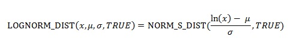

# WorksheetFunction.LogNorm_Dist Method (Excel)

Returns the lognormal distribution of x, where ln(x) is normally distributed with parameters mean and standard_dev. Use this function to analyze data that has been logarithmically transformed.

## Syntax

 _表达式_. **LogNorm_Dist**( ** _Arg1_**, ** _Arg2_**, ** _Arg3_** )

 _表达式_ A variable that represents a **[WorksheetFunction](7b1d5639-363d-632c-2cf0-2232562646b6.md)** object.

### Parameters

|**Name**|**Required/Optional**|**Data Type**|**Description**|
|:-----|:-----|:-----|:-----|
| _Arg1_|必需|**Double**|X - The value at which to evaluate the function.|
| _Arg2_|必需|**Double**|Mean - The mean of ln(x).|
| _Arg3_|必需|**Double**|Standard_dev - The standard deviation of ln(x).|
| _Arg4_|可选|**Variant**|Cumulative - A logical value that determines the form of the function. If cumulative is TRUE, LOGNORM_DIST returns the cumulative distribution function; if FALSE, it returns the probability density function.|

### Return Value

Double

## Remarks

- If any argument is nonnumeric, LOGNORM_DIST returns the #VALUE! error value.
    
- If x ? 0 or if standard_dev ? 0, LOGNORM_DIST returns the #NUM! error value.
    
- The equation for the lognormal cumulative distribution function is:

    

## 另请参阅

#### 概念

[WorksheetFunction Object](7b1d5639-363d-632c-2cf0-2232562646b6.md)
#### 其他资源

[WorksheetFunction Object Members](http://msdn.microsoft.com/library/6811ca87-4b53-0bff-88c9-30bf7497879a%28Office.15%29.aspx)