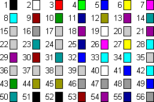

# ColorIndex 属性

返回或设置边框、字体或内部填充区域的颜色，如下表所示。该颜色可指定为当前调色板中的索引值，也可为以下 XlColorIndex 常量之一：xlColorIndexAutomatic 或 xlColorIndexNone，可读写。


|**对象**|**说明**|
|:-----|:-----|
|**Border**|边框的颜色。|
|**Font**|字体颜色。|
|**Interior**|内部填充的颜色。可将  **ColorIndex** 设置为 **xlColorIndexNone** 以表示不希望内部填充。将 **ColorIndex** 设置为 **xlColorIndexAutomatic** 可指定自动填充（用于绘图对象）。|

 _expression_. **ColorIndex**

 _表达式_ 必需。该表达式返回"应用于"列表中的一个对象。

## 说明

本属性指定某颜色在调色板中的颜色编号。下列图示给出了默认调色板中的颜色编号值。





## 示例

以下示例假定正在使用默认调色板。

以下示例设置数值轴主要网格线的颜色。


```
With myChart.Axes(xlValue) 
 If .HasMajorGridlines Then 
 'Set color to blue 
 .MajorGridlines.Border.ColorIndex = 5 
 End If 
End With
```

以下示例将图表区内部颜色设置为红色，边框颜色设置为蓝色。


```
With myChart.ChartArea 
 .Interior.ColorIndex = 3 
 .Border.ColorIndex = 5 
End With
```

