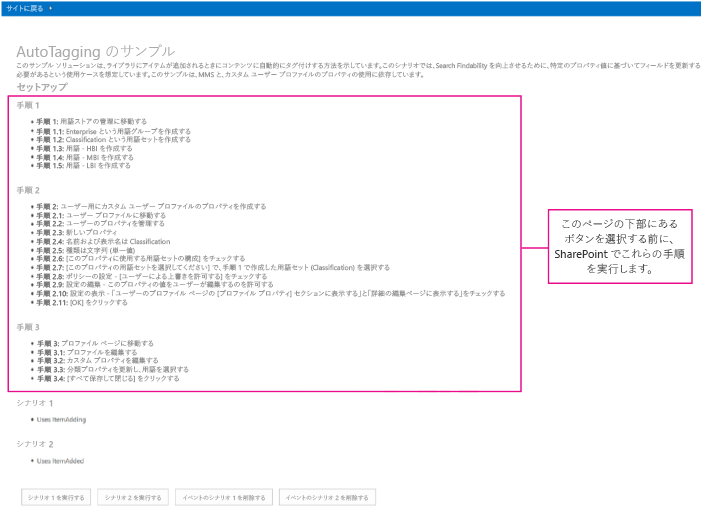
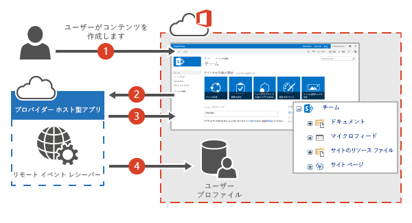
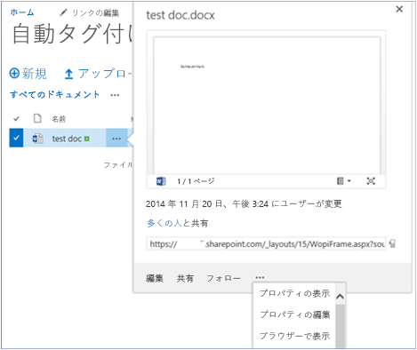
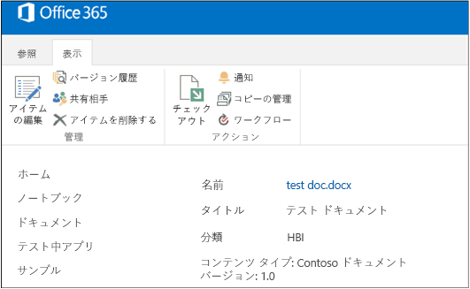

# 自動タグ付けサンプル アドイン (SharePoint)

エンタープライズ コンテンツ管理 (ECM) 戦略の一環として、メタデータ付きのドキュメントを作成したり SharePoint にアップロードする際、それらに自動的にタグを付けることができます。 
    
_**適用対象:** Office 365 | SharePoint 2013 | SharePoint Online_

[ECM.AutoTagging](https://github.com/OfficeDev/PnP/tree/master/Samples/ECM.AutoTagging) のサンプルは、プロバイダー ホスト型 アドインを使用して、SharePoint ライブラリに追加されたコンテンツに (カスタム ユーザー プロファイルのプロパティをソースとするデータを使って) 自動的にタグを付ける方法を示しています。このアドインは、Azure Web サイト でホストされるリモート イベント レシーバーを使用して、以下のことを行います。   

- フィールド、コンテンツ タイプ、およびドキュメント ライブラリを作成します。
    
- カスタムのユーザー プロファイル プロパティの値を取得します。
    
- 分類フィールドを設定します。
    
以下を行う場合は、このソリューションを使用します。

- SharePoint Online にイベント レシーバーを実装します。 
    
- コンテンツの作成時に追加のメタデータを付加して、検索結果を改善します。
    
- コンテンツを分類します。
    
- SharePoint の最新バージョンに移行する前にコードを最新の状態にしてください。お客様は過去にイベント レシーバーを使用されたことがあります。
    
## はじめに
<a name="sectionSection0"> </a>

まず GitHub の [Office 365 Developer Patterns and Practices](https://github.com/OfficeDev/PnP/tree/dev) プロジェクトから、[ECM.AutoTagging](https://github.com/OfficeDev/PnP/tree/master/Samples/ECM.AutoTagging) サンプル アドインをダウンロードします。

このアドインを実行する前に、以下を実行します。

1. Azure Web サイト を作成してから、そこに ECM.AutoTaggingWeb プロジェクトを展開します。
    
2. Office 365 の Appregnew.aspx ページを使用してアドインを登録します。 
    
3. このアドインでは、アプリ専用のアクセス許可を使用します。アプリ専用のアクセス許可を Office 365 の [AppInv.aspx] ページを使用して割り当てる必要があります。図 1 に示すように、次の XML を AppManifest.xml ファイルから [AppInv.aspx] ページにある [アクセス許可の要求 XML] テキストボックスにコピーします。 

    ``` 
      <AppPermissionRequests AllowAppOnlyPolicy="true">
        <AppPermissionRequest Scope="http://sharepoint/content/tenant" Right="FullControl" />
        <AppPermissionRequest Scope="http://sharepoint/taxonomy" Right="Read" />
        <AppPermissionRequest Scope="http://sharepoint/social/tenant" Right="Read" />
      </AppPermissionRequests>
    ```

    **図 1. Office 365 の AppInv.aspx ページを使って、アプリ専用のアクセス許可を割り当てる**

    

4. ECM.AutoTaggingWeb プロジェクトの ReceiverHelper.cs ファイルの  **CreateEventReciever** メソッドにおいて、Azure Web サイト の URL で **ReceiverUrl** プロパティを更新します。

    ```C#
        public static EventReceiverDefinitionCreationInformation CreateEventReciever(string receiverName, EventReceiverType type)
            {
    
                EventReceiverDefinitionCreationInformation _rer = new EventReceiverDefinitionCreationInformation();
                _rer.EventType = type;
                _rer.ReceiverName = receiverName;
                _rer.ReceiverClass = "ECM.AutoTaggingWeb.Services.AutoTaggingService";
                _rer.ReceiverUrl = "https://<Your domain>.azurewebsites.net/Services/AutoTaggingService.svc";
                _rer.Synchronization = EventReceiverSynchronization.Synchronous;
                return _rer;
            }
    
    ```
5. アドインをパッケージ化して展開します。 
    
図 2 に示すように、アドインを起動すると、ドキュメントの自動タグ付け機能のプロバイダ ホスト型アドインの開始ページが表示されます。開始ページは、イベント レシーバーの割り当てまたは削除の前に実行する必要のある追加の構成手順を示しています。 

**図 2. SharePoint のアドイン開始ページで実行する追加の構成手順**



## ECM.Autotagging サンプル アドインを使用する 
<a name="sectionSection1"> </a>

このサンプルでは、リモート イベント レシーバーを使用して、ドキュメント ライブラリに追加されたドキュメントに自動的にタグ付け、つまりメタデータの追加を行います (カスタムのユーザー プロファイル プロパティのデータを使用)。図 3 に、リモート イベント レシーバーを使用したドキュメントの自動タグ付けの処理フローを示します。

**図 3. リモート イベント レシーバーを使用したドキュメント ライブラリのドキュメンへのタグ付けの処理フロー**



リモート イベント レシーバーを使用して、ドキュメント ライブラリ内に新規作成されたドキュメントにメタデータを割り当てるには、以下を実行します。

1. ユーザーは、新しいコンテンツをドキュメント ライブラリに作成またはアップロードします。リモート イベント レシーバーが割り当てられて、このドキュメント ライブラリで  **ItemAdding** イベントまたは **ItemAdded** イベントを処理します。
    
2. **ItemAdding** メソッドまたは **ItemAdded** メソッドが、リモート イベント レシーバーに対して呼び出しを実行します。
    
3. プロバイダー ホスト型アドインは、そのユーザーの SharePoint のユーザー プロファイル サービスにあるカスタム ユーザー プロファイル プロパティの値を取得します。このサンプル アドインでは、以前に追加された Classification カスタム ユーザー プロファイル プロパティを取得します。
    
4. リモート イベント レシーバーは、そのユーザーのカスタムのユーザー プロファイル プロパティの値で新しいドキュメントのメタデータを更新します。 

### シナリオ 1 を実行します。

**[シナリオ 1 の実行]** ボタンを選択すると、アドインは以下を実行します。

1. ドキュメント ライブラリを実行する。
    
2. ItemAdding イベント用にリモート イベント レシーバーを作成する。
    
    
                **メモ** この記事では、ItemAdding イベント レシーバー タイプについて説明します。 一般に、ItemAdding イベント レシーバー タイプは、ItemAdded イベント レシーバー タイプよりもパフォーマンスが優れています。 ECM.Autotagging サンプルは、ItemAdding イベント レシーバー タイプと ItemAdded イベント レシーバー タイプの両方のコードを提供します。

3. ドキュメント ライブラリにリモート イベント レシーバーを追加する。
    
ECM.AutoTaggingWeb プロジェクトの Default.aspx.cs ページの  **btnScenario1_Click** メソッドで、次のコードはこれらの手順を示しています。

**メモ**  この記事で提供されるコードは、明示または黙示のいかなる種類の保証なしに現状のまま提供されるものであり、特定目的への適合性、商品性、権利侵害の不存在についての暗黙的な保証は一切ありません。

```C#
protected void btnScenario1_Click(object sender, EventArgs e)
        {
            var _libraryToCreate = this.GetLibaryInformationItemAdding();
 
            var spContext = SharePointContextProvider.Current.GetSharePointContext(Context);
            using (var ctx = spContext.CreateUserClientContextForSPHost())
            {
                try 
                { 
                    if(!ctx.Web.ListExists(_libraryToCreate.Title))
                    {
                        ScenarioHandler _scenario = new ScenarioHandler();
                        _scenario.CreateContosoDocumentLibrary(ctx, _libraryToCreate);
                    }
                    List _list = ctx.Web.Lists.GetByTitle(_libraryToCreate.Title);
                    EventReceiverDefinitionCreationInformation _rec = ReceiverHelper.CreateEventReciever(ScenarioHandler.AUTOTAGGING_ITEM_ADDING_RERNAME, EventReceiverType.ItemAdding);
                    ReceiverHelper.AddEventReceiver(ctx, _list, _rec);
                }
                catch(Exception _ex)
                {

                }
            }
        }  
```

**CreateContosoDocumentLibrary** メソッドに対して呼び出しが実行されます。ScenarioHandler.cs ファイルの次のコードは、OfficeDevPnP.Core のメソッドを使用して、カスタムのコンテンツ タイプを持つカスタムのドキュメント ライブラリを作成します。ドキュメント ライブラリにある既定のコンテンツ タイプは削除されます。

```C#
public void CreateContosoDocumentLibrary(ClientContext ctx, Library library)
        {
            // Check the fields.
            if (!ctx.Web.FieldExistsById(FLD_CLASSIFICATION_ID))
            {
                ctx.Web.CreateTaxonomyField(FLD_CLASSIFICATION_ID,
                                            FLD_CLASSIFICATION_INTERNAL_NAME,
                                            FLD_CLASSIFICATION_DISPLAY_NAME,
                                            FIELDS_GROUP_NAME,
                                            TAXONOMY_GROUP,
                                            TAXONOMY_TERMSET_CLASSIFICATION_NAME);
            }

            // Check the content type.
            if (!ctx.Web.ContentTypeExistsById(CONTOSODOCUMENT_CT_ID))
            {
                ctx.Web.CreateContentType(CONTOSODOCUMENT_CT_NAME,
                                          CT_DESC, CONTOSODOCUMENT_CT_ID,
                                          CT_GROUP);
            }

            // Associate fields to content types.
            if (!ctx.Web.FieldExistsByNameInContentType(CONTOSODOCUMENT_CT_NAME, FLD_CLASSIFICATION_INTERNAL_NAME))
            {
                ctx.Web.AddFieldToContentTypeById(CONTOSODOCUMENT_CT_ID,
                                                  FLD_CLASSIFICATION_ID.ToString(),
                                                  false);
            }

            
            CreateLibrary(ctx, library, CONTOSODOCUMENT_CT_ID);
        }

private void CreateLibrary(ClientContext ctx, Library library, string associateContentTypeID)
        {
            if (!ctx.Web.ListExists(library.Title))
            {
                ctx.Web.AddList(ListTemplateType.DocumentLibrary, library.Title, false);
                List _list = ctx.Web.GetListByTitle(library.Title);
                if (!string.IsNullOrEmpty(library.Description))
                {
                    _list.Description = library.Description;
                }

                if (library.VerisioningEnabled)
                {
                    _list.EnableVersioning = true;
                }

                _list.ContentTypesEnabled = true;
                _list.RemoveContentTypeByName("Document");
                _list.Update();
                
     
                ctx.Web.AddContentTypeToListById(library.Title, associateContentTypeID, true);
                ctx.Web.Context.ExecuteQuery();
               
            }
            else
            {
                throw new Exception("A list, survey, discussion board, or document library with the specified title already exists in this Web site.  Please choose another title.");
            }
        }
```

図 4 に示すように、このコードの実行後、AutoTaggingSampleItemAdding ドキュメント ライブラリがサイト コンテンツに作成されます。

**図 4. AutoTaggingSampleItemAdding ドキュメント ライブラリ**

![新しい AutoTaggingSampleItemAdd ドキュメント ライブラリが含まれる [サイト コンテンツ] ページのスクリーン ショット。](media/8820a44f-8df8-4c80-aeaa-e50c37b8912c.png)

ECM.AutoTaggingWeb プロジェクトの ReceiverHelper.cs ファイルにおいて、 **CreateEventReciever** メソッドは ItemAdding イベント レシーバー定義を作成します。ECM.AutoTaggingWeb プロジェクトの [Services] フォルダーには、AutoTaggingService.svc という Web サービスがあります。ECM.AutoTaggingWeb プロジェクトを Azure Web サイト に発行したとき、この Web サービスもサイトに展開されました。 **CreateEventReciever** メソッドは、この Web サービスを、ドキュメント ライブラリのリモート イベント レシーバーとして割り当てます。 **CreateEventReciever** メソッドの次のコードは、Web サービスをリモート イベント レシーバーに割り当てる方法を示しています。

```C#
public static EventReceiverDefinitionCreationInformation CreateEventReciever(string receiverName, EventReceiverType type)
        {

            EventReceiverDefinitionCreationInformation _rer = new EventReceiverDefinitionCreationInformation();
            _rer.EventType = type;
            _rer.ReceiverName = receiverName;
            _rer.ReceiverClass = "ECM.AutoTaggingWeb.Services.AutoTaggingService";
            _rer.ReceiverUrl = "https://<Your domain>.azurewebsites.net/Services/AutoTaggingService.svc";
            _rer.Synchronization = EventReceiverSynchronization.Synchronous;
            return _rer;
        }

```

**AddEventReceiver** メソッドの次のコードは、リモート イベント レシーバーをドキュメント ライブラリに割り当てます。

```C#
public static void AddEventReceiver(ClientContext ctx, List list, EventReceiverDefinitionCreationInformation eventReceiverInfo)
        {
            if (!DoesEventReceiverExistByName(ctx, list, eventReceiverInfo.ReceiverName))
            {
                list.EventReceivers.Add(eventReceiverInfo);
                ctx.ExecuteQuery();
            }
        }

```

これで、リモート イベント レシーバーがドキュメント ライブラリに追加されました。ドキュメントを  **AutoTaggingSampleItemAdding** ドキュメント ライブラリにアップロードすると、ドキュメントにそのユーザーの Classification カスタム ユーザー プロファイル プロパティの値がタグとして付けられます。図 5 は、ドキュメントのプロパティを表示する方法を示しています。図 6 は、"Classification" フィールドを持つドキュメントのメタデータを示しています。


**図 5. ドキュメントのプロパティを表示する**


**図 6. ドキュメントのメタデータ内の "Classification" フィールド**



AutoTaggingService.svc.cs ファイルの **HandleAutoTaggingItemAdding** メソッドは、**GetProfilePropertyFor** メソッドを使用して、Classification ユーザー プロファイル プロパティの値を取得します。

```C#
public void HandleAutoTaggingItemAdding(SPRemoteEventProperties properties,SPRemoteEventResult result)
        {
            using (ClientContext ctx = TokenHelper.CreateRemoteEventReceiverClientContext(properties))
            {
                if (ctx != null)
                {
                    var itemProperties = properties.ItemEventProperties;
                    var _userLoginName = properties.ItemEventProperties.UserLoginName;
                    var _afterProperites = itemProperties.AfterProperties;
                    if(!_afterProperites.ContainsKey(ScenarioHandler.FLD_CLASSIFICATION_INTERNAL_NAME))
                    {
                        string _classficationToSet = ProfileHelper.GetProfilePropertyFor(ctx, _userLoginName, Constants.UPA_CLASSIFICATION_PROPERTY);
                        if(!string.IsNullOrEmpty(_classficationToSet))
                        { 
                            var _formatTaxonomy = AutoTaggingHelper.GetTaxonomyFormat(ctx, _classficationToSet);
                            result.ChangedItemProperties.Add(ScenarioHandler.FLD_CLASSIFICATION_INTERNAL_NAME, _formatTaxonomy);
                        }
                    }
                }
            }
        }

```
    
**重要**   **GetProfilePropertyFor** メソッドから **Classification** の値を取得した後、 **Classification** の値は、ドキュメントのメタデータとして格納される前に、特定の方法で書式変更される必要があります。AutoTaggingHelper.cs ファイルの **GetTaxonomyFormat** メソッドは、 **Classification** の値を書式変更する方法を示しています。

```C#
public static string GetTaxonomyFormat(ClientContext ctx, string term)
        { 
            if(string.IsNullOrEmpty(term))
            {
                throw new ArgumentException(string.Format(EXCEPTION_MSG_INVALID_ARG, "term"));
            }
            string _result = string.Empty;
            var _list = ctx.Web.Lists.GetByTitle(TAXONOMY_HIDDEN_LIST_NAME);
            CamlQuery _caml = new CamlQuery();

            _caml.ViewXml = string.Format(TAXONOMY_CAML_QRY, term);
            var _listItemCollection = _list.GetItems(_caml);

            ctx.Load(_listItemCollection,
                eachItem => eachItem.Include(
                    item => item,
                    item => item.Id,
                    item => item[TAXONOMY_FIELDS_IDFORTERM]));
            ctx.ExecuteQuery();

            if (_listItemCollection.Count > 0)
            {
                var _item = _listItemCollection.FirstOrDefault();
                var _wssId = _item.Id;
                var _termId = _item[TAXONOMY_FIELDS_IDFORTERM].ToString(); ;
                _result = string.Format(TAXONOMY_FORMATED_STRING, _wssId, term, _termId);
            }

            return _result;
        }

```

### イベントのシナリオ 1 を削除する

**[イベント シナリオ 1 の削除]** ボタンをクリックすると、次のコードが実行されて、ドキュメント ライブラリからイベント レシーバーが削除されます。

```C#
public static void RemoveEventReceiver(ClientContext ctx, List list, string receiverName)
        {
            ctx.Load(list, lib => lib.EventReceivers);
            ctx.ExecuteQuery();

            var _rer = list.EventReceivers.Where(e => e.ReceiverName == receiverName).FirstOrDefault();
            if(_rer != null)
            {
                _rer.DeleteObject();
                ctx.ExecuteQuery();
            }
        }

```

## その他のリソース
<a name="bk_addresources"> </a>

-  [SharePoint 2013 と SharePoint Online 用のエンタープライズ コンテンツ管理ソリューション](Enterprise-Content-Management-solutions-for-SharePoint-2013-and-SharePoint-Online.md)
    
-  [OfficeDevPnP.Core のサンプル](https://github.com/OfficeDev/PnP-Sites-Core/tree/master/Core)
    
