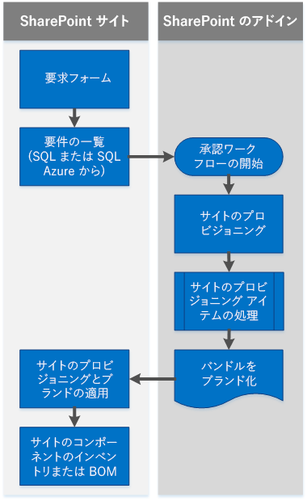

# SharePoint 2013 および SharePoint Online のブランディングおよびサイト プロビジョニング ソリューション

クラウド アドイン モデルと SharePoint 用アドインを導入することで、従来の SharePoint サイトのブランディングとプロビジョニング方法に代わる方法が実現します。 

_**適用対象:** Office 365? | SharePoint 2013? | SharePoint Online_

これまでは、SharePoint の機能フレームワーク、サイト テンプレート、Web テンプレート、およびサイト定義を使用して、サイトおよびサイト コレクションをプロビジョニングしてきました。リモート プロビジョニング パターンは、サイト ブランド化を提供したりその他のサイト プロビジョニング タスクを実行したりする SharePoint 用カスタム アドインを作成する方法を示します。このセクションの記事では、SharePoint 用アドインを使用したサイト ブランド化 (リモート プロビジョニングとも呼ばれるパターン) のプロビジョニングと管理について説明します。 

## SharePoint について理解しておく必要のある事項

SharePoint でブランディング機能とサイト プロビジョニング機能を使用するには、以下の内容を理解しておく必要があります。

- 主要な SharePoint の用語と概念。
    
- SharePoint 構造要素の階層。
    
- SharePoint サイトの種類と、各サイトを使用する理由。
    
- ファイル システム、コンテンツ データベース、およびこの 2 つの連携。
    
- ファイル カスタマイズの状態と、アップグレードにおけるその長期的な影響。
    
- SharePoint 用アドイン。
    
- SharePoint での .NET クライアント側オブジェクト モデル (CSOM) と REST API を使用したクライアント側プログラミング。

## 主要な SharePoint の用語と概念

リモート プロビジョニング パターンを使用して SharePoint サイトのプロビジョニングとブランディングを開始するにあたって、知っておくと便利な用語と概念を次の表に示します。

**SharePoint の用語と概念**

|**用語または概念**|**説明**|**詳細情報**|
|:-----|:-----|:-----|
|SharePoint 用アプリ|最も一般的な Web 標準とテクノロジーを統合し、クラウド アドイン モデルを使用して SharePoint Web サイトの機能を拡張する軽量 Web アプリケーション。| [SharePoint 用アドインのビルド](http://msdn.microsoft.com/library/37727101-0692-4652-a481-e6d6379cf921.aspx)|
|アプリ Web|アドインの展開元 Web サイト。| [SharePoint 2013 のホスト Web、アドイン Web、および SharePoint コンポーネント](http://msdn.microsoft.com/library/b791cdf5-8aa2-47fa-bc4c-aee437354759.aspx)|
|承認ワークフロー|ページの発行を承認するユーザーと時期を指定する、発行サイト固有のワークフロー。| 
            [SharePoint 2013 ワークフロー – WCF サービスの呼び出し](http://blogs.msdn.com/b/thirusrinivasan1/archive/2013/10/31/sharepoint-2013-workflow-calling-a-wcf-service.aspx)、[SharePoint 2013 ワークフローの概要](http://msdn.microsoft.com/library/a2643cd7-474d-4e4c-85bb-00f0b6685a1d.aspx)|
|ClientContext|すべての SharePoint CSOM および JSOM 操作の「中心となる存在」である、中心的なオブジェクト。| [T:Microsoft.SharePoint.Client.ClientContext](https://msdn.microsoft.com/en-us/library/office/microsoft.sharepoint.client.clientcontext.aspx)|
|クラウド アドイン モデル |SharePoint 用アドインは、SharePoint Web サイトの機能を拡張する機能の自己完結型の部分です。クラウド アドイン モデルを使用して、安全性、信頼性、柔軟性、および一貫性を備えた SharePoint 用アドインを作成できます。| [SharePoint アドインの概要](http://msdn.microsoft.com/library/cd1eda9e-8e54-4223-93a9-a6ea0d18df70.aspx)|
|コンテンツ データベース|コンテンツ データベースは、次のようなサイト コレクションのすべてのコンテンツを格納します。 <ul xmlns:xlink="http://www.w3.org/1999/xlink" xmlns:mtps="http://msdn2.microsoft.com/mtps" xmlns:mshelp="http://msdn.microsoft.com/mshelp" xmlns:ddue="http://ddue.schemas.microsoft.com/authoring/2003/5" xmlns:msxsl="urn:schemas-microsoft-com:xslt"><li>
ドキュメント ライブラリ内のサイト ドキュメントおよびファイル
</li><li>
リスト データ
</li><li>
Web パーツ プロパティ
</li><li>
ユーザー名と権限
</li></ul>| [データベースの種類と説明](https://technet.microsoft.com/en-us/library/cc678868.aspx)|
|CSOM|クライアント側オブジェクト モデル。 .NET Framework を使用して SharePoint のクライアント側コードを作成するためのモデルです。| [「SharePoint 2013 でクライアント オブジェクト モデルと外部データを使用する方法の概要」](http://msdn.microsoft.com/library/8ed91929-fdb6-4fde-ba2a-7942870575f3.aspx) [「[MS-CSOM]:SharePoint クライアント クエリ プロトコル」](https://msdn.microsoft.com/en-us/library/dd912094%28v=office.15%29.aspx) [「SharePoint 2013: .NET Server、CSOM、JSOM、および REST の API インデックス」](http://msdn.microsoft.com/library/fddbb75f-9f6c-46d3-8d95-1d4a5e791dfa.aspx)|
|ハイブ|SharePoint の物理ファイル (ファイル システムのファイル)。 これらのファイルは、コンテンツ データベースに格納されるファイルとは異なります。 ハイブの場所は、次のとおりです。 `%program files%/Common Files/Microsoft Shared/Web Server Extensions/15/`||
|ホスト Web|アドインがインストールされている Web サイト。| [SharePoint 2013 のホスト Web、アドイン Web、および SharePoint コンポーネント](http://msdn.microsoft.com/library/b791cdf5-8aa2-47fa-bc4c-aee437354759.aspx)|
|OneDrive for Business|組織内で共有可能な作業ドキュメントを保存、整理するための個人用ライブラリ。| 
            [OneDrive for Business と OneDrive の相違点](https://support.office.microsoft.com/en-us/article/What-is-OneDrive-for-Business-187f90af-056f-47c0-9656-cc0ddca7fdc2?CorrelationId=2ac1e496-1807-483a-a39f-c1a460efc7af&amp;ui=en-US&amp;rs=en-US&amp;ad=US#differences)、[ドキュメントを OneDrive for Business とチーム サイトのどちらに保存すればよいか](https://support.office.microsoft.com/en-us/article/Should-I-save-my-documents-to-OneDrive-for-Business-or-a-team-site-d18d21a0-1f9f-4f6c-ac45-d52afa0a4a2e?CTT=5&amp;origin=HA102822076&amp;CorrelationId=e3a0512c-ab5f-4ae7-a58f-e33878242936&amp;ui=en-US&amp;rs=en-US&amp;ad=US)|
|リモート プロビジョニング|プロバイダー向けのホスト型アドインで SharePoint 外で実行するテンプレートとコードを使用してサイトをプロビジョニングするモデルです。| [「SharePoint 2013 でのサイト プロビジョニングの手法とリモート プロビジョニング」](http://blogs.msdn.com/b/vesku/archive/2013/08/23/site-provisioning-techniques-and-remote-provisioning-in-sharepoint-2013.aspx) [SharePoint 2013 のアドインを使用したセルフサービス サイトのプロビジョニング](http://blogs.msdn.com/b/richard_dizeregas_blog/archive/2013/04/04/self-service-site-provisioning-using-apps-for-sharepoint-2013.aspx)|
|REST| アーキテクチャ要素を抽象化し、HTTP 動詞を使用して XML ファイルを含む Web ページでのデータの読み取りと書き込みを行うステートレス アーキテクチャ スタイル。| [方法:REST インターフェイスを使用してリストにカスタム アクセス許可を設定する](http://msdn.microsoft.com/library/d5fcc26c-4e44-404b-aacf-e9351af8cc7d.aspx)|
|ルート Web|サイト コレクション内の最初の Web。ルート Web は「Web アプリケーション ルート」と呼ばれることもあります。 ||
|SharePoint Online|Office 365 で提供されるクラウドベースの SharePoint。 | [SharePoint Online の全般的な参照情報](https://msdn.microsoft.com/en-us/library/office/gg271151%28v=office.14%29.aspx#sectionSection0)|
|サイト|同一の所有者と管理設定 (アクセス許可など) を共有するサイトのグループ。| [T:Microsoft.SharePoint.Client.Web](https://msdn.microsoft.com/en-us/library/office/microsoft.sharepoint.client.web.aspx)|
|サイト コレクション|同一の所有者と管理設定 (アクセス許可など) を共有するサイトのグループ。| [SharePoint 2013 でサイト コレクションを作成する](https://technet.microsoft.com/en-us/library/cc263094.aspx)|
|サイト プロビジョニング|サイトにフィーチャー、構造、ブランド、およびその他の機能を装備するプロセス。| 
            [SharePoint 2013 でのサイト プロビジョニングの手法とリモート プロビジョニング](http://blogs.msdn.com/b/vesku/archive/2013/08/23/site-provisioning-techniques-and-remote-provisioning-in-sharepoint-2013.aspx)、[SharePoint 2013 におけるアドインを使用したセルフサービスのサイト プロビジョニング](http://blogs.msdn.com/b/richard_dizeregas_blog/archive/2013/04/04/self-service-site-provisioning-using-apps-for-sharepoint-2013.aspx)|
|サブサイト|SharePoint サイト コレクション内の 1 つの SharePoint サイト。サブサイトでは親サイトからナビゲーションとアクセス許可を継承するか、または固有のアクセス許可とナビゲーションを設定することができます。ルート サイト コレクションに基づくサブサイトを作成するか、または他のサイト コレクションに基づくサイトを作成できます。サイト コレクションからアクセス許可を継承することを選択するか、またはサブサイトに固有のアクセス許可を指定することができます。||

## SharePoint 構造要素の階層

概念上、SharePoint オブジェクトの階層はコンテナー単位で表現されます。オブジェクトの種類と階層の種類には、階層でその直下にあるすべての種類のオブジェクトが含まれます。「表 2」に、SharePoint 構造要素の階層を示します。

**表 2 SharePoint 構造要素**

|**オブジェクトの種類 (階層順)**|**説明**|
|:-----|:-----|
|Web アプリケーション|サーバー上に存在し、ブラウザーからの要求に対して応答するアプリケーション。Web アプリケーションは、インターネット インフォメーション サービス (IIS) の中心的な構造です。SharePoint では、Web アプリケーションとは固有の URL を持ち、SQL Server に格納されているコンテンツ データベースを備えた Web サイトです。|
|サイト コレクション|アクセス許可を定義し、構成に応じてコンテナー内のすべてのサイトのブランディングのいくつかの側面を定義できるサイトのコンテナー。|
|サイト|リスト、ライブラリ、構造、ナビゲーション、および外観の要素のコレクション。一般にこれらは中心的なトピックまたはテーマに基づいて編成されています。同一サイト コレクション内の別のサイトの子であるサイトは、サブサイトと呼ばれることがあります。サブサイトは、親 Web サイトのサブフォルダーに格納されているサイトです。サブサイトは、アクセス許可とナビゲーション構造をその親サイトから継承するか、サブサイトに固有の管理権限と作成権限を設定できます。サブサイトには子サブサイトを含めることができます。|
|アプリ、リスト、およびドキュメント ライブラリ|コンテンツとデータのコンテナー。コンテンツとデータは特定の構造で編成されています。マスター ページ ギャラリーは SharePoint 2010 発行サイト内の特殊なドキュメント ライブラリーであり、既定ではすべてのブランディング要素 (マスター ページ、ページ レイアウト、JavaScript ファイル、CSS、および画像) が格納されています。すべてのサイトにはそれぞれ専用のマスター ページ ギャラリーがあります。チーム サイトでは、マスター ページはサイト コレクションではなくサイトから取得されます。 |
|アイテム|アドイン、リスト、およびドキュメント ライブラリに含まれる個別のデータまたはコンテンツ。|

## SharePoint 用アドイン

SharePoint アドインは、SharePoint ホスト サーバーにインストールされない軽量型ソリューションです。つまり、ホスト サーバーに対する大量の API 呼び出しを実行しません。 SharePoint アドインは、クラウド アドイン モデルを使用して作成できます。 ユーザーは、Office ストアや企業のアドイン カタログでアドインを見つけて、ダウンロードできます。 詳細については、「[SharePoint アドイン](http://msdn.microsoft.com/library/cd1eda9e-8e54-4223-93a9-a6ea0d18df70.aspx)」を参照してください。 

## ファイル システム、コンテンツ データベース、およびこの 2 つの連携

ブランディング オプションと、サイト カスタマイズがアップグレードと移行に及ぼす影響について理解するには、SharePoint ファイル システムとコンテンツ データベースについて理解しておく必要があります。

### ファイル システム

SharePoint ではファイルはファイル システム (「ハイブ」) に格納されます。SharePoint 2013 では、この場所は「15 ハイブ」と呼ばれます。次に 15 ハイブのパスを示します。 

    `%program files%/Common Files/Microsoft Shared/Web Server Extensions/15/`

15 ハイブには、サイトのブランディングとプロビジョニング時に使用するファイルが格納される各種サブフォルダーがあります。

### コンテンツ データベース

コンテンツ データベースには、SharePoint コンテンツ オブジェクト (サイト コレクションなど) が格納されます。コンテンツ データベースは、SharePoint 2013 の配置時にすべてのサイト コレクションに対して自動的にインストールされます。サイト コレクションのコンテンツはすべて 1 つのサーバー上の 1 つのコンテンツ データベースに格納されます。ただし、1 つのコンテンツ データベースに複数のサイト コレクションを関連付けることができ、またコンテンツ データベースを SharePoint Web アプリケーションにアタッチできます。たとえばコンテンツのサイズがコンテンツ データベースを超えそうな場合などには、コンテンツ データベース間でコンテンツを移動する必要があります。

コンテンツ データベースの一部の特性は、サイト コレクションの使用方法に応じて異なります。たとえば、サイトが書き込み中心型であることがよくありますが、その他のタイプのコンテンツ (読み取り専用ドキュメントなど) は読み取り中心型です。コンテンツの用途は、コンテンツ データベースの側面 (サイズやパフォーマンスなど) に影響します。 

## ファイルのカスタマイズ状態とアップグレードにおけるその影響

SharePoint ファイルとコンテンツの状態は、更新適用の容易さに影響し、SharePoint がコンテンツ データベースとファイル システムのいずれのファイルを処理するかを左右します。既定ではすべての SharePoint ファイルはカスタマイズされておらず非実体化ファイルであり、SharePoint ファイル システムとコンテンツ データベースで一致する状態で存在しています。ファイルまたはコンテンツ データベース エントリ、あるいはこの両方が特定の方法で使用または変更されると、そのコンテンツの状態に影響します。

**表 3 ファイルとコンテンツの状態**

|**ファイルまたはコンテンツの状態**|**定義**|**Comment**|
|:-----|:-----|:-----|
|カスタマイズされていない|ファイルに関連付けられている属性であり、ファイルが変更されていないことを示します。|複数のファイル コピーが同一ソースを指し示すことができます。これにより、設計者による変更の実装が容易になります。|
|カスタマイズ済み|ファイルに関連付けられている属性であり、ファイルが変更されていることを示します。|ファイルをカスタマイズすると、広範な更新を適用することが難しくなります。カスタマイズする内容には十分注意してください。一般的なルールとして、システム ファイルをカスタマイズしたり、手動で更新する必要があるカスタマイズを導入したりするよりも、既定の SharePoint ファイルと機能を使用することをお勧めします。|
|非実体化済み|コンテンツ データベース外部にソースが格納されているファイル。|コンテンツ データベース内には、SharePoint に対してサーバーのファイル システムでファイルのソースを検索するように指示するポインター (ファイルのゴースト) が引き続き存在しています。|
|非実体化されていない|ソース ファイルの未カスタマイズ バージョンがコンテンツ データベースに存在しています。|例: SharePoint 2013 Design Manager は、ブランディング ファイルをパッケージングするためのサンドボックス ソリューションを作成します。このソリューションはこれまでサーバー上のファイル システムに追加されたことがないため、定義上はそのファイルは非実体化ファイルと見なされますが、展開するファイルはカスタマイズされていない状態にあります。 |


            **メモ** カスタマイズ済みのファイルは、新しいサービス パックのインストール時や SharePoint Online サービスの更新時に更新されません。

## クラウド アドイン モデルを使用したサイト ブランディングおよびプロビジョニング

SharePoint 2013 では、ブランディング要素を使用して SharePoint サイト コレクション、サイト、およびサブサイトをプロビジョニングするために、SharePoint 用アドインのカスタム コードを使用できます。このサイト プロビジョニング パターンはリモート プロビジョニングと呼ばれます。SharePoint ではクラウドベースの展開に重点を置いていることから、SharePoint のすぐに利用できる機能を使用して、複雑さと長期にわたる運用コストを削減できるようなサイト ブランディングのプロビジョニングを支援する目的で、このパターンが開発されました。

### クラウド アドイン モデルでできること

場合によっては、完全な信頼を必要とするコードの機能とクラウド アドイン モデルに相関性がないことがあります。SharePoint 用アドインとクラウド アドイン モデルに基づいてカスタマイズを開発する際には、直接的な変換ではなく代替的な手法を検討し、カスタマイズの内容を可能な限りシンプルにするように努めてください。次に例を示します。

- イベント レシーバーをリモート イベント レシーバーに置き換えます (「[SharePoint アドインでリモート イベント レシーバーを作成する](http://msdn.microsoft.com/library/628c6103-52f9-4d85-9464-4a6862b36640.aspx)」を参照)。
    
- サイト テンプレート、Web テンプレート、およびサイト定義をリモート プロビジョニングに置き換えます。 これはサブサイトとサイト コレクションの両方で有効です。
    
- タイマー ジョブを Microsoft Azure またはオンプレミスの [worker ロール](https://msdn.microsoft.com/library/azure/jj149831.aspx)で置き換えます。
    
HTTP モジュールや HTTP ハンドラーなど、クラウド アドイン モデルでは作成できないものもあります。クラウド アドイン モデルで既存のカスタマイズをレプリケートする前に、カスタマイズが作成された当初の理由と、すぐに利用できる SharePoint フィーチャーが有効であるかどうかを検討してください。

### リモート プロビジョニング パターン

リモート プロビジョニングでは、新しいアドイン パターンを使用して、プロビジョニング ロジックを SharePoint ファームの外部に完全に移動します。 この方法では、SharePoint ファームで機能フレームワークやその他のカスタマイズを使用する必要がなくなり、SharePoint の外部でカスタマイズを制御できるようになります。 この方法により、SharePoint の可用性に影響を与えることなく、プロビジョニング エンジンを更新したり、変更することができます。 機能フレームワークの詳細については、「[サイト定義とプロビジョニング: 機能フレームワーク](https://msdn.microsoft.com/en-us/library/ms454453%28v=office.12%29.aspx)」を参照してください。 このセクションではリモート プロビジョニング パターンの側面と実装について詳しく解説します。 まず、パターンに関する次の入門文書に目を通しておくと役に立つ場合があります。

-  [「SharePoint 2013 のアドインを使用したセルフサービス サイトのプロビジョニング」](http://blogs.msdn.com/b/richard_dizeregas_blog/archive/2013/04/04/self-service-site-provisioning-using-apps-for-sharepoint-2013.aspx)
    
-  [SharePoint 2013 サイト プロビジョニングのテクニック (動画)](http://blogs.msdn.com/b/vesku/archive/2013/09/09/sharepoint-2013-site-provisioning-techniques-presentation-video-recording.aspx)
    
-  [SharePoint アドインのパターンを導入した理由](http://blogs.msdn.com/b/vesku/archive/2013/09/06/introduction-to-sp-apps-or-cam.aspx)
    
リモート プロビジョニング パターンの最も単純な実装では、プロビジョニング要件が SQL Server または SQL Azure データベース、あるいは XML ファイルに格納されます。次に、SharePoint 用アドインはデータソースから要件を読み取り、そのソース ロケーションからブランディング要素を読み取り、プロビジョニング要件に基づいてブランディング要素をターゲット サイトに適用します。

ブランディングとプロビジョニングのコード サンプルでは、リモート プロビジョニング パターンを表示するためこの一連のイベントをたどります。

**表 4 基本的なリモート プロビジョニングの順序と関連コード サンプル**

|**手順**|**説明**|**サンプル**|**記事**|
|:-----|:-----|:-----|:-----|
|1|ユーザーがフォームを使用してサイトに対する変更を要求します。これにより承認ワークフローが開始されます。ユーザーが要求フォームを使用して送信したデータは、任意のデータ格納形式 (SQL、SQL Azure、XML) で格納されます。| 
[SharePoint 2013: ワークフローを使用して SharePoint サイトをプロビジョニングする (ホスト Web)](https://code.msdn.microsoft.com/SharePoint-2013-Use-e2ee88dd)

[SharePoint 2013: ワークフローを使用して SharePoint サイトをプロビジョニングする (アプリ Web)](https://code.msdn.microsoft.com/SharePoint-2013-Use-2b96feb7)
| [SharePoint 2013 のサイト プロビジョニング](sharepoint-site-provisioning-solutions.md)|
|2|ワークフローが承認されたら、SharePoint 用アドインは保存されているデータを呼び出し、ユーザーがステップ 1 で送信したメタデータに基づいてサイトのプロビジョニングを行います。| 
[アドイン モデルを使用してサイトをバッチ プロビジョニングする](https://code.msdn.microsoft.com/Provision-sites-in-batches-fcf31bc6)

[SharePoint 2013: ワークフローを使用して SharePoint サイトをプロビジョニングする (ホスト Web)](https://code.msdn.microsoft.com/SharePoint-2013-Use-e2ee88dd)

[SharePoint 2013: ワークフローを使用して SharePoint サイトをプロビジョニングする (アプリ Web)](https://code.msdn.microsoft.com/SharePoint-2013-Use-2b96feb7)

[SharePoint 2013: SharePoint 用アドインを使用してオンプレミスのサイト コレクションをプロビジョニングする](https://code.msdn.microsoft.com/SharePoint-2013-Use-apps-9094e012)
| [SharePoint 2013 のサイト プロビジョニング](sharepoint-site-provisioning-solutions.md)|
|3|SharePoint 用アドインが、アドイン Web とコンテンツ データベースで使用可能なデータを使用して、要求フォームの指示に基づいてプロビジョニングのスコープを設定します。この段階では、適用可能なブランディング要素がサイトにプロビジョニングされます。| 
[SharePoint 2013: SharePoint 用アドインを使用して CSS を構成する](https://code.msdn.microsoft.com/SharePoint-2013-Use-an-app-c5d78f25)

[SharePoint 2013: SharePoint 用アドインを使用してテーマを SharePoint サイトに適用する](https://code.msdn.microsoft.com/SharePoint-2013-Use-an-app-d90a49e3)

[SharePoint 2013: Sharepoint OneDrive for Business サイトをブランド化する](https://code.msdn.microsoft.com/SharePoint-2013-Brand-a-6da627cb)

[SharePoint 2013: リモート プロビジョニングを使用してサイトにカスタム CSS をプロビジョニングする](https://code.msdn.microsoft.com/SharePoint-2013-Provision-bf1d878a)

[SharePoint 2013: SharePoint 用アドインを使用して Wiki ページをプロビジョニングする](https://code.msdn.microsoft.com/SharePoint-2013-Use-an-app-5db977e8)
|
[SharePoint ページとページ モデル](SharePoint-pages-and-the-page-model.md)

[SharePoint サイト ブランド化とページ カスタマイズのソリューション](SharePoint-site-branding-and-page-customization-solutions.md)

[SharePoint 2013 のサイト プロビジョニング](sharepoint-site-provisioning-solutions.md)|


              **メモ** 表 4 は、一般的なリモート プロビジョニング シナリオに似たステップを示します。使用するサンプルは、企業に最適なアプローチに応じて異なります。たとえば、カスタム承認ワークフローを作成する業務上の必要性がない場合、そのサンプルは使用しません。 

**図 1. リモート プロビジョニング パターンを使用したサイトのプロビジョニングとブランディングのワークフローの例**

### リモート プロビジョニングによる既存のサイト コンテンツへの影響

プロビジョニングする特定のサイト要素によっては、コードにおいて、既定または既存のサイト コンテンツが、SharePoint 用リモート プロビジョニング アドインのフックによってオーバーライドされます。アドインはデータベースに格納されているプロビジョニング要件に基づいてサイト テンプレートとその他の機能を選択し、SharePoint の構成は一切行いません。

基本的なリモート プロビジョニング パターンは、追加の要件に関係なく同一です。ただし、このパターンを使用してサイト ブランディングをプロビジョニングする予定である場合は、SharePoint CSOM、JSOM、および REST API のカスタマイズ機能に即してブランド開発戦略を計画してください。また、次の点についても考慮してください。 

- サイト アーキテクチャ。構築しているサイトは、認証ユーザーに対して企業データにアクセスするためにインターネット接続サイトを介してログオンすることを求めるような、インターネット接続サイト、イントラネット サイト、あるいはエクストラネットですか。
    
- 特定のユーザーがプロビジョニング要件を定義および要求する際の制御の度合い。ユーザーがフォームを使用してカスタム プロビジョニング オプションを指定できるようにする必要がありますか。意思決定権限を持つ人物が変更を承認した後でのみ、変更内容を自動的にサイトに適用しますか。変更がガバナンス ポリシーによって管理されていますか。
    
- 適用するブランディング カスタマイズの種類 (構造、外観、またはこの両方)。

## ブランディングとサイト プロビジョニングのコード サンプル

このセクションでは、コア シナリオを示し、このシナリオを拡張して、より具体的な使用例に対応したコード サンプルについて説明します。このセクションの記事にもいくつかのコード サンプルが含まれています。これらのコード サンプルを次の表で説明します。

**表 5 サイト プロビジョニングのサンプル**

|**サンプル**|**説明**|**関連記事**|
|:-----|:-----|:-----|
|BatchProvisioning|コンソール アプリでサイト コレクションをプロビジョニングします。| [SharePoint 2013 のサイト プロビジョニング](sharepoint-site-provisioning-solutions.md)|
| [Provisioning.Pages](https://github.com/OfficeDev/PnP/tree/master/Samples/Provisioning.Pages)|リモート プロビジョニング モデルを使用して Wiki ページをプロビジョニングし、Wiki ページからの HTML とリモート Web パーツを追加する方法を示します。| [SharePoint ページとページ モデル](SharePoint-pages-and-the-page-model.md)|
|SiteProvisioningWorkflow|ホスト Web とリモート イベント レシーバーでワークフローを使用してサイト コレクションをプロビジョニングします。| [SharePoint 2013 のサイト プロビジョニング](sharepoint-site-provisioning-solutions.md)|
|SiteProvisioningWorkflowAppWeb|アドイン Web とリモート イベント レシーバーでワークフローを使用してサイト コレクションをプロビジョニングします。| [SharePoint 2013 のサイト プロビジョニング](sharepoint-site-provisioning-solutions.md)|


              **メモ** BatchProvisioning、SiteProvisioningWorkflow、および SiteProvisioningWorkflowAppWeb サンプルは、リモート プロビジョニング パターンの中心的な概念と機能を示します。ProvisionWikiPages サンプルは、特定の使用例 (Wiki ページ プロビジョニング) を扱います。

**表 6. ブランディングのサンプル**

|**サンプル**|**説明**|**関連記事**|
|:-----|:-----|:-----|
| [Branding.Theme](https://github.com/OfficeDev/PnP/tree/master/Samples/Branding.Themes)|テーマの適法方法 (CSOM) を示します。| [SharePoint サイト ブランド化とページ カスタマイズのソリューション](SharePoint-site-branding-and-page-customization-solutions.md)|
| [OD4B.Configuration.Async](https://github.com/OfficeDev/PnP/tree/master/Solutions/OD4B.Configuration.Async)|リモート プロビジョニング モデルを使用して Wiki ページをプロビジョニングし、Wiki ページからの HTML とリモート Web パーツを追加する方法を示します。| [SharePoint サイト ブランド化とページ カスタマイズのソリューション](SharePoint-site-branding-and-page-customization-solutions.md)|
| [Branding.AlternateCSSAndSiteLogo ](https://github.com/OfficeDev/PnP/tree/master/Samples/Branding.AlternateCSSAndSiteLogo)|ユーザー カスタマー アクションと埋め込み JavaScript を使用して、カスタム CSS をホスト サイトに設定する例を示します (CSOM)。| [SharePoint サイト ブランド化とページ カスタマイズのソリューション](SharePoint-site-branding-and-page-customization-solutions.md)|
| [Provisioning.OnPrem.Async](https://github.com/OfficeDev/PnP/tree/master/Samples/Provisioning.OnPrem.Async) [Provisioning.SiteCol.OnPrem](https://github.com/OfficeDev/PnP/tree/master/Samples/Provisioning.SiteCol.OnPrem)|オンプレミスに SharePoint ホスト Web 内のすべての情報をカプセル化するためにサービスを使用する例を示します。|サービスを使用して SharePoint ホスト Web のすべての情報をアドイン Web にカプセル化し、Web を取得し、指定した Web アプリケーションのサイト コレクションのリストを取得し、特定の ContentTypeId を使用してコンテンツ タイプを作成する方法を示します。このサンプルは、リモート プロビジョニング パターンを使用して、SharePoint 用アドインを使用したサイトのプロビジョニングを行う場合に特に役立ちます。ただし、シナリオを実行するために必要な CSOM メンバーは、CSOM でまだ使用できません。 | [SharePoint 2013 のサイト プロビジョニング](sharepoint-site-provisioning-solutions.md)|

## SharePoint のブランド化ワークフロー

SharePoint Web サイトのブランディングは、他の Web サイトのブランディングによく似ています。十分に理解している Web テクノロジ (HTML、CSS、JavaScript など) を使用して、サイトの構造、外観、およびカスタムの動作を作成します。また、SharePoint は ASP.NET に基づいており、ASP.NET マスター ページ/ページ レイアウト モデルに非常に類似したページ モデルを使用します。このページ モデルには構造が含まれ、外観要素を適用するためのフックとロジックを提供します。

SharePoint には、データ ビュー、画像、スクリプト、検索結果などをサイト デザインに組み込むために使用できる各種 Web パーツがあります。構成済みの外観により、ユーザーはサイトの外観を容易にカスタマイズでき、設計者と IT 部門による設計の詳細と使用可能な外観オプションに対するコントロールが強化されます。テーマ設定エンジンとカスタム CSS 機能が相まって、さらに先進的なブランディング カスタマイズへの扉が開かれます。 

SharePoint Web サイトのブランディング設計と開発のワークフローは、業界で採用されている設計ワークフローによく似ています。

- サイトのアーキテクチャとデザインを計画する。
    
- 使い慣れた Web デザイン ツールとテクノロジを使用してデザイン資産を作成する。
    
- Design Manager などの SharePoint ツールを使用してサイトを作成する。
    
- サイト デザインをパッケージングし、SharePoint 用アドインとリモート プロビジョニング パターンを使用してサイト ブランディングをプロビジョニングする。


              **メモ** SharePoint では、ブランディングの適用とは、既定の SharePoint サイトの外観を変更することを意味します。これには、サイトの外観の構造的な変更と見栄えの変更の両方が含まれます。

### ブランディングのコストと複雑さ

ブランディングの変更は、コストが低く単純な変更からコストが高く複雑な変更までさまざまです。ユーザーは UI を使用して構成済みの外観 (背景画像、カラー パレット、フォント、これらの要素に関連付けられているマスター ページ、マスター ページに関連付けられているプレビュー ファイルなど) を適用できます。SharePoint 2013 テーマ設定エンジンを使用して各自のテーマを作成し、サイトの外観を変更するカスタム CSS を作成することができます。 


            **重要** カスタム ブランディング プロジェクトでカスタム マスター ページとその他の構造要素を作成できますが、長期にわたる構造カスタマイズのサポートに伴うコストは高くなる可能性があります。また、組織がアップグレードを適用し、カスタマイズへの短期の投資を長期にわたって適用できるようにするには、さらにコストがかかる可能性があります。

### 専用ファームまたはオンプレミスでホストされている SharePoint サイトのブランディング

リモート プロビジョニング パターンを使用して、社内でホストされているか、または専用ファーム上にあるチーム サイト、発行サイト、および OneDrive for Business サイトを、サイト コレクション レベルとサブサイト レベルの両方でブランディングできます。 

### SharePoint Online

SharePoint ブランディング プロジェクトの計画時に、構築、ブランディング、プロビジョニングするサイトの種類を決定します。SharePoint Online のライセンスは、発行サイト機能を使用できるかどうかに影響します。すべてのライセンスでは、SharePoint Server 発行サイトのフィーチャーの一部を備えたパブリック Web サイトを少なくとも 1 つ指定できますが、すべてのライセンスですべての発行サイト機能が提供されるわけではりません。

**表 7. SharePoint Online でのオプション**

|**Office 365 のエディション**|**チーム サイト**|**パブリック Web サイト**|**発行サイト**|**メモ**|
|:-----|:-----|:-----|:-----|:-----|
|Small Business|はい|はい|いいえ|1 つのチーム サイトとパブリック Web サイトが含まれています。発行サイト機能は含まれていません。パブリック Web サイト機能は小規模ビジネスを考慮して設計されています。|
|Enterprise|はい|いいえ|はい|発行サイトが含まれていないドメインのルート Web アプリケーションでのチーム サイト コレクションが含まれています。このルート Web アプリケーションで新しい発行サイト コレクションを作成できます。 |
詳細については、「[Office 365 のすべての一般法人向けプランを比較する](https://products.office.com/en-us/business/compare-office-365-for-business-plans?legRedir=true&amp;CorrelationId=b633601e-1b0f-46cf-a4f8-1bfa8645376e)」および「[モデル: SharePoint 2013 の設計およびブランディング](http://www.microsoft.com/en-us/download/details.aspx?id=30715)」を参照してください。

## カスタマイズを行う時期

ビジネス ニーズに対応するために必要な機能のほとんどは、SharePoint ですぐに利用できます。したがって、カスタマイズの作成前に、カスタマイズを作成するための実際のビジネス ケースが存在しているかどうかと、そのカスタマイズの作成とサポートに伴って企業にかかる長期のコストを洗い出してください。エンド ユーザーに対してフィーチャーと機能をどのように提供しますか。テクノロジーを検討する前に、ビジネス目標とユーザー エクスペリエンスに関する考慮事項を検討してください。

既存のカスタム SharePoint ソリューションを使用しており、クラウド アドイン モデルにそのソリューションを移行するかどうかとその移行方法を検討する場合は、最初にカスタマイズを行う理由と、カスタマイズの目的を確認します。 

完全な信頼を必要とするコードからクラウド アドイン モデルに既存のカスタマイズを移行することを検討する場合、通常、フィーチャーと機能の関係は 1 対 1 ではありません。サーバー側コードとクライアン側コードの間で 1 対 1 の一致を探すのではなく、代替手法を検討してください。表 8 に、SharePoint ソリューションのいくつかの一般的な概念と機能、および SharePoint 用アドインでそれに対応する概念と機能を示します。

**表 8. SharePoint の概念とアドインの関係**

|**タスク**|**SharePoint ソリューションの場合**|**SharePoint 用アドインの場合**|**ガイダンス**|
|:-----|:-----|:-----|:-----|
|SharePoint ページの情報の表示|Web パーツ|アプリ パーツ|Web パーツは、ユーザー アクセス許可またはフル アクセス許可/昇格した特権を使用して、SharePoint サーバー上で実行されます。アプリ パーツは、具体的に付与されたアクセス許可を持つアプリ ID を使用して、ブラウザー上または外部サーバー上で実行されます。 これらは、独自ドメイン内のクライアント上で完全に分離されています。 アドイン パーツは、SharePoint の外部で実行され、SharePoint サーバーのパフォーマンスに影響を与えません。 [方法:アドイン パーツを作成して SharePoint 用アドインと共にインストールする](http://msdn.microsoft.com/library/a2664289-6c56-4cb1-987a-22367fad55eb.aspx)|
|通知の作成と管理|イベント レシーバーとフィーチャー レシーバー|リモート イベント レシーバーとアドイン イベント レシーバー|イベント レシーバーとフィーチャー レシーバーは、サーバー側のコードが必要であり、外部システムにイベントを通知できません。リモート イベント レシーバーは、クライアント側のコードを使用し、SharePoint ソリューションまたは SharePoint 用アドインで使用でき、外部システムにイベントを通知することもできます。アプリ イベント レシーバーは、アドインがインストール、アンインストール、またはアップグレードされるときにコードを実行します。 
            [SharePoint アドインのイベントの処理 (MSDN 記事)](http://msdn.microsoft.com/library/c050d056-8548-4496-a053-016779d723d9.aspx)[方法:SharePoint アドインでリモート イベント レシーバーを作成する](http://msdn.microsoft.com/library/f20a0476-e3f7-4f1b-b692-2ec893245b85.aspx)|
|データへのアクセス|.NET サーバー オブジェクト モデル (SSOM)、.NET クライアント オブジェクト モデル (CSOM)、OData|.NET クライアント オブジェクト モデル (CSOM、JSOM)、OData、REST、クロスドメイン ライブラリ| [方法:SharePoint 2013 のクライアント ライブラリ コードを使用して基本的な操作を完了する](http://msdn.microsoft.com/library/5a69c9e3-73bf-4ed5-bc19-182056bdb394.aspx) [方法:SharePoint 2013 の JavaScript ライブラリ コードを使用して基本的な操作を完了する](http://msdn.microsoft.com/library/29089af8-dbc0-49b7-a1a0-9e311f49c826.aspx) [SharePoint 2013 REST サービスの概要](http://msdn.microsoft.com/library/2de035a0-ac75-43bd-9665-5c5a59c4c590.aspx) [SharePoint 用アドイン向け .NET クライアント API リファレンス](http://msdn.microsoft.com/library/16912f78-e8e4-4a1a-89c2-77b155c7ffa8.aspx) [SharePoint 用アドイン向け JavaScript API リファレンス](http://msdn.microsoft.com/library/46510ed1-a8d9-4fa6-86b3-9b9426897d97.aspx) [REST API リファレンスおよびサンプル](http://msdn.microsoft.com/library/02128c70-9d27-4388-9374-a11bce68fdb8.aspx)|
|パッケージと展開|ソリューション パッケージ (WSP、フィーチャー パッケージ)|アプリ カタログと Office ストア|ソリューション パッケージは、SharePoint ファーム全体に展開することは困難です。SharePoint 用アドインを公に利用できるようにしたり販売したりする場合は、Office ストアに公開できます。 アドイン カタログを使用して、SharePoint 用アドインを組織内で使用できるようにします。ソリューション パックのガイダンスとコード サンプルでは、SharePoint 用アドインを使用してブランドの構成要素を SharePoint サイトにプロビジョニングする方法の例を示します。 [方法:SharePoint Online 上でアドイン カタログをセットアップする](http://msdn.microsoft.com/library/1d50a571-6e02-4bc0-a3d6-6ef1eca3c2ce.aspx) [方法:SharePoint 上でアドイン カタログをセットアップする](http://msdn.microsoft.com/library/fddbdb6c-250e-411c-9de4-4b6d874fc096.aspx) [Office 用アドインおよび SharePoint 用アドインを発行してユーザーが使用できるようにする](http://msdn.microsoft.com/library/ff075782-1303-4517-91cc-b3d730e9b9ae.aspx) [SharePoint のアドインを開発およびホストするためのパターンを選択する](http://msdn.microsoft.com/library/05ce5435-0a03-4ddc-976b-c33b08d03457.aspx)|
|外部データの使用|外部コンテンツ タイプ|アプリを対象範囲とする外部コンテンツ タイプ|SharePoint サイト管理者または SharePoint Designer ユーザーは、外部コンテンツ タイプを作成したりインストールしたりする必要があります。外部コンテンツ タイプは、ファーム レベルでのみインストールできます。アプリを対象範囲とするコンテンツ タイプは、その作成対象となった SharePoint 用アドインにのみ適用され、管理を必要としません。さらに、OData ソースにアクセスできます。 [アドイン スコープの外部コンテンツ タイプ (SharePoint 2013)](http://msdn.microsoft.com/library/a34cbbba-dc38-4d3d-b796-d54b5848bdfb.aspx) [方法:SharePoint 2013 で OData ソースから外部コンテンツ タイプを作成する](http://msdn.microsoft.com/library/bc60ea49-c44e-4531-af62-06b8cf77d35d.aspx)|
|カスタム ページとマスター ページの追加|アプリケーション ページとサイト ページ|Web ホスト ページ|アプリケーション ページは、サーバー上のすべてのサイトで共有され、SharePoint 上でホストされます。サイト ページは、SharePoint でホストされ、そのページ コントロールが安全なコントロール リストに載っていることが必要です。アプリケーション ページはカスタム コードに適していますが、サイト ページ上のカスタム コードはカスタマイズ後に適切な状態ではなくなります。代わりに、Web ホスト ページを使用してください。これらは、カスタマイズできるように設計されていて、サイト ページ上の組み込み Web パーツの使用をサポートします。また、外部でホストされるため、アドインがインストールされている任意の場所で使用できます。|

## このセクションの内容

-  [SharePoint ページとページ モデル](SharePoint-pages-and-the-page-model.md)
    
-  [SharePoint 開発ツールとデザイン ツールおよび操作](SharePoint-development-and-design-tools-and-practices.md)
    
-  [SharePoint サイト ブランド化とページ カスタマイズのソリューション](SharePoint-site-branding-and-page-customization-solutions.md)

## その他のリソース

-  [Office 365 開発パターンとプラクティス (ソリューション ガイダンス)](Office-365-development-patterns-and-practices-solution-guidance.md)
    
-  [SharePoint 用アドインのビルド](http://msdn.microsoft.com/library/37727101-0692-4652-a481-e6d6379cf921.aspx)
    
