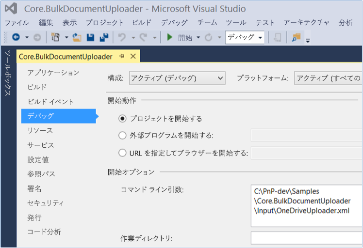

# ドキュメントの一括アップロード サンプル アドイン (SharePoint)

エンタープライズ コンテンツ管理 (ECM) 戦略の一環として、OneDrive for Business を含むドキュメント ライブラリにドキュメントを一括アップロードすることができます。
    
_**適用対象:** Office 365 | SharePoint 2013 | SharePoint Online_

**メモ**  サンプルでは、ドキュメント ライブラリに 1 つのファイルをアップロードします。複数のファイルをアップロードするには、サンプルを拡張する必要があります。

このアドインでは、REST API 呼び出しを使用してファイルをアップロードするコンソール アプリケーションを使用します。構成設定は、XML ファイルと CSV ファイルで指定されます。以下を行う場合は、このソリューションを使用します。

- SharePoint Online にファイルをアップロードする。
    
- Office 365 に移行してから、カスタム移行ツールを使用してファイルを移動する。

## はじめに
<a name="sectionSection0"> </a>

まず GitHub の [Office 365 Developer Patterns and Practices](https://github.com/OfficeDev/PnP/tree/dev) プロジェクトから、[Core.BulkDocumentUploader](https://github.com/OfficeDev/PnP/tree/master/Samples/Core.BulkDocumentUploader) サンプル アドインをダウンロードします。

コード サンプルを実行する前に、以下を実行します。


1. 次の情報を使って OneDriveUploader.xml ファイルを編集します。
    
    - テキストと CSV ログ ファイルを保存する場所。
    
    - CSV マッピング ファイルのファイル パス (C:\PnP\Samples\Core.BulkDocumentUploader\Input\SharePointSites.csv など)。
    
    - アップロードする企業ポリシー ファイルの場所 (C:\PnP\Samples\Core.BulkDocumentUploader\Input\OneDriveFiles など)。
    
    - SharePoint Online 資格情報。
    
    - 実行するドキュメントの操作 (アップロードまたは削除)。
    
    - ファイルがドキュメント ライブラリにアップロードされた後、ファイルに適用する新しいファイル名 (COMPANY POLICY DOCUMENT.xlsx など)。
    
2. SharePointSites.csv マッピング ファイルで、ファイルをアップロードするドキュメント ライブラリの URL と、アップロードする企業ポリシー ファイルの名前を一覧表示します。 
    
3. OneDriveUploader.xml ファイルのファイル パスをコマンドライン引数として追加します。これを実行するには、図 1 に示すように、ソリューション エクスプローラーで Core.BulkDocumentUploader プロジェクトのプロパティを開き、 **[プロパティ]** > **[デバッグ]** をクリックします。
    
    **図 1. OneDriveUploader.xml をプロジェクト プロパティのコマンドライン引数として設定する**

    


## Core.BulkDocumentUploader サンプル アプリケーションを使用する
<a name="sectionSection1"> </a>

Program.cs の  **Main** メソッドから、 **RecurseActions** メソッドは OneDriveMapper.cs の **Run** メソッドを呼び出します。 **Run** メソッドは、SharePointSites.csv からアップロードするファイルの場所を取得してから、 **IterateCollection** メソッドを呼び出します。

**メモ**  この記事で提供されるコードは、明示または黙示のいかなる種類の保証なしに現状のまま提供されるものであり、特定目的への適合性、商品性、権利侵害の不存在についての暗黙的な保証は一切ありません。

```C#
public override void Run(BaseAction parentAction, DateTime CurrentTime, LogHelper logger)
        {
            CsvProcessor csvProcessor = new CsvProcessor();

            logger.LogVerbose(string.Format("Attempting to read mapping CSV file '{0}'", this.UserMappingCSVFile));

            using (StreamReader reader = new StreamReader(this.UserMappingCSVFile))
            {
                csvProcessor.Execute(reader, (entries, y) => { IterateCollection(entries, logger); }, logger);
            }
        }

```

SharePointSite.csv ファイルは、アップロードするファイルと、そのファイルのアップロード先のドキュメント ライブラリを一覧表示します。その後、 **IterateCollection** メソッドは、以下を実行してファイルをドキュメント ライブラリにアップロードします。

1. アップロードするファイルを取得します。 
    
2. アイテムを追加するアクセス許可がユーザーにあることを確認します。
    
3. 認証 Cookie、ドキュメントをアップロードする REST 文字列要求、および HTTP 要求の操作メソッドにより、 **HttpWebRequest** オブジェクトを作成します。
    
4. ファイルのアップロードを実行します。

**メモ**  ファイル名が、OneDriveUploader.xml で指定した  **FileUploadName** の値で上書きされます。

```C#
public override void IterateCollection(Collection<string> entries, LogHelper logger)
        {
            Stopwatch IterationSW = new Stopwatch();
            IterationSW.Start();

            logger.LogVerbose(string.Format(CultureInfo.CurrentCulture, "Establishing context object to: '{0}'", entries[this.SiteIndex]));

            try
            {
                // Use the context of the current iteration URL for current user item.
                using (ClientContext context = new ClientContext(entries[this.SiteIndex]))
                {
                    using (SecureString password = new SecureString())
                    {
                        foreach (char c in this.Password.ToCharArray())
                        {
                            password.AppendChar(c);
                        }

                        context.Credentials = new SharePointOnlineCredentials(this.UserName, password);

                        // Get the file to upload from the directory.
                        FileInfo theFileToUpload = new FileInfo(Path.Combine(this.DirectoryLocation + "\\", entries[this.FileIndex] + ".xlsx"));

                        logger.LogVerbose(string.Format(CultureInfo.CurrentCulture, "Attempting to {0} file {1}", this.DocumentAction, theFileToUpload));

                        // Ensure that the account has permissions to access.
                        BasePermissions perm = new BasePermissions();
                        perm.Set(PermissionKind.AddListItems);

                        ConditionalScope scope = new ConditionalScope(context, () => context.Web.DoesUserHavePermissions(perm).Value);

                        using(scope.StartScope())
                        {
                            Stopwatch tempSW = new Stopwatch();
                            tempSW.Start();

                            int success = 0;

                            while(tempSW.Elapsed.TotalSeconds < 20)
                            {
                                var digest = context.GetFormDigestDirect();

                                string cookie = ((SharePointOnlineCredentials)context.Credentials).GetAuthenticationCookie(new Uri(entries[this.SiteIndex])).TrimStart("SPOIDCRL=".ToCharArray());

                                using (Stream s = theFileToUpload.OpenRead())
                                {
                                    // Define REST string request to upload document to context. This string specifies the Documents folder, but you can specify another document library.
                                    string theTargetUri = string.Format(CultureInfo.CurrentCulture, "{0}/_api/web/lists/getByTitle('Documents')/RootFolder/Files/add(url='{1}',overwrite='true')?", entries[this.SiteIndex], this.FileUploadName);

                                    // Define REST HTTP request object.
                                    HttpWebRequest SPORequest = (HttpWebRequest)HttpWebRequest.Create(theTargetUri);

                                    // Define HTTP request action method.
                                    if (this.DocumentAction == "Upload")
                                    {
                                        SPORequest.Method = "POST";
                                    }
                                    else if (this.DocumentAction == "Delete")
                                    {
                                        SPORequest.Method = "DELETE";
                                    }
                                    else
                                    {
                                        logger.LogVerbose(string.Format(CultureInfo.CurrentCulture, "There was a problem with the HTTP request in DocumentAction attribute of XML file"));
                                        throw new Exception("The HTTP Request operation is not supported, please check the value of DocumentAction in the XML file");
                                    }

                                    // Build out additional HTTP request details.
                                    SPORequest.Accept = "application/json;odata=verbose";
                                    SPORequest.Headers.Add("X-RequestDigest", digest.DigestValue);
                                    SPORequest.ContentLength = s.Length;
                                    SPORequest.ContentType = "application/octet-stream";

                                    // Handle authentication to context through cookie.
                                    SPORequest.CookieContainer = new CookieContainer();
                                    SPORequest.CookieContainer.Add(new Cookie("SPOIDCRL", cookie, string.Empty, new Uri(entries[this.SiteIndex]).Authority));

                                    // Perform file upload/deletion.
                                    using (Stream requestStream = SPORequest.GetRequestStream())
                                    {
                                        s.CopyTo(requestStream);
                                    }

                                    // Get HTTP response to determine success of operation.
                                    HttpWebResponse SPOResponse = (HttpWebResponse)SPORequest.GetResponse();

                                    logger.LogVerbose(string.Format(CultureInfo.CurrentCulture, "Successfully '{0}' file {1}", this.DocumentAction, theFileToUpload));
                                    logger.LogOutcome(entries[this.SiteIndex], "SUCCCESS");

                                    success = 1;

                                    // Dispose of the HTTP response.
                                    SPOResponse.Close();

                                    break;
                                }
                                                       
                            }

                            tempSW.Stop();

                            if (success != 1)
                            {
                                throw new Exception("The HTTP Request operation exceeded the timeout of 20 seconds");
                            }

                        }
                    }
                }

            }
            catch(Exception ex)
            {
                logger.LogVerbose(string.Format(CultureInfo.CurrentCulture, "There was an issue performing '{0}' on to the URL '{1}' with exception: {2}", this.DocumentAction, entries[this.SiteIndex], ex.Message));
                logger.LogOutcome(entries[this.SiteIndex], "FAILURE");
            }
            finally
            {
                IterationSW.Stop();
                logger.LogVerbose(string.Format(CultureInfo.CurrentCulture, "Completed processing URL:'{0}' in {1} seconds", entries[this.SiteIndex], IterationSW.ElapsedMilliseconds/1000));
            }
        }

```

## その他の技術情報
<a name="bk_addresources"> </a>

-  [SharePoint 2013 と SharePoint Online 用のエンタープライズ コンテンツ管理ソリューション](Enterprise-Content-Management-solutions-for-SharePoint-2013-and-SharePoint-Online.md)
    
-  [Core.LargeFileUpload のサンプル](https://github.com/OfficeDev/PnP/tree/master/Samples/Core.LargeFileUpload)
    
