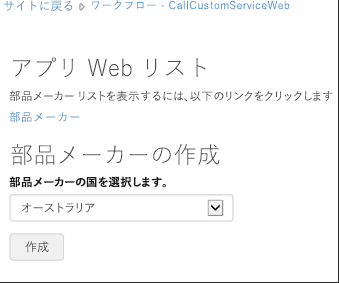
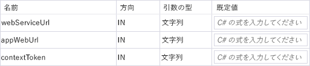
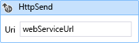
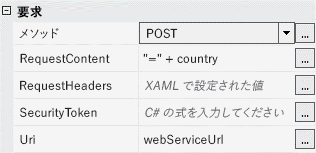
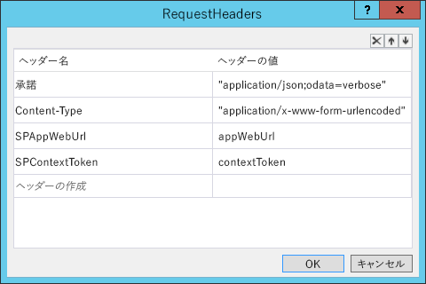
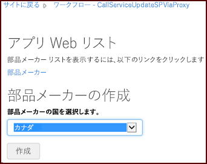
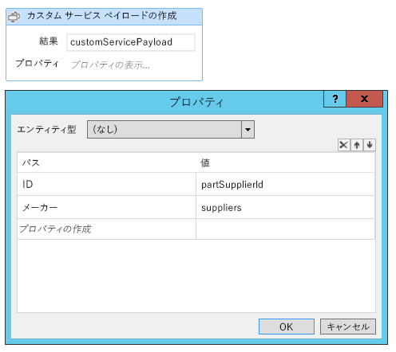
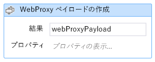
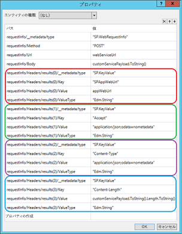
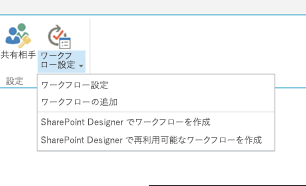

# SharePoint ワークフローからの Web サービス呼び出し

SharePoint のアドインから SharePoint 2013 ワークフローをホスト web に展開し、SharePoint ワークフローから Web サービスを呼び出します。

_**適用対象:** Office 365 | SharePoint 2013 | SharePoint Online_

SharePoint 2013 アドイン モデルを使用して、アドイン Web またはホスト Web で実行するワークフローを作成および展開できます。こうしたワークフローは、プロバイダー ホスト型アドインのリモートでホストされる部分と対話できます。また、次の 2 つの方法のうちいずれかにより、重要なビジネス データが含まれるリモート Web サービスを呼び出すことも可能です。 

- アドインのリモートでホストされる部分にクエリ情報を渡す。その後、リモート Web アプリケーションは Web サービスを呼び出してその情報を SharePoint に戻します。
    
- SharePoint 2013 Web プロキシを使用して Web サービスを照会する。ワークフローはアドインのリモートでホストされる部分にそのクエリ結果を渡し、次にその情報を SharePoint に渡します。
    
Web サービスから取得した情報は SharePoint リストに格納できます。この記事では、以下の表にまとめられているように、ワークフローから Web サービスを呼び出す方法を示す 3 つのコード サンプルについて説明します。最初の 2 つのコード サンプルの場合、ワークフローとリストは、アドインのインストール時にアドイン Web に展開されます。最後のサンプルではワークフローの基本シェルが示され、ホスト Web への展開方法と、ホスト Web 上のリストと関連付ける方法を取り上げています。 

**ワークフローのタスクと関連サンプル**

|**タスク**|**サンプル**|
|:-----|:-----|
|ワークフローからカスタム Web サービスを呼び出す|[Workflow.CallCustomService](https://github.com/OfficeDev/PnP/tree/master/Samples/Workflow.CallCustomService)|
|ワークフローからカスタム Web サービスを呼び出し、SharePoint Web プロキシを使用して SharePoint を更新する|[Workflow.CallServiceUpdateSPViaProxy](https://github.com/OfficeDev/PnP/tree/master/Samples/Workflow.CallServiceUpdateSPViaProxy)|
|ワークフローをホスト Web に関連付ける|[Workflow.AssociateToHostWeb](https://github.com/OfficeDev/PnP/tree/master/Samples/Workflow.AssociateToHostWeb)|

## ワークフローからカスタム Web サービスを呼び出す
<a name="bk1"> </a>

[Workflow.CallCustomService](https://github.com/OfficeDev/PnP/tree/master/Samples/Workflow.CallCustomService) サンプルは、SharePoint リスト データを更新するカスタム Web サービスを呼び出すワークフローの作成方法を示しています。また、プロバイダー ホスト型アドインを、アドインと一緒に展開するリモート ホスト型 Web アプリケーションを使用して Web サービスを照会するように設計する方法も示しています。このサンプルは、Web サービスとのすべて対話を、プロバイダー向けのホスト型アドインのリモートでホストされる部分によって処理する場合に役立ちます。

このサンプルでは、リモート Web アプリケーションからのワークフローが作業開始点です。このワークフローは、ユーザーによって送信されるクエリ情報をリモート Web アプリケーションに渡し、その情報を使用して Northwind OData Web サービスに対するクエリを作成します。このクエリにより、指定の国の製品供給者が返されます。その情報の受信後、リモート Web アプリケーションは、アドイン Web に既に展開されている製品供給者リストを更新します。

**メモ**[Workflow.CallCustomService ](https://github.com/OfficeDev/PnP/tree/master/Samples/Workflow.CallCustomService) サンプル ページには、このアドインを展開するための指示が含まれています。また、ブログ投稿「[Visual Studio 2013 を使用して SharePoint 2013 ワークフローをデバッグする](http://blogs.msdn.com/b/officeapps/archive/2013/10/30/debugging-sharepoint-2013-workflows-using-visual-studio-2013.aspx)」の説明に従う場合、Visual Studio で F5 によるデバッグを使用してアドインの展開とテストを行うこともできます。

このアプリの開始ページにあるドロップダウン メニューを使用すると、製品供給者リストを作成する国を選択できます (図 1)。 

**図 1. Workflow.CallCustomService サンプル アプリの開始ページ**



画面上の **[作成]** ボタンを使用すると、Controllers\PartSuppliersController.cs ファイルの **Create** メソッドが呼び出され、アドイン Web の [部品供給者] リスト内に新しいエントリが作成されます。**Create** メソッドは次に **Add** メソッドを呼び出します。このメソッドは Services\PartSuppliersService.cs ファイルで定義されています。次の 2 つのコード サンプルにこのシーケンスを示します。

**Create メソッド**

```
public ActionResult Create(string country, string spHostUrl)
        {
            var spContext = SharePointContextProvider.Current.GetSharePointContext(HttpContext);
            using (var clientContext = spContext.CreateUserClientContextForSPAppWeb())
            {
                var service = new PartSuppliersService(clientContext);
                var id = service.GetIdByCountry(country);
                if (id == null)
                {
                    id = service.Add(country);
                    TempData["Message"] = "Part Supplier Successfully Created!";
                }
                else
                    TempData["ErrorMessage"] = string.Format("Failed to Create The Part Supplier: There's already a Part Supplier who's country is {0}.", country);

                return RedirectToAction("Details", new { id = id.Value, SPHostUrl = spHostUrl });
            }
        }

```

**Add メソッド**

```
public int Add(string country)
        {
            var item = list.AddItem(new ListItemCreationInformation());
            item["Country"] = country;
            item.Update();
            clientContext.ExecuteQuery();
            return item.Id;
        }

```

新しいリスト項目を作成すると、アドインには、図 2 に示されているように、承認ワークフローを開始するボタンが表示されます。

**図 2. サンプル アプリの [ワークフローの開始] ボタン**

![サンプル アプリの [ワークフローの開始] ページを示すスクリーンショット](media/1d5fc6a1-79fe-4767-b8d8-905a10354565.png)

**[ワークフローの開始]** ボタンを選択すると、Controllers\PartSuppliersController.cs ファイルに定義されている **StartWorkflow** メソッドが実行されます。このメソッドはアドイン Web URL、Web サービス URL (Northwind Web サービス用ではなく、リモート ホスト型 Web アプリケーション用)、コンテキスト トークン値をパッケージ化し、それを **StartWorkflow** メソッドに渡します。**PartSuppliersService** メソッドでは、SharePoint と対話するためにコンテキスト トークンが必要となります。

```
public ActionResult StartWorkflow(int id, Guid workflowSubscriptionId, string spHostUrl)
        {
            var spContext = SharePointContextProvider.Current.GetSharePointContext(HttpContext) as SharePointAcsContext;

            var webServiceUrl = Url.RouteUrl("DefaultApi", new { httproute = "", controller = "Data" }, Request.Url.Scheme);
            var payload = new Dictionary<string, object>
                {
                    { "appWebUrl", spContext.SPAppWebUrl.ToString() },
                    { "webServiceUrl", webServiceUrl },
                    { "contextToken",  spContext.ContextToken }
                };

            using (var clientContext = spContext.CreateUserClientContextForSPAppWeb())
            {
                var service = new PartSuppliersService(clientContext);
                service.StartWorkflow(workflowSubscriptionId, id, payload);
            }

            TempData["Message"] = "Workflow Successfully Started!";
            return RedirectToAction("Details", new { id = id, SPHostUrl = spHostUrl });
        }

```

次に **StartWorkflow** メソッドはワークフロー インスタンスを作成し、ペイロード変数に格納されている 3 つの値 (appWebUrl、webServiceUrl、contextToken) をワークフローに渡します。

```
 {
            var workflowServicesManager = new WorkflowServicesManager(clientContext, clientContext.Web);

            var subscriptionService = workflowServicesManager.GetWorkflowSubscriptionService();
            var subscription = subscriptionService.GetSubscription(subscriptionId);

            var instanceService = workflowServicesManager.GetWorkflowInstanceService();
            instanceService.StartWorkflowOnListItem(subscription, itemId, payload);
            clientContext.ExecuteQuery();
        }

```

ワークフローを開始すると、リモート ホスト型 Web アプリケーションに対する **POST HTTP** 要求が作成されます。この要求は、ユーザーが先ほど追加した国の供給者によって供給者リストを更新するよう、Web アプリケーションに指示します。Controllers\DataController.cs ファイルには、この要求のコンテンツを受信する **POST** メソッドが入っています。

```
public void Post([FromBody]string country)
        {
            var supplierNames = GetSupplierNames(country);
            UpdateSuppliers(country, supplierNames);
        }

```

**GetSupplierNames** メソッド (Controllers\DataController.cs ファイル内) によって、選択した国と関連するすべての提供者に関して、LINQ クエリが作成されて Northwind OData Web サービスに対して実行されます。その後、**UpdateSuppliers** メソッドは、以下の 2 つのコード サンプルに示されているように、新しく追加されたリスト項目の Suppliers フィールドを更新します。

**Northwind に対するクエリ**

```
private string[] GetSupplierNames(string country)
        {
            Uri uri = new Uri("http://services.odata.org/V3/Northwind/Northwind.svc");
            var entities = new NorthwindEntities(uri);
            var names = entities.Suppliers
                .Where(s => s.Country == country)
                .AsEnumerable()
                .Select(s => s.CompanyName)
                .ToArray();
            return names;
        }

```

**供給者リストの更新**

```
private void UpdateSuppliers(string country, string[] supplierNames)
        {
            var request = HttpContext.Current.Request;
            var authority = request.Url.Authority;
            var spAppWebUrl = request.Headers["SPAppWebUrl"];
            var contextToken = request.Headers["SPContextToken"];

            using (var clientContext = TokenHelper.GetClientContextWithContextToken(
                spAppWebUrl, contextToken, authority))
            {
                var service = new PartSuppliersService(clientContext);
                service.UpdateSuppliers(country, supplierNames);
            }
        }

```

アプリ プロジェクトの Approve Suppliers ディレクトリにある workflow.xaml ファイルのデザイン ビューを表示している場合、(デザイン ビューの左下にある **[引数]** タブを選択して) 対象のワークフローに、ワークフロー引数として渡されるペイロード変数の 3 つの値が格納されていることを確認できます (図 3)。

**図 3. ワークフローに渡されたペイロード引数**



**HttpSend** アクティビティは、ワークフローの承認の前に発生します。このアクティビティは、リモート Web アプリケーションに **POST** クエリを送信します。リモート Web アプリケーションは Northwind Web サービスに対する呼び出しを実行し、リスト項目を (供給者リストで) 更新します。このアクティビティは、ワークフロー引数として渡された webServiceUrl 値に要求を送信するように構成されています (図 4)。

**図 4. HttpSend アクティビティの Uri 値**



また **POST** 要求は、ワークフローの操作対象のリスト項目に格納されている国の値も渡します (図 5)。

**図 5. HttpSend アクティビティのプロパティ グリッド**



このワークフローは appWebUrl 値と contextToken 値を、要求ヘッダーを介して Web アプリケーションに送信します (図 6)。またヘッダーは、要求の送信と承認のためのコンテンツ タイプも設定します。

**図 6. HttpSend アクティビティの要求ヘッダー**



ワークフローが承認されると、該当リスト項目の isApproved フィールド値が **true** に変更されます。

## ワークフローからカスタム Web サービスを呼び出し、SharePoint Web プロキシを使用して SharePoint を更新する
<a name="bk2"> </a>

[Workflow.CallServiceUpdateSPViaProxy](https://github.com/OfficeDev/PnP/tree/master/Samples/Workflow.CallServiceUpdateSPViaProxy) サンプルは、Web サービスを照会し、その情報を SharePoint リストに SharePoint 2013 Web プロキシを介して渡すようにプロバイダー ホスト型アドインを設計する方法を示しています。

このサンプルは、Web サービスとのすべての対話をカプセル化して、ワークフローによってそれらの対話が直接処理されるようにする場合に役立つタスクを示しています。Web プロキシを使用すると、ワークフロー インスタンスを更新することなく、リモート Web アプリケーション ロジックを簡単に更新できます。プロキシを使用せずに Web アプリケーション内のロジックを更新する必要がある場合には、既存のワークフロー インスタンスを削除してからアドインを再展開しなければなりません。このため、リモート Web サービスを呼び出す必要がある場合、この設計を使用することをお勧めします。 

**メモ**[Workflow.CallCustomServiceUpdateViaProxy](https://github.com/OfficeDev/PnP/tree/master/Samples/Workflow.CallServiceUpdateSPViaProxy) サンプル ページには、このアドインを展開するための指示が含まれています。また、ブログ投稿「**Visual Studio 2013 を使用して SharePoint 2013 ワークフローをデバッグする**」の説明に従う場合、Visual Studio で [F5](http://blogs.msdn.com/b/officeapps/archive/2013/10/30/debugging-sharepoint-2013-workflows-using-visual-studio-2013.aspx) によるデバッグを使用してアドインの展開とテストを行うこともできます。

このサンプルの開始点は、リモート Web アプリケーションからのワークフローになります。このワークフローは、ユーザーが送信したクエリ情報を Northwind OData Web サービスに渡します。このクエリは、指定の国の製品供給者を返します。Web サービス応答を受信後、ワークフローは応答からの情報をリモート Web アプリケーションに渡します。次にリモート Web アプリケーションは、アドイン Web に既に展開されている製品供給者リストを更新します。

このアプリを開始する際、スタート ページに含まれているドロップダウン メニューで、製品供給者リストを作成する国を選択できます (図 7)。

**図 7. Workflow.CallServiceUpdateSPViaProxy サンプル アドインの開始ページ**



そのボタンは Controllers\PartSuppliersController.cs ファイル内のメソッドを呼び出し、アドイン Web の **[部品供給者]** リストに新たなエントリを作成します。そのファイル内にある **Create** メソッドは、Services\PartSuppliersService.cs ファイルで定義されている **Add** メソッドを呼び出します。両方のメソッドを、次の 2 つのコード サンプルで示します。

**Create メソッド**

```
public ActionResult Create(string country, string spHostUrl)
        {
            var spContext = SharePointContextProvider.Current.GetSharePointContext(HttpContext);
            using (var clientContext = spContext.CreateUserClientContextForSPAppWeb())
            {
                var service = new PartSuppliersService(clientContext);
                var id = service.GetIdByCountry(country);
                if (id == null)
                {
                    id = service.Add(country);
                    TempData["Message"] = "Part Supplier Successfully Created!";
                }
                else
                    TempData["ErrorMessage"] = string.Format("Failed to Create The Part Supplier: There's already a Part Supplier who's country is {0}.", country);

                return RedirectToAction("Details", new { id = id.Value, SPHostUrl = spHostUrl });
            }
        }

```

**Add メソッド**

```
public int Add(string country)
        {
            var item = list.AddItem(new ListItemCreationInformation());
            item["Country"] = country;
            item.Update();
            clientContext.ExecuteQuery();
            return item.Id;
        }

```

新しいリスト項目の作成後、アドインには承認ワークフローを開始するボタンが表示されます (図 8)。

**図 8. [ワークフローの開始] ボタン**

![カスタム Web サービスの [ワークフローの開始] ページを示すスクリーンショット](media/69576609-f4c1-4160-9f82-3099e0a07d58.png)

**[ワークフローの開始]** ボタンを選択すると、Controllers\PartSuppliersController.cs ファイル内の **StartWorkflow** メソッドが実行されます。このメソッドは、アドイン Web URL と Web サービス URL (Northwind Web サービス用ではなく、リモート ホスト型 Web アプリケーション用) をパッケージ化し、それを Services\PartSuppliersService.cs ファイル内の **StartWorkflow** メソッドに渡します。このワークフローは Web プロキシを介してリモート Web アプリケーションと通信し、Web プロキシは要求ヘッダーにアクセス トークンを追加します。この理由で、このサンプルの場合、該当ワークフローは **StartWorkflow** メソッドに対してコンテキスト トークンを渡しません。以下のサンプルにコードを示します。

```
public ActionResult StartWorkflow(int id, Guid workflowSubscriptionId, string spHostUrl)
        {
            var spContext = SharePointContextProvider.Current.GetSharePointContext(HttpContext);

            var webServiceUrl = Url.RouteUrl("DefaultApi", new { httproute = "", controller = "Data" }, Request.Url.Scheme);
            var payload = new Dictionary<string, object>
                {
                    { "appWebUrl", spContext.SPAppWebUrl.ToString() },
                    { "webServiceUrl", webServiceUrl }
                };

            using (var clientContext = spContext.CreateUserClientContextForSPAppWeb())
            {
                var service = new PartSuppliersService(clientContext);
                service.StartWorkflow(workflowSubscriptionId, id, payload);
            }

            TempData["Message"] = "Workflow Successfully Started!";
            return RedirectToAction("Details", new { id = id, SPHostUrl = spHostUrl });
        }

```

**StartWorkflow** メソッドがワークフロー インスタンスを作成し、ペイロード変数に格納された 2 つの値 (appWebUrl および webServiceUrl) をワークフローに渡します。

```
public void StartWorkflow(Guid subscriptionId, int itemId, Dictionary<string, object> payload)
        {
            var workflowServicesManager = new WorkflowServicesManager(clientContext, clientContext.Web);

            var subscriptionService = workflowServicesManager.GetWorkflowSubscriptionService();
            var subscription = subscriptionService.GetSubscription(subscriptionId);

            var instanceService = workflowServicesManager.GetWorkflowInstanceService();
            instanceService.StartWorkflowOnListItem(subscription, itemId, payload);
            clientContext.ExecuteQuery();
        }

```

ワークフローの開始後、承認されるまでの間に、ワークフローは、ユーザーが選択した国の供給者リストを取得するため Northwind Web サービスに対するクエリを作成します。その際、エンドポイント (`"http://services.odata.org/V3/Northwind/Northwind.svc/Suppliers/?$filter=Country eq '" + country.Replace("'", "''") + "'&amp;$select=CompanyName"`) に対して OData クエリを送信する **HTTPSend** アクティビティを使用します。**HttpSend** アクティビティは、次のようにメタデータなしで JSON を指定する **Accept** ヘッダーによる **GET** 要求として構成する必要があります: ` application/json;odata=nometadata` (図 9 および 10)。

**図 9. HttpSend アクティビティ構成**


**図 10. HttpSend アクティビティの要求ヘッダー**

![HTTP 送信アクティビティの [要求ヘッダー] グリッドを示すスクリーンショット](media/5cac4a52-cb8e-432a-bf72-6d0fa100f3fd.png)

たとえばユーザーが新しい供給者リスト項目に関してカナダを選択した場合、JSON 形式の応答は次の例のようになります。

```
{
    value: [
        {
            CompanyName: "Ma Maison"
        },
        {
            CompanyName: "Forêts d'érables"
        }
    ]
}

```

ワークフローを開始すると **POST HTTP** 要求が作成され、この要求には、リモート ホスト型 Web アプリケーションにプロキシを介して渡す供給者リストが含まれます。これは、Web プロキシ URL (`appWebUrl + "/_api/SP.WebProxy.invoke"`) を照会する **HttpSend** アクティビティを介して行われます。次にワークフローは、カスタムのサービス ペイロードを作成して渡すことによって、Northwind サービスから受け取った供給者リストを渡します。**Create Custom Service Payload** アクティビティのプロパティには、図 11 に示されているように、供給者リストと、供給者の国 ID が含まれています。

**図 11. Create Custom Service Payload アクティビティ**



**Create WebProxy Payload** アクティビティは、Web プロキシ URL にこのペイロードのコンテンツを渡すペイロードを作成します (図 12)。

**図 12. Create WebProxy Payload 構成**



このアクティビティのプロパティによって、アドイン Web URL、POST 要求のコンテンツの長さと種類、要求ヘッダーを介した要求承認の種類を指定します (図 13)。

**図 13. WebProxy ペイロード アクティビティのプロパティ グリッド**



ワークフローがペイロードと要求を作成すると、その後、Web プロキシ URL に対する POST 要求として構成された **HttpSend** アクティビティによって、要求が Web プロキシに渡されます。この要求ヘッダーで、**Content-Type** ヘッダーと **Accept** ヘッダーの JSON 形式の OData を指定します (図 14)。

**図 14. HttpSend アクティビティのプロパティ**

![HTTP 送信アクティビティの [要求ヘッダー] ダイアログを示すスクリーンショット](media/01ce82fb-4690-4226-874a-c4734a17d9a4.png)

Controllers\DataController.cs ファイル内の **Post** メソッドが、ワークフローが Web プロキシを介して送信する要求のコンテンツを受け取ります。前のサンプルの **Post** メソッドは、Northwind から供給者リストを取得し、対応する SharePoint 供給者リストを更新するためのメソッドを呼び出しました。このサンプルのワークフローは既に Northwind サービスに対する照会を実行しているので、今回のメソッドで必要となるのは SharePoint リストの更新のみです。また、次のコード例に示されているように、Services\PartSuppliersService.cs ファイル内の **UpdateSuppliers** メソッドに対して、アドイン Web URL とアクセス トークン (Web プロキシによって渡されます) を渡します。

```
public void Post(UpdatePartSupplierModel model)
        {
            var request = HttpContext.Current.Request;
            var authority = request.Url.Authority;
            var spAppWebUrl = request.Headers["SPAppWebUrl"];
            var accessToken = request.Headers["X-SP-AccessToken"];

            using (var clientContext = TokenHelper.GetClientContextWithContextToken(spAppWebUrl, accessToken, authority))
            {
                var service = new PartSuppliersService(clientContext);
                service.UpdateSuppliers(model.Id, model.Suppliers.Select(s => s.CompanyName));
            }
        }

```

PartSuppliers.cs ファイル内の **UpdateSuppliers** メソッドは、新たに作成されたリスト項目の Suppliers フィールドを更新します。

```
public void UpdateSuppliers(int id, IEnumerable<string> supplierNames)
        {
            var item = list.GetItemById(id);
            clientContext.Load(item);
            clientContext.ExecuteQuery();

            string commaSeparatedList = String.Join(",", supplierNames);
            item["Suppliers"] = commaSeparatedList;
            item.Update();
            clientContext.ExecuteQuery();
        }

```

ワークフローが承認されると、該当リスト項目の isApproved フィールド値が true に変更されます。

## ワークフローをホスト Web に関連付ける
<a name="bk3"> </a>

[Workflow.AssociateToHostWeb](https://github.com/OfficeDev/PnP/tree/master/Samples/Workflow.AssociateToHostWeb) サンプルは、Visual Studio 2013 のツールを使用してワークフローをホスト Web に展開し、ホスト Web 上のリストと関連付ける方法を示しています。このサンプル用の指示では、Visual Studio でワークフローを作成し、それをホスト Web に展開してからホスト Web 上のリストに関連付ける方法が示されています。

このサンプルには、任意のリストに関連付けられる簡単なワークフローが含まれています。このワークフローを展開するための指示では、アプリをパッケージ化してから開き、構成ファイルを編集し、その後手動で再パッケージ化してからホスト Web に展開することによって、Visual Studio ワークフロー ツールの現在の制限を回避する方法が示されています。

このプロジェクトを Visual Studio で開くと、どの SharePoint リストも処理できる簡単な汎用ワークフローが表示されます。ワークフロー タスク リストのほかには、関連付けが可能なリストは展開しません。

**メモ**  Visual Studio 2013 を使用してこのサンプルで示されているタスクを実行することはできません。このサンプルには役立つ回避策が示されています。Visual Studio ツールが今後更新される場合には、この回避策を使用する必要はなくなる可能性があります。

### ワークフローをホスト Web に展開する

1. [Workflow.AssociateToHostWeb](https://github.com/OfficeDev/PnP/tree/master/Samples/Workflow.AssociateToHostWeb) アドイン プロジェクトをプロジェクト エクスプローラーのショートカット メニュー (右クリック) で開き、**[発行]** を選択します。図 15 に示されているように、**[アプリをパッケージ化する]** ボタンが含まれるウィンドウが表示されます。
    
    **図 15. アドイン画面を発行する**
    
    ![サンプル アプリを発行するための [アプリを発行する] ページを示すスクリーンショット](media/b003cc8b-90dc-4d49-8cb7-8b563f25f056.png)

2. **[アプリをパッケージ化する]** を選択すると、Visual Studio によって Workflow.AssociateToHostWeb.app ファイルがご使用のソリューションの `bin\Debug\app.publish\1.0.0.0` ディレクトリに作成されます。この .app ファイルのファイルの種類は zip です。
    
3. 最初にファイル拡張子を .zip に変更してファイル コンテンツを解凍します。 
    
4. 解凍先ディレクトリで WorkflowManifest.xml という名前の XML ファイルを見つけて開きます。このファイルは空です。
    
5. 次の XML フラグメントをファイルに追加し、ファイルを保存します。
    
    ```XML
      <SPIntegratedWorkflow xmlns="http://schemas.microsoft.com/sharepoint/2014/app/integratedworkflow">
        <IntegratedApp>true</IntegratedApp>
      </SPIntegratedWorkflow>
    ```

6. 解凍先フォルダー内のすべてのファイルを選択し、それらのファイルをショートカット メニュー (右クリック) で開き、**[送る]**  >  **[圧縮 (zip 形式) フォルダー]** と選択します。
    
7. 先ほど作成した zip ファイルのファイル拡張子を .app に変更します。これで、更新した WorkflowManifest.xml ファイルが含まれる新しい Workflow.AssociateToHostWeb.app パッケージができました。
    
8. アドインをアプリ カタログに追加します。
    
9. アドインをホスト サイトにインストールします。
    
10. ホスト サイト上のリストに移動し、ページ上部左にある **[リスト]** 編集オプションを選択します。**[ワークフロー設定]** ドロップダウン メニューが表示されます (図 16)。
    
    **図 16. リストのワークフロー設定**
    
    

11. ドロップダウン メニューから **[ワークフローの追加]** を選択します。
    
12. 図 17 の画像と同様の選択オプションが表示されます。選択可能なオプション リストから **Workflow.AssociateToHostWeb** アプリを選択します。
    
    **図 17. ワークフロー設定を追加する**
    
    ![[ワークフローの追加] 設定ページを示すスクリーンショット](media/08317057-4546-4ad9-b8c5-d5b33bc4350d.png)

これで、ワークフローをホスト Web に展開し、ホスト Web 上のリストと関連付けることができました。ワークフローを手動で起動するか、Visual Studio でワークフローを更新して他の方法で起動できます。

## その他のリソース
<a name="bk_addresources"> </a>

-  [SharePoint 2013 および SharePoint Online 用の複合ビジネス アドイン](Composite-buisness-apps-for-SharePoint.md)
    
-  [Visual Studio 2013 を使用して SharePoint 2013 ワークフローをデバッグする](http://blogs.msdn.com/b/officeapps/archive/2013/10/30/debugging-sharepoint-2013-workflows-using-visual-studio-2013.aspx)
    
-  [Workflow.AssociateToHostWeb](https://github.com/OfficeDev/PnP/tree/master/Samples/Workflow.AssociateToHostWeb)
    
-  [Workflow.CallServiceUpdateSPViaProxy](https://github.com/OfficeDev/PnP/tree/master/Samples/Workflow.CallServiceUpdateSPViaProxy)
    
-  [Workflow.AssociateToHostWeb](https://github.com/OfficeDev/PnP/tree/master/Samples/Workflow.AssociateToHostWeb)
    
-  [Workflow.CallCustomService](https://github.com/OfficeDev/PnP/tree/master/Samples/Workflow.CallCustomService)
