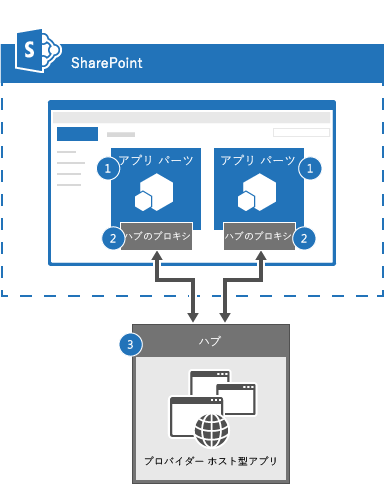

# SignalR を使用して SharePoint アプリ パーツを接続する

SignalR を使用して、SharePoint アプリ パーツ間のリアルタイム通信を実装します。

_**適用対象:** SharePoint 用アドイン | SharePoint 2013 | SharePoint Online_

[Core.ConnectedAppParts](https://github.com/OfficeDev/PnP/tree/master/Samples/Core.ConnectedAppParts) サンプルは、プロバイダー ホスト型アプリをメッセージ ブローカーまたはチャット ハブとして使用し、チャット ハブに接続されたすべてのアプリ パーツとメッセージを送受信する方法を紹介します。このソリューションは、既存の SharePoint Web パーツをアプリ パーツに変換していて、アプリ パーツが相互に通信する必要がある場合に使用できます。

## はじめに
<a name="sectionSection0"> </a>

まず GitHub の [Office 365 Developer Patterns and Practices](https://github.com/OfficeDev/PnP/tree/dev) プロジェクトから、[Core.ConnectedAppParts](https://github.com/OfficeDev/PnP/tree/master/Samples/Core.ConnectedAppParts) サンプル アプリをダウンロードします。

## 接続されたアプリ パーツとチャット ハブのアーキテクチャ
<a name="sectionSection1"> </a>

図 1 は、接続されたアプリ パーツとチャット ハブのアーキテクチャを示しています。

**図 1.接続されたアプリ パーツとチャット ハブのアーキテクチャ**



接続されたアプリ パーツとチャット ハブのアーキテクチャには、次のコンポーネントが含まれています。

1. アプリ パーツを含む SharePoint のページ。アプリ パーツは、SignalR jQuery ライブラリを使います。アプリ パーツには、JavaScript のコードが含まれています。このコードは、プロバイダー ホスト型アドインで実行中のチャット ハブとメッセージを送受信します。各アプリ パーツは、最初に、チャット ハブに接続する必要があります。アプリ パーツは、チャット ハブに接続した後で、他の接続されているアプリ パーツとメッセージを送受信できます。
    
2. SignalR ハブ プロキシ (チャット ハブとのソケット接続を確立します)。SignalR ハブ プロキシ ブローカーは、アプリ パーツの JavaScript コードとチャット ハブの C# コードとの間のメッセージをやりとりします。
    
3. チャット ハブ (アプリ パーツが送受信するメッセージをルーティングするために SignalR ライブラリを使用します)。このコード サンプルでは、メッセージを送信したアプリ パーツを含む、すべてのアプリ パーツがチャット ハブからメッセージを受信します。
    
**メモ**  アプリ パーツは IFRAME で実行されるため、アプリ パーツ間の通信に JavaScript だけを使うことはできません。 

## Core.ConnectedAppParts アプリを使用する
<a name="sectionSection2"> </a>

SignalR を使用して 2 つのアプリ パーツが通信するデモを見るには、次の手順を実行します。 

1. アプリを実行し、スタート ページが表示されたら、**[サイトに戻る]** を選択します。
    
2. **[設定]**  >  **[ページの追加]** を選択します。
    
3. **[新しいページ名]** に「 **ConnectedAppParts**」と入力してから、 **[作成]** を選択します。
    
4. **[挿入]**  >  **[アプリ パーツ]** を選択します。
    
5. **[Connected Part - One]** (接続されたパーツ - 1)  >  **[追加]** を選択します。
    
6. **[挿入]**  >  **[アプリ パーツ]** を選択します。
    
7. **[Connected Part - Two** (接続されたパーツ - 2)  >  **[追加]** を選択します。
    
8. **[保存]** を選択します。
    
9. **[Connected Part - One]** (接続されたパーツ - 1) に「**Hello World from App Part 1**」と入力してから、**[送信]** を選択します。
    
10. 「**Hello World from App Part 1**」というメッセージが、**[Connected Part - One]** (接続されたパーツ - 1) と **[Connected Part - Two** (接続されたパーツ - 2) の両方のアプリ パーツに表示されることを確認します。
    
このコード サンプルでは、Core.ConnectedAppParts プロジェクトに 2 つのアプリ パーツ (ConnectedPartOne と ConnectedPartTwo) が含まれており、ホスト Web に配置されます。ConnectedPartOne と ConnectedPartTwo は IFRAME 内で実行されます。ConnectedPartOne と ConnectedPartTwo の Web ページ コンテンツは、Core.ConnectedAppPartsWeb プロジェクト内の Pages\ConnectedPartOne.aspx と Pages\ConnectedPartTwo.aspx で定義されています。どちらのページも、プロバイダー ホスト型アプリ内でチャット ハブ (ChatHub.cs) と一緒に実行され、インライン JavaScript を使用して次の処理を行います。

1. SignalR jQuery ライブラリを組み込みます。
    
2. **connection.chatHub** を使用して SignalR ハブ プロキシに接続します。 
    
3. **chat.client.broadcastMessage** を使用して、チャット ハブから送信されたブロードキャスト メッセージを受信する関数を定義します。このコード サンプルでは、アプリ パーツの名前とブロードキャストされているメッセージを、**ディスカッション** リストに表示します。
    
4. **$.connection.hub.start().done** を使用して、チャット ハブへの接続を開始します。接続が確立されると、**sendmessage** ボタンの click イベントに対するイベント ハンドラーが定義されます。このイベント ハンドラーは、**chat.server.send** を呼び出して、アプリ パーツの名前と、ユーザーがチャット ハブに入力したメッセージを送信します。

**メモ**  この記事で提供されるコードは、明示または黙示のいかなる種類の保証なしに現状のまま提供されるものであり、特定目的への適合性、商品性、権利侵害の不存在についての暗黙的な保証は一切ありません。

```
    <!--Script references. -->
    <!--Reference the jQuery library. -->
    <script src="../Scripts/jquery-1.6.4.min.js" ></script>
    <!--Reference the SignalR library. -->
    <script src="../Scripts/jquery.signalR-2.0.3.min.js"></script>
    <!--Reference the autogenerated SignalR hub script. -->
    <script src="../signalr/hubs"></script>
    <!--Add script to update the page and send messages.--> 
    <script type="text/javascript">
        $(function () {
            // Declare a proxy to reference the hub. 
            var chat = $.connection.chatHub;
            // Create a function that the hub can call to broadcast messages.
            chat.client.broadcastMessage = function (name, message) {
                // Html encode display name and message. 
                var encodedName = $('<div />').text(name).html();
                var encodedMsg = $('<div />').text(message).html();
                // Add the message to the page. 
                $('#discussion').append('<li><strong>' + encodedName
                    + '</strong>:&amp;nbsp;&amp;nbsp;' + encodedMsg + '</li>');
            };
            // Set initial focus to message input box.  
            $('#message').focus();
            // Start the connection.
            $.connection.hub.start().done(function () {
                $('#sendmessage').click(function () {
                    // Call the Send method on the hub. 
                    chat.server.send($('#displayname').val(), $('#message').val());
                    // Clear text box and reset focus for next comment. 
                    $('#message').val('').focus();
                });
            });
        });
    </script>
```

ConnectedPartOne.aspx 内のインライン JavaScript コードによって **chat.server.send** が実行されると、ChatHub.cs 内の **Send** メソッドが呼び出されます。ChatHub.cs の **Send** メソッドは、ブロードキャストを実行したアプリ パーツの名前とメッセージを受信し、 **Clients.All.broadcastMessage** を使用して、接続されているすべてのアプリ パーツに情報をブロードキャストします。**Clients.All.broadcastMessage** は、**chat.client.broadcastMessage** を使用することにより定義された JavaScript 関数 (すべての接続されたアプリ パーツ内にある) を呼び出します。

```C#
 public void Send(string name, string message)
        {
            // Call the broadcastMessage method to update the app parts.
            Clients.All.broadcastMessage(name, message);
        }
```

**重要**  このコード サンプルでは、チャット ハブに接続されているすべてのアプリ パーツが、チャット ハブ経由で送信されるすべてのメッセージを受信します。どのアプリ パーツがどのメッセージを受信する必要があるかを判断するため、セッション ID に基づいてメッセージをフィルター処理することを検討してください。

## その他の技術情報
<a name="bk_addresources"> </a>

-  [Office 365 開発パターンとプラクティス (ソリューション ガイダンス)](Office-365-development-patterns-and-practices-solution-guidance.md)
    
-  [SignalR 入門](http://www.asp.net/signalr/overview/getting-started/introduction-to-signalr)
    
-  [チュートリアル: SignalR の概要 2](http://www.asp.net/signalr/overview/getting-started/tutorial-getting-started-with-signalr)
    
