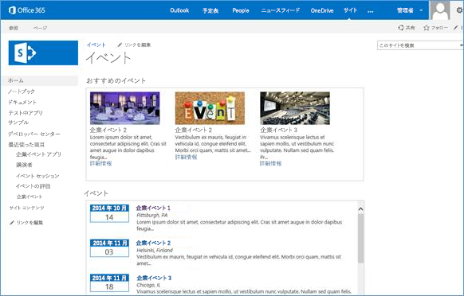
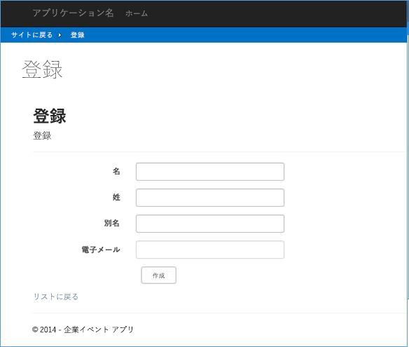

# 会社のイベント アプリと SharePoint との統合

複数の複雑なビジネス タスクを実装できるプロバイダー ホスト型アドインを使用して、SharePoint のアドインを事業運営に統合します。

_**適用対象:** Office 365 | SharePoint 2013 | SharePoint Online_

[BusinessApps.CorporateEventApp](https://github.com/OfficeDev/PnP/tree/master/Solutions/BusinessApps.CorporateEventsApp) サンプルは、既存の基幹業務 (LOB) アプリケーションと統合されるプロバイダー ホスト型アドインとして、中央に一元化した企業イベント管理システムを実装する方法を示しています。

具体的には、[BusinessApps.CorporateEventApp](https://github.com/OfficeDev/PnP/tree/master/Solutions/BusinessApps.CorporateEventsApp) サンプルは、LOB エンティティのデータ ストアとして、SharePoint と対話する ASP.NET Web アプリケーションを実装する方法を示します。また、複雑なビジネス タスクに含まれる複数のステップを単一のプロバイダー ホスト型アドインで実装する方法も示します。このサンプル アプリは、SharePoint エンティティ (リストおよびコンテンツ タイプ) で構成される中央に一元化した管理システムを実装します。それぞれの新しいコンテンツ タイプについて、ASP.NET Web アプリケーションの対応する LOB エンティティを作成します。Web アプリケーションのコンポーネントは、SharePoint インターフェイス内のリモート ホスト型アドイン パーツとしても、リモートの Web ホストで完全に実行されているページとしても実行されます。アドインは、サイトのホーム ページにカスタム ブランドのインターフェイスを提示できるように、SharePoint サイトの既定のウェルカム ページを上書きします。

## BusinessApps.CorporateEventApp サンプルを使用する

BusinessApps.CorporateEventApp サンプル アプリを起動すると、サンプルを構成するためのオプションがホーム ページに表示されます。さらに、詳細を説明する多数のリソースへのリンクもあります。

図 1 に示すとおり、[**構成の開始**] を選択すると、[構成] ページに移動します。[構成] ページで [**データ ストアの初期化**] を選択すると、サンプルは、SharePoint エンティティと、サンプルをサポートするサンプル データを展開します。

**図 1. [構成] ページ**

![[データの初期化] 画面を示すスクリーンショット](media/ee213035-b014-45cc-94f4-d8c1c58a047e.png)

データ ストアを初期化した後でサイトに戻ると、新しいウェルカム ページが表示されます (EventsHome.aspx ページ)。図 2 に示すとおり、このページには、アドインによって展開された 2 つの Web パーツが表示されます。左側の欄に、アプリによってインストールされた 4 つの新しいリストが表示されます。会社のイベントの一覧にはサンプルのデータが入ります。

**図 2. Web パーツが初期化されたウェルカム ページ**



各 Web パーツには、表示された各イベントへのリンクが含まれており、それを使ってイベントの詳細を確認できます。図 3 に示すとおり、リンクを選択すると、イベントの詳細ページがリモート ホストで別個に実行されます。ページの **[サイトに戻る]** をクリックして SharePoint サイトに戻り、イベントに登録できます。

**図 3. イベントの詳細ページ**


登録ページもリモート ホストで別個に実行されます。このページにも SharePoint のホスト サイトに戻るリンクがあります (図 4 参照)。イベントの登録が完了すると、新しくインストールされた **[イベントの登録]** リストに自分の名前が表示されます。

**図 4. [イベントの登録] ページ**



Models\DataInitializer.cs ファイルには、このボタンをクリックしたときに実行されるコードが含まれています。このファイルのコードにより、4 つの新しい SharePoint リストとともに、次の 4 つの関連するコンテンツ タイプが作成され、展開されます。

- 会社のイベント
    
- イベントの登録
    
- イベントの発言者
    
- イベントのセッション
    
このファイル内のコードでは、[Core.ModifyPages](https://github.com/OfficeDev/PnP/tree/master/Samples/Core.ModifyPages) サンプルで使用されているメソッドに似たメソッドを使用して、サイトにカスタム ページを追加します。

```
            // Create default wiki page.
            web.AddWikiPage("Site Pages", "EventsHome.aspx");
AddWikiPage is an extension method from the Core.DevPnPCore project to add a new page to the site. This new page also becomes the new WelcomePage for the site. It also prepares to add the web parts to this page.
            var welcomePage = "SitePages/EventsHome.aspx";
            var serverRelativeUrl = UrlUtility.Combine(web.ServerRelativeUrl, welcomePage);

            File webPartPage = web.GetFileByServerRelativeUrl(serverRelativeUrl);

            if (webPartPage == null) {
                return;
            }

            web.Context.Load(webPartPage);
            web.Context.Load(webPartPage.ListItemAllFields);
            web.Context.Load(web.RootFolder);
            web.Context.ExecuteQuery();

            web.RootFolder.WelcomePage = welcomePage;
            web.RootFolder.Update();
            web.Context.ExecuteQuery();

```

Models\DataInitializer.cs ファイルは、新しいウェルカム ページに表示される両方の Web パーツの XML も定義し、それぞれをページに追加します。次の例は、おすすめのイベント Web パーツでこれがどのように機能するかを示しています。

**Web パーツの XML の定義**

```XML
            var webPart1 = new WebPartEntity(){
                WebPartXml = @"<webParts>
  <webPart xmlns='http://schemas.microsoft.com/WebPart/v3'>
    <metaData>
      <type name='Microsoft.SharePoint.WebPartPages.ClientWebPart, Microsoft.SharePoint, Version=16.0.0.0, Culture=neutral, PublicKeyToken=71e9bce111e9429c' />
      <importErrorMessage>Cannot import this Web Part.</importErrorMessage>
    </metaData>
    <data>
      <properties>
        <property name='Description' type='string'>Displays featured events</property>
        <property name='FeatureId' type='System.Guid, mscorlib, Version=4.0.0.0, Culture=neutral, PublicKeyToken=b77a5c561934e089'>3a6d7f41-2de8-4e69-b4b4-0325bd56b32c</property>
        <property name='Title' type='string'>Featured Events</property>
        <property name='ProductWebId' type='System.Guid, mscorlib, Version=4.0.0.0, Culture=neutral, PublicKeyToken=b77a5c561934e089'>12ae648f-27db-4a97-9c63-37155d3ace1e</property>
        <property name='WebPartName' type='string'>FeaturedEvents</property>
        <property name='ProductId' type='System.Guid, mscorlib, Version=4.0.0.0, Culture=neutral, PublicKeyToken=b77a5c561934e089'>3a6d7f41-2de8-4e69-b4b4-0325bd56b32b</property>
        <property name='ChromeState' type='chromestate'>Normal</property>
      </properties>
    </data>
  </webPart>
</webParts>",
                WebPartIndex = 0,
                WebPartTitle = "Featured Events",
                WebPartZone = "Rich Content"
            };

```

**ページへの Web パーツの追加**

```XML
            var limitedWebPartManager = webPartPage.GetLimitedWebPartManager(Microsoft.SharePoint.Client.WebParts.PersonalizationScope.Shared);
            web.Context.Load(limitedWebPartManager.WebParts);
            web.Context.ExecuteQuery();

            for (var i = 0; i < limitedWebPartManager.WebParts.Count; i++) {
                limitedWebPartManager.WebParts[i].DeleteWebPart();
            }
            web.Context.ExecuteQuery();

            var oWebPartDefinition1 = limitedWebPartManager.ImportWebPart(webPart1.WebPartXml);
            var oWebPartDefinition2 = limitedWebPartManager.ImportWebPart(webPart2.WebPartXml);
            var wpdNew1 = limitedWebPartManager.AddWebPart(oWebPartDefinition1.WebPart, webPart1.WebPartZone, webPart1.WebPartIndex);
            var wpdNew2 = limitedWebPartManager.AddWebPart(oWebPartDefinition2.WebPart, webPart2.WebPartZone, webPart2.WebPartIndex);
            web.Context.Load(wpdNew1);
            web.Context.Load(wpdNew2);
            web.Context.ExecuteQuery();

```

Web プロジェクトの Models ディレクトリを見ると、この MVC ASP.NET Web アプリケーションには、アプリによってインストールされたリストとコンテンツ タイプに対応する 4 つのクラス名が含まれていることが分かります。

- Event.cs (会社のイベント)
    
- Registration.cs (イベントの登録)
    
- Session.cs (イベントのセッション)
    
- Speaker.cs (イベントの発言者)
    
これらの 4 つのクラスと、それぞれに対応する SharePoint コンテンツ タイプとが一緒になって、このアドインで使用される 4 つの LOB エンティティになります。

DataInitializer.cs ファイルは、**会社のイベント** リストのサンプル データを追加するために、**会社のイベント** コンテンツ タイプに対応するサンプル **Event** オブジェクトを作成します。アプリはこれを**会社のイベント** リストに追加します。イベントに登録する際、アプリは **Event Registration** コンテンツ タイプに対応する **Registration** オブジェクトを作成します。アプリはこれを **イベント登録**リストに追加します。サンプルは、**Session** オブジェクトと **Speaker** オブジェクトをまだ完全に実装していないため、現時点でアプリがこれらのオブジェクトを使用して動作することはできません。

次の表は、**BaseListItem** 抽象クラスから継承されたクラスによって実装する必要があるプロパティの一覧です。

**表 1. **BaseListItem**** から継承されるクラスで実装するメソッド

|**メンバー**|**説明**|
|:-----|:-----|
|**ContentTypeName**|アイテムに関連付けられているコンテンツ タイプを取得します。Null の場合、アイテムを保存する時、既定のライブラリのコンテンツ タイプがアイテムに割り当てられます。|
|**FieldInternalNames**|キャッシュに入れることができるフィールド名の一覧です。保存前のフィールドのデータ確認に使用して、パフォーマンスを向上させることができます。|
|ListTitle|リストのタイトルを取得します (大文字小文字を区別します)。|

次の表は、**BaseListItem** 抽象クラスから継承されたクラスによって実装する必要があるメソッドの一覧です。これらのメソッドは、複数のプラットフォームで使用できるよう、[blittable 型](https://msdn.microsoft.com/en-us/library/75dwhxf7%28v=vs.110%29.aspx)に設定する必要があるパラメーターを返します。

 **表 2. blittable 型を返すメソッド**

|**メソッド**|**説明**|
|:-----|:-----|
|**ReadProperties(ListItem)**|**BaseGet** メソッドと **BaseGetEnum** メソッドを使用して **ListItem** オブジェクトからプロパティを読み取り、サブクラスのプロパティに割り当てます。|
|**SetProperties(ListItem)**|抽象クラスの **BaseSet** メソッドと **BaseSetTaxonomyField** メソッドを使用して **ListItem** オブジェクトのプロパティを設定します。|

次の表は、サブクラスが **ReadProperties** メソッドと **SetProperties** メソッドを実装する必要がある **BaseListItem** クラスのヘルパー メソッドの一覧です。

**表 3. BaseListItem ヘルパー メソッド**

|**ヘルパー メソッド**|**説明**|
|:-----|:-----|
|**BaseGet(ListItem item, string internalName)**|*ListItem* から **internalName** パラメーターによって定義されるプロパティを取得し、それをジェネリック型 **T** で返します。|
|**BaseSet(ListItem item, string internalName, object value)**|**internalName** パラメーターによって定義される *ListItem* プロパティを設定します。|
|**BaseSetTaxonomyField(ListItem item, string internalName, string label, Guid termId)**|**internalName** および *termId* パラメーターによって定義される *ListItem* 分類フィールドを設定します。|
|**BaseGetEnum(ListItem item, string internalName, T defaultValue)**|*internalName* パラメーターによって定義される列挙型プロパティの値を取得します。プロパティが設定されていない場合は *defaultValue* パラメーターの値を返します。|

Event.cs ファイルには、**ReadProperties** メソッドと **SetProperties** メソッドの次の実装が含まれています。

**ReadProperties**

```C#
        protected override void ReadProperties(ListItem item) {
            RegisteredEventId = BaseGet<string>(item, FIELD_REGISTERED_EVENT_ID);
            Description = BaseGet<string>(item, FIELD_DESCRIPTION);
            Category = BaseGet<string>(item, FIELD_CATEGORY);
            EventDate = BaseGet<DateTime?>(item, FIELD_DATE);
            Location = BaseGet<string>(item, FIELD_LOCATION);
            ContactEmail = BaseGet<string>(item, FIELD_CONTACT_EMAIL);
            Status = BaseGetEnum<EventStatus>(item, FIELD_STATUS);
            var imageUrl = BaseGet<FieldUrlValue>(item, FIELD_IMAGE_URL);

            if (imageUrl != null)
                ImageUrl = imageUrl.Url;
        }
SetProperties:
        protected override void SetProperties(ListItem item) {
            BaseSet(item, FIELD_REGISTERED_EVENT_ID, RegisteredEventId);
            BaseSet(item, FIELD_DESCRIPTION, Description);
            BaseSet(item, FIELD_CATEGORY, Category);
            BaseSet(item, FIELD_DATE, EventDate);
            BaseSet(item, FIELD_LOCATION, Location);
            BaseSet(item, FIELD_CONTACT_EMAIL, ContactEmail);
            BaseSet(item, FIELD_STATUS, Status.ToEnumDescription());
            BaseSet(item, FIELD_IMAGE_URL, ImageUrl);
        }

```

次のコードの使用例は、基になる **BaseGet** メソッドと **BaseSet** メソッドが BaseListItem.cs でどのように定義されているかを示しています。

**BaseGet**

```
protected T BaseGet<T>(ListItem item, string internalName){
            var field = _fields[internalName.ToLowerInvariant()];
            var value = item[field.InternalName];
            return (T)value;
        }

```

**BaseSet**

```
protected void BaseSet(ListItem item, string internalName, object value) {
            if (_fields.ContainsKey(internalName)) {
                var field = _fields[internalName.ToLowerInvariant()];

                if (field is FieldUrl &amp;&amp; value is string) {
                    var urlValue = new FieldUrlValue() {
                        Url = value.ToString()
                    };
                    value = urlValue;
                }
            }
            item[internalName] = value;
        }
```

**BaseListItem** クラスには、アプリが作成し、操作する各 LOB エンティティの保存に使用される **Save** メソッドも含まれています。このメソッドは、リストを読み込み、現在の項目の ID が 0 より大きいかどうかを判断します。ID が 0 以下の場合、ID は無効と見なされ、新しいリスト項目が作成されます。このメソッドは、**SetProperties** メソッドを使用して、**ListItem** のプロパティを設定してから、**ReadProperties** メソッドを使用してサブクラスのプロパティを設定します。

```
public void Save(Web web) {
            var context = web.Context;
            var list = web.GetListByTitle(ListTitle);
            if (!IsNew &amp;&amp; Id > 0) {
                ListItem = list.GetItemById(Id);
            }
            else {
                var listItemCreationInfo = new ListItemCreationInformation();
                ListItem = list.AddItem(listItemCreationInfo);
            }

            // Ensure that the fields have been loaded.
            EnsureFieldsRetrieved(ListItem);

            // Set the properties on the list item.
            SetProperties(ListItem);
            BaseSet(ListItem, TITLE, Title);

            // Use if you want to override the created/modified date.
            //BaseSet(ListItem, CREATED, Created);
            //BaseSet(ListItem, MODIFIED, Modified);

            ListItem.Update();

            if (!string.IsNullOrEmpty(ContentTypeName)) {
                var contentType = list.GetContentTypeByName(ContentTypeName);
                if (contentType != null)
                    BaseSet(ListItem, "ContentTypeId", contentType.Id.StringValue);
            }

            ListItem.Update();

            // Execute the batch.
            context.ExecuteQuery();

            // Reload the properties.
            ListItem.RefreshLoad();
            UpdateBaseProperties(ListItem);
            ReadProperties(ListItem);
        }

```

## その他のリソース
<a name="bk_addresources"> </a>

-  [SharePoint 2013 および SharePoint Online 用の複合ビジネス アドイン](Composite-buisness-apps-for-SharePoint.md)
    
-  [Core.ModifyPages サンプル](https://github.com/OfficeDev/PnP/tree/master/Samples/Core.ModifyPages)
    
-  [Provisioning.Pages サンプル](https://github.com/OfficeDev/PnP/tree/master/Samples/Provisioning.Pages)
    
-  [OfficeDevPnP.Core サンプル](https://github.com/OfficeDev/PnP-Sites-Core/tree/master/Core)
    
