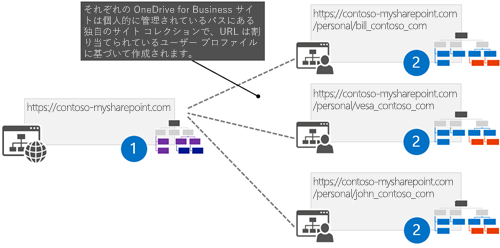
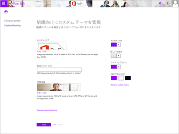
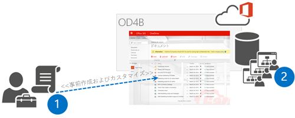
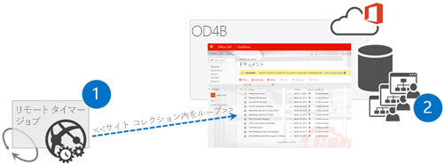

# OneDrive for Business サイトのカスタマイズ #

### 概要 ###
OneDrive for Business サイトは、会社の要件に基づいて、Office 365 または一般的なアプリ モデルを使用してカスタマイズできます。このカスタマイズを行う実際の方法は、アプリ モデルの方法のみを使用できることから、オンプレミスの方法とは異なります。ここでは、アプリ モデルと合わせて使うことができる、OneDrive for Business サイトをカスタマイズする実際のパターンの詳細を紹介します。 

# OneDrive for Business サイトをカスタマイズする理由 #

OneDrive for Business (OD4B) サイトにカスタマイズを適用することに関しては、多くのさまざまな側面があります。これらのサイトは SharePoint サイトなので、確かにカスタマイズできます。でも同時に、カスタマイズの短期的および長期的な影響を常に考慮する必要があります。OD4B サイトのカスタマイズについて、経験に基づく次のような大まかなガイドラインを示しましょう。 

- ブランド化カスタマイズは Office 365 のテーマまたは SharePoint サイトのテーマ エンジンを使用して適用する
- テーマ エンジンでは不十分な場合は、代替 CSS のオプションを使用して一部の CSS 設定を調整することができる
- カスタム マスター ページを使用して OD4B サイトをカスタマイズすることができますが、長期にわたる追加コストと将来の更新に関する課題が生じる可能性があります。
  + ほとんどの場合、テーマと代替 CSS を使用してすべての一般的なブランド化シナリオを実現できるため、これが制限要因になることはありません
  + カスタム マスター ページを使用する場合は、Office 365 に大きな機能更新が適用されたときにサイトに変更を適用する準備をすること
- JavaScript 埋め込みを使用して、サイトの機能を変更または非表示にできる
- CSOM を使用して、OD4B サイトの言語や地域などの設定をコントロールできる (新しい API を参照してください)
- 課題を避けるため、コンテンツ タイプとサイト列は OD4B サイトで使用しないほうがよい 
  + OD4B サイトは構造化されていない個人データやドキュメントと考えること。すると、チーム サイトとコラボレーションの位置付けが、会社のデータとドキュメントを対象としたものになり、あらゆる情報管理ポリシーとメタデータを確実に使用できるようになる。

要約すると、Office 365 ではカスタマイズが確実にサポートされるので、OD4B サイトで使い続けることができます。ただし、運用とメンテナンスの観点から、このようなカスタマイズが及ぼす短期的および長期的影響だけはかならず考慮してください。以上のことは実際、SharePoint に限ったことではなく、任意のプラットフォームで構築されるすべての IT ソリューションに当てはまる経験則です。 

上記のガイドラインを使用してカスタマイズした OD4B サイトの例を以下に示します。ここでは、最終的な結果を得るために、Office 365 のテーマ、サイトのテーマ、いわゆる JavaScript 埋め込みパターンの使用を組み合わせています。

# OneDrive for Business サイトのカスタマイズ適用に関する課題 #

ここでは、課題の内容と、解決のための取り組みを定義することから始めましょう。技術的には、各 OneDrive for Business サイトでは現在、SharePoint 2007 または 2010 バージョンの頃に個人用サイトが使用していたアーキテクチャと同じアーキテクチャを使用しています。つまり、技術的には各 OneDrive for Business サイトは、独自のサイト コレクションであり、ブランド化などのカスタマイズを適用する一元的な場所はありません。

必要な構成を OneDrive for Business サイト (個人サイトを含む) に適用する従来の解決策は、ファーム レベルの機能の関連付けに基づいていました。つまり、SharePoint ファームにファーム ソリューションを展開し、機能フレームワークを使用して、個人サイトが作成されるたびにアクティブにするカスタム機能を関連付けることで、必要なカスタマイズを適用していました。このようなアプローチは Office 365 では機能しません。ファーム ソリューションを展開する必要があるのに、Office 365 サイトではそれができないからです。そのため、サイトに必要な変更を適用するための別の方法を見つける必要があります。

Office 365 では、OD4B サイトが作成されるときにカスタム コードをアタッチできるような、一元的なイベントは発生しません。つまり、アプリ モデルのアプローチで非常によく用いられる、別の解決策を考える必要があります。古いモデルにこだわらず、新しい API とテクノロジを使って、同じ最終的な結果を達成する方法について考えましょう。ビジネス要件は機能の関連付けを使うことではないため、サポートされるなんらかの技術的メカニズムを使って必要なカスタマイズを適用することに関して、純粋な要件の観点から見ると、適用される限り、どんな方法でサイトにカスタマイズを適用するかはたいした問題ではありません。 

# カスタマイズを適用するためのさまざまなオプション #

実際、Office 365 で一元的なカスタマイズを OD4B サイトに適用するメカニズムは 4 つあります。5 番目として手動オプションを検討することもできますが、数百、数千の OD4B サイトがある場合は、手動オプションの使用は現実的ではありません。4 つのオプションを次に示します。
 
1. Office 365 スイート レベルの設定 (Office 365 のテーマとその他の設定)
2. ユーザー コンテキストが含まれる非表示のアプリ パーツ
3. 構成を事前に作成して適用する
4. ユーザー プロファイルの更新に基づくリモート タイマー ジョブ

それぞれのオプションには長所と短所があり、適切なオプションは詳細なビジネス要件によって異なります。一部の設定は、Office 365 スイート レベルから適用することもできますが、多くの場合、より具体的な設定が必要になります。そのため、実際にカスタマイズを行う必要があります。結局のところ、すべては正確な要件と、短期的および長期的な影響におけるビジネス ケース分析に帰着します。

## Office 365 スイート レベルの設定 ##

ご存知のとおり、Office 365 は SharePoint のみの場合よりはるかに優れています。Delve や Yammer など多くのサービスが発表され、SharePoint アーキテクチャにさえ基づいていないサービスがどんどん増えています。つまり、エンタープライズのブランド化と構成は SharePoint サイト環境のコントロールにとどまりません。それどころか、全体のエンド ユーザー エクスペリエンスと、さまざまなサービスに一貫性のある構成をどう提供するか、を考える必要があります。

このようなエンタープライズ要件の典型的な例がブランド化です。そのために、Office 365 のテーマが導入されました。テーマを使用して、ブランド化のかなりのレベルをコントロールできます。サイト コレクション設定外部の一元管理された場所から、サイト ガバナンスなどの設定をコントロールできるようにするその他の機能も導入が予定されています。たとえば、Office 365 のコンプライアンス センターがこれに該当し、現在 Office 365 のロードマップに示されています。

次の図は、今後すべての Office 365 サービスに適用される、Office 365 のテーマの現在の設定を示しています。

既定の Office 365 のテーマ設定は、OD4B サイト スイート バーを制御するためのものであるため、ほとんどの場合、少なくとも OD4B サイト全体で正しいブランド化要素を提供できるよう、このオプションをほかのオプションと組み合わせて使用することになります。Office 365 管理ツールで Office 365 のテーマ設定を変更すると、設定が OD4B サイトに適用されるまでに長い時間がかかります。しばらくお待ちください。 

## ユーザー コンテキストが含まれる非表示のアプリ パーツ ##

これは、必要なカスタマイズ プロセスを開始するための場所として、一元管理されたランディング ページを使うアプローチです。つまり、企業イントラネットのフロント ページのような、ユーザーがブラウザーを開いたときに常にランディングする一元管理された場所を用意する必要があります。これは、企業のランディング ページが AD のグループ ポリシー設定を使ってコントロールされる、中規模および大規模なエンタープライズでの一般的なプロセスです。そうすることで、エンド ユーザーが会社のドメインに参加するブラウザーの既定のウェルカム ページを上書きできなくします。

ユーザーがイントラネットにアクセスしたときに、ページに非表示のアプリ パーツを配置することで、カスタマイズ プロセスを開始します。通常はサイトの作成プロセスが開始される前にユーザーが 1 回 OD4B サイトにアクセスする必要があるため、実際には、OD4B サイト作成全体をカバーすることができます。非表示のアプリ パーツは実際には、Azure でホストされているプロバイダー ホスト型アドインをホストします。そのため、このページがカスタマイズ プロセスの開始を実行します。

では、このアプローチの論理設計について詳しく説明します。

1. 非表示のアプリ パーツを、エンドユーザーが到着する集中管理サイトに配置します。 通常これは、企業のイントラネットのフロント ページです。
2. アプリ パーツはプロバイダー ホスト型アドインからページをホストしています。プロバイダー ホスト型アドインでは、サーバー側コードで Azure のストレージ キューに必要なメタデータを追加することでカスタマイズ プロセスを開始します。つまり、このページはカスタマイズ要求を受信するだけで、実際には変更を一切適用しないことで、処理時間を通常に保ちます。
3. 実際の Azure のストレージ キューです。処理を求めるキュー宛てのメッセージを受信します。こうすることで、非同期的にプロセスをコントロールしながらカスタマイズを処理でき、エンド ユーザーがイントラネットのフロント ページに留まる時間が問題にならなようにします。カスタマイズ プロセスを同期すると、ページの実行が完了するまでブラウザーでイントラネットのフロント ページを開いた状態に保つためにエンドユーザーに依存することになります。それでは、最適なエンド ユーザー エクスペリエンスになるはずがありません。 
4. ストレージ キューに従うためにフックされた WebJob です。ストレージ キューに新しい項目が配置されるときに呼び出されます。この WebJob は、キューイングされたメッセージから必要なパラメーターとメタデータを受信して、適切なサイト コレクションにアクセスします。WebJob は、アプリ専用トークン使い、テナント レベルでサイト コレクションを操作するために必要なアクセス許可を与えられます。
5. 実際のカスタマイズは、プロセスを開始するイントラネットのフロント ページにアクセスした人のサイトに対して、個々に適用されます。

これは、間違いなく、OD4B サイトに適切な構成が存在することを保証する最も信頼性の高いプロセスです。また、プロセスにカスタマイズ バージョン管理ロジックを簡単に追加することもでき、そうすることで必要な更新がありユーザーが次回イントラネットのフロント ページにアクセスしたときに、OD4B サイトに必要な更新を適用されます。ただし、このオプションでは、エンド ユーザーがランディングする一元管理された場所が必要です。

従来のファーム ソリューションを使う SharePoint 開発モデルに慣れている場合は、これは、ワン タイム実行タイマー ジョブに非常に類似したプロセスです。

## 構成の事前作成および適用 ##

このオプションは、ユーザーがアクセスする前の OD4B サイトの事前作成に依存します。CSOM または REST を使って、バッチ プロセスで特定ユーザー向けの OD4B サイトを作成することができる、比較的新しい API を使用して実現できます。必要なコードを開始するには、PowerShell スクリプトを使用するか、リモート API を呼び出す実際のコードを記述します。 

1. 管理者は、リモート作成 API を使用してユーザーの OD4B サイトを作成し、スクリプト プロセスの一部として OD4B サイトに必要なカスタマイズを適用します。
2. 実際の OD4B サイトは、特定のユーザーの Office 365 に作成され、そのユーザー プロファイルに関連付けられます。

ある意味でこれも非常に信頼性の高いプロセスですが、新しい人や更新を「手動」で管理する必要があり、非表示のアプリ パーツによるアプローチよりも作業が増える可能性があります。これは、採用することができる確実に有効なアプローチです。特に、他のファイル共有ソリューションから OD4B に移行し、実際のサイト作成を開始する前にエンド ユーザーが 1 回 OD4B サイトにアクセスする必要がないようにする場合に役立ちます。

## ユーザー プロファイルの更新に基づくリモート タイマー ジョブ ##

この方法では、OD4B サイトの作成者を確認するためにユーザー プロファイルをスキャンした後、必要に応じて変更をサイトに適用します。つまり、SharePoint の外部で実行されるスケジュールされたジョブは、定期的に状態をチェック、必要なカスタマイズを実行します。スケジュールされたジョブは、Azure での WebJob として、または独自の Windows スケジューラーでスケジュールされた PowerShell スクリプトとしてシンプルに実行することができます。明らかに、展開の規模は選択したスケジュール設定オプションに大きな影響を与えます。

1. スケジュールされたタスクが開始され、OD4B サイトをプロビジョニングしたユーザーを確認するために、ユーザー プロファイルにアクセスします。2. 実際のサイトは、ビジネス要件に基づいて 1 つずつカスタマイズされます

このオプションの主な欠点の 1 つは、カスタマイズが適用される前にユーザーが OD4B サイトにアクセスできる状況が明らかに発生し得ることです。同時に、このオプションは他のオプションの面白いアドオンでもあります。エンドユーザーがサイトの必要な設定をなにも変更していないことを保証したり、OD4B サイトのコンテンツが会社のポリシーに沿っていることを確認したりするために使用できます。

----------

### 関連リンク ###
-  [アドイン モデルを使用して OneDrive for Business サイトをカスタマイズする (MSDN ブログ記事)](http://blogs.msdn.com/b/vesku/archive/2015/01/01/customizing-onedrive-for-business-sites-with-app-model.aspx)

### 関連する PnP サンプル ###
-  [非同期パターンを使用して OD4B サイトをカスタマイズする](#)
-  [OD4B サイトのカスタマイズ用の典型的なアプリ パーツと同期プロセス](https://github.com/OfficeDev/PnP/tree/master/Solutions/Provisioning.OneDrive)
-  [ユーザー用の OD4B サイトの事前作成](https://github.com/OfficeDev/PnP/tree/master/Samples/Provisioning.OneDriveProvisioning)

### 適用対象 ###
-  Office 365 マルチテナント (MT)
-  Office 365 専用 (D) - *一部*
-  SharePoint 2013 オンプレミス - *一部*

*専用およびオンプレミスの場合のパターンは、アドイン モデルの手法と同じですが、使用可能なテクノロジは異なる可能性があります。*

### 著者
Vesa Juvonen (マイクロソフト) - [@vesajuvonen](https://twitter.com/vesajuvonen)

### バージョン履歴 ###
バージョン  | 日付 | コメント
---------| -----| --------
1.0  | 2015 年 1 月 2 日 | 最初のリリース | Vesa Juvonen (マイクロソフト)
