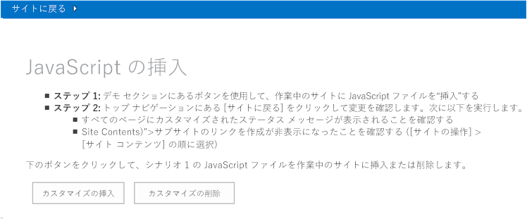
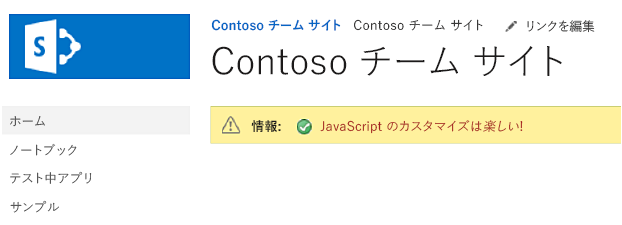

# JavaScript を使用して SharePoint サイト UI をカスタマイズする

JavaScript を使用して SharePoint サイトの UI を更新できます。
    
_**適用対象:** Office 365? | SharePoint 2013? | SharePoint Online_
    
[Core.EmbedJavaScript](https://github.com/OfficeDev/PnP/tree/master/Samples/Core.EmbedJavaScript) サンプル アドインは、JavaScript を使用して、ステータス バー メッセージを SharePoint サイト上のすべてのページに追加し、**[新しいサブサイト]** リンクを **[サイト コンテンツ]** ページから削除します。 
    
カスタム マスター ページを作成する方法ではなく、JavaScript を使用して SharePoint サイトに UI の更新を適用する (埋め込み JavaScript 手法とも呼ばれます) 場合は、このソリューションを使用します。 

## はじめに
<a name="sectionSection0"> </a>

まず、[Core.EmbedJavaScript](https://github.com/OfficeDev/PnP/tree/master/Samples/Core.EmbedJavaScript) サンプル アドインを、GitHub の [Office 365 Developer のパターンおよびプラクティス](https://github.com/OfficeDev/PnP/tree/dev) プロジェクトからダウンロードします。

## Core.EmbedJavaScript アプリの使用
<a name="sectionSection1"> </a>

このコード サンプルを実行すると、図 1 のように、プロバイダー向けのホスト型アドインが表示されます。 

**図 1. Core.EmbedJavaScript アドインの開始ページのスクリーン ショット**



**[カスタマイズの挿入]** を選択すると、以下のように SharePoint サイトがカスタマイズされます。

- 図 2 のように、SharePoint サイト内のすべてのページにステータス バー メッセージを作成します。
    
- 図 3 のように、**[新しいサブサイト]** リンクを **[サイト コンテンツ]** から削除します。

**図 2. すべてのページに追加されるステータス バーのスクリーン ショット**



**図 3. [サイト コンテンツ] ページから削除される [新しいサブサイト] リンクのスクリーン ショット**

![[サイト コンテンツ] の新しいサブサイト リンクが削除されます。](media/0631ce39-76e8-446a-b628-f41c2a066e4c.png)

図 1 で、**[カスタマイズの挿入]** を選択すると、default.aspx の **btnSubmit_Click** が呼び出されます。 
                **btnSubmit_Click** は、次の処理を実行する **AddJsLink** を呼び出します。

1. スクリプト ブロック定義を表す文字列を作成します。このスクリプト ブロック定義は、SharePoint サイト上のすべてのページに含まれる JavaScript ファイル (scenario1.js) を指します。 
    
2. [UserCustomActions](https://msdn.microsoft.com/library/office/microsoft.sharepoint.spweb.usercustomactions%28v=office.15%29.aspx) を使用して、SharePoint サイトで定義されているユーザー カスタム アクションをすべて取得します。 scenario1.js という名前の JavaScript ファイルへの既存の参照は削除されます。
    
3.  新しいカスタム アクションを作成し、手順 1 で作成したスクリプト ブロック定義をその新しいカスタム アクションに割り当てます。
    
4. Web サイトに新しいカスタム アクションを追加します。
    
SharePoint サイト上のすべてのページで scenario1.js が実行され、図 2 と図 3 に示されているカスタマイズ済みの UI が表示されるようになります。
    
**メモ**  この記事で提供されるコードは、明示または黙示のいかなる種類の保証なしに現状のまま提供されるものであり、特定目的への適合性、商品性、権利侵害の不存在についての暗黙的な保証は一切ありません。

```C#
 public void AddJsLink(ClientContext ctx, Web web)
        {
            string scenarioUrl = String.Format("{0}://{1}:{2}/Scripts", this.Request.Url.Scheme, 
                                                this.Request.Url.DnsSafeHost, this.Request.Url.Port);
            string revision = Guid.NewGuid().ToString().Replace("-", "");
            string jsLink = string.Format("{0}/{1}?rev={2}", scenarioUrl, "scenario1.js", revision);

            StringBuilder scripts = new StringBuilder(@"
                var headID = document.getElementsByTagName('head')[0]; 
                var");

            scripts.AppendFormat(@"
                newScript = document.createElement('script');
                newScript.type = 'text/javascript';
                newScript.src = '{0}';
                headID.appendChild(newScript);", jsLink);
            string scriptBlock = scripts.ToString();

            var existingActions = web.UserCustomActions;
            ctx.Load(existingActions);
            ctx.ExecuteQuery();
            var actions = existingActions.ToArray();
            foreach (var action in actions)
            {
                if (action.Description == "scenario1" &amp;&amp;
                    action.Location == "ScriptLink")
                {
                    action.DeleteObject();
                    ctx.ExecuteQuery();
                }
            }

            var newAction = existingActions.Add();
            newAction.Description = "scenario1";
            newAction.Location = "ScriptLink";

            newAction.ScriptBlock = scriptBlock;
            newAction.Update();
            ctx.Load(web, s => s.UserCustomActions);
            ctx.ExecuteQuery();
        }
```

SharePoint はダウンロード最小化戦略 (MDS) を使って、ユーザーが SharePoint サイト上のページ間をナビゲートする際にブラウザーでダウンロードされるデータの量を減らします。 詳細については、「[ダウンロード最小化戦略の概要](https://msdn.microsoft.com/library/office/dn456544%28v=office.15%29.aspx)」を参照してください。 scenario1.js では、次に示すコードによって、SharePoint サイトでダウンロード最小化戦略が使用されているかどうかにかかわらず、常に **RemoteManager_Inject** が実行されるようにしています。

```
// Is MDS enabled?
if ("undefined" != typeof g_MinimalDownload &amp;&amp; g_MinimalDownload &amp;&amp; (window.location.pathname.toLowerCase()).endsWith("/_layouts/15/start.aspx") &amp;&amp; "undefined" != typeof asyncDeltaManager) {
    // Register script for MDS if possible
    RegisterModuleInit("scenario1.js", RemoteManager_Inject); //MDS registration
    RemoteManager_Inject(); //non MDS run
} else {
    RemoteManager_Inject();
}
```


            **RemoteManager_Inject** は、SharePoint サイト上で以下のタスクを実行します。

- ホスト Web 上でステータス バーを作成します。  
                **RemoteManager_Inject** では、[SP.SOD.executeOrDelayUntilScriptLoaded](https://msdn.microsoft.com/library/office/ff411788%28v=office.14%29.aspx) を使用して、まず、sp.js を読み込んでから、サイトにステータス バーを追加する**SetStatusBar** を呼び出すようにしています。 JavaScript ファイルは非同期的に読み込まれるため、**SP.SOD.executeOrDelayUntilScriptLoaded** を使用することで、JavaScript ファイル (sp.js) を読み込んでから、その JavaScript ファイル内で定義されている関数がコードから呼び出されるようにします。
    
- **[サイト コンテンツ]** ページの **[新しいサブサイト]** リンクを非表示にします。

```
function RemoteManager_Inject() {

    loadScript(jQuery, function () {
        $(document).ready(function () {
            var message = " <font color='#AA0000'>JavaScript customization is <i>fun</i>!</font>"

            // Execute status setter only after SP.JS has been loaded
            SP.SOD.executeOrDelayUntilScriptLoaded(function () { SetStatusBar(message); }, 'sp.js');

            // Customize the viewlsts.aspx page
            if (IsOnPage("viewlsts.aspx")) {
                //hide the subsites link on the viewlsts.aspx page
                $("#createnewsite").parent().hide();
            }
        });
    });
}

function SetStatusBar(message) {
    var strStatusID = SP.UI.Status.addStatus("Information : ", message, true);
    SP.UI.Status.setStatusPriColor(strStatusID, "yellow");
}

function IsOnPage(pageName) {
    if (window.location.href.toLowerCase().indexOf(pageName.toLowerCase()) > -1) {
        return true;
    } else {
        return false;
    }
}

```

## その他のリソース
<a name="bk_addresources"> </a>

-  [Office 365 開発パターンとプラクティス (ソリューション ガイダンス)](Office-365-development-patterns-and-practices-solution-guidance.md)
    
-  [Core.JavaScriptCustomization](https://github.com/OfficeDev/PnP/tree/master/Samples/Core.JavaScriptCustomization)
    
-  [方法:クライアント側レンダリングを使用して SharePoint アドインのリスト ビューをカスタマイズする](https://msdn.microsoft.com/library/8d5cabb2-70d0-46a0-bfe0-9e21f8d67d86.aspx)
