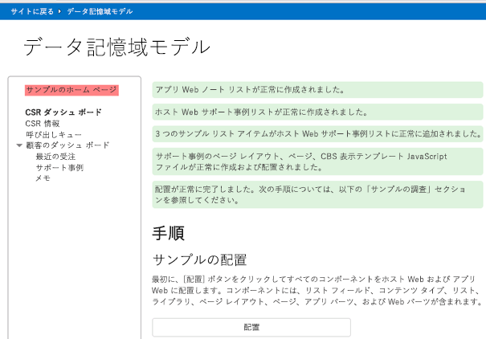
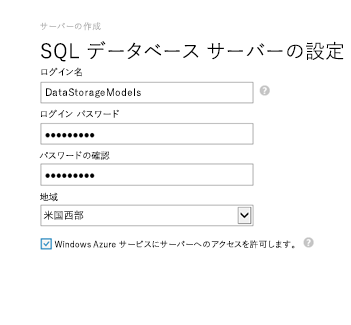
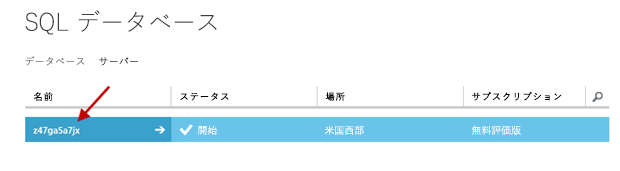
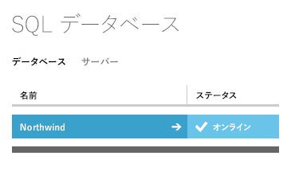
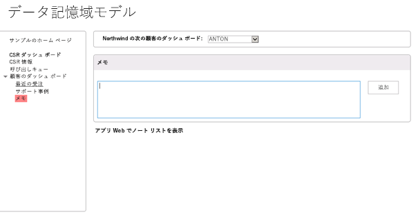
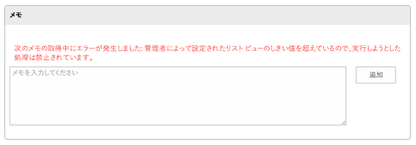
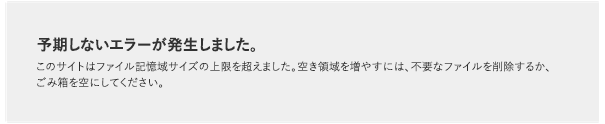
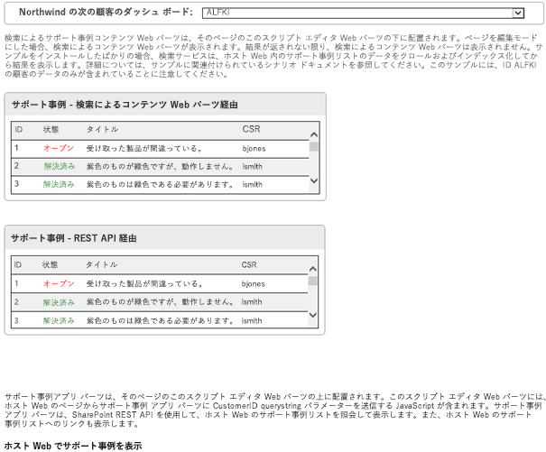
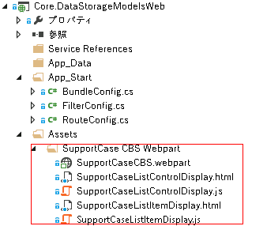

# SharePoint Online でのデータ ストレージ オプション

SharePoint Online アドインの開発では、さまざまなデータ ストレージに関するオプションがあります。この記事で説明するサンプルを使用すると、各オプションの違いを確認できるだけでなく、リモートのデータ ストレージを使用する利点について学ぶことができます。 

_**適用対象:** Office 365 | SharePoint 2013 | SharePoint Online_

この記事では、[Core.DataStorageModels](https://github.com/OfficeDev/PnP/tree/master/Samples/Core.DataStorageModels) サンプル アプリについて説明します。これは、以下のデータ ストレージ オプションと、それぞれの長所と短所を示すものです。

- ホスト Web の SharePoint リスト
    
- アプリ Web の SharePoint リスト
    
- SQL Azure データベース
    
- Azure のキュー ストレージ
    
- Azure のテーブル ストレージ
    
- 外部  Web サービス
    
[Core.DataStorageModels](https://github.com/OfficeDev/PnP/tree/master/Samples/Core.DataStorageModels) サンプル アプリは、C#  と JavaScript で記述されたプロバイダー ホスト型アプリで、ホスト Web とアプリ Web の両方に多くの SharePoint アーティファクト (リスト、アプリ パーツ、Web パーツ) を展開します。アプリ Web とホスト Web の SharePoint リストと対話し、SQL Azure データベース、Azure のキューおよびテーブル ストレージ、OData を実装しているリモートの Web サービスの呼び出しも行います。このサンプルでは、モデル ビュー コントローラー (MVC) パターンを使用します。[Core.DataStorageModels](https://github.com/OfficeDev/PnP/tree/master/Samples/Core.DataStorageModels) サンプル アプリは、次の表に示すように、各データ ストレージ オプションが最も適した特定の機能に対象のオプションを適用します。

|サンプル アプリのストレージのオプション|使用先|
|:--|:--|
|アプリ Web の SharePoint リスト|お客様の注意事項|
|ホスト Web の SharePoint リスト|サポート事例|
|Northwind OData サービス|お客様|
|Azure のテーブル ストレージ|CSR 評価|
|Azure のキュー ストレージ|コール キュー|
|SQL Azure の Northwind データベース|注文、受注明細、製品|

このアプリは、顧客サービス ダッシュ ボードと関連インターフェイスを実装します。インターフェイスでは、最近の注文、顧客担当者アンケート評価、お客様の注意事項、サポート事例、および顧客担当者のコール キューを表示します。最初の 2 つのシナリオでは、比較的単純なクライアント オブジェクト モデル コードまたは REST クエリを使用してデータを取得できますが、リスト クエリのしきい値によって制限されます。次の 4 つのシナリオでは、さまざまな種類のリモート ストレージを使用します。 

**図 1. SharePoint コンポーネントを展開するよう促すデータ ストレージ モデルの開始ページ**



## はじめに
<a name="sectionSection0"> </a>

このサンプルを使用する前に、次に示すものが準備されていることを確認してください。

- SQL Azure データベースを展開し Azure Storage のアカウントを作成できる Microsoft Azure アカウント 
    
- Visual Studio 2013 からサンプルを展開できる SharePoint 開発者サイト
    
さらに、Northwind データベースを Microsoft Azure に展開する必要があります。

### Northwind データベースを展開するには

1. Azure 管理ポータルにログオンし、**[SQL データベース]** >  **[サーバー]** の順にクリックします。
    
2. **[SQL データベース サーバーを作成する]** をクリックします。
    
3. 図 2 に示すとおり、**[サーバーの作成]** フォームで、**[ログイン名]**、**[ログイン パスワード]**、および **[リージョン]** の値を入力します。
    
    **図 2. SQL データベース サーバー設定**

    

4. チェックマークのボタンをクリックして終了し、サーバーを作成します。
    
5. これでデータベースが作成されたので、図 3 に示すとおり、作成したサーバーの名前をクリックします。
    
    **図 3. サーバー ページのサーバー名**

    

6. **[構成]** をクリックしてから、右下隅にある矢印をクリックして構成を完了し、**[保存]** をクリックします。
    
7. ローカルの開発用コンピューターで SQL Server Management Studio を開き、「**NorthWind**」という名前の新しいデータベースを作成します。
    
8. **オブジェクト エクスプローラー**で、**Northwind** データベースをクリックしてから、**[新しいクエリ]** をクリックします。
    
9. お好みのテキスト エディターで、[Core.DataStorageModels](https://github.com/OfficeDev/PnP/tree/master/Samples/Core.DataStorageModels) サンプルに付属の northwind.sql SQL スクリプトを開きます。
    
10. northwind.sql ファイルにあるテキストをコピーし、SQL Server Management Studio の **[SQL クエリ]** ウィンドウにペーストします。続いて、**[実行]** をクリックします。
    
11. **オブジェクト エクスプローラー**で、**Northwind** データベースのショートカット メニューを開き (右クリック)、**[タスク]** を選択してから、**[SQL Azure へのデータベースの配置]** を選択します。
    
12. **[概要]** の画面で、**[次へ]** をクリックします。
    
13. **[接続...]** をクリックしてから、先ほど作成した SQL Azure データベース サーバーの**サーバー名**を入力します。
    
14. **[認証]** ボックスで、**[SQL Server 認証]** を選択します。
    
15. SQL Azure データベース サーバーの作成時に使用したユーザー名とパスワードを入力してから、**[接続]** をクリックします。
    
16. **[次へ]**、**[終了]** の順にクリックし、データベースが作成されるまで待ちます。データベースが作成されたら、**[閉じる]** をクリックしてウィザードを閉じます。
    
17. Azure の管理ポータル ([https://manage.windowsazure.com/](https://manage.windowsazure.com/)) に戻り、Northwind データベースが正常に作成されたことを確認します。図 4 に示すとおり、SQL データベースの画面に一覧表示されていることが分かります。
    
    **図 4. SQL Server データベースのリスト**

    

18. Northwind データベースをクリックしてから、**[SQL データベースの接続文字列を表示する]** をクリックします。
    
19. 接続文字列をコピーしてテキスト ファイルに貼り付け、ローカルに保存します。この接続文字列は、後で必要になります。**[接続文字列]** ダイアログ ボックスを閉じます。
    
20. **[この IP アドレスに Microsoft Azure のファイアウォール規則を設定する]** というリンクをクリックし、ファイアウォール規則に IP アドレスを追加し、データベースにアクセスできるようにします。
    
21. Visual Studio 2013 で Core.DataStorageModels.sln プロジェクトを開きます。
    
22. Visual Studio の**ソリューション エクスプローラー**で Web.config ファイルを検索します。
    
23. Web.config ファイルで、add `name="NorthWindEntities"` 要素を探し、既存の connectionString の値を、手順 19 でローカルに保存した接続文字列情報に置き換えます。 
    
    ```XML
      <add name="NorthWindEntities" connectionString="metadata=res://*/Northwind.csdl|res://*/Northwind.ssdl|res://*/Northwind.msl;provider=System.Data.SqlClient;provider connection string=&amp;quot;data source=<Your Server Here>.database.windows.net;initial catalog=NorthWind;user id=<Your Username Here>@<Your Server Here>;password=<Your Password Here>;MultipleActiveResultSets=True;App=EntityFramework&amp;quot;" providerName="System.Data.EntityClient" />
    ```
24. Web.config ファイルを保存します。

## アプリ Web の SharePoint リスト (メモのシナリオ)
<a name="sectionSection1"> </a>

アプリ Web の SharePoint リストを使用するメモ リストのシナリオでは、リストが SharePoint アプリ Web でどのように実行されるかを示します。メモ リストはアプリ Web 内に作成され、タイトルと説明のフィールドを持ちます。SharePoint REST API は、メモ リストをクエリし、顧客 ID に基づいてすべてのメモを返します。

アプリ Web でのリストの使用には、他のストレージ ソリューションに勝る 1 つの大きな利点があります。すなわち、簡単な SharePoint REST API を使用してデータをクエリできるということです。ただし、以下に挙げる短所もあります。

- リストのメタデータを更新するには、更新してからアプリを再展開する必要がある。
    
- データ構造を更新するには、データの保存と更新用のアプリケーション ロジックを書き直す必要がある。
    
- リストに格納された情報は、その他のアドインと簡単に共有できない。
    
- SharePoint でデータを検索できない。
    
- リスト内に格納できるデータの量とクエリの結果セットのサイズに制限がある。
    
顧客のダッシュ ボードのメモ セクションの基となるコードは、REST クエリを使用して、アプリ Web に展開されているリストからデータを取得します。このリストには、タイトル、作成者、顧客 ID、および説明の各フィールドがあります。図  5 に示すとおり、アプリのインターフェイスを使用して、指定した顧客のメモを追加および取得できます。

**図 5. メモ アプリのユーザー インターフェイス**



**[アプリ Web に メモ リストを表示する]** リンクでは、リストのデータの「そのまま使える」ビューが表示されます。

このアプリは、モデル ビュー コントローラー (MVC) パターンを使用しています。メモのシナリオのコードは、Views/CustomerDashboard/Notes.cshtml ファイルで確認できます。このコードでは、簡単な REST の呼び出しを使用してデータを追加および取得します。次のコードは、指定された顧客のメモをメモ リストから取得します。

```C#
function getNotesAndShow() {
    var executor = new SP.RequestExecutor(appWebUrl);
    executor.executeAsync(
       {
           url: appWebUrl + "/_api/web/lists/getByTitle('Notes')/items/" +
                "?$select=FTCAM_Description,Modified,Title,Author/ID,Author/Title" +
                "&amp;$expand=Author/ID,Author/Title" +
                "&amp;$filter=(Title eq '" + customerID + "')",
           type: "GET",
           dataType: 'json',
           headers: { "accept": "application/json;odata=verbose" },
           success: function (data) {
               var value = JSON.parse(data.body);
               showNotes(value.d.results);
           },
           error: function (error) { console.log(JSON.stringify(error)) }
       }

    );
}
```

次のコードは、所定の顧客のメモをメモ リストに追加します。

```C#
function addNoteToList(note, customerID) {
    var executor = new SP.RequestExecutor(appWebUrl);
    var bodyProps = {
        '__metadata': { 'type': 'SP.Data.NotesListItem' },
        'Title': customerID,
        'FTCAM_Description': note
    };
    executor.executeAsync({
        url: appWebUrl + "/_api/SP.AppContextSite(@target)/web/lists/getbytitle('Notes')/items?@target='" + appWebUrl + "'",
        contentType: "application/json;odata=verbose",
        method: "POST",
        headers: {
            "accept": "application/json;odata=verbose",
            "content-type": "application/json;odata=verbose",
            "X-RequestDigest": $("#__REQUESTDIGEST").val()
        },
        body: JSON.stringify(bodyProps),
        success: getNotesAndShow,
        error: addNoteFailed
    });
}
```

リストには 5000 アイテムを追加できます。これは、リストのクエリで 5000 以上のアイテムから成る結果セットが生成されると、リストのクエリのしきい値に達して失敗することを示すためです。また、アプリ Web のリストには、サイト コレクションのストレージ制限 (割り当てられたストレージの容量に依存します) を超えるほどの多量のデータを追加することもできます。これらのシナリオは、リストのクエリのサイズ制限とストレージの容量の制限という 2 つの最も重要な制限を示しています。大きなデータ セットとクエリ結果のセットを処理する必要があるビジネス ニーズに、このアプローチは適しません。

### リスト クエリのしきい値
<a name="bk_listquerythreshold"> </a>

リスト クエリのしきい値の制限を超えるデータを読み込むには: 


1. 左側のメニューで、**[サンプルのホーム ページ]** をクリックします。
    
2. **[リストのクエリのしきい値]** セクションで、**[アプリ Web の メモ リストにリスト項目を追加する]** をクリックします。
    
3. ボタンの上に表示される指示に従って、この操作を 10 回実行します。
    
    メモ リストを更新すると、追加したリスト アイテム (メモ) の数とまだ追加されていないリスト アイテムの数を示すメッセージがページの上部に表示されます。
    
    
                **メモ** この操作の実行は、ボタンを選択するたびに約 1 分かかります。 この操作を 10 回実行した場合の最終結果は、図 6 に示されています。
4. リストに 5,001 個のアイテムを追加した後、左側のメニューで [メモ] をクリックします。ページが読み込まれると、図 6 に示すエラー メッセージが表示されます。これは SharePoint の REST API から出されたものです。
    
    **図 6. リスト クエリのしきい値を超えた場合のエラー メッセージ**

    

5. **[アプリ Web にノートのリストを表示する]** をクリックし、リストをページごとに表示していくと、リストが 500 行あることが分かります。SharePoint リストのビューはこの数のエンティティの表示に対応できますが、REST API はリストのクエリの調整のしきい値があるため失敗します。
    
### データ ストレージの制限
<a name="bk_listquerythreshold"> </a>

データ ストレージの制限を超えるデータを読み込むには: 

1. 左側のメニューで、**[サンプルのホーム ページ]** をクリックします。
    
2. [データのしきい値] セクションで、**[1GB のデータがあるアプリ Web のメモ リストに記入する]** をクリックします。
    
3. **[1GB のデータがあるアプリ Web のメモ リストに記入する]** ボタンの上に表示される指示に従って、この操作を 11 回実行します。
    
    メモ リストを更新すると、追加したリスト アイテム (メモ) の数とまだ追加されていないリスト アイテムの数を示すメッセージがページの上部に表示されます。
    
    
                **メモ** この操作の実行は、ボタンを選択するたびに約 1 分かかります。 この操作を 11 回実行した場合の最終結果は、図 7 に示されています。
4. 図 7 に示すとおり、操作を 11 回実行すると、ボタンをクリックしたときにエラー メッセージが表示されます。
    
    **図 7. データ記憶域のしきい値を超えた場合のエラー メッセージ**

    

5. データ ストレージの制限を超えたら、Web ブラウザーの [戻る] ボタンをクリックしてから、左側のメニューにある **[メモ]** のリンクをクリックします。
    
6. **[アプリ Web にメモ リストを表示する]** をクリックします。
    
    ページが読み込まれると、サイトの記憶領域が不足していることを示すエラー メッセージがページの上部に表示されます。

## ホスト Web の SharePoint リスト (サポート事例のシナリオ)
<a name="sectionSection2"> </a>

サポート事例のシナリオでは、ホスト Web の SharePoint リストに格納されたデータが表示されます。このシナリオでは、データにアクセスして操作するために 2 つの異なるパターンを使います。最初のパターンには、SharePoint 検索サービス、およびカスタムの表示テンプレートが適用された「検索によるコンテンツ」 Web パーツが含まれています。2 つ目のパターンには、MVC ビューを表示するアプリ パーツ (クライアント Web パーツ) が含まれています。MVC ビューでは、SharePoint REST API を呼び出す **SP.RequestExecutor** クラスを使用します。

このアプローチの使用には、次のようないくつかの長所があります。

- 簡単な REST クエリまたはクライアント オブジェクト モデル コードを使用して簡単にデータをクエリできる。
    
- SharePoint でデータを検索できる。
    
- アプリの更新および再展開を行わずに、リストのメタデータの更新と、リストのビューの新規作成が行える。これらの変更がアプリの動作に影響を与えることはない。
    
- アプリが **AppUninstalled** イベントを使用してリストの削除またはデータの削除を実行しない限り、アプリをアンインストールしてもホスト Web のリストは削除されない。
    
これらの長所の見返りとして、以下の短所があります。

- ホスト Web では、リストに格納できるデータの量と、クエリ結果のサイズの両方に制限がある。大きなデータ セットの格納またはクエリを必要としているビジネス ニーズに、このアプローチはお勧めできません。
    
- 複雑なクエリの場合、リストの動作はデータベースに劣る。
    
- データのバックアップと復元に関し、リストの動作はデータベースに劣る。
    
このシナリオのデータは、ホスト Web に展開された SharePoint リストに格納されます。データは以下によって取得され、表示されます。 

- [コンテンツ検索 Web パーツ](https://msdn.microsoft.com/en-us/library/office/jj163789%28v=office.15%29.aspx)
    
- モデル ビュー コントローラーのビューとして実装されるアプリ パーツ 
    
このビューのコードでは、REST クエリを使用してリストから情報を取得します。一方、コンテンツ検索 Web パーツは、SharePoint 検索サービスを使用してデータを取得します。2 つのアプローチは、ホスト Web のリストから情報を取得するために検索サービスと REST/CSOM API の両方を使用できるという、このオプションの大きな長所を実証します。

[サポート事例] ドロップダウンから顧客を選択すると、Web パーツとアプリ パーツの両方に対象の顧客のサポート事例データが表示されることが分かります (図 8)。SharePoint 検索サービスがデータのインデックスを作成するまで最大 24 時間かかるため、Web パーツはすぐにコンテンツを返せない場合があります。**[ホスト Web にサポート事例リストを表示する]** のリンクをクリックして、リスト データの従来のビューを表示することもできます。

**図 8. サポート事例のシナリオのユーザー インターフェイス**



このアプリによって展開されるコンテンツ検索 Web パーツは、カスタム表示テンプレートを使用します。図 9 は、Web プロジェクトの **Assets** ディレクトリのどこに Web パーツと関連するテンプレートがあるかを示しています。

**図 9. Web プロジェクトの Assets ディレクトリの内容**



Views/SupportCaseAppPart\Index.cshtml ファイルにある次の JavaScript コードでは、クロスドメイン ライブラリを使用して、ホスト Web 上の JavaScript リストに対する REST クエリを呼び出します。 

```C#
function execCrossDomainRequest() {
var executor = new SP.RequestExecutor(appWebUrl);

executor.executeAsync(
   {
        url: appWebUrl + "/_api/SP.AppContextSite(@@target)" +
                "/web/lists/getbytitle('Support Cases')/items" +
              "?$filter=(FTCAM_CustomerID eq '" + customerID + "')" +
            "&amp;$top=30" +
                    "&amp;$select=Id,Title,FTCAM_Status,FTCAM_CSR" +
                    "&amp;@@target='" + hostWebUrl + "'",
method: "GET",
              headers: { "Accept": "application/json; odata=verbose" },
              success: successHandler,
              error: errorHandler
   }
);
}
```

リストには 5000 アイテムを追加できます。これは、リストのクエリにより、5000 以上のアイテムから成る結果セットが生成されると、リストのクエリのしきい値に達して失敗することを示すためです。このシナリオは、このアプローチの重要な制限の 1 つを示しています。すなわちリストのクエリのサイズ制限です。大きなデータ セットとクエリ結果のセットの操作を必要とするビジネス ニーズに、このアプローチは適しません。詳細については、この記事で前述した「[リストのクエリのしきい値](#bk_listquerythreshold)」を参照してください。

## Northwind OData Web サービス (顧客のダッシュボードのシナリオ)
<a name="sectionSection3"> </a>

顧客のダッシュボードのシナリオでは、JQuery AJAX を使用して NorthWind OData サービスを呼び出し、顧客情報を返します。このアプリは、データを Web サービスに格納し、次いで [OData](http://www.odata.org/) を使用してデータを取得します。

このアプローチを使用する長所は次のとおりです。

- 1 つの Web サービスで複数のアドインをサポートできる。
    
- アプリの更新と再展開を行わずに Web サービスを更新できる。
    
- SharePoint と Web サービスのインストールが相互に影響しない。
    
- Microsoft Azure などのホスティング サービスにより、Web サービスを拡大/縮小できる。
    
- SharePoint サイトとは別に Web サービスの情報をバックアップおよび復元できる。
    
- アプリが **AppUninstalled** イベントを使用してデータを削除しない限り、アプリをアンインストールしてもデータは失われない。
    
顧客のダッシュボードのシナリオでは、データを取得する OData 標準を実行する Web サービスにデータを格納します。顧客のダッシュボードのインターフェイスで、ドロップダウン メニューから顧客を選択すると、顧客情報が **[顧客情報]** ウィンドウに表示されます。

この UI ページは、モデル ビュー コントローラーのビューです。表示内容は Views/CustomerDashboard\Home.cshtml ファイルで定義します。基になるコードは Scripts/CustomerDashboard.js ファイルにあります。SharePoint コードでは、AJAX を使用して Northwind Web サービスをクエリします。このサービスは OData サービスであるため、Web サービスのクエリは、Web サービスのエンドポイントをポイントする URL に付加されるクエリ文字列引数で構成されます。サービスは、顧客情報をJSON 形式で返します。

次のコードは、**[顧客のダッシュボード]** のリンクをクリックしたときに実行されます。このコードは、ドロップダウン メニューの内容を表示するために、顧客の名前と ID をすべて取得します。

```C#
var getCustomerIDsUrl = "https://odatasampleservices.azurewebsites.net/V3/Northwind/Northwind.svc/Customers?$format=json&amp;$select=CustomerID";
    $.get(getCustomerIDsUrl).done(getCustomerIDsDone)
        .error(function (jqXHR, textStatus, errorThrown) {
            $('#topErrorMessage').text('Can\'t get customers. An error occurred: ' + jqXHR.statusText);
        });
```

次のコードは、ドロップダウン メニューから顧客名を選択したときに実行されます。このコードは、OData の **$filter** 引数によって顧客 ID およびその他のクエリ文字列引数を指定して、対象の顧客に関する情報を取得します。

```C#
var url = "https://odatasampleservices.azurewebsites.net/V3/Northwind/Northwind.svc/Customers?$format=json" +  "&amp;$select=CustomerID,CompanyName,ContactName,ContactTitle,Address,City,Country,Phone,Fax" + "&amp;$filter=CustomerID eq '" + customerID + "'";

$.get(url).done(getCustomersDone)
   .error(function (jqXHR, textStatus, errorThrown) {
          alert('Can\'t get customer ' + customerID + '. An error occurred: ' + 
                 jqXHR.statusText);
});
```

## Azure のテーブル ストレージ (顧客サービス アンケートのシナリオ)
<a name="sectionSection4"> </a>

顧客サービス アンケートのシナリオでは、顧客サービス担当者は、顧客アンケートに基づく自分の評価を表示したり、Azure のテーブル ストレージと Microsoft.WindowsAzure.Storage.Table.CloudTable API を使用してデータを格納および操作したりします。

このアプローチを使用する長所は次のとおりです。

- Azure のストレージ テーブルは、複数のアプリをサポートする。
    
- アプリの更新と再展開を行わずにAzure のストレージ テーブルを更新できる。
    
- SharePoint のインストールと Azure のストレージ テーブルが相互のパフォーマンスに影響を与えることはない。
    
- Azure のストレージ テーブルは、簡単に拡大/縮小できる。
    
- Azure のストレージ テーブルは、SharePoint サイトから個別にバックアップおよび復元できる。
    
- アプリが **AppUninstalled** イベントを使用してデータを削除しない限り、アプリをアンインストールしてもデータは失われない。
    
アプリのインターフェイスには、現在のユーザーのアンケート評価が中央のページに表示されます。対象の Azure のストレージ テーブルが空の場合、アプリはテーブルを表示する前に、テーブルに情報を追加します。

次の CSRInfoController.cs のコードは、ユーザーの **nameId** を取得する **Home** メソッドを定義します。

```C#
[SharePointContextFilter]
public ActionResult Home()
{
    var context = 
        SharePointContextProvider.Current.GetSharePointContext(HttpContext);
    var sharePointService = new SharePointService(context);
    var currentUser = sharePointService.GetCurrentUser();
    ViewBag.UserName = currentUser.Title;

    var surveyRatingsService = new SurveyRatingsService();
    ViewBag.Score = surveyRatingsService.GetUserScore(currentUser.UserId.NameId);

    return View();
}
```

次の SurveyRatingService.cs ファイルのコードは、Azure Storage のアカウントへの接続を設定する **SurveyRatingsService** コンストラクターを定義します。

```C#
public SurveyRatingsService(string storageConnectionStringConfigName = 
        "StorageConnectionString")
{
    var connectionString = Util.GetConfigSetting("StorageConnectionString");
    var storageAccount = CloudStorageAccount.Parse(connectionString);

    this.tableClient = storageAccount.CreateCloudTableClient();
    this.surveyRatingsTable = this.tableClient.GetTableReference("SurveyRatings");
    this.surveyRatingsTable.CreateIfNotExists();
}
```

同じファイルの次のコードは、Azure のストレージ テーブルからユーザーのアンケート スコアを取得する **GetUserScore** メソッドを定義します。

```C#
public float GetUserScore(string userName)
{
    var query = new TableQuery<Models.Customer>()
    .Select(new List<string> { "Score" })
    .Where(TableQuery.GenerateFilterCondition("Name", 
    QueryComparisons.Equal, userName));

    var items = surveyRatingsTable
         .ExecuteQuery(query)
             .ToArray();

    if (items.Length == 0)           
    return AddSurveyRatings(userName);

    return (float)items.Average(c => c.Score);
}
```

テーブルに現在のユーザーに関するアンケート データが含まれていない場合、**AddSurveyRating** メソッドはユーザーに対してランダムにスコアを割り当てます。

```C#
private float AddSurveyRatings(string userName)
{
    float sum = 0;
    int count = 4;
    var random = new Random();

    for (int i = 0; i < count; i++)
    {
    var score = random.Next(80, 100);
    var customer = new Models.Customer(Guid.NewGuid(), userName, score);

    var insertOperation = TableOperation.Insert(customer);
    surveyRatingsTable.Execute(insertOperation);

    sum += score;
    }
    return sum / count;
}
```

## Azure のキュー ストレージ (顧客コール キューのシナリオ)
<a name="sectionSection5"> </a>

顧客コール キューのシナリオでは、サポート キュー内の発信元を一覧表示して、電話に出る動作をシミュレートします。シナリオでは、Azure のストレージ キューを使用してデータを格納すると共に、モデル ビュー コントローラーの **Microsoft.WindowsAzure.Storage.Queue.CloudQueue** API を使用します。

このアプローチを使用する長所は次のとおりです。

- Azure のストレージ キューは、複数のアプリをサポートする。
    
- アプリの更新と再展開を行わずにAzure のストレージ キューを更新できる。
    
- SharePoint のインストールと Azure のストレージ キューが相互のパフォーマンスに影響を与えることはない。
    
- Azure のストレージ キューは、簡単に拡大/縮小できる。
    
- Azure のストレージ キューは、SharePoint サイトから個別にバックアップおよび復元できる。
    
- アプリが **AppUninstalled** イベントを使用してデータを削除しない限り、アプリをアンインストールしてもデータは失われない。
    
アプリのインターフェイスで **[呼び出しのキュー]** リンクをクリックすると、サポート コール キューが中央のウィンドウに表示されます。**[呼び出しをシミュレートする]** をクリックすると、電話がかかってきた状態 (コールのキューへの追加) をシミュレートできます。また、特定のコールに関連付けられている **[呼び出しを取る]** アクションをクリックすると、最も古いコールに出る動作 (コールをキューから除去) をシミュレートできます。

このページは、Views\CallQueue\Home.cshmtl ファイルで定義されるモデル ビュー コントローラーのビューです。Controllers\CallQueueController.cs ファイルでは、**CallQueueController** クラスが定義されます。このクラスには、キュー内のすべてのコールの取得、キューへのコールの追加 (電話のシミュレート)、およびキューからのコールの削除 (電話に出る) の各メソッドが含まれます。これらの各メソッドは、Services\CallQueueService.cs ファイルに定義されるメソッドを呼び出します。このファイルは、Azure のストレージ キュー API を使用してストレージ キュー内の基になる情報を取得します。

```C#
public class CallQueueController : Controller
{
    public CallQueueService CallQueueService { get; private set; }

    public CallQueueController()
    {
        CallQueueService = new CallQueueService();
    }

    // GET: CallQueue
    public ActionResult Home(UInt16 displayCount = 10)
    {
        var calls = CallQueueService.PeekCalls(displayCount);
        ViewBag.DisplayCount = displayCount;
        ViewBag.TotalCallCount = CallQueueService.GetCallCount();
        return View(calls);
    }

    [HttpPost]
    public ActionResult SimulateCalls(string spHostUrl)
    {
        int count = CallQueueService.SimulateCalls();
        TempData["Message"] = string.Format("Successfully simulated {0} calls and added them to the call queue.", count);
        return RedirectToAction("Index", new { SPHostUrl = spHostUrl });
    }

    [HttpPost]
    public ActionResult TakeCall(string spHostUrl)
    {
        CallQueueService.DequeueCall();
        TempData["Message"] = "Call taken successfully and removed from the call queue!";
        return RedirectToAction("Index", new { SPHostUrl = spHostUrl });
    }
}
```

CallQueueService.cs ファイルでは、Azure のストレージ キューへの接続を確立する **CallQueueService** クラスを定義します。このクラスには、キューでコールを追加、削除 (デキュー)、取得するメソッドも含まれています。

```C#
public class CallQueueService
{
    private CloudQueueClient queueClient;

    private CloudQueue queue;

    public CallQueueService(string storageConnectionStringConfigName = "StorageConnectionString")
    {
        var connectionString = CloudConfigurationManager.GetSetting(storageConnectionStringConfigName);
        var storageAccount = CloudStorageAccount.Parse(connectionString);

        this.queueClient = storageAccount.CreateCloudQueueClient();
        this.queue = queueClient.GetQueueReference("calls");
        this.queue.CreateIfNotExists();
        }

        public int? GetCallCount()
        {
        queue.FetchAttributes();
        return queue.ApproximateMessageCount;
    }

    public IEnumerable<Call> PeekCalls(UInt16 count)
    {
        var messages = queue.PeekMessages(count);

        var serializer = new JavaScriptSerializer();
        foreach (var message in messages)
        {
        Call call = null;
        try
        {
        call = serializer.Deserialize<Call>(message.AsString);
        }
        catch { }

        if (call != null) yield return call;
        }
    }

    public void AddCall(Call call)
    {
        var serializer = new JavaScriptSerializer();
        var content = serializer.Serialize(call);
        var message = new CloudQueueMessage(content);
        queue.AddMessage(message);
    }

    public void DequeueCall()
    {
        var message = queue.GetMessage();
        queue.DeleteMessage(message);
    }

    public int SimulateCalls()
    {
        Random random = new Random();
        int count = random.Next(1, 6);
        for (int i = 0; i < count; i++)
        {
        int phoneNumber = random.Next();
        var call = new Call
        {
        ReceivedDate = DateTime.Now,
        PhoneNumber = phoneNumber.ToString("+1-000-000-0000")
        };
        AddCall(call);

        return count;
    }
}
```

## SQL Azure データベース (最近の注文のシナリオ)
<a name="sectionSection6"> </a>

最近の注文のシナリオでは、指定された顧客のすべての注文を返すために Northwind SQL Azure データベースに対する直接の呼び出しを使用します。

このアプローチを使用する長所は次のとおりです。

- 1 つのデータベースで複数のアプリをサポートできる。
    
- スキーマの変更がアプリのクエリに影響を与えない限り、アプリの更新と展開を行わずにデータベースのスキーマを更新できる。
    
- リレーショナル データベースは、多対多のリレーションシップをサポートするため、より複雑な業務のシナリオに対応できる。
    
- データベース設計ツールを使用してデータベースの設計を最適化できる。
    
- クエリ内で計算や結合などの複雑な操作を実行する必要がある場合、リレーショナル データベースは他のオプションよりパフォーマンスが良い。
    
- SQL Azure データベースではデータのインポートとエクスポートが簡単に行えるため、データの管理と移動が簡単になる。
    
- アプリが **AppUninstalled** イベントを使用してデータを削除しない限り、アプリをアンインストールしてもデータはまったく失われない。
    
最近の注文のインターフェイスは、顧客のダッシュボード インターフェイスとよく似た動作をします。左の欄にある **[最近使用した注文]** のリンクをクリックし、中央のウィンドウの上部にあるドロップダウン メニューから顧客を選択します。すると、対象の顧客の注文の一覧が中央のウィンドウに表示されます。

このページは、Views\CustomerDashboard\Orders.cshtml ファイルに定義されたモデル ビュー コントローラーのビューです。Controllers\CustomerDashboardController.cs ファイルのコードは、[Entity Framework](https://msdn.microsoft.com/en-us/data/ef.aspx) を使用して SQL Azure データベースの**注文**テーブルをクエリします。顧客 ID の受け渡しは、ユーザーがドロップダウン メニューから顧客を選択する際に渡される URL のクエリ文字列パラメーターを使用して行われます。クエリにより、「**顧客**」、「**従業員**」、および「**運送会社**」の各テーブルの結合が作成されます。クエリの結果は、結果を表示するモデル ビュー コントローラーのビューに渡されます。

次の CustomerDashboardController.cs ファイルのコードは、データベースのクエリを実行し、ビューにデータを返します。

```C#
public ActionResult Orders(string customerId)
{            
    Order[] orders;
    using (var db = new NorthWindEntities())
    {
            orders = db.Orders
                  .Include(o => o.Customer)
                  .Include(o => o.Employee)
                  .Include(o => o.Shipper)
                  .Where(c => c.CustomerID == customerId)
                  .ToArray();
    }

    ViewBag.SharePointContext = 
        SharePointContextProvider.Current.GetSharePointContext(HttpContext);

    return View(orders);
}
```

## その他のリソース
<a name="bk_addresources"> </a>

-  [SharePoint 2013 および SharePoint Online 用の複合ビジネス アドイン](Composite-buisness-apps-for-SharePoint.md)
    
-  [GitHub での Office 365 Development パターンおよびプラクティス](https://github.com/OfficeDev/PnP)
