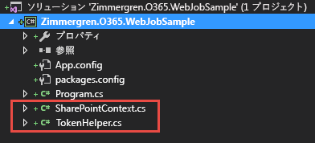
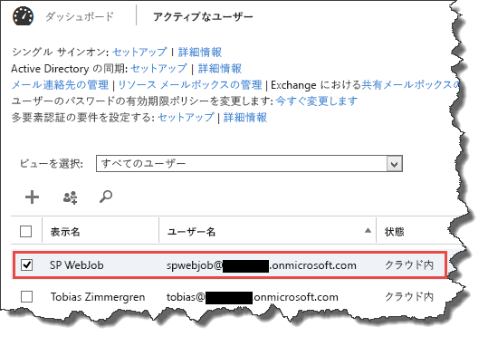
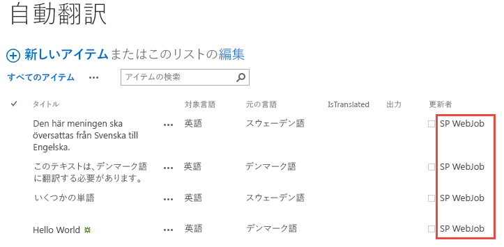
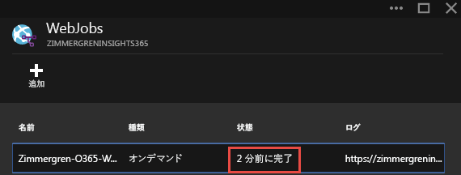
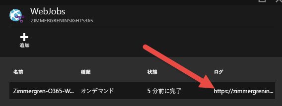
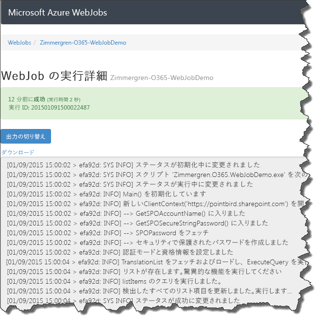

# Office 365 サイト用の Azure Web ジョブ ("タイマー ジョブ") の使用の開始 #

### 概要 ###
この投稿では、Office 365 (またはオンプレミス) SharePoint サイト用のスケジュールされたジョブとして機能する Azure Web ジョブを構築する方法について説明します。Office 365 で SharePoint Online サービスを実行して利用している場合は、従来のファーム ソリューションで*タイマー ジョブ*にしていた処理の実行方法を考え直す必要があります。ここでは、Office 365 サイト用のカスタム ジョブの構築を開始するときの基本的な概念について知ることができます。

# Office 365 サイト用のタイマー ジョブとしての Azure Web ジョブの概要 #
従来の SharePoint 開発では、[タイマー ジョブ](http://tz.nu/1DNtqH8)により、スケジュールされたタスクを SharePoint ファームで実行します。環境で特定のタスクを継続的または繰り返し実行するために一般的に使用される手法は、カスタム タイマー ジョブを開発することです。

Office 365 と SharePoint Online では、従来のタイマー ジョブが存在する通常の場所であるファーム ソリューションを展開する余裕はありません。代わりに、タスクをスケジュールする別の方法を見つける必要があります。これにより、[Azure Web ジョブ](http://tz.nu/1ueFvMZ)の概念が生み出されました。

## Visual Studio 2015 (プレビュー) を使用して Web ジョブを構築するための手順  ##
新しい Web ジョブをゼロから構築するために行う必要があるのは、新しいコンソール アプリケーションを作成し、必要なアセンブリを確実にプロジェクトに追加することだけです。このサンプルでは [Visual Studio 2015 (プレビュー)](http://tz.nu/1CagngX) を使用します (名前が示すように、これは現在ベータ版リリースです)。

### 手順 1:コンソール アプリケーションを作成する ###
最初に、新しいプロジェクトを作成します。必ず "**コンソール アプリケーション**" テンプレートを選択してください。また、**.NET Framework 4.5** を選択することも重要です。

![[新しいプロジェクト] ダイアログ ボックス、.NET Framework 4.5 を使用してコンソール アプリケーションを作成するための設定](media/Getting-Started-with-building-Azure-WebJobs-for-your-Office365-sites/1.Create-Console-Application.png)

### 手順 2:NuGet から SharePoint 固有のアセンブリを追加する ###
私と同じように Visual Studio 2015 を使用している場合、NuGet パッケージ マネージャー ダイアログ ボックスは以前のバージョンの Visual Studio とは多少異なって表示されますが、概念は同じです。

 - **[ツール]** > **[NuGet パッケージ マネージャー]** > **[ソリューションの NuGet パッケージの管理...]** の順に選択します。
 - 「**App for SharePoint**」を検索します。
 - 「**AppForSharePointWebToolkit**」という名前のパッケージをインストールします。これにより、SharePoint クライアント オブジェクト モデルの処理に必要なヘルパー クラスがインストールされます。


                ![検索する用語「App for SharePoint」を表示する NuGet パッケージ マネージャーのダイアログ。 [App For SharePoint Web Toolkit] が強調表示され、インストール ボタンがクリックできるようになります。](media/Getting-Started-with-building-Azure-WebJobs-for-your-Office365-sites/2.Add-App-For-SharePoint-Web-Toolkit-from-Nuget.png)
コンソール アプリケーション プロジェクトに次の 2 つの新しいクラスがあることを確認することにより、NuGet パッケージが機能したことを確認してください。

### 手順 3:Office 365 サイトでジョブを実行するために必要なコードを追加する ###
この時点で、コンソール アプリケーションは作成済みであり、簡単に SharePoint と通信するために必要なアセンブリも追加済みです。次の手順は、SharePoint 環境でコンソール アプリケーションを使用してコマンドを実行できるようにこれらのヘルパー クラスを利用することです。これからその点を説明します。


                ***メモ:***完成後のサンプルでは、アカウントとパスワードのアプローチ (サービス アカウントのようなもの) を使用しています。 認証オプションの詳細については、この記事の後の方で説明します。他の代替手段についてはリンクを参照してください。

#### SharePoint Online サイト コレクションの呼び出しを作成する ####

次のコードは、NuGet パッケージからヘルパー クラスが追加済みである場合にサイトの呼び出しを非常に簡単に作成する方法の例を示しています。

```C#
 static void Main(string[] args)
  {
      using (ClientContext context = new ClientContext("https://redacted.sharepoint.com"))
      {
          // Use default authentication mode
          context.AuthenticationMode = ClientAuthenticationMode.Default;
          // Specify the credentials for the account that will execute the request
          context.Credentials = new SharePointOnlineCredentials(GetSPOAccountName(), GetSPOSecureStringPassword());

          // TODO: Add your logic here!
      }
  }
 
 
  private static SecureString GetSPOSecureStringPassword()
  {
      try
      {
          Console.WriteLine(" --> Entered GetSPOSecureStringPassword()");
          var secureString = new SecureString();
          foreach (char c in ConfigurationManager.AppSettings["SPOPassword"])
          {
              secureString.AppendChar(c);
          }
          Console.WriteLine(" --> Constructed the secure password");
 
          return secureString;
      }
      catch
      {
          throw;
      }
  }
 
  private static string GetSPOAccountName()
  {
      try
      {
          Console.WriteLine(" --> Entered GetSPOAccountName()");
          return ConfigurationManager.AppSettings["SPOAccount"];
      }
      catch
      {
          throw;
      }
   }
``` 

見てわかるように、サンプル アプリケーションには、app.config ファイルからアカウント名とアカウント パスワードを取得するための 2 つのヘルパー メソッドが追加されています。これについては、この記事の後の方にある認証に関するセクションで説明しています。

main メソッドは、すべてをポータルに接続するのに必要十分なものとなっています。コードから SharePoint を操作する方法を詳しく説明する前に、認証用のオプションについて説明します。

## 認証に関する考慮事項 ##
ここでは、認証用の 2 種類のオプションとその違いを確認します。世の中には他にも認証用のオプションがあるかもしれませんが、一般に使用されているアプローチはこの 2 つです。

### オプション 1:サービス アカウント (ユーザー名とパスワード) を使用する ###
このアプローチはとても単純であり、Office 365 テナントにアカウントとパスワードを入力するだけで、CSOM などを使用してサイトでコードを実行できるようになります。上のサンプル コードでもこれが使用されています。

#### Office 365 で新しいサービス アカウントを作成する ####
これを行うには、サービス アカウントとして機能する特定のアカウントを作成する必要があります。これは、特定のアプリケーション用のサービス アカウントか、すべてのジョブとサービスで使用できる汎用的なサービス アプリケーション アカウントになります。

このデモのために、"**SP WebJob**" という名前の新しいアカウントを作成しました。

ジョブに必要なアクセス許可によっては、アカウントのセットアップ時にそのアクセス許可を編集する必要があります。

#### app.config に資格情報を保存する ####
プロジェクトの app.config ファイル内で資格情報を指定すると、コードの実行可能ファイルから容易に取り出すことができるようになります。私の app.config は次のようになっています。
```XML
<?xml version="1.0" encoding="utf-8" ?>
<configuration>
 <startup> 
   <supportedRuntime version="v4.0" sku=".NETFramework,Version=v4.5" />
 </startup>
 <appSettings>
   <add key="SPOAccount" value="spwebjob@redacted.onmicrosoft.com"/>
   <add key="SPOPassword" value="redacted"/>
 </appSettings>
</configuration>

```
この app.config 内には次の 2 つの設定があります。

 - SPOAccount
 - SPOPassword

最初のコード スニペットをもう 1 度確認すると、私が app.config ファイルからこれらの設定を取り出していることがわかります。これは、アカウント名とパスワードをクリア テキストとして app.config に保存することを示しているだけです。このアプローチを選択した場合、パスワードを保存して保護する方法と場所については、自身のプロジェクトで決定する必要があります。

#### ジョブは指定されたアカウントの下で実行される ####
アプリケーションが実行された後は、それが SharePointOnlineCredentials() コンストラクターで指定されたアカウントを使用して実行されていることがわかります。



上のサンプルでは、SharePoint Online サイト コレクションでホストされている私のサイトの 1 つにあるカスタム リストに対してアクションを実行する Web ジョブを示しています。

このため、サービス アカウントによってポータルで実行された変更を容易に追跡することができます。そのようなわけで、アカウントの名前を賢く付けることは重要です。そうすれば、すべてのユーザーは変更/作成されたメタデータを調べるだけで、変更がサービスによって自動的に行われたことを知ることができます。

### オプション 2:アカウント / パスワードの指定を避けるため、OAuth を使用し、リクエストに認証トークンを含める ###
これについては、Microsoft の [Kirk Evans](http://blogs.msdn.com/b/kaevans/) が大変詳しく説明しています。

彼の投稿である「[SharePoint アドインをタイマー ジョブとして構築する](http://tz.nu/1xBA76K)」では、パスワードと資格情報をアプリケーションに保存したくない場合に、上記のようにアクセス トークンを利用して渡すことによってユーザー名 / パスワードのセットアップを避ける方法を説明しています。

## CSOM の手法でコードを拡張する ##
これで、Office 365 サイトに認証して要求を実行できる有効なコンソール アプリケーションができました。このコードで特別なことはまだ行われていないため、私が作成した "Automatic Translations" という名前のリストからいくらかの情報を取り出すコード スニペットを紹介します。このコードのロジックは、リスト内にまだ翻訳していない項目があるかどうか調べた後、翻訳サービスの呼び出しを実行して、テキストを目的の出力言語に翻訳します。
```C#
static void Main(string[] args)
{
   try
   {
      Console.WriteLine("Initiating Main()");

      using (ClientContext context = new ClientContext("https://redacted.sharepoint.com"))
      {
         Console.WriteLine("New ClientContext('https://redacted.sharepoint.com') opened. ");

         context.AuthenticationMode = ClientAuthenticationMode.Default;
         context.Credentials = new SharePointOnlineCredentials(GetSPOAccountName(), GetSPOSecureStringPassword());

         Console.WriteLine("Authentication Mode and Credentials configured");

         List translationlist = context.Web.Lists.GetByTitle("Automatic Translations");
         context.Load(translationlist);
         context.ExecuteQuery();

         Console.WriteLine("TranslationList fetched, loaded and ExecuteQuery'ed");

         if (translationlist != null && translationlist.ItemCount > 0)
         {
             Console.WriteLine("The list exist, let's do some magic");

             CamlQuery camlQuery = new CamlQuery();
             camlQuery.ViewXml =
             @"<View>  
             <Query> 
                 <Where><Eq><FieldRef Name='IsTranslated' /><Value Type='Boolean'>0</Value></Eq></Where> 
             </Query> 
         </View>";

             ListItemCollection listItems = translationlist.GetItems(camlQuery);
             context.Load(listItems);
             context.ExecuteQuery();

             Console.WriteLine("Query for listItems executed.");

             foreach (ListItem item in listItems)
             {
                 item["Output"] = TranslatorHelper.GetTranslation(item["Title"], item["Target Language"], item["Original Language"]);
                 item["IsTranslated"] = true;
                 item.Update();
             }


             context.ExecuteQuery();
             Console.WriteLine("Updated all the list items we found. Carry on...");
         }
      }
   }
   catch (Exception ex)
   {
       Console.WriteLine("ERROR: " + ex.Message);
       Console.WriteLine("ERROR: " + ex.Source);
       Console.WriteLine("ERROR: " + ex.StackTrace);
       Console.WriteLine("ERROR: " + ex.InnerException);
   }
}

```
**TranslatorHelper** クラスはカスタム変換 API を呼び出すヘルパー クラスですが、その詳細はこの投稿の扱う範囲からかなり外れているため、ここでは説明しません。


            **メモ:***見てわかるように、このコードはデモであり、実際の運用を目的としたものではありません。実際のコーディング基準とセキュリティ原則に応じて見直しと調整を行ってください。ただし、Console.WriteLine のすべての追加部分は、Azure ポータルからジョブの実行を簡単に確認するために追加されています。ログと監視の詳細については、この記事の後の方で説明します。*

## Azure への Web ジョブの発行 ##
Web ジョブの開発が完了し、Azure 環境に展開する (Azure Web サイトに展開する) 準備が整ったら、次に説明する 2 種類の主なオプションから選ぶことができます。

### オプション 1:Web ジョブ バイナリの入った zip ファイルを Azure ポータルにアップロードする ###
自身の優位性を Azure 内で維持する場所である Azure ポータルを使用して、Visual Studio のビルドからの出力が含まれる zip ファイルをアップロードすることができます。これは、コードをコンパイルして展開の担当者に送る簡単な方法です。

#### zip ファイルを作成する ####
Visual Studio ビルドからのすべての出力ファイル (通常は bin/Debug or bin/Release フォルダーにあります) を入手します。


                
これらのファイルを圧縮すると、Web ジョブに適した zip ファイルが得られます。


#### ジョブを展開する Web サイトを見つける ####

これで、パッケージを入手できました。とても簡単です。次の手順は、https://portal.azure.com にアクセスして Windows Azure ポータルにログインすることです。そこから新しい Web サイトを作成するか、既存のサイトを使用する必要があります。この Web サイトは Web ジョブのホストになります。

私の場合、すでに Office 365 デモ用の Azure Web サイトがあるので、それを使用します。

Web サイトの設定ウィンドウを下にスクロールすると、**[操作]** ヘッダーの下に **[Web ジョブ]** という項目があります。


            ![作成者の Azure ポータルが表示されていて、矢印が [WebJobs] を指しています。](media/Getting-Started-with-building-Azure-WebJobs-for-your-Office365-sites/8.Find-WebJobs-in-Azure-Portal.png)
**矢印が指している場所をクリックします。**

#### Web ジョブをアップロードする ####

**[+ 追加]** 記号をクリックして Web ジョブをアップロードします。

![WebJobs Azure ポータルが表示されていて、矢印が [追加] を指しています。](media/Getting-Started-with-building-Azure-WebJobs-for-your-Office365-sites/9.Upload-Azure-WebJob-from-Azure-Portal.png)

名前、ジョブを実行する方法、および実際の zip ファイルを選択します。

![[WebJob の追加] ダイアログが表示されます。 [名前] フィールドには、テキスト「Zimmergren-O365-WebJobSample」が含まれ、[実行方法] フィールドには、テキスト「On Demand」が含まれます。](media/Getting-Started-with-building-Azure-WebJobs-for-your-Office365-sites/10.Configure-Name-of-Uploaded-WebJob.png)


            ***重要:***[実行方法] の選択肢には現時点では "オンデマンド" と "連続" しかありませんが、私達が必要とする "スケジュール" ももうすぐサポートされます。

*(ヒント: Azure からの直接発行に関する次のセクションで、VS 内からスケジュールを設定できます)。*

これで完了です。Web ジョブを Azure ポータルから実行できるようになりました。

![新しいジョブの一覧のある WebJobs Azure ポータルが表示されています。 ジョブの上にコンテキスト メニューが表示されています。このメニューには、[実行] と [削除] のオプションがあります。](media/Getting-Started-with-building-Azure-WebJobs-for-your-Office365-sites/11.Run-WebJob-from-Azure-Portal.png)

このオプションに問題はありませんが、ポータルにはスケジュールをサポートするためのダイアログがまだ存在しないため、Visual Studio 2015 (ご希望の場合は 2013) 内から発行する方法を確認することをお勧めします。

### オプション 2:Visual Studio から Azure に直接発行する ###
現時点では、これが私のお気に入りです。Visual Studio 内のツールを使用して、ホストされるサービスに変更を即座に直接発行できます。すぐにわかる別のメリットは、Visual Studio のダイアログからジョブの実行方法を直接スケジュールできることです。

#### Visual Studio 2015 から Web ジョブの発行を選択する ####


            ***メモ:****以前のバージョンの Visual Studio を実行している場合、これらのダイアログは若干異なる可能性があります。また、私はすでにログインしていますが、この作業を初めて行う場合は、Azure アカウントにサインインするようにログイン ダイアログが表示される可能性があります。これは前提条件の 1 つです。*

プロジェクトを右クリックして、**[Azure WebJob として発行する...]** を選択します。

![ソリューション エクスプローラーのコンテキスト メニューが表示されていて、[Azure WebJob として発行する...] オプションが強調表示されています。](media/Getting-Started-with-building-Azure-WebJobs-for-your-Office365-sites/12.Publish-WebJob-from-Visual-Studio-2015.png)

#### Azure WebJob の追加 ####
これにより、ジョブを構成するための新しいダイアログ ボックスが表示されます。スケジュールに従って (この例では毎晩に) 実行される定期的なジョブを構成する必要があるため、ダイアログからスケジュールを直接構成できます。![[Azure WebJob の追加] ダイアログが表示されます。 [WebJob 名] フィールドには、テキスト「Zimmergren-O365-WebJobSample」が含まれています。[Web ジョブ実行モード] フィールドには、「スケジュールに従って実行」が含まれています。[繰り返し] フィールドには、オプションの [定期的なジョブ] が含まれていて、[終了日なし] チェック ボックスはオンになっています。[繰り返しの間隔] フィールドは、「1」に設定されています。[開始日時] の日付は、2015 年 1 月 9 になっています。](media/Getting-Started-with-building-Azure-WebJobs-for-your-Office365-sites/13.Add-Azure-WebJob-Dialog.png)

 - 名前は Web に適したものにします
 - 実行モードを選択します。毎日特定の時刻に実行されるようにするため、ここでは [スケジュールで実行] を選択しています
 - ジョブを定期的なジョブにするか、一時的なジョブにするかを指定します。タイマー ジョブをシミュレートするため、定期的なジョブにする必要があります。この例は毎晩実行されるため、終了日はありません
 - 必要な場合は、スケジュールを毎分の実行まで細かく設定することができます
 - 開始日時を設定します :-)

**[OK]** をクリックすると、Visual Studio から "**Web ジョブ発行用 NuGet パッケージのインストール**" というメッセージが表示されます。

#### Visual Studio により、Web ジョブ発行用 NuGet パッケージが追加される ####
![[WebJobs NuGet パッケージのインストール] ダイアログ ボックスが表示されています。ここには、スピナーとテキスト「WebJobs NuGet パッケージのインストール」が表示されています。](media/Getting-Started-with-building-Azure-WebJobs-for-your-Office365-sites/14.WebJobs-NuGet-Package-Install.png)

実際には、ジョブの構成が含まれる新しいファイル "**webjob-publish-settings.json**" がプロジェクトに追加されます。

このファイルは次のようになっています。
```json
{
  "$schema": "http://schemastore.org/schemas/json/webjob-publish-settings.json",
  "webJobName": "Zimmergren-O365-WebJobSample",
  "startTime": "2015-01-09T01:00:00+01:00",
  "endTime": null,
  "jobRecurrenceFrequency": "Day",
  "interval": 1,
  "runMode": "Scheduled"
}
```
ダイアログを使用してスケジュールをすでに設計したので、現時点でこのファイルについて考える必要はありません。

#### 発行 / 展開ターゲットを選択する ####
ダイアログでの次の手順は、Web ジョブを発行 / 配置する場所の選択です。既存のサイトを認証して選択するため、発行プロファイルをインポートするか、Microsoft Azure Web サイトを選択することができます。

私には常に Azure ポータルから自分の発行プロファイルをダウンロードする習慣があるため、[**インポート**] を選択し、Azure Web サイトからダウンロードした発行プロファイル ファイルを指定するだけです。

![[接続] タブの内容が示された [Web の発行] ダイアログが表示されています。](media/Getting-Started-with-building-Azure-WebJobs-for-your-Office365-sites/15.Publish-Web-Dialog.png)

ここまで完了したら、あとは [発行] というボタンをクリックするだけです。 心配する必要は おそらくありません。

#### 発行する ####
[発行] をクリックすると、[Web 発行アクティビティ] ダイアログに Web ジョブの展開の進行状況が表示されます。![[Web 発行アクティビティ] ダイアログが表示されます。](media/Getting-Started-with-building-Azure-WebJobs-for-your-Office365-sites/16.Publish-Progress-Visual-Studio-2015.png)

完了すると、Azure ポータルに Web ジョブが表示されます。

Web ジョブの状態は [完了] として表示されます。未処理の例外がスローされる場合や異常な動作が発生する可能性がある場合は、失敗 / エラーが返されます。

引き続き [オンデマンド] と表示されていますが、このジョブは実際には 1 時間ごとに実行されます。

## ジョブの監視とログの確認 ##
上記のすべての手順を完了すると、ジョブがスケジュールされたタスクとしてクラウドで実行され、Office 365 サイトに対するアクションを実行しています。

### ジョブのすべての例外と状態を表示する ###
ジョブが最後が実行された日時、ジョブの毎回の実行の結果、またはジョブの実行中に何が起こったかを確認するには、Web ジョブの概要で [ログ] の下にあるリンクをクリックすることができます。

このとき、状態/結果を含む、選択したジョブのすべての実行の概要が表示されます。

![[最近実行したジョブ] が示されている [WebJob の詳細]。](media/Getting-Started-with-building-Azure-WebJobs-for-your-Office365-sites/19.WebJob-Details-Overview.png)

強調表示されたリンクをクリックすることにより、特定の実行の詳細を表示し、ジョブのログを見て正常に実行されていることを確認することができます。これが関係するのは、ジョブによってエラーが発生し、状況を調査する必要がある場合や、ジョブの結果が不正確または予期したものと違う場合です。

また、このデモ用のコンソール アプリケーションで適切に使用した Console.WriteLine ステートメントがジョブ実行ログに表示されることがわかります。



## ヒントとトリック ##
このすべては以前のバージョンの Visual Studio でも実行できますが、私は Visual Studio 2015 を使用しました。その過程で理解したことがいくつかあったので、同じ状況に直面する場合に備えてここで説明します。

### ジョブ実行時の終了コード 2146232576 に関する問題 ###
Visual Studio 2015 (プレビュー) プロジェクトを開始したため、プロジェクトは **.NET Framework 4.5.3** に基づくコンソール アプリケーションとしてセットアップされました。

開発マシン上に .NET Framework 4.5.3 が存在するため、ローカルでのジョブ実行は正しく機能します。しかし、Windows Azure Web サイトに Web ジョブとして展開した後、ジョブは**終了コード 2146232576**で失敗しました。

#### 解決方法:正しい .NET バージョンを使用していることを確認する ####
しばらくしてから私は Azure と .NET Framework バージョン 4.5.3 の相性が良くないことがわかり、**.NET Framework 4.5** に変更したところ、正しく機能しました。

この問題が発生した場合は、ジョブが適切な .NET Framework バージョンのもとで実行されていることを確認してください。

                ![Visual Studio の [プロジェクトのプロパティ] ページで [アプリケーション] タブが表示されています。このタブには、「.NET Framework 4.5」が強調表示されている [ターゲット フレームワーク] ドロップダウンが示されています。](media/Getting-Started-with-building-Azure-WebJobs-for-your-Office365-sites/21.Change-NET-Framework-In-Visual-Studio-2015.png)

# 概要 #
Azure Web ジョブを構築する機会はあまり多くありませんが、非常に複雑なものを作ることができます。全体的な概念は非常に単純ですが、複雑なプロジェクトでは、認証、コードの安定性と信頼性、高可用性シナリオ、保守性などに関する決定を行います。これらは各プロジェクトに固有の変数であり、ジョブを Azure に "単に展開する" 前に慎重に検討する必要があります。

### 関連リンク ###
-  
            [Azure Web ジョブに関する元のブログ投稿](http://zimmergren.net/technical/getting-started-with-building-azure-webjobs-timer-jobs-for-your-office-365-sites) (Tobias Zimmergren)
-  [Azure Web ジョブに関して推奨されるリソース](http://azure.microsoft.com/en-us/documentation/articles/websites-webjobs-resources/)
-  [Visual Studio 2015 (プレビュー) のダウンロード](http://www.visualstudio.com/en-us/downloads/visual-studio-2015-downloads-vs.aspx)
-  
            [SharePoint アドインをタイマー ジョブとして構築する](http://blogs.msdn.com/b/kaevans/archive/2014/03/02/building-a-sharepoint-app-as-a-timer-job.aspx) (Kirk Evans)
-  [Azure Web ジョブを Azure Web サイトに展開する方法](http://azure.microsoft.com/en-us/documentation/articles/websites-dotnet-deploy-webjobs/)
-  
            [SharePoint Online とやり取りする単純なリモート タイマー ジョブ](http://channel9.msdn.com/Blogs/Office-365-Dev/Simple-remote-timer-job-that-interacts-with-SharePoint-Online-Office-365-Developer-Patterns-and-Prac) (Andrew Connell、Channel9)

### 適用対象 ###
-  Office 365 マルチテナント (MT)
-  Office 365 専用 (D)
-  SharePoint 2013 オンプレミス 
