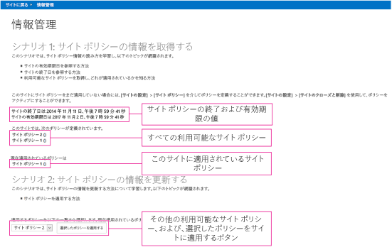

# 情報管理のサンプル アドイン (SharePoint)
Enterprise Content Management (ECM) ストラテジの一部として、SharePoint サイトのライフサイクルを管理するためのサイト ポリシーを取得したり設定したりすることができます。
    
_**適用対象:** Office 365 | SharePoint 2013 | SharePoint Online_

[Core.InformationManagement](https://github.com/OfficeDev/PnP/tree/master/Samples/Core.InformationManagement) サンプルには、プロバイダー向けのホスト型 ASP.NET SharePoint アドインを使用することによって、サイトのサイト ポリシーを取得したり設定したりする方法が示されています。このソリューションは、以下の場合に使用します。

- カスタム サイト プロビジョニング プロセス中にポリシー設定を適用する場合。 
    
- サイト ポリシーを新規作成したり、既存のサイト ポリシーを修正したりする場合。
    
- ユーザー設定の有効期限計算式を作成する場合。 
    
## はじめに
<a name="sectionSection0"> </a>

まず、[Core.InformationManagement ](https://github.com/OfficeDev/PnP/tree/master/Samples/Core.InformationManagement) サンプル アドインを、GitHub の [Office 365 Developer Patterns and Practices](https://github.com/OfficeDev/PnP/tree/dev) プロジェクトからダウンロードします。

このアドインを実行する前に、少なくとも 1 つのサイト ポリシーを作成し、それをサイトに割り当てることをお勧めします。そうしない場合、アドインは、サンプル データを表示することなく開始されることになります。詳細については、「[SharePoint 2013 のサイト ポリシーの概要](http://technet.microsoft.com/en-US/library/jj219569%28v=office.15%29.aspx)」を参照してください。

## Core.InformationManagement サンプル アプリの使用
<a name="sectionSection1"> </a>

アプリを起動すると、図 1 に示すように、開始画面に以下の情報が表示されます。

- サイトの閉鎖日付と有効期限。これらの日付はサイト固有のものであり、適用されるサイト ポリシーの設定に基づくものです
    
- このサイトに適用可能なすべてのサイト ポリシー。
    
- 現在適用されているサイト ポリシー。
    
- このサイトのための新しいサイト ポリシーを選択して適用するためのオプション ボックス。

**図 1. 情報管理アドインの開始ページ**



SharePoint サイトで、**[最近使用したファイル]**  >  **[ Core.InformationManagement]** を選択することによってアプリに移動します。それはリモート ホストで実行されます。SharePoint サイトに戻るには、**[サイトに戻る]** を選択します。

Core.InformationManagementWeb プロジェクトの Pages\Default.aspx.cs ファイルには、図 1 に示されているページのコードが含まれています。 

Default.aspx.cs ページの  **Page_Load** メソッドの以下のコードは、適用されているサイト ポリシーに基づいて閉鎖日付と有効期限を取得して表示します。このコードは、OfficeDevPnP.Core プロジェクトの **GetSiteExpirationDate** 拡張メソッドと **GetSiteCloseDate** 拡張メソッドを呼び出します。
    
**メモ**  この記事で提供されるコードは、明示または黙示のいかなる種類の保証なしに現状のまま提供されるものであり、特定目的への適合性、商品性、権利侵害の不存在についての暗黙的な保証は一切ありません。

```C#
// Get site expiration and closure dates.
if (cc.Web.HasSitePolicyApplied())
{
        lblSiteExpiration.Text = String.Format("The expiration date for the site is {0}", cc.Web.GetSiteExpirationDate());
        lblSiteClosure.Text = String.Format("The closure date for the site is {0}", cc.Web.GetSiteCloseDate());
}

```

Default.aspx.cs ページの  **Page_Load** メソッドの以下のコードは、対象サイトに適用可能なサイト ポリシー (現在適用されているサイト ポリシーも含む) の名前すべてを表示します。このコードは、OfficeDevPnP.Core プロジェクトの **GetSitePolicies** 拡張メソッドを呼び出します。

```C#
// List the defined policies.
List<SitePolicyEntity> policies = cc.Web.GetSitePolicies();
string policiesString = "";
foreach (var policy in policies)
                    {
                        policiesString += String.Format("{0} ({1}) <BR />", policy.Name, policy.Description);
                    }
lblSitePolicies.Text = policiesString;
            };

```

Default.aspx.cs ページの  **Page_Load** メソッドの以下のコードは、対象サイトに現在適用されているサイト ポリシーの名前を表示します。これは、OfficeDevPnP.Core プロジェクトの **GetAppliedSitePolicy** 拡張メソッドを呼び出します。

```C#
// Show the assigned policy.
SitePolicyEntity appliedPolicy = cc.Web.GetAppliedSitePolicy();
if (appliedPolicy != null)
            {
            lblAppliedPolicy.Text = String.Format("{0} ({1})", appliedPolicy.Name, appliedPolicy.Description);
            }
else
            {
            lblAppliedPolicy.Text = "No policy has been applied";
            }

```

Default.aspx.cs ページの  **Page_Load** メソッドの以下のコードは、ドロップダウン リストの内容として、使用可能なサイト ポリシー (対象サイトに現在割り当てられているサイト ポリシーを除く) の一覧を設定します。

```C#
// Fill the policies combo.
foreach (var policy in policies)
{
if (appliedPolicy == null || !policy.Name.Equals(appliedPolicy.Name, StringComparison.InvariantCultureIgnoreCase))
{
                            drlPolicies.Items.Add(policy.Name);
           }
}
btnApplyPolicy.Enabled = drlPolicies.Items.Count > 0;

```

Default.aspx.cs ページの以下のコードは、選択されたサイト ポリシーを対象サイトに適用します。元のサイト ポリシーが新しいサイト ポリシーに置き換えられます。 

```C#
protected void btnApplyPolicy_Click(object sender, EventArgs e)
{
if (drlPolicies.SelectedItem != null)
            {
                cc.Web.ApplySitePolicy(drlPolicies.SelectedItem.Text);
                Page.Response.Redirect(Page.Request.Url.ToString(), true);
            }
}

```

## その他のリソース
<a name="bk_addresources"> </a>

-  [SharePoint 2013 と SharePoint Online 用のエンタープライズ コンテンツ管理ソリューション](Enterprise-Content-Management-solutions-for-SharePoint-2013-and-SharePoint-Online.md)
    
-  [OfficeDevPnP.Core サンプル](https://github.com/OfficeDev/PnP-Sites-Core/tree/master/Core)
    
-  [Core.SiteClassification サンプル](https://github.com/OfficeDev/PnP/tree/master/Samples/Core.SiteClassification)
    
-  [ECM.AutoTagging サンプル アプリ](https://github.com/OfficeDev/PnP/tree/master/Samples/ECM.AutoTagging)
    
-  [ECM.DocumentLibraries サンプル アプリ](https://github.com/OfficeDev/PnP/tree/master/Samples/ECM.DocumentLibraries)
    
-  [ECM.RecordsManagement サンプル アプリ](https://github.com/OfficeDev/PnP/tree/master/Samples/ECM.RecordsManagement)
