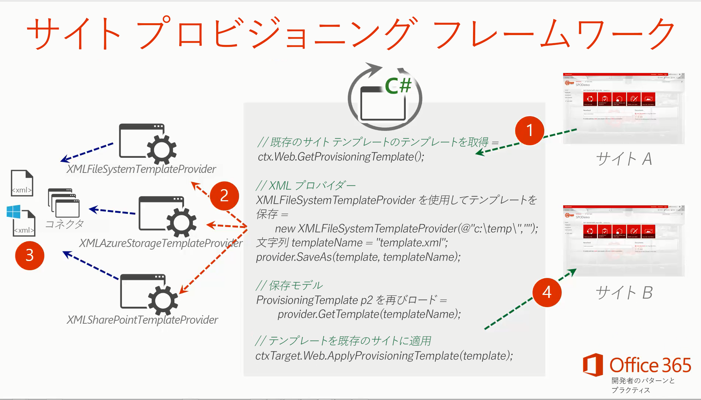
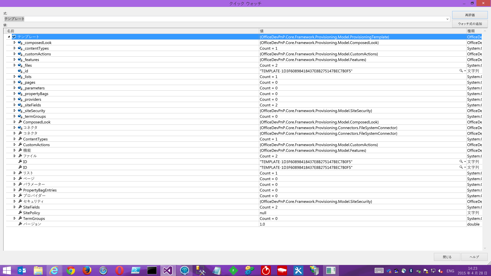
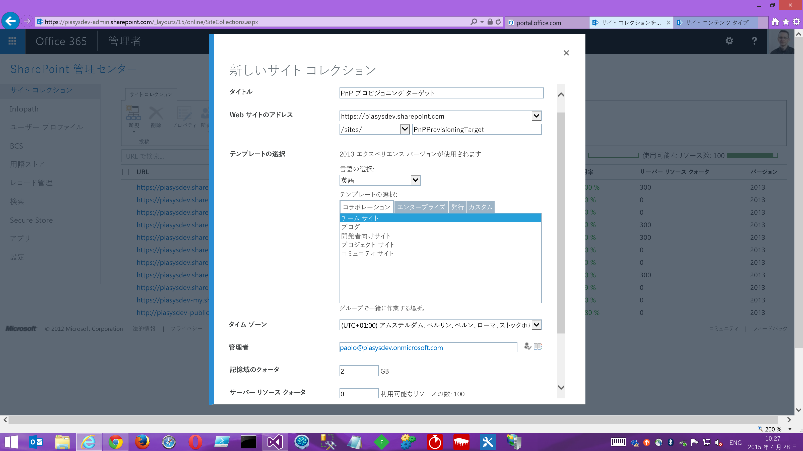
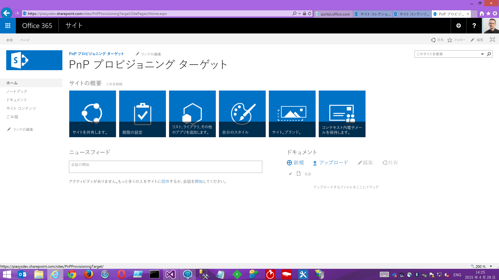
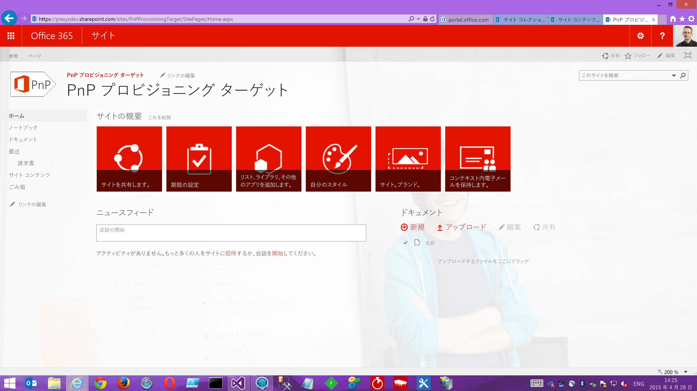

# PnP プロビジョニング エンジンの紹介

**作成者:**Paolo Pialorsi - [www.piasys.com](http://www.piasys.com/) - [@PaoloPia](https://www.twitter.com/PaoloPia/)

_**適用対象:**SharePoint 2013 | SharePoint Online | Office 365_

[OfficeDev PnP](http://aka.ms/officedevpnp) プロジェクト内で 2015 年 4 月 にリリースされたこの短いホワイト ペーパーは、PnP プロビジョニング エンジンについて説明し、Office デベロッパー PnP コア ライブラリのリリース スケジュールに沿って毎月更新されます。ここに表示されている内容は、Office Dev PnP コア チームのメンバー ([Vesa Juvonen](https://twitter.com/vesajuvonen)[Bert Jansen](https://twitter.com/O365Bert), [Frank Marasco](https://twitter.com/frank_marasco)、[Erwin van Hunen](https://twitter.com/erwinvanhunen)、そして[私](https://twitter/paolopia))、および OfficeDev PnP コミュニティ全体の努力の結利用可能となったものです。

## 目標

まず、プロビジョニング エンジンを持つという主な目標から開始しましょう。Microsoft Office 365 および Microsoft SharePoint Online の導入により、開発者は一般に、Microsoft SharePoint 2013、Microsoft SharePoint Online、および Microsoft Office 365 などのカスタム ソフトウェア ソリューションを作成する新しい方法として、新しいクラウド アドイン モデル (別名、CAM) に直面しています。ただし、過去の開発者は、完全信頼コード (別名 FTC) ソリューションまたはサンド ボックス ソリューションのいずれかで CAML/XML ベースの機能フレームワークを使用してカスタムの成果物をプロビジョニングしていましたが、現在の新しい CAM では、いわゆる「リモート プロビジョニング」技術を使用した成果物のプロビジョニングに基づいてアプローチを行う必要があります。「リモート プロビジョニング」とはどういう意味でしょうか。機能フレームワークを使用する代わりにクライアント側オブジェクト モデル (CSOM) を使用して成果物をプロビジョニングすることを意味します。

テストや本番環境を使用して成果物をモデル化し、プロビジョニングする場合はどうすればよいでしょうか。または、カスタマイズを複数の顧客に販売するためだけに、成果物のプロビジョニングを自動化する場合はどうでしょうか。さらに、顧客指向のサイトやプロジェクト指向のサイトなど、複数のインスタンス間で再利用するカスタム サイト テンプレートを定義する場合はどうでしょうか。

PnP プロビジョニング エンジンでは、Web ブラウザーを使用していても、サイト列、コンテンツ タイプ、リスト定義とインスタンス構成済みの外観、ページ (WebPart ページや Wiki ページ) などのデザインをモデル化できます。設計が完了したら、実行した内容を永続的なプロビジョニングのテンプレート形式 (XML、JSON、または必要な形式) にエクスポートし、そのテンプレートを必要に応じてターゲット サイトに適用できます。

これに興味があるようでしたら、この先の使用方法についての説明を読み進めてください。

## プロビジョニング テンプレートの作成

既に述べたように、カスタム プロビジョニング テンプレートを作成する最も簡単な方法は、Microsoft SharePoint Online で最新の新しいサイト コレクションを作成、成果物 (構成済みの外観、サイト列、コンテンツ タイプ、リスト インスタンス、ページ、ファイルなど) を定義し、プロビジョニングのテンプレートを保存する方法です。

このため、カスタムの外観 (カスタムの色テーマ、カスタム ロゴ、カスタムの背景画像) を使用してサンプル サイトを定義したとします。次の図では、結果として表示されるホーム ページを確認できます。

さらに、カスタム ビューを使用していくつかのサイト列、コンテンツ タイプと、請求書のライブラを定義したとします。次の 2 つの図では結果を確認できます。

![請求書のライブラリの [設定] ページ](./media/Introducing-the-PnP-Provisioning-Engine/Figure-3-SiteTemplate03.png)

プロビジョニングのテンプレートとしてサイトをエクスポートするには、一連の PowerShell スクリプトを作成を使用する ([Erwin](https://twitter.com/erwinvanhunen)の努力のおかげです) か、OfficeDev PnP コア ライブラリに用意されているいくつかの拡張メソッドで CSOM コードを使用できます。 

PowerShell の拡張機能を使用するには、適切な URL (Microsoft SharePoint Online の場合は [http://aka.ms/officedevpnpcmdlets16](http://aka.ms/officedevpnpcmdlets16)、Microsoft SharePoint 2013 の場合は [http://aka.ms/officedevpnpcmdlets15](http://aka.ms/officedevpnpcmdlets15)) を参照し、OfficeDev PnP コア PowerShell の拡張機能をインストールします。その後、*Connect-SPOnline* コマンドレットを使用しPowerShell 環境を Microsoft Office 365 に接続すると、次の PowerShell コマンドレットを使用できるようになります。

*Get-SPOProvisioningTemplate -Out "PnP-Provisioning-File.xml"*

*–Out* 引数はコマンドレットに対しプロビジョニング テンプレートを保存する場所を指定します。

一方、CSOM の拡張機能を使用するためには、任意の種類 (コンソール、Windows、SharePoint アドインなど) の .NET ソフトウェア プロジェクトを作成し、OfficeDev PnP NuGet パッケージを追加できます。NuGet パッケージは、2 つのフレーバー (Microsoft SharePoint 2013 オンプレミスを対象とした OfficeDev PnP コア v15、Microsoft SharePoint Online を対象とした OfficeDev PnP コア) で使用できます。

ここでは、より多くテストされ、PnP コア チームの取り組みの主なターゲットである Microsoft SharePoint Online  を対象とします。Microsoft Office 365 に接続、*ClientContext* インスタンス化を取得、および *Web* オブジェクトへの参照を取得する必要があります。新しい拡張メソッド (*GetProvisioningTemplate*) により、テンプレート プロバイダーとシリアル化フォーマッタを使用して保存可能な *ProvisioningTemplate* オブジェクトを取得できます。テンプレート プロバイダーと、シリアル化フォーマッタ オブジェクトは両方ともカスタマイズできます。そのため、必要な永続ストレージやシリアル化形式なら何でも実装できます。標準の PnP のプロビジョニング エンジンは、ファイル システム、SharePoint、Azure Blob  ストレージ テンプレート プロバイダー、XML および JSON のシリアル化フォーマッタのサポートを提供します。次の図 ([Vesa](https://twitter.com/vesajuvonen) 作成) では、PnP プロビジョニング エンジンのアーキテクチャ全体の概要を確認できます。

*ProvisioningTemplate* インスタンス オブジェクトを抽出し、保存した結果は、次の XML ファイルの抜粋が示すような XML ファイルのインスタンス用になります。
    
    <?xml version="1.0"?>
    <pnp:Provisioning xmlns:pnp="http://schemas.dev.office.com/PnP/2015/05/ProvisioningSchema">
      <pnp:Preferences Generator="OfficeDevPnP.Core, Version=1.2.515.0, Culture=neutral, PublicKeyToken=null" />
      <pnp:Templates ID="CONTAINER-TEMPLATE-1D3F60898418437E8B275147BEC7B0F5">
    <pnp:ProvisioningTemplate ID="TEMPLATE-1D3F60898418437E8B275147BEC7B0F5" Version="1">
      <pnp:Security>
    <pnp:AdditionalAdministrators>
      <pnp:User Name="i:0#.f|membership|paolo@piasysdev.onmicrosoft.com" />
    </pnp:AdditionalAdministrators>
      </pnp:Security>
      <pnp:Files>
    <pnp:File Src="PnP.png" Folder="SiteAssets" Overwrite="true" />
    <pnp:File Src="STB13_Rick_01_small.png" Folder="SiteAssets" Overwrite="true" />
      </pnp:Files>
      <pnp:SiteFields>
    <Field Type="DateTime" DisplayName="Invoice Date" Required="FALSE" EnforceUniqueValues="FALSE"
        Indexed="FALSE" Format="DateOnly" Group="PnP Columns" FriendlyDisplayFormat="Disabled"
        ID="{f1c6f202-f976-4f4e-b0a3-8b984991d00d}" SourceID="{5a15b9ca-4410-4854-bc61-d7fb0ff84e56}"
        StaticName="PnPInvoiceDate" Name="PnPInvoiceDate" CalType="0">
      <Default>[today]</Default>
    </Field>
    <Field Type="Text" DisplayName="Invoice Number" Required="FALSE" 
        EnforceUniqueValues="FALSE" Indexed="FALSE" MaxLength="20" Group="PnP Columns"
        ID="{5049a822-424c-4479-9648-79c4b3214375}" SourceID="{5a15b9ca-4410-4854-bc61-d7fb0ff84e56}"
        StaticName="PnPInvoiceNumber" Name="PnPInvoiceNumber">
    </Field>
      </pnp:SiteFields>
      <pnp:ContentTypes>
    <pnp:ContentType ID="0x01010097931365769EE34E9078576A150FF52E" Name="Invoice"
        Description="" Group="PnP Content Types">
      <pnp:FieldRefs>
    <pnp:FieldRef ID="5049a822-424c-4479-9648-79c4b3214375" Name="PnPInvoiceNumber" />
    <pnp:FieldRef ID="f1c6f202-f976-4f4e-b0a3-8b984991d00d" Name="PnPInvoiceDate" />
      </pnp:FieldRefs>
    </pnp:ContentType>
      </pnp:ContentTypes>
      <pnp:Lists>
    <pnp:ListInstance Title="Invoices" Description=""
        DocumentTemplate="{site}/Invoices/Forms/template.dotx" TemplateType="101" Url="Invoices"
        EnableVersioning="true" MinorVersionLimit="0" MaxVersionLimit="500"
        TemplateFeatureID="00bfea71-e717-4e80-aa17-d0c71b360101" ContentTypesEnabled="true"
        EnableAttachments="false">
      <pnp:ContentTypeBindings>
    <pnp:ContentTypeBinding ContentTypeID="0x01010097931365769EE34E9078576A150FF52E" Default="true" />
      </pnp:ContentTypeBindings>
      <pnp:Views>
    <View Name="{3D715498-8FA2-4B80-8D35-885B2A4CCBDE}" MobileView="TRUE" MobileDefaultView="TRUE"
            Type="HTML" DisplayName="All Documents"
            Url="/sites/PnPProvisioningDemo/Invoices/Forms/AllItems.aspx" Level="1"
            BaseViewID="1" ContentTypeID="0x" ImageUrl="/_layouts/15/images/dlicon.png?rev=38">
      <Query>
    <OrderBy>
      <FieldRef Name="FileLeafRef" />
    </OrderBy>
      </Query>
      <ViewFields>
    <FieldRef Name="DocIcon" />
    <FieldRef Name="LinkFilename" />
    <FieldRef Name="Modified" />
    <FieldRef Name="Editor" />
      </ViewFields>
      <RowLimit Paged="TRUE">30</RowLimit>
      <JSLink>clienttemplates.js</JSLink>
      <XslLink Default="TRUE">main.xsl</XslLink>
      <Toolbar Type="Standard" />
    </View>
    <View Name="{D9BC935E-2154-47EE-A9E2-7C9490389007}" DefaultView="TRUE" MobileView="TRUE"
            Type="HTML" DisplayName="All Invoices"
            Url="/sites/PnPProvisioningDemo/Invoices/Forms/All Invoices.aspx" Level="1"
            BaseViewID="1" ContentTypeID="0x" ImageUrl="/_layouts/15/images/dlicon.png?rev=38">
      <Query>
    <OrderBy>
      <FieldRef Name="FileLeafRef" />
    </OrderBy>
      </Query>
      <ViewFields>
    <FieldRef Name="DocIcon" />
    <FieldRef Name="LinkFilename" />
    <FieldRef Name="Modified" />
    <FieldRef Name="Editor" />
    <FieldRef Name="PnPInvoiceDate" />
    <FieldRef Name="PnPInvoiceNumber" />
      </ViewFields>
      <RowLimit Paged="TRUE">30</RowLimit>
      <Aggregations Value="Off" />
      <JSLink>clienttemplates.js</JSLink>
      <XslLink Default="TRUE">main.xsl</XslLink>
      <Toolbar Type="Standard" />
    </View>
      </pnp:Views>
      <pnp:FieldRefs>
    <pnp:FieldRef ID="5049a822-424c-4479-9648-79c4b3214375" Name="PnPInvoiceNumber"
            DisplayName="Invoice Number" />
    <pnp:FieldRef ID="f1c6f202-f976-4f4e-b0a3-8b984991d00d" Name="PnPInvoiceDate"
            DisplayName="Invoice Date" />
      </pnp:FieldRefs>
    </pnp:ListInstance>
      </pnp:Lists>
      <pnp:Features />
      <pnp:CustomActions />
      <pnp:ComposedLook
    BackgroundFile="{sitecollection}/SiteAssets/STB13_Rick_01_small.png"
    ColorFile="{sitecollection}/_catalogs/theme/15/Palette012.spcolor"
    SiteLogo="{sitecollection}/SiteAssets/PnP.png"
    Name="RED"
    MasterPage="{sitecollection}/_catalogs/masterpage/seattle.master"
    FontFile="" />
    </pnp:ProvisioningTemplate>
      </pnp:Templates>
    </pnp:Provisioning>
    

ご覧のように、XML 要素にはほとんど説明が必要ありません。例で使用されている XML スキーマは PnP プロビジョニング スキーマのバージョン 201505  (XML 名前空間: * http://schemas.dev.office.com/PnP/2015/05/ProvisioningSchema *) を参照しています。このスキーマは OfficeDev PnP コミュニティ全体と一緒に定義され、以下の URL ([https://github.com/OfficeDev/Pnp-Provisioning-Schema/](https://github.com/OfficeDev/Pnp-Provisioning-Schema/)) にある GitHub に記載されています。同じリポジトリ内でも、マークダウン (MD) 自動生成ドキュメントを見つけることができます。このドキュメントは XML プロビジョニング テンプレートを手動で定義するのに使用可能な主な要素、タイプ、および属性について説明します。

ただし、このプロビジョニング エンジンの真の力は高度な可用性と、シリアル化形式の独立したドメイン モデルです。実際に、内部的にPnP プロビジョニング エンジンはすべての種類のシリアル化形式と完全に分離されており、エンジン全体は  *ProvisioningTemplate* タイプのインスタンスを単純に処理します。たとえば、次の図では、ProvisioningTemplate オブジェクト インスタンスを示す、Microsoft Visual Studio 2013 の「クイック ウォッチ」 ウィンドウを確認できます。

*ProvisioningTemplate* を手動で定義する場合、モデル サイトを使用するか、PnP プロビジョニング XSD スキーマに対して有効にする必要がある XML ドキュメントを作成するか、単純に .NET コードを作成し、オブジェクトの階層を構築するかどうかはユーザー次第です。これらの方法の両方を混在させて実行することもできます。モデル サイトを使用してプロビジョニング テンプレートをデザインしてから、XML ファイル形式で保存し、メモリ内でいくつかカスタマイズを実行し、同時に*ProvisioningTemplate*  インスタンスをコード内で処理することができます。

## プロビジョニング テンプレートの適用

これで、プロビジョニング テンプレートとは何か、既存のサイトからドメイン モデルを抽出する方法がわかり、それらをターゲット サイトに適用する準備が整いました。たとえば、もう一つの新しいサイトがあり、このサイトが次の図のように、チーム サイト テンプレートを使用して作成された Microsoft SharePoint Online の新しいサイト コレクションのルート サイトだとします。
 

既定では、サイトは次の図のようになります (SharePoint Online サイトの既定のレイアウト)。

もう一度、一連の PowerShell スクリプトを使用するか、.NET コードを記述して、カスタム *ProvisioningTemplate* インスタンス オブジェクトを適用することができます。PowerShell を使用する場合は、次の抜粋で稼働中の *Apply-SPOProvisioningTemplate* コマンドレットを参照できます。

*Apply-SPOProvisioningTemplate -Path "PnP-Provisioning-File.xml"*

*–Path* 引数は参照元テンプレート ファイルを参照しています。コマンドレットは現在接続されているサイト (*Connect-SPOnline* コマンドで示す) へ明示的に適用されます。次の図では、最終的な結果を確認できます。

ご覧のように、サイトの外観は元のテンプレートと同じとなり、請求書ライブラリ、およびカバー (サイト列、コンテンツ タイプなど) の下にプロビジョニング関連のすべてのものが含まれています。では、.NET コードを使用してはどうでしょうか。CSOM および OfficeDev PnP コア ライブラリの拡張メソッドを使用してテンプレートを適用する方法についての抜粋を次に示します。

    using (var context = new ClientContext(destinationUrl))
    {
      context.Credentials = new SharePointOnlineCredentials(userName, password);
      Web web = context.Web;
      context.Load(web, w => w.Title);
      context.ExecuteQueryRetry();
    
      // Configure the XML file system provider
      XMLTemplateProvider provider =
      new XMLFileSystemTemplateProvider(
        String.Format(@"{0}\..\..\",
        AppDomain.CurrentDomain.BaseDirectory),
        "");
    
      // Load the template from the XML stored copy
      ProvisioningTemplate template = provider.GetTemplate(
        "PnP-Provisioning-Demo-201505-Polished.xml");
    
      // Apply the template to another site
      Console.WriteLine("Start: {0:hh.mm.ss}", DateTime.Now);
    
      // We can also use Apply-SPOProvisioningTemplate
      web.ApplyProvisioningTemplate(template);
     
      Console.WriteLine("End: {0:hh.mm.ss}", DateTime.Now);
    }
    
テンプレートの保存や読み込みに使用する永続性の種類に応じて、テンプレート プロバイダー オブジェクトのインスタンスを作成する必要があります。*GetTemplate* メソッドを使用して、ソース リポジトリからテンプレートを読み込む必要があります。最後に、サイトを使用して、Web タイプの *ApplyProvisioningTemplate* 拡張メソッドを使用して、ターゲットにテンプレートを適用します。

PowerShell、.NET またはその他の何を使用しているかに関わらず、ライブラリをテンプレートに適用するには平均して数分かかります。必要であれば、プロビジョニングの進行中に全体的なプロセスを監視する代理人を登録できます。エンジンの性能はまだ改善中です。そのため、今までのところは、機能に注目して説明しています。

## 高度なトピック

この記事は入門編です。近いうちに、より高度なトピックについてさらに深く説明します。とはいえ、新しい PnP プロビジョニング エンジンを使用することで分類法をプロビジョニングでき、プロビジョニングの内容 (リスト ID、パラメーター、条件の ID など) に基づいて実行時に置き換え可能な変数やトークンを使用できると強調することが重要です。プロビジョニング エンジンは、タイマー ジョブのサービス、プロバイダー ホスト型アドイン、外部サイトなどから呼び出すことができます。最後に、PnP プロビジョニング エンジンを使用して、成果物をテスト / ステージング環境から本番環境から移すことができます。

さらに、Channel 9 には、[OfficeDev PnP 専用のセクション](http://aka.ms/OfficeDevPnPVideos)があり、PnP プロビジョニング エンジンや PnP PowerShell の拡張機能に関するいくつかのビデオを見ることができます。

- [PnP プロビジョニング エンジンの入門](https://channel9.msdn.com/blogs/OfficeDevPnP/Getting-Started-with-PnP-Provisioning-Engine)
- [PnP プロビジョニング エンジン スキーマの詳細](https://channel9.msdn.com/blogs/OfficeDevPnP/Deep-dive-to-PnP-provisioning-engine-schema)
- [PnP PowerShell コマンドレットの概要](https://channel9.msdn.com/blogs/OfficeDevPnP/Introduction-to-PnP-PowerShell-Cmdlets)

## 要件とまとめ ##

PnP のプロビジョニング エンジンをオンプレミスで操作するには、少なくとも SharePoint 2013 の 2015年 3 月累積更新プログラムをインストールする必要があります。実際、エンジンは以前のバージョンでは使用できない、クライアント側オブジェクト モデルのいくつかの[新機能](http://blogs.msdn.com/b/vesku/archive/2015/04/10/new-sharepoint-csom-version-released-for-office-365.aspx)を活用しています。Microsoft SharePoint Online を対象とする場合の要件は、サービスとしてのソフトウェア (SaaS) モデルにより自動的に満たされています。

PnP プロビジョニング エンジンを操作してフィードバックをお送りいただき、SharePoint アドイン モデルとリモート プロビジョニングの未来をお楽しみください!

## その他のリソース

-  [GitHub での Office 365 Development パターンおよびプラクティス](https://github.com/OfficeDev/PnP/)
    
-  [Office 365 Professionals 向け Yammer ネットワーク](https://www.yammer.com/itpronetwork/)
