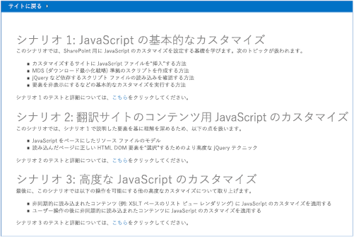
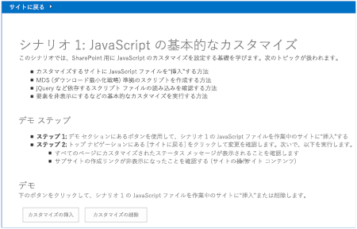
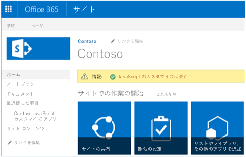
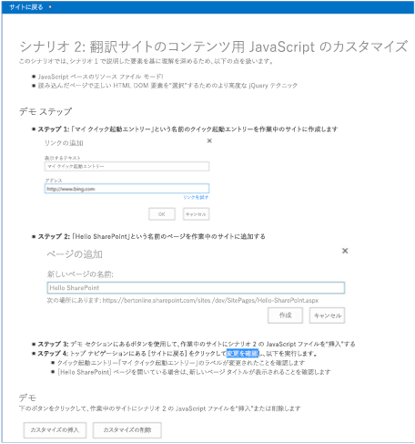
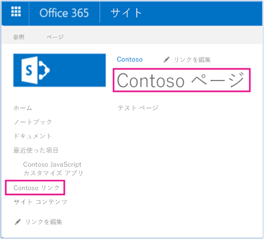

# SharePoint 用の UI 要素サンプル アドインのローカライズ

JavaScript を使用して、SharePoint UI 要素値のテキスト値を JavaScript リソース ファイルから読み込んだ翻訳済みのテキスト値に置き換えて、この UI 要素をローカライズできます。 

_**適用対象:** Office 365 | SharePoint 2013 | SharePoint Online_
    
[Core.JavaScriptCustomization](https://github.com/OfficeDev/PnP/tree/master/Samples/Core.JavaScriptCustomization) サンプル アドインは、JavaScript を使用して、SharePoint UI 要素のテキスト値を JavaScript リソース ファイルから読み込んだ翻訳済みのテキスト値に置き換える方法を示します。 

**メモ**  JavaScript リソース ファイル内の翻訳済みのテキスト値の保守を行う必要があります。 

このコード サンプルでは、プロバイダー ホスト型アドインを使用して以下の操作を実行します。

- 特定のテキスト値でサイト ページやサイド リンク バーのリンク タイトルをローカライズします。
    
- 主言語でサイト ページやサイド リンク バーのリンク タイトルを保存し、実行時に別の言語で翻訳済みバージョンのサイト ページやサイド リンク バーのリンク タイトルを表示します。
    
- クライアント側のローカライズに JavaScript リソース ファイルを使用します。
    
- カスタム アクションを使用して JavaScript ファイルを SharePoint サイトにリンクします。
    
- サイトの UI カルチャを調べてから、カルチャ固有のテキスト値を JavaScript リソース ファイルから読み込みます。
    
- JQuery を使用して、カルチャ固有のテキスト値でサイト ページとサイド リンク バーのリンク タイトルを上書きします。

## はじめに
<a name="sectionSection0"> </a>

まず、[Core.JavaScriptCustomization](https://github.com/OfficeDev/PnP/tree/master/Samples/Core.JavaScriptCustomization) サンプル アドインを、GitHub の [Office 365 Developer Patterns and Practices](https://github.com/OfficeDev/PnP/tree/dev) プロジェクトからダウンロードします。

このコード サンプルを実行する前に、サイトの言語設定を構成し、ユーザーのプロファイル ページの表示言語を設定します。

### サイトで言語設定を構成するには

1. チーム サイトで、 **[設定]** > **[サイトの設定]** を選択します。
    
2. **[サイトの管理]** で、 **[言語設定]** を選択します。
    
3. **[言語設定]** ページの **[第 2 言語]** で、サイトでサポートする第 2 言語を選択します。たとえば、図 1 のように **[フランス語]** と **[フィンランド語]** を選択します。
    
4. [ **OK**] をクリックします。

### ユーザーのプロファイル ページで表示言語を設定するには

1. 図 2 のように、Office 365 サイトのトップで、自分のプロファイル画像を選択してから  **[自己紹介]** を選択します。
    
2. **[自己紹介]** ページで、 **[プロファイルの編集]** を選択します。
    
3. 追加オプションの省略記号 (...) を選択してから、 **[言語と地域]** を選択します。
    
4. **[表示言語]** で、 **[新しい言語の選択]** ドロップダウン内の新しい言語を選択してから、 **[追加]** を選択します。たとえば、図 3 のようにフランス語とフィンランド語を選択します。上下の矢印ボタンを選択して、優先言語を上下に移動する必要が生じることもあります。
    
5. **[すべて保存して閉じる]** を選択します。

**メモ**  選択した言語でサイトが表示されるまでに数分かかる場合があります。

**重要**  CSOM は新機能で定期的に更新されます。CSOM でサイト ページやサイド リンク バーのリンク タイトルの更新に関する新機能が提供されている場合は、この記事で説明されているオプションではなく CSOM の新機能を使用することをお勧めします。

**図 1. サイトの言語を設定する**

![[サイトの設定] の [言語設定] ページのスクリーンショット](media/0265dd57-cf25-4879-a6df-68072ffa5270.png)

**図 2. [自己紹介] を選択してユーザーのプロファイル ページにナビゲートする**

![[自己紹介] が選択された状態のユーザー プロファイル ページのスクリーンショット](media/e3971203-7011-40ad-ab1b-341af2df28fc.png)

**図 3. ユーザーのプロファイル ページでユーザーの表示言語設定を変更する**

![[詳細の編集] ページの [言語と地域] セクションのスクリーンショット](media/ff41b24e-42eb-48ca-83cd-00d88ef753bd.png)

このコード サンプルの[シナリオ 2](#bk_Scenario2) を実行する前に、以下のタスクを完了してください。

### クイック起動のリンクを作成するには

1. ホスト Web で、 **[リンクの編集]** を選択します。
    
2. 図 4 のように、 **[リンク]** を選択します。
    
3. **[表示するテキスト]** で、 **My quicklaunch entry** と入力します。
    
4. **[アドレス]** で、Web サイトの URL を入力します。
    
5. **[OK]** > **[保存]** を選択します。

**図 4. サイド リンク バーにリンクを追加する**

![リンクが選択された状態の [リンクの編集] ページのスクリーンショット](media/fcb28647-1576-4e86-8ca7-15f3ce8d85fb.png)

### サイト ページを作成するには

1. ホスト Web で、 **[サイト コンテンツ]**  >  **[サイト ページ]**  >  **[新規]** を選択します。
    
2. **[新しいページ名]** で、 **Hello SharePoint** と入力します。
    
3. **[作成]** を選択します。
    
4. ページの本文に  **Test page** と入力します。
    
5. **[保存]** を選択します。

## Core.JavaScriptCustomization サンプル アプリの使用
<a name="sectionSection1"> </a>

このサンプル コードを実行すると、図 5 のように、プロバイダー ホスト型アプリケーションが表示されます。シナリオ 1 とシナリオ 2 の手法を使用して、ローカライズされたバージョンのサイト ページやクイック起動のリンク タイトルを提供することがあるので、この記事ではシナリオ 1 とシナリオ 2 について説明します。 

**図 5. Core.JavaScriptCustomization アプリの開始ページ**


### シナリオ 1

シナリオ 1 では、カスタム アクションを使用して、SharePoint サイト上の JavaScript ファイルへの参照を追加する方法を示します。 **[カスタマイズの挿入]** ボタンを選択すると、scenario1.aspx.cs 内の **btnSubmit_Click** メソッドが呼び出されます。 **btnSubmit_Click** メソッドは **AddJsLink** を呼び出して、ホスト Web 上でカスタム アクションを使用して JavaScript ファイルへの参照を追加します。

図 6 は、シナリオ 1 の開始ページを示します。

**図 6. シナリオ 1 の開始ページ**



**AddJSLink** メソッドは **OfficeDevPnP.Core** 内の JavaScriptExtensions.cs ファイルの一部です。**AddJSLink** には、カスタム アクションに割り当てる識別子を表す文字列と、ホスト Web に追加する JavaScript ファイルに対する URL のセミコロンで区切った一覧を含む文字列を指定する必要があります。なお、このコード サンプルは Scripts\scenario1.js への参照を追加し、scenario1.js はステータス バー メッセージをホスト Web に追加します。
    
**メモ**  この記事で提供されるコードは、明示または黙示のいかなる種類の保証なしに現状のまま提供されるものであり、特定目的への適合性、商品性、権利侵害の不存在についての暗黙的な保証は一切ありません。

```
protected void btnSubmit_Click(object sender, EventArgs e)
        {
            var spContext = SharePointContextProvider.Current.GetSharePointContext(Context);
            using (var cc = spContext.CreateUserClientContextForSPHost())
            {
                cc.Web.AddJsLink(Utilities.Scenario1Key, Utilities.BuildScenarioJavaScriptUrl(Utilities.Scenario1Key, this.Request));
            }
        }
```
   
**メモ**  SharePoint 2013 はダウンロード最小化戦略を使用して、ユーザーが SharePoint サイト上のページ間をナビゲートする際にブラウザーでダウンロードされるデータの量を減らします。詳細については、「[ダウンロード最小化戦略の概要](http://msdn.microsoft.com/library/9caa7d99-1e74-4889-96c7-ba5a10772ad7.aspx)」を参照してください。scenario1.js 内の以下のコードは、SharePoint サイト上でダウンロード最小化戦略が使用されるかどうかにかかわらず、必ず **RemoteManager_Inject** メソッドが呼び出され、JavaScript コードが実行されてステータス バー メッセージがホスト Web に追加されるようにします。

```
if ("undefined" != typeof g_MinimalDownload &amp;&amp; g_MinimalDownload &amp;&amp; (window.location.pathname.toLowerCase()).endsWith("/_layouts/15/start.aspx") &amp;&amp; "undefined" != typeof asyncDeltaManager) {
    // Register script for MDS if possible.
    RegisterModuleInit("scenario1.js", RemoteManager_Inject); //MDS registration
    RemoteManager_Inject(); //non MDS scenario
} else {
    RemoteManager_Inject();
}
```

**メモ**  一部の JavaScript ファイルが正常に実行されて完了するには、その前にまず他の JavaScript ファイルが読み込まれる必要があります。以下の **RemoteManager_Inject** から構成されているコードは、scenario1.js 内の **loadScript** 関数を使用して、最初に jQuery を読み込んでから、引き続き残りの JavaScript コードを実行します。

```
var jQuery = "https://ajax.aspnetcdn.com/ajax/jQuery/jquery-2.0.2.min.js";

    // Load jQuery first, then continue running the rest of the code.
    loadScript(jQuery, function () {
     // Add additional JavaScript code here to complete your task. 
});
```

**[サイトに戻る]** を選択します。図 7 のように、scenario1.js によって追加されたステータス バー メッセージがホスト Web に表示されるようになります。

**図 7. JavaScript を使用してチーム サイトに追加されたステータス バー メッセージ**



### シナリオ 2
<a name="bk_Scenario2"> </a>

シナリオ 2 では、シナリオ 1 で説明されている手法を使用して、UI テキストを JavaScript リソース ファイルから読み取られた翻訳済みのテキストに置き換えます。シナリオ 2 は、以前に作成したクイック起動のリンク タイトル ( **My quicklaunch entry**) とサイト ページ タイトル ( **Hello SharePoint**) を置き換えます。シナリオ 2 では、カルチャ固有の JavaScript リソース ファイル内の変数から翻訳済みのテキスト値を読み取る JavaScript ファイルを添付してから、UI を更新します。図 8 は、シナリオ 2 の開始ページを示しています。

**図 8. シナリオ 2 の開始ページ**



図 8 のように、**[カスタマイズの挿入]** を選択すると、以下の変更がサイトに適用されます。

- サイド リンク バーのリンク タイトル  **My quicklaunch entry** が **Contoso link** に変更されます。
    
- **Hello SharePoint** サイト ページ タイトルが **Contoso page** に変更されます。

**図 9. シナリオ 2 のカスタマイズ**


    
**メモ**  クイック起動のリンク タイトルやサイト ページ タイトルの実際の値が図 8 に示されている値と違う場合、JavaScript リソース ファイル scenario2.en-us.js か scenario2.nl-nl.js 内の **quickLauch_Scenario2** 変数や **pageTitle_HelloSharePoint** 変数を編集してから、コード サンプルを再度実行します。scenario2.en-us.js ファイルは、米国英語のカルチャ固有のリソースを格納します。scenario2.nl-nl.js ファイルは、オランダ語のカルチャ固有のリソースを格納します。別の言語を使用してこのコード サンプルをテストしようとしている場合は、同じ名前付け規則を使用して別の JavaScript リソース ファイルを作成することを検討してください。

シナリオ 1 と同様に、scenario2.aspx.cs 内の  **btnSubmit_Click** は **AddJsLink** を呼び出して Scripts\scenario2.js ファイルへの参照を追加します。scenario2.js 内の **RemoteManager_Inject** 関数は、以下のタスクを実行する **TranslateQuickLaunch** 関数を呼び出します。

- **_spPageContextInfo.currentUICultureName** を使用してサイトのカルチャを判別します。
    
- サイトの UI カルチャと一致するカルチャ固有リソースが含まれている JavaScript リソース ファイルを読み込みます。たとえば、サイトのカルチャが米国英語の場合、scenario2.en-us.js ファイルが読み込まれます。
    
- **my quicklaunch entry** を、JavaScript リソース ファイルから読み取られる **quickLauch_Scenario2** 変数の値に置き換えます。

```
function RemoteManager_Inject() {

    var jQuery = "https://ajax.aspnetcdn.com/ajax/jQuery/jquery-2.0.2.min.js";
    
    loadScript(jQuery, function () {
        SP.SOD.executeOrDelayUntilScriptLoaded(function () { TranslateQuickLaunch(); }, 'sp.js');
    });
}

function TranslateQuickLaunch() {
    // Load jQuery and if complete, load the JS resource file.
    var scriptUrl = "";
    var scriptRevision = "";
    // iterate over the scripts loaded on the page to find the scenario2 script. Then use the script URL to dynamically build the URL for the resource file to be loaded.
    $('script').each(function (i, el) {
        if (el.src.toLowerCase().indexOf('scenario2.js') > -1) {
            scriptUrl = el.src;
            scriptRevision = scriptUrl.substring(scriptUrl.indexOf('.js') + 3);
            scriptUrl = scriptUrl.substring(0, scriptUrl.indexOf('.js'));
        }
    })

    var resourcesFile = scriptUrl + "." + _spPageContextInfo.currentUICultureName.toLowerCase() + ".js" + scriptRevision;
    // Load the JS resource file based on the user's language settings.
    loadScript(resourcesFile, function () {

        // General changes that apply to all loaded pages.
        // ----------------------------------------------

        // Update the Quick Launch labels.
        // Note that you can use the jQuery  function to iterate over all elements that match your jQuery selector.
        $("span.ms-navedit-flyoutArrow").each(function () {
            if (this.innerText.toLowerCase().indexOf('my quicklaunch entry') > -1) {
                // Update the label.
                $(this).find('.menu-item-text').text(quickLauch_Scenario2);
                // Update the tooltip.
                $(this).parent().attr("title", quickLauch_Scenario2);
            }
        });

        // Page specific changes require an IsOnPage call.
        // ----------------------------------------------------------

        // Change the title of the "Hello SharePoint" page.
        if (IsOnPage("Hello%20SharePoint.aspx")) {
            $("#DeltaPlaceHolderPageTitleInTitleArea").find("A").each(function () {
                if ($(this).text().toLowerCase().indexOf("hello sharepoint") > -1) {
                    // Update the label.
                    $(this).text(pageTitle_HelloSharePoint);
                    // Update the tooltip.
                    $(this).attr("title", pageTitle_HelloSharePoint);
                }
            });
        }

    });
}
```

## その他のリソース
<a name="bk_addresources"> </a>

-  [SharePoint 2013 と SharePoint Online のローカリゼーション ソリューション](localization-solutions-for-sharepoint-2013-and-sharepoint-online.md)
    
-  [Core.JavaScriptCustomization](https://github.com/OfficeDev/PnP/tree/master/Samples/Core.JavaScriptCustomization)
