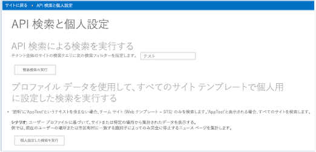
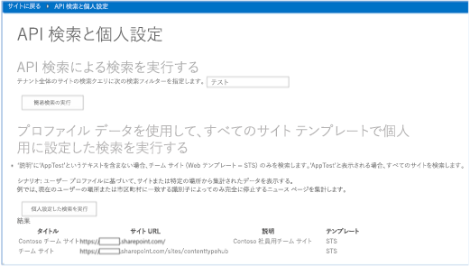
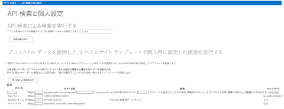

# 検索結果のカスタマイズ サンプル アドイン (SharePoint)

ユーザー プロファイル プロパティの値に基づいて、ユーザーに表示される情報をフィルター処理して、SharePoint をカスタマイズできます。
    
_**適用対象:** Office 365? | SharePoint 2013? | SharePoint Online_
    
[Search.PersonalizedResults](https://github.com/OfficeDev/PnP/tree/master/Samples/Search.PersonalizedResults) コード サンプルは、ユーザー プロファイル プロパティの値に基づいて情報をフィルター処理して SharePoint をカスタマイズする方法を示します。たとえば、以下のようにカスタマイズできます。

- ニュース記事などのコンテンツを国や場所によってフィルター処理します。
    
- ユーザーの役割や組織に基づいてナビゲーション リンクをフィルター処理します。
    
- 事業所の場所に基づいてレストランや小売店を一覧表示します。
    
このコード サンプルは、プロバイダー ホスト型アドインを使用して、ユーザーがアクセス許可を持つすべてのサイトまたはチーム サイトのみが含まれる検索結果をそのユーザーに対して表示します。このために、サンプルでは以下の処理が実行されます。

- **AboutMe** ユーザー プロファイル プロパティの値を調べます。
    
- **AboutMe** ユーザー プロファイル プロパティの値に関連付けられた検索クエリ フィルター文字列を構築します。
    
- 検索クエリを実行し、検索クエリの結果を表示します。

## はじめに
<a name="sectionSection0"> </a>

まず、[Search.PersonalizedResults](https://github.com/OfficeDev/PnP/tree/master/Samples/Search.PersonalizedResults) サンプル アドインを、GitHub の [Office 365 Developer Patterns and Practices](https://github.com/OfficeDev/PnP/tree/dev) プロジェクトからダウンロードします。

## Search.PersonalizedResults アプリの使用
<a name="sectionSection1"> </a>

このコード サンプルを実行すると、図 1 のように、プロバイダー ホスト型アプリケーションが表示されます。 

**図 1.  Search.PersonalizedResults アプリの開始ページ**



この記事では、「**すべてのサイト テンプレートに対して、プロファイル データを使用して個人用に設定した検索を実行する**」というシナリオについて説明します。 図 2 に示すように、**[カスタマイズ検索の実行]** を選択すると、チーム サイトのみ含まれるようにフィルター処理された検索結果が返されます。 **[テンプレート]** 列には、種類が **[STS]** のサイトのみ含まれていることに注意してください。

**図 2. チーム サイトのみが表示された検索結果**



カスタマイズ シナリオを処理するため、以下のようにして検索クエリを変更できます。

- ユーザーのユーザー プロファイル プロパティの値を読み取ってテストします。このコード サンプルは値  **AppTest** に対して **About Me** プロパティをテストします。
    
- ユーザー プロファイル プロパティの値に基づいて特定の連続したアクションを実行します。たとえば、 **About Me** ユーザー プロファイル プロパティの値が **AppTest** の場合、このコード サンプルはチーム サイトのフィルターを削除し、すべてのサイトを含む検索結果を返します。

### 自己紹介ユーザー プロファイル プロパティに AppTest を入力するには

1. 図 3 に示すように、Office 365 サイトのトップで、自分のプロファイル画像を選択してから **[自己紹介]** を選択します。
    
2. **[自己紹介]** ページで、**[プロファイルの編集]** を選択します。
    
3. **[自己紹介]** で、 **AppTest** と入力します。
    
4. **[すべて保存して閉じる]** を選択します。

**図 3. [自己紹介] を選択してユーザーのプロファイル ページに移動する**

![[自己紹介] が選択された状態のユーザー プロファイル ページのスクリーンショット](media/a7eccfcd-68f7-44b9-8f32-14a0d2f60398.png)

**Search.PersonalizedResults** プロバイダー ホスト型アドインに戻り、**[カスタマイズ検索の実行]** を再度選択します。図 4 のように、このアドインは検索クエリに対するフィルターを変更し、チーム サイトのみの代わりにすべてのサイトを表示します。**[テンプレート]** 列に数種類のサイト テンプレートが含まれるようになります。

**図 4. すべてのサイトが表示されている検索結果**



**[カスタマイズ検索の実行]** を選択すると、default.aspx.cs 内の **btnPersonalizedSearch_Click** メソッドが呼び出されます。 
                **btnPersonalizedSearch_Click** は、次に示すアクションを実行します。

- **PeopleManager** を使用して、このアドインを実行しているユーザーのユーザー プロファイル プロパティをすべて取得します。
    
- **AboutMe** ユーザー プロファイル プロパティの値を取得して調べます。 **AboutMe** プロパティの値が **AppTest** の場合、検索クエリではクエリ文字列 `contentclass:"STS_Site"` を使用してすべてのサイトが検索されます。 **AboutMe** プロパティの値が **AppTest** でない場合、検索文字列にチーム サイトのフィルターが付加され ( `WebTemplate=STS`)、検索クエリではチーム サイトのみ検索されます。
    
- **ProcessQuery** メソッドを呼び出して、指定したクエリ文字列に基づいて検索結果を取得します。 **ProcessQuery** は検索結果と共に返されるプロパティの一覧を指定する方法も示します。
    
- **FormatResults** メソッドを呼び出して、 検索結果を HTML テーブルに書式設定します。
    
**メモ**  この記事で提供されるコードは、明示または黙示のいかなる種類の保証なしに現状のまま提供されるものであり、特定目的への適合性、商品性、権利侵害の不存在についての暗黙的な保証は一切ありません。

```
protected void btnPersonalizedSearch_Click(object sender, EventArgs e)
        {
            var spContext = SharePointContextProvider.Current.GetSharePointContext(Context);

            using (var clientContext = spContext.CreateUserClientContextForSPHost())
            {
                // Load user profile properties.
                PeopleManager peopleManager = new PeopleManager(clientContext);
                PersonProperties personProperties = peopleManager.GetMyProperties();
                clientContext.Load(personProperties);
                clientContext.ExecuteQuery();
                // Check the value of About Me. 
                string aboutMeValue = personProperties.UserProfileProperties["AboutMe"];
                string templateFilter = ResolveAdditionalFilter(aboutMeValue);
                // Build the query string.
                string query = "contentclass:\"STS_Site\" " + templateFilter;
                ClientResult<ResultTableCollection> results = ProcessQuery(clientContext, query);
                lblStatus2.Text = FormatResults(results);
            }
        }

private ClientResult<ResultTableCollection> ProcessQuery(ClientContext ctx, string keywordQueryValue)
        {
            KeywordQuery keywordQuery = new KeywordQuery(ctx);
            keywordQuery.QueryText = keywordQueryValue;
            keywordQuery.RowLimit = 500;
            keywordQuery.StartRow = 0;
            keywordQuery.SelectProperties.Add("Title");
            keywordQuery.SelectProperties.Add("SPSiteUrl");
            keywordQuery.SelectProperties.Add("Description");
            keywordQuery.SelectProperties.Add("WebTemplate");
            keywordQuery.SortList.Add("SPSiteUrl", Microsoft.SharePoint.Client.Search.Query.SortDirection.Ascending);
            SearchExecutor searchExec = new SearchExecutor(ctx);
            ClientResult<ResultTableCollection> results = searchExec.ExecuteQuery(keywordQuery);
            ctx.ExecuteQuery();
            return results;
        }
```

## その他の技術情報
<a name="bk_addresources"> </a>

-  [SharePoint 2013 と SharePoint Online のユーザー プロファイル ソリューション](user-profile-solutions-for-sharepoint.md)
    
-  [Search.PersonalizedResults アプリ](https://github.com/OfficeDev/PnP/tree/master/Samples/Search.PersonalizedResults)
    
-  [UserProfile.Manipulation.CSOM](https://github.com/OfficeDev/PnP/tree/master/Samples/UserProfile.Manipulation.CSOM)
    
-  [UserProfile.Manipulation.CSOM.Console](https://github.com/OfficeDev/PnP/tree/master/Samples/UserProfile.Manipulation.CSOM.Console)
    
-  [Core.ProfileProperty.Migration](https://github.com/OfficeDev/PnP/tree/master/Samples/Core.ProfileProperty.Migration)
