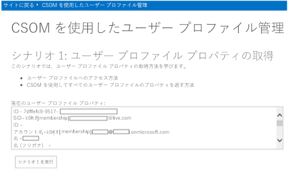
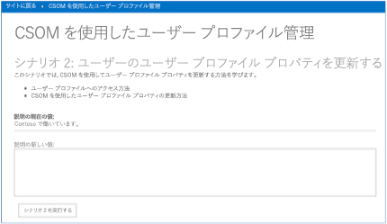
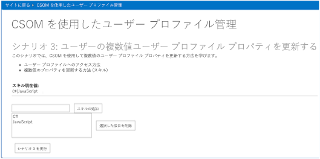

# ユーザー プロファイル プロパティの読み取りまたは更新サンプル アドイン (SharePoint)

プロバイダー向けのホスト型アドインを使用して、SharePoint の単一値または複数値を持つユーザー プロファイル プロパティを読み取ったり更新したりできます。

_**適用対象:** Office 365? | SharePoint 2013? | SharePoint Online_
    
[UserProfile.Manipulation.CSOM](https://github.com/OfficeDev/PnP/tree/master/Samples/UserProfile.Manipulation.CSOM) サンプルは、特定のユーザーのユーザー プロファイル プロパティを読み取って更新する方法を示します。このサンプルでは、プロバイダー向けのホスト型アドインを使用して以下の操作を実行します。

- ユーザーのすべてのユーザー プロファイル プロパティを読み取って表示します。
    
- 単一値を持つユーザー プロファイル プロパティを更新します。
    
- 複数値を持つユーザー プロファイル プロパティを更新します。
    
このソリューションは、以下の操作を行う場合に使用します。

- ユーザーのユーザー プロファイル プロパティに対してデータの読み書きを実行します。 
    
- ユーザー プロファイル プロパティの値を使用して SharePoint を個人用設定します。

**メモ**  このコード サンプルは Office 365 のみで実行できます。 

## はじめに
<a name="sectionSection0"> </a>

まず、[UserProfile.Manipulation.CSOM](https://github.com/OfficeDev/PnP/tree/master/Samples/UserProfile.Manipulation.CSOM) サンプル アドインを、GitHub の [Office 365 Developer Patterns and Practices](https://github.com/OfficeDev/PnP/tree/dev) プロジェクトからダウンロードします。

シナリオ 1 を 実行する前に、以下を実行します。

1. 図 1 のように、Office 365 サイトのトップで、自分のプロファイル画像を選択してから  **[自己紹介]** を選択します。 
    
2. **[自己紹介]** ページで、 **[プロファイルの編集]** を選択します。
    
3. **[自己紹介]** で、I work at Contoso と入力します。
    
4. **[すべて保存して閉じる]** を選択します。 
    
シナリオ 3 を 実行する前に、以下を実行します。

1. 図 1 のように、サイトのトップで、自分のプロファイル画像を選択してから **[自己紹介]** を選択します。 
    
2. **[自己紹介]** ページで、 **[プロファイルの編集]** を選択します。
    
3. **[詳細の編集]** で、 **[詳細]** を選択します。
    
4. **[スキル]** で、C#, JavaScript と入力します。
    
5. **[すべて保存して閉じる]** を選択します。 

**図 1. [自己紹介] を選択してユーザーのプロファイル ページにナビゲートする**

![[自己紹介] が選択された状態のユーザー プロファイル ページのスクリーンショット](media/692b9a82-45df-4c82-960b-42281be39f1c.png)

## UserProfile.Manipulation.CSOM アプリの使用
<a name="sectionSection1"> </a>

このサンプルを実行すると、図 2 のように、プロバイダー向けのホスト型アドインが開始されます。

**図 2. UserProfile.Manipulation.CSOM アプリの開始ページ**


このコード サンプルには、3 つのシナリオが含まれています。

|シナリオ|説明される方法...|
|:---|:---|
|1|アプリを実行しているユーザーのユーザー プロファイル プロパティをすべて読み取ります。|
|2|<p>単一値を持つユーザー プロファイル プロパティを更新します。</p><p>
            **メモ:**このシナリオは Office 365 でのみサポートされます。</p>|
|3|<p>複数値を持つユーザー プロファイル プロパティを更新します。</p><p>
            **メモ:**このシナリオは Office 365 でのみサポートされます。</p>|

### シナリオ 1:すべてのユーザー プロファイル プロパティの取得

**[シナリオ 1 の実行]** を選択すると、アドインは現在のユーザーのユーザー プロファイル プロパティをすべて読み取ってから、図 3 のように、ユーザー プロファイル データを **[現在のユーザー プロファイル プロパティ]** に表示します。

**図 3. 現在のユーザーのプロファイル プロパティ データ**



**[シナリオ 1 の実行]** を選択すると、CodeSample1.aspx.cs 内の **btnScenario1_Click** メソッドが呼び出され、以下のタスクを実行します。

- **PeopleManager** を使用して、現在のユーザーのユーザー プロファイル プロパティをすべて取得します。
    
- **PersonProperties.UserProfileProperties** の反復処理を実行して、テキスト ボックス内にユーザー プロファイル プロパティの値を一覧表示します。
    
**メモ**  この記事で提供されるコードは、明示または黙示のいかなる種類の保証なしに現状のまま提供されるものであり、特定目的への適合性、商品性、権利侵害の不存在についての暗黙的な保証は一切ありません。

```C#
protected void btnScenario1_Click(object sender, EventArgs e)
        {

            var spContext = SharePointContextProvider.Current.GetSharePointContext(Context);

            using (var clientContext = spContext.CreateUserClientContextForSPHost())
            {
                // Get the people manager instance and load current properties.
                PeopleManager peopleManager = new PeopleManager(clientContext);
                PersonProperties personProperties = peopleManager.GetMyProperties();
                clientContext.Load(personProperties);
                clientContext.ExecuteQuery();

                // Output user profile properties to a text box.
                txtProperties.Text = "";
                foreach (var item in personProperties.UserProfileProperties)
                {
                    txtProperties.Text += string.Format("{0} - {1}{2}", item.Key, item.Value, Environment.NewLine);
                }
            }
        }
```

### シナリオ 2: 単一値を持つユーザー プロファイル プロパティの更新

シナリオ 2 では、単一値を持つユーザー プロファイル プロパティを更新する方法を示します。図 4 のように、このアドインを実行しているユーザーの  **[自己紹介]** ユーザー プロファイル プロパティの現在の値は **I work at Contoso** です。 **[自己紹介]** ユーザー プロファイル プロパティの値を更新するには、 **[自己紹介の新しい値]** ボックスで、I am a software engineer at Contoso と入力してから **[シナリオ 2 の実行]** を選択します。このコードは、 **[自己紹介]** プロパティの値を **I am a software engineer at Contoso** に更新します。図 5 のように、アドインは **[自己紹介の現在の値]** を **[自己紹介]** ユーザー プロファイル プロパティの新しい値で更新します。

**図 4. シナリオ 2 の開始ページ**



**図 5. 更新された [自己紹介] ユーザー プロファイル プロパティ**

![更新された [自己紹介] ユーザー プロファイル プロパティのスクリーンショット](media/9ffc34d9-b9b5-481c-8b63-fa28bc883d04.png)

**[シナリオ 2 の実行]** を選択すると、CodeSample2.aspx.cs 内の **btnScenario2_Click** メソッドが呼び出され、以下の操作を実行します。

- **PeopleManager** を使用して、現在のユーザーのユーザー プロファイル プロパティを取得します。
    
- HTML でユーザーが入力したテキストの書式を設定します。
    
- **SetSingleValueProfileProperty** を使用して、**AboutMe** ユーザー プロファイル プロパティの値を更新します。  
                **SetSingleValueProfileProperty** は、次に示す 3 つのパラメーターを受け取ります。
    
    - 更新するユーザー プロファイルを持つユーザーのアカウント名。
    
    - ユーザー プロファイル プロパティ名 (このシナリオでは **AboutMe**)。
    
    - HTML 形式のプロパティ値 (このシナリオでは  **I am a software engineer at Contoso**)。
    
```C#
protected void btnScenario2_Click(object sender, EventArgs e)
        {
            var spContext = SharePointContextProvider.Current.GetSharePointContext(Context);

            using (var clientContext = spContext.CreateUserClientContextForSPHost())
            {
                // Get the people manager instance and initialize the account name.
                PeopleManager peopleManager = new PeopleManager(clientContext);
                PersonProperties personProperties = peopleManager.GetMyProperties();
                clientContext.Load(personProperties, p => p.AccountName);
                clientContext.ExecuteQuery();

                // Convert entry to HTML.
                string updatedValue = (txtAboutMe.Text).Replace(Environment.NewLine, "");

                // Update the AboutMe property for the user using account name from the user profile.
                peopleManager.SetSingleValueProfileProperty(personProperties.AccountName, "AboutMe", updatedValue);
                clientContext.ExecuteQuery();

            }
        }
```
    
**メモ**  カスタムのユーザー プロファイル プロパティを使用する場合、ユーザーが編集できるようにプロパティを構成します。このシナリオで使用している手法は、カスタムのユーザー プロファイル プロパティに有効です。 

### シナリオ 3:複数値を持つユーザー プロファイル プロパティの更新

シナリオ 3 では、複数値を持つユーザー プロファイル プロパティの更新方法を示します。 図 6 は、シナリオ 3 の開始ページです。  
                **[スキルの現在値]** には、アプリを実行しているユーザーのスキルが表示されます。 このスキルは、そのユーザーの SPS-Skills ユーザー プロファイル プロパティから読み込まれます。

**図 6. シナリオ 3 の開始ページ**



このアドインから SPS-Skills ユーザー プロファイル プロパティに新しいスキルを追加するには、以下の操作を実行します。

1. HTML5 と入力してから、 **[スキルの追加]** を選択します。 
    
2. ASP.Net と入力してから、 **[スキルの追加]** を選択します。 
    
3. **[シナリオ 3 の実行]** を選択します。
    
4. **[スキルの現在の値]** にユーザーのスキルの新しい一覧が表示されていることを確認します。
    
5. ユーザーの  **[SPS-Skills]** ユーザー プロファイル プロパティにスキルの新しい一覧が表示されたことを確認します。
    
**[シナリオ 3 の実行]** を選択すると、CodeSample3.aspx.cs 内の **btnScenario3_Click** を呼び出して、以下の操作を実行します。

- **PeopleManager** を使用して、現在のユーザーのユーザー プロファイル プロパティを取得します。
    
- リスト ボックスに表示されるスキルの一覧を読み取ります。 
    
- **SetMultiValuedProfileProperty** を使用して、**SPS-Skills** ユーザー プロファイル プロパティに新しいスキルを保存します。  
                **SetMultiValuedProfileProperty** は、次に示す 3 つのパラメーターを受け取ります。
    
    - 更新しようとしているユーザー プロファイルを持つユーザーのアカウント名。
    
    - ユーザー プロファイル プロパティ名 (**SPS-Skills**)。
    
    - プロファイル値 (文字列オブジェクトの  **List** として)。

```C#
  protected void btnScenario3_Click(object sender, EventArgs e)
        {
            var spContext = SharePointContextProvider.Current.GetSharePointContext(Context);

            using (var clientContext = spContext.CreateUserClientContextForSPHost())
            {
                // Get the people manager instance and initialize the account name.
                PeopleManager peopleManager = new PeopleManager(clientContext);
                PersonProperties personProperties = peopleManager.GetMyProperties();
                clientContext.Load(personProperties, p => p.AccountName);
                clientContext.ExecuteQuery();

                // Collect the user's skills from the list box in order to update the user's profile.
                List<string> skills = new List<string>();
                for (int i = 0; i < lstSkills.Items.Count; i++)
                {
                    skills.Add(lstSkills.Items[i].Value);
                }

                // Update the SPS-Skills property for the user using account name from the user's profile.
                peopleManager.SetMultiValuedProfileProperty(personProperties.AccountName, "SPS-Skills", skills);
                clientContext.ExecuteQuery();

                // Refresh the values.
                RefreshUIValues();
            }

        }
```
## その他のリソース
<a name="bk_addresources"> </a>

-  [SharePoint 2013 と SharePoint Online のユーザー プロファイル ソリューション](user-profile-solutions-for-sharepoint.md)
    
-  [ Search.PersonalizedResults サンプル](https://github.com/OfficeDev/PnP/tree/master/Samples/Search.PersonalizedResults)
