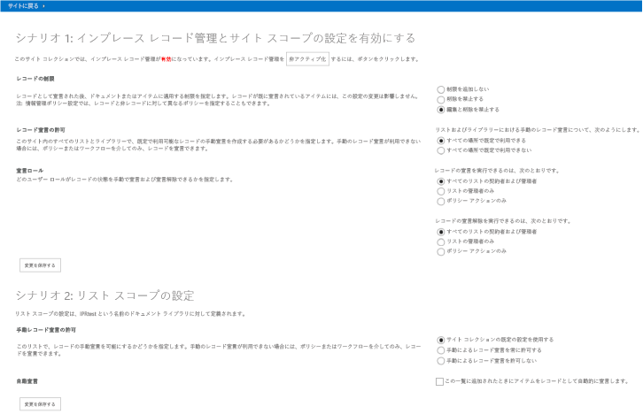

# レコード管理の拡張サンプル アプリ (SharePoint)

エンタープライズ コンテンツ管理 (ECM) 戦略の一環として、SharePoint のサイトとリストでインプレース レコード管理の設定の有効化と変更を行えます。

_**適用対象:** Office 365? | SharePoint 2013? | SharePoint Online_

[ECM.RecordsManagement](https://github.com/OfficeDev/PnP/tree/master/Samples/ECM.RecordsManagement) サンプルは、サイトまたはリストのインプレース レコード管理の設定を制御する、プロバイダーがホストする SharePoint アプリの使用方法を示しています。    

以下を行う場合は、このソリューションを使用します。

- カスタム サイト プロビジョニング プロセス中にインプレース レコード管理の設定を構成する。
 
## はじめに
<a name="sectionSection0"> </a>

まず、[ECM.RecordsManagement](https://github.com/OfficeDev/PnP/tree/master/Samples/ECM.RecordsManagement) サンプル アドインを GitHub の [Office 365 Developer Patterns and Practices](https://github.com/OfficeDev/PnP/tree/dev) プロジェクトからダウンロードします。

このアプリを実行する前に

- 図 1 に示すように、サイト コレクションでインプレース レコード管理機能をアクティブ化します。
    
    **図 1.  サイト コレクションでインプレース レコード管理をアクティブにする**

    ![アクティブ化されたインプレース レコード管理機能が強調表示されている [サイト コレクションの機能] ページのスクリーン ショット。](media/d99269ae-b8fc-445b-a1b8-1612b16dcba6.png)

- サイトの設定では、図 2 に示すように、**[サイト コレクション管理]** に **[レコード宣言の設定]** が表示されていることを確認します。
    
    **図 2. [サイトの設定] の [レコード宣言の設定]**

    ![[レコード宣言の設定] が強調表示されている [サイトの設定] ページのスクリーン ショット。](media/13a6a490-68cd-4f70-8714-cd6222325890.png)

## ECM.RecordsManagement サンプル アプリケーションを使用する
<a name="sectionSection1"> </a>

 アプリを起動すると、開始ページに使用可能な 2 つのシナリオが表示されます。

- サイト用のインプレース レコード管理を有効にする
    
- リスト用のインプレース レコード管理を有効にする

**図 3. ECM.RecordsManagement アプリの開始ページ**

 

シナリオ 1 を使用すると、サイト コレクションのレコード管理設定を制御する UI を作成できます。このアプリケーションの UI は、**[サイトの設定]** の **[レコード宣言の設定]** にある UI と似ています (図 2 を参照)。サイト コレクションでインプレース レコード管理機能をアクティブ化または非アクティブ化することもできます。

シナリオ 2 を使用すると、リストのレコード管理設定を制御する UI を作成できます。 このアプリの UI は、リストのライブラリ設定にある **[レコード宣言の設定]** の UI と似ています。

**図 4. リストの [レコード宣言の設定]**

![[ライブラリのレコード宣言設定] ページのスクリーン ショット。](media/2522e4b0-5d5c-40bc-829d-f13d96a2b233.png)
### シナリオ 1

シナリオ 1 は、インプレース レコード管理機能とサイトの設定に対応しています。 図 5 に示すように、アプリケーションの UI には **[非アクティブ化]** (または **[アクティブ化]**) ボタンがあります。 このボタンを選択すると、サイト コレクションでのインプレース レコード管理機能が非アクティブ化 (またはアクティブ化) されます。 

**図 5. インプレース レコード管理機能の [非アクティブ化] ボタン**


次のコードは、サイト コレクションでのインプレース レコード管理機能のアクティブ化または非アクティブ化を行います。**DisableInPlaceRecordsManagementFeature** メソッドと **EnableSiteForInPlaceRecordsManagement** メソッドは、[OfficeDevPnP.Core](https://github.com/OfficeDev/PnP/tree/master/OfficeDevPnP.Core) にある AppModelExtensions\RecordsManagementExtensions.cs ファイルの一部です。
    
**メモ**  この記事で提供されるコードは、明示または黙示のいかなる種類の保証なしに現状のまま提供されるものであり、特定目的への適合性、商品性、権利侵害の不存在についての暗黙的な保証は一切ありません。

```C#
protected void btnToggleIPRStatus_Click(object sender, EventArgs e)
        {
            if (cc.Site.IsInPlaceRecordsManagementActive())
            {
                cc.Site.DisableInPlaceRecordsManagementFeature();
                IPRStatusUpdate(false);
            }
            else
            {
                cc.Site.EnableSiteForInPlaceRecordsManagement();
                IPRStatusUpdate(true);
            }
        }
```

OfficeDevPnP.Core には、サイトを対象範囲とするインプレース レコード管理設定すべての取得と設定を行う拡張メソッドがあります。**EnableSiteForInPlaceRecordsManagement** メソッドの次のコードは、これらの拡張メソッドを使用して制約を設定する方法、およびサイトのレコード宣言またはレコード宣言の解除を行えるユーザーを指定する方法を示しています。

```C#
public static void EnableSiteForInPlaceRecordsManagement(this Site site)
        {
            // Activate the In-Place Records Management feature if not yet enabled.
            if (!site.IsFeatureActive(new Guid(INPLACE_RECORDS_MANAGEMENT_FEATURE_ID)))
            {
                // Note: this also sets the ECM_SITE_RECORD_RESTRICTIONS value to "BlockDelete, BlockEdit".
                site.ActivateInPlaceRecordsManagementFeature();
            }

            // Enable in-place records management in all locations.
            site.SetManualRecordDeclarationInAllLocations(true);

            // Set restrictions to default values after enablement (this is also done at feature activation).
            EcmSiteRecordRestrictions restrictions = EcmSiteRecordRestrictions.BlockDelete | EcmSiteRecordRestrictions.BlockEdit;
            site.SetRecordRestrictions(restrictions);

            // Set record declaration to default value.
            site.SetRecordDeclarationBy(EcmRecordDeclarationBy.AllListContributors);

            // Set record undeclaration to default value.
            site.SetRecordUnDeclarationBy(EcmRecordDeclarationBy.OnlyAdmins);

        }
```

ユーザーがインプレース レコード管理の設定を変更し、**[変更の保存]** ボタンを選択すると、**btnSaveSiteScopedIPRSettings_Click** メソッドの次のコードが実行されます。

```C#
protected void btnSaveSiteScopedIPRSettings_Click(object sender, EventArgs e)
        {
            EcmSiteRecordRestrictions restrictions = (EcmSiteRecordRestrictions)Convert.ToInt32(rdRestrictions.SelectedValue);
            cc.Site.SetRecordRestrictions(restrictions);
            cc.Site.SetManualRecordDeclarationInAllLocations(Convert.ToBoolean(rdAvailability.SelectedValue));
            EcmRecordDeclarationBy declareBy = (EcmRecordDeclarationBy)Convert.ToInt32(rdDeclarationBy.SelectedValue);
            cc.Site.SetRecordDeclarationBy(declareBy);
            EcmRecordDeclarationBy unDeclareBy = (EcmRecordDeclarationBy)Convert.ToInt32(rdUndeclarationBy.SelectedValue);
            cc.Site.SetRecordUnDeclarationBy(unDeclareBy);
        }
```

上記のコードでは、呼び出しは RecordsManagementExtensions.cs の **SetRecordRestrictions** メソッドに対して行われます。次の使用例では、**SetRecordRestrictions** はレコードに制約を設定する方法を示しています。

```C#
public static void SetRecordRestrictions(this Site site, EcmSiteRecordRestrictions restrictions)
        {
            string restrictionsProperty = "";

            if (restrictions.Has(EcmSiteRecordRestrictions.None))
            {
                restrictionsProperty = EcmSiteRecordRestrictions.None.ToString();
            }
            else if (restrictions.Has(EcmSiteRecordRestrictions.BlockEdit))
            {
                // BlockEdit is always used in conjunction with BlockDelete.
                restrictionsProperty = EcmSiteRecordRestrictions.BlockDelete.ToString() + ", " + EcmSiteRecordRestrictions.BlockEdit.ToString();
            }
            else if (restrictions.Has(EcmSiteRecordRestrictions.BlockDelete))
            {
                restrictionsProperty = EcmSiteRecordRestrictions.BlockDelete.ToString();
            }

            // Set property bag entry.
            site.RootWeb.SetPropertyBagValue(ECM_SITE_RECORD_RESTRICTIONS, restrictionsProperty);
        }
```

### シナリオ 2

シナリオ 2 は、リストのインプレース レコード管理の設定を操作する方法を示しています。アプリケーションをインストールすると、IPRTest というドキュメント ライブラリが作成されます。このアプリケーションを使用してインプレース レコード管理設定を変更して保存すると、変更は IPRTest に適用されます。 


            **メモ** この記事の上記の図 1 に示すように、リストでインプレース レコード管理設定を使用するには、サイト コレクションでインプレース レコード管理機能をアクティブ化する必要があります。 

次に示す Default.aspx.cs 内のコードは、ユーザーが **[変更の保存]** ボタンをクリックすると実行されます。

```C#
protected void btnSaveListScopedIPRSettings_Click(object sender, EventArgs e)
        {
            List ipr = cc.Web.GetListByTitle(IPR_LIBRARY);
            EcmListManualRecordDeclaration listManual = (EcmListManualRecordDeclaration)Convert.ToInt32(rdListAvailability.SelectedValue);
            ipr.SetListManualRecordDeclaration(listManual);
            ipr.SetListAutoRecordDeclaration(chbAutoDeclare.Checked);

            // Refresh the settings as AutoDeclare changes the manual settings.
            if (ipr.IsListRecordSettingDefined())
            {
                rdListAvailability.SelectedValue = Convert.ToString((int)ipr.GetListManualRecordDeclaration());
                chbAutoDeclare.Checked = ipr.GetListAutoRecordDeclaration();
                rdListAvailability.Enabled = !chbAutoDeclare.Checked;
            }

        }
```

このコードは、OfficeDevPnP.Core の RecordsManagementExtensions.cs ファイルにある次の 2 つのメソッドを呼び出します。

-  
            **SetListManualRecordDeclaration** - このリストの手動レコード宣言設定を定義します。
    
-  
              **SetListAutoRecordDeclaration** - このリストに追加されたアイテムをレコードとして自動的に宣言します。このリストでレコード宣言が [自動] に設定されている場合、リストの手動レコード宣言の設定は適用されません。イベントの発生時に特定のレコード管理操作を開始するため、イベント レシーバーがリストに追加されます。

```C#
public static void SetListManualRecordDeclaration(this List list, EcmListManualRecordDeclaration settings)
        {
            if (settings == EcmListManualRecordDeclaration.UseSiteCollectionDefaults)
            {
                // If you set list record declaration back to the default values, you also need to 
                // turn off auto record declaration. Other property bag values are left as is; when 
                // settings are changed again these properties are also again usable.
                if (list.PropertyBagContainsKey(ECM_AUTO_DECLARE_RECORDS))
                {
                    list.SetListAutoRecordDeclaration(false);
                }
                // Set the property that dictates custom list record settings to false.
                list.SetPropertyBagValue(ECM_IPR_LIST_USE_LIST_SPECIFIC, false.ToString());
            }
            else if (settings == EcmListManualRecordDeclaration.AlwaysAllowManualDeclaration)
            {
                list.SetPropertyBagValue(ECM_ALLOW_MANUAL_DECLARATION, true.ToString());
                // Set the property that dictates custom list record settings to true.
                list.SetPropertyBagValue(ECM_IPR_LIST_USE_LIST_SPECIFIC, true.ToString());
            } 
            else if (settings == EcmListManualRecordDeclaration.NeverAllowManualDeclaration)
            {
                list.SetPropertyBagValue(ECM_ALLOW_MANUAL_DECLARATION, false.ToString());
                // Set the property that dictates custom list record settings to true.
                list.SetPropertyBagValue(ECM_IPR_LIST_USE_LIST_SPECIFIC, true.ToString());
            }
            else
            {
                throw new ArgumentOutOfRangeException("settings");
            }
        }

public static void SetListAutoRecordDeclaration(this List list, bool autoDeclareRecords)
        {
            // Determine the SharePoint version based on the loaded CSOM library.
            Assembly asm = Assembly.GetAssembly(typeof(Microsoft.SharePoint.Client.Site));
            int sharePointVersion = asm.GetName().Version.Major;

            if (autoDeclareRecords)
            {
                // Set the property that dictates custom list record settings to true.
                list.SetPropertyBagValue(ECM_IPR_LIST_USE_LIST_SPECIFIC, true.ToString());
                // Prevent manual declaration.
                list.SetPropertyBagValue(ECM_ALLOW_MANUAL_DECLARATION, false.ToString());

                // Hook up the needed event handlers.
                list.Context.Load(list.EventReceivers);
                list.Context.ExecuteQuery();

                List<EventReceiverDefinition> currentEventReceivers = new List<EventReceiverDefinition>(list.EventReceivers.Count);
                currentEventReceivers.AddRange(list.EventReceivers);

                // Track changes to see if a list.Update is needed.
                bool eventReceiverAdded = false;
                
                // ItemUpdating receiver.
                EventReceiverDefinitionCreationInformation newEventReceiver = CreateECMRecordEventReceiverDefinition(EventReceiverType.ItemUpdating, 1000, sharePointVersion);
                if (!ContainsECMRecordEventReceiver(newEventReceiver, currentEventReceivers))
                {
                    list.EventReceivers.Add(newEventReceiver);
                    eventReceiverAdded = true;
                }
                // ItemDeleting receiver.
                newEventReceiver = CreateECMRecordEventReceiverDefinition(EventReceiverType.ItemDeleting, 1000, sharePointVersion);
                if (!ContainsECMRecordEventReceiver(newEventReceiver, currentEventReceivers))
                {
                    list.EventReceivers.Add(newEventReceiver);
                    eventReceiverAdded = true;
                }
                // ItemFileMoving receiver.
                newEventReceiver = CreateECMRecordEventReceiverDefinition(EventReceiverType.ItemFileMoving, 1000, sharePointVersion);
                if (!ContainsECMRecordEventReceiver(newEventReceiver, currentEventReceivers))
                {
                    list.EventReceivers.Add(newEventReceiver);
                    eventReceiverAdded = true;
                }
                // ItemAdded receiver.
                newEventReceiver = CreateECMRecordEventReceiverDefinition(EventReceiverType.ItemAdded, 1005, sharePointVersion);
                if (!ContainsECMRecordEventReceiver(newEventReceiver, currentEventReceivers))
                {
                    list.EventReceivers.Add(newEventReceiver);
                    eventReceiverAdded = true;
                }
                // ItemUpdated receiver.
                newEventReceiver = CreateECMRecordEventReceiverDefinition(EventReceiverType.ItemUpdated, 1007, sharePointVersion);
                if (!ContainsECMRecordEventReceiver(newEventReceiver, currentEventReceivers))
                {
                    list.EventReceivers.Add(newEventReceiver);
                    eventReceiverAdded = true;
                }
                // ItemCheckedIn receiver.
                newEventReceiver = CreateECMRecordEventReceiverDefinition(EventReceiverType.ItemCheckedIn, 1006, sharePointVersion);
                if (!ContainsECMRecordEventReceiver(newEventReceiver, currentEventReceivers))
                {
                    list.EventReceivers.Add(newEventReceiver);
                    eventReceiverAdded = true;
                }
                                
                if (eventReceiverAdded)
                {
                    list.Update();
                    list.Context.ExecuteQuery();
                }

                // Set the property that dictates the autodeclaration.
                list.SetPropertyBagValue(ECM_AUTO_DECLARE_RECORDS, autoDeclareRecords.ToString());
            }
            else
            {
                // Set the property that dictates the autodeclaration.
                list.SetPropertyBagValue(ECM_AUTO_DECLARE_RECORDS, autoDeclareRecords.ToString());
                //Note: Existing list event handlers will just stay as they are, no need to remove them.
            }
        }
```

## 予定表、連絡先
<a name="bk_addresources"> </a>

-  [SharePoint 2013 と SharePoint Online 用のエンタープライズ コンテンツ管理ソリューション](Enterprise-Content-Management-solutions-for-SharePoint-2013-and-SharePoint-Online.md)
    
-  [OfficeDevPnP.Core のサンプル](https://github.com/OfficeDev/PnP-Sites-Core/tree/master/Core)
