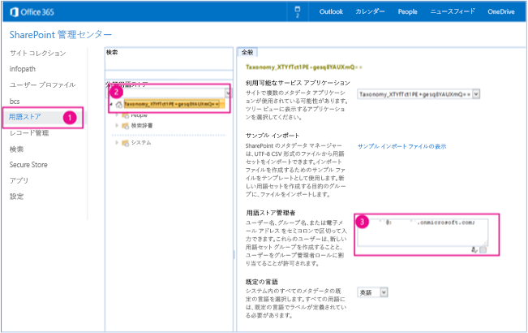
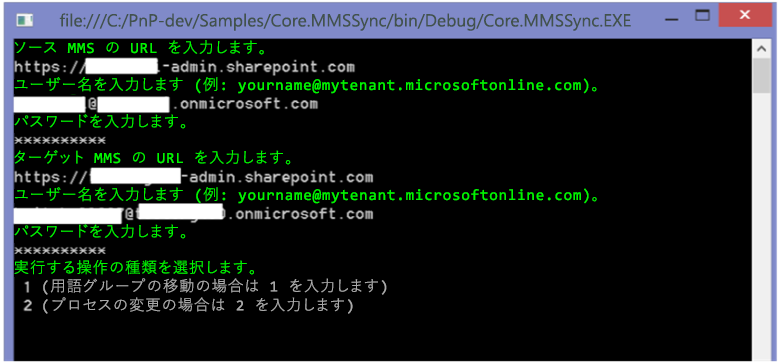

# 用語グループの同期サンプル アドイン (SharePoint)

エンタープライズ コンテンツ管理 (ECM) 戦略の一環として、用語グループを複数の SharePoint 用語ストアの間で同期できます。
    
_**適用対象:** Office 365? | SharePoint 2013? | SharePoint Online_

[Core.MMSSync](https://github.com/OfficeDev/PnP/tree/master/Samples/Core.MMS) のサンプルでは、ソースとターゲットの分類を同期させる、プロバイダー ホスト型の アドインの使用方法を示します。このアドインは、管理されたメタデータ サービスの 2 つの用語ストア (ソースとターゲットの用語ストア) を同期させます。用語グループを同期するには、次のオブジェクトを使用します。

- **TermStore** 

- **ChangeInformation** 

以下を行う場合は、このソリューションを使用します。

- 2 つの分類を同期させます。たとえば、異なる一連のデータに対して SharePoint Online とオンプレミス SharePoint Server 2013 の両方を使用する可能性がありますが、これらは同じ分類を使用します。
    
- 特定の用語グループにのみ加えられた変更を同期します。

## はじめに
<a name="sectionSection0"> </a>

まず、[Core.MMSSync](https://github.com/OfficeDev/PnP/tree/master/Samples/Core.MMSSync) サンプル アドインを GitHub の [Office 365 Developer Patterns and Practices](https://github.com/OfficeDev/PnP/tree/dev) プロジェクトからダウンロードします。

このアドインを実行するには、管理されたメタデータ サービスの用語ストアへのアクセス許可が必要です。図 1 は、これらのアクセス許可の割り当てを行う Office 365 管理センターを示しています。

**Figure 1. Assigning permissions to the term store in the SharePoint admin center**



用語ストアにアクセス許可を割り当てるには、次のようにします。

1. Office 365 管理センターで、 **[用語ストア]** を選択します。
    
2. **[分類用語ストア]** で、管理者の割り当て先となる用語セットを選択します。
    
3. **[用語ストア管理者]** に、用語ストア管理者のアクセス許可を必要とする組織アカウントを入力します。

## Core.MMSSync サンプル アプリを使用する
<a name="sectionSection1"> </a>

アドインを起動すると、図 2 に示すようにコンソール アプリケーションが表示されます。次に示す情報の入力を促すメッセージが表示されます。

- ソースの用語ストアを含む Office 365 管理センターの URL (これはソース管理メタデータ サービスの URL です)。たとえば、「https://contososource-admin.sharepoint.com」と入力します。
    
- ソースの管理対象メタデータ サービスにおける用語ストアの管理者のユーザー名とパスワード。
    
- ターゲット用語ストアを含む Office 365 管理センターの URL (これは、ターゲット MMS の URL です)。たとえば、「https://contosotarget-admin.sharepoint.com」と入力します。
    
- ターゲットの管理対象メタデータ サービスにおける用語ストアの管理者のユーザー名とパスワード。
    
- 実行する操作の種類を指定します。次のいずれかを実行できます。
    
    - **TermStore** オブジェクトを使用して、用語グループを移動する (シナリオ 1)。
    
    - **ChangeInformation** オブジェクトを使用して、プロセスを変更する (シナリオ 2)。

**重要**  このサンプル アドインは SharePoint Online およびオンプレミス SharePoint Server 2013 の両方で機能します。

**図 2.Core.MMSSync コンソール アプリケーション**



シナリオを選択した後、図 3 に示すように、ソースからターゲットの管理対象メタデータ サービスを同期する用語のグループの名前を入力します。たとえば、「Enterprise」のように入力します。

**図 3.管理対象メタデータ サービスの用語グループ**


### シナリオ 1: 用語グループの移動

When you select  **Move Term Group**, the add-in prompts you to enter a term group to synchronize and then calls the  **CopyNewTermGroups** method in MMSSyncManager.cs. **CopyNewTermGroups** then does the following to copy a term group from the source term store to the target term store:

1. ソースとターゲットの用語ストア オブジェクトを取得します。
    
2. ソースとターゲットの用語ストアの言語が一致することを確認します。 
    
3. ソースの用語グループがターゲットの用語ストアに存在しないことを確認してから、 **CreateNewTargetTermGroup** を使用してソースの用語グループをターゲットの用語ストアにコピーします。 
    
パラメーター  _TermGroupExclusions_、 _TermGroupToCopy_、および  _TermSetInclusions_ で、処理対象の用語をフィルター処理するように設定します。

次のコードは、MMSSyncManager.cs の  **CopyNewTermGroups** および **CreateNewTargetTermGroup** メソッドを示しています。

**メモ**  この記事で提供されるコードは、明示または黙示のいかなる種類の保証なしに現状のまま提供されるものであり、特定目的への適合性、商品性、権利侵害の不存在についての暗黙的な保証は一切ありません。

```C#
public bool CopyNewTermGroups(ClientContext sourceContext, ClientContext targetContext, List<string> termGroupExclusions = null, string termGroupToCopy = null)
        {
            TermStore sourceTermStore = GetTermStoreObject(sourceContext);
            TermStore targetTermStore = GetTermStoreObject(targetContext);

            
            List<int> languagesToProcess = null;
            if (!ValidTermStoreLanguages(sourceTermStore, targetTermStore, out languagesToProcess))
            {
                Log.Internal.TraceError((int)EventId.LanguageMismatch, "The target termstore default language is not available as language in the source term store, syncing cannot proceed.");
                return false;
            }

            // Get a list of term groups to process. Exclude site collection-scoped groups and system groups.
            IEnumerable<TermGroup> termGroups = sourceContext.LoadQuery(sourceTermStore.Groups.Include(g => g.Name,
                                                                                                       g => g.Id,
                                                                                                       g => g.IsSiteCollectionGroup,
                                                                                                       g => g.IsSystemGroup))
                                                                                              .Where(g => g.IsSystemGroup == false &amp;&amp; g.IsSiteCollectionGroup == false);
            sourceContext.ExecuteQuery();

            foreach (TermGroup termGroup in termGroups)
            {
                // Skip term group if you only want to copy one particular term group.
                if (!String.IsNullOrEmpty(termGroupToCopy))
                {
                    if (!termGroup.Name.Equals(termGroupToCopy, StringComparison.InvariantCultureIgnoreCase))
                    {
                        continue;
                    }
                }

                // Skip term groups that you do not want to copy.
                if (termGroupExclusions != null &amp;&amp; termGroupExclusions.Contains(termGroup.Name, StringComparer.InvariantCultureIgnoreCase))
                {
                    Log.Internal.TraceInformation((int)EventId.CopyTermGroup_Skip, "Skipping {0} as this is a system termgroup", termGroup.Name);
                    continue;
                }

                // About to start copying a term group.
                TermGroup sourceTermGroup = GetTermGroup(sourceContext, sourceTermStore, termGroup.Name);
                TermGroup targetTermGroup = GetTermGroup(targetContext, targetTermStore, termGroup.Name);

                if (sourceTermGroup == null)
                {
                    continue;
                }
                if (targetTermGroup != null)
                {
                    if (sourceTermGroup.Id != targetTermGroup.Id)
                    {
                        // Term group exists with a different ID, unable to sync.
                        Log.Internal.TraceWarning((int)EventId.CopyTermGroup_IDMismatch, "The term groups have different ID's. I don't know how to work it.");
                    }
                    else
                    {
                        // Do nothing as this term group was previously copied. Term group changes need to be 
                        // picked up by the change log processing.
                        Log.Internal.TraceInformation((int)EventId.CopyTermGroup_AlreadyCopied, "Termgroup {0} was already copied...changes to it will need to come from changelog processing.", termGroup.Name);
                    }
                }
                else
                {
                    Log.Internal.TraceInformation((int)EventId.CopyTermGroup_Copying, "Copying termgroup {0}...", termGroup.Name);
                    this.CreateNewTargetTermGroup(sourceContext, targetContext, sourceTermGroup, targetTermStore, languagesToProcess);
                }
            }

            return true;
        }


private void CreateNewTargetTermGroup(ClientContext sourceClientContext, ClientContext targetClientContext, TermGroup sourceTermGroup, TermStore targetTermStore, List<int> languagesToProcess)
        {
            TermGroup destinationTermGroup = targetTermStore.CreateGroup(sourceTermGroup.Name, sourceTermGroup.Id);
            if (!string.IsNullOrEmpty(sourceTermGroup.Description))
            {
                destinationTermGroup.Description = sourceTermGroup.Description;
            }

            TermSetCollection sourceTermSetCollection = sourceTermGroup.TermSets;
            if (sourceTermSetCollection.Count > 0)
            {
                foreach (TermSet sourceTermSet in sourceTermSetCollection)
                {
                    sourceClientContext.Load(sourceTermSet,
                                              set => set.Name,
                                              set => set.Description,
                                              set => set.Id,
                                              set => set.Contact,
                                              set => set.CustomProperties,
                                              set => set.IsAvailableForTagging,
                                              set => set.IsOpenForTermCreation,
                                              set => set.CustomProperties,
                                              set => set.Terms.Include(
                                                        term => term.Name,
                                                        term => term.Description,
                                                        term => term.Id,
                                                        term => term.IsAvailableForTagging,
                                                        term => term.LocalCustomProperties,
                                                        term => term.CustomProperties,
                                                        term => term.IsDeprecated,
                                                        term => term.Labels.Include(label => label.Value, label => label.Language, label => label.IsDefaultForLanguage)));

                    sourceClientContext.ExecuteQuery();

                    TermSet targetTermSet = destinationTermGroup.CreateTermSet(sourceTermSet.Name, sourceTermSet.Id, targetTermStore.DefaultLanguage);
                    targetClientContext.Load(targetTermSet, set => set.CustomProperties);
                    targetClientContext.ExecuteQuery();
                    UpdateTermSet(sourceClientContext, targetClientContext, sourceTermSet, targetTermSet);

                    foreach (Term sourceTerm in sourceTermSet.Terms)
                    {
                        Term reusedTerm = targetTermStore.GetTerm(sourceTerm.Id);
                        targetClientContext.Load(reusedTerm);
                        targetClientContext.ExecuteQuery();

                        Term targetTerm;
                        if (reusedTerm.ServerObjectIsNull.Value)
                        {
                            try
                            {
                                targetTerm = targetTermSet.CreateTerm(sourceTerm.Name, targetTermStore.DefaultLanguage, sourceTerm.Id);
                                targetClientContext.Load(targetTerm, term => term.IsDeprecated,
                                                                     term => term.CustomProperties,
                                                                     term => term.LocalCustomProperties);
                                targetClientContext.ExecuteQuery();
                                UpdateTerm(sourceClientContext, targetClientContext, sourceTerm, targetTerm, languagesToProcess);
                            }
                            catch (ServerException ex)
                            {
                                if (ex.Message.IndexOf("Failed to read from or write to database. Refresh and try again.") > -1)
                                {
                                    // This exception was due to caching issues and generally is thrown when terms are reused across groups.
                                    targetTerm = targetTermSet.ReuseTerm(reusedTerm, false);
                                }
                                else
                                {
                                    throw ex;
                                }
                            }
                        }
                        else
                        {
                            targetTerm = targetTermSet.ReuseTerm(reusedTerm, false);
                        }

                        targetClientContext.Load(targetTerm);
                        targetClientContext.ExecuteQuery();

                        targetTermStore.UpdateCache();

                        // Refresh session and term store references to force reload of the term just added. You need 
                        // to do this because there can be an update change event following next, and if you don't,
                        // the newly created term set cannot be obtained from the server.
                        targetTermStore = GetTermStoreObject(targetClientContext);

                        // Recursively add the other terms.
                        ProcessSubTerms(sourceClientContext, targetClientContext, targetTermSet, targetTerm, sourceTerm, languagesToProcess, targetTermStore.DefaultLanguage);
                    }
                }
            }
            targetClientContext.ExecuteQuery();
        }

```

### シナリオ 2 - プロセスの変更

When you select  **Process Changes**, the add-in prompts you to enter a Term Group to synchronize, and then calls the  **ProcessChanges** method in MMSSyncManager.cs. **ProcessChanges** uses the **GetChanges** method of the **ChangedInformation** class to retrieve all changes made to groups, term sets, and terms in the source managed metadata service. Changes are then applied to the target managed metadata service.

**メモ**  このドキュメントには、 **ProcessChanges** メソッドの一部のみを記載しています。メソッド全体を確認するには、Visual Studio で Core.MMSSync ソリューションを開いてください。

**ProcessChanges** メソッドは、**TaxonomySession** オブジェクトの作成から始まります。

```C#
Log.Internal.TraceInformation((int)EventId.TaxonomySession_Open, "Opening the taxonomy session");
            TaxonomySession sourceTaxonomySession = TaxonomySession.GetTaxonomySession(sourceClientContext);
            TermStore sourceTermStore = sourceTaxonomySession.GetDefaultKeywordsTermStore();
            sourceClientContext.Load(sourceTermStore,
                                            store => store.Name,
                                            store => store.DefaultLanguage,
                                            store => store.Languages,
                                            store => store.Groups.Include(group => group.Name, group => group.Id));
            sourceClientContext.ExecuteQuery();

```

次に、 **ChangeInformation** オブジェクトを使用して変更を取得し、 **ChangeInformation** オブジェクトにおける開始日の設定を取得します。この例では、昨年内に行われたすべての変更を取得しています。

```C#
Log.Internal.TraceInformation((int)EventId.TermStore_GetChangeLog, "Reading the changes");
            ChangeInformation changeInformation = new ChangeInformation(sourceClientContext);
            changeInformation.StartTime = startFrom;
            ChangedItemCollection termStoreChanges = sourceTermStore.GetChanges(changeInformation);
            sourceClientContext.Load(termStoreChanges);
            sourceClientContext.ExecuteQuery();

```

**GetChanges** メソッドは **ChangedItemCollection** を返します。これは、次のコードの使用例に示すとおり、用語ストアで発生するすべての変更を列挙します。この使用例の最終行で、**ChangedItem** が用語グループかどうかを確認して判断しています。**ProcessChanges** には、**ChangedItem** で用語セットと用語について同様の確認を行うコードが含まれています。

```C#
foreach (ChangedItem _changeItem in termStoreChanges)
                {
                    
                    if (_changeItem.ChangedTime < startFrom)
                    {
                        Log.Internal.TraceVerbose((int)EventId.TermStore_SkipChangeLogEntry, "Skipping item {1} changed at {0}", _changeItem.ChangedTime, _changeItem.Id);
                        continue;
                    }

                    Log.Internal.TraceVerbose((int)EventId.TermStore_ProcessChangeLogEntry, "Processing item {1} changed at {0}. Operation = {2}, ItemType = {3}", _changeItem.ChangedTime, _changeItem.Id, _changeItem.Operation, _changeItem.ItemType);

                    #region Group changes
                    if (_changeItem.ItemType == ChangedItemType.Group)

```

変更されたアイテムの種類は、用語グループ、用語セット、または用語になることがあります。変更されたアイテムの種類ごとに、実行できる操作が異なります。次の表は、変更されたアイテムの種類ごとに実行できる操作を一覧表示しています。 

|変更内容 (ChangedItemType) | 変更されたアイテムの種類で実行できる操作 (ChangedOperationType)|
|---|---|
|Group|<p>グループを削除する</p><p>グループの追加</p><p>グループの編集|
|TermSet|</p>用語セットの削除</p><p>用語セットの移動</p><p>用語セットのコピー</p><p>用語セットの追加</p><p>用語セットの編集<p>|
|用語|</p>用語の削除</p><p>用語の移動</p><p>用語のコピー</p><p>用語のパス変更</p><p>用語のマージ</p><p>用語の追加</p><p>用語の編集<p>|

次のコードは、ソースの管理対象メタデータ サービスで用語グループが削除されたときの削除操作の実行方法を示しています。

```C#
#region Delete group
                        if (_changeItem.Operation == ChangedOperationType.DeleteObject)
                        {
                            TermGroup targetTermGroup = targetTermStore.GetGroup(_changeItem.Id);
                            targetClientContext.Load(targetTermGroup, group => group.Name);
                            targetClientContext.ExecuteQuery();

                            if (!targetTermGroup.ServerObjectIsNull.Value)
                            {
                                if (termGroupExclusions == null || !termGroupExclusions.Contains(targetTermGroup.Name, StringComparer.InvariantCultureIgnoreCase))
                                {
                                    Log.Internal.TraceInformation((int)EventId.TermGroup_Delete, "Deleting group: {0}", targetTermGroup.Name);
                                    targetTermGroup.DeleteObject();
                                    targetClientContext.ExecuteQuery();
                                }
                            }
                        }
                        #endregion

```

## その他のリソース
<a name="bk_addresources"> </a>

-  [SharePoint 2013 と SharePoint Online 用のエンタープライズ コンテンツ管理ソリューション](Enterprise-Content-Management-solutions-for-SharePoint-2013-and-SharePoint-Online.md)
    
-  [OfficeDevPnP.Core のサンプル](https://github.com/OfficeDev/PnP-Sites-Core/blob/master/Core)
    
-  [Core.MMS のサンプル](https://github.com/OfficeDev/PnP/tree/master/Samples/Core.MMS)
