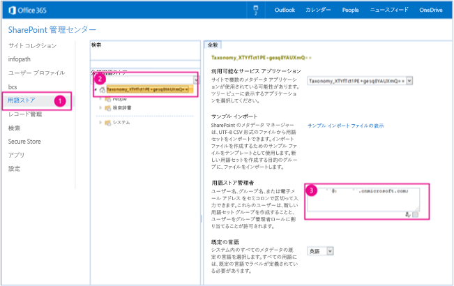
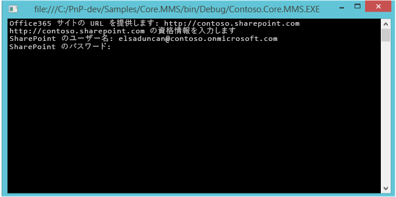
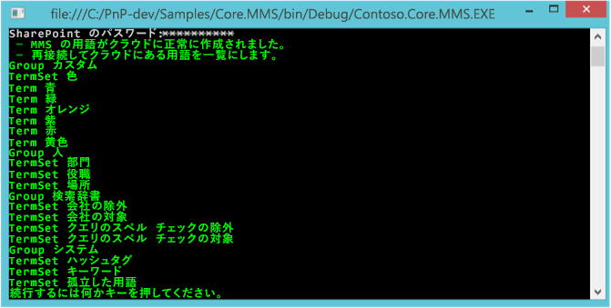
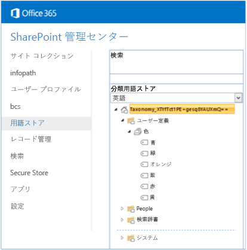

# 分類操作サンプル アプリ (SharePoint)

エンタープライズ コンテンツ管理 (Enterprise Content Management: ECM) ストラテジの一部として、SharePoint リストに分類データを作成し、それを読み込むことができます。
    
_**適用対象:** Office 365 | SharePoint 2013 | SharePoint Online_

Core.MMS サンプル コンソール アプリケーションは、SharePoint Managed Metadata Service とのやり取りによって用語、用語セット、グループを作成したり取得したりする方法を示しています。またこのサンプルは、ASP.NET MVC Web アプリケーションなどのプロバイダー向けのホスト型アプリでも実行されます。SharePoint ファーム間で用語を移行したり、カスタム アプリで用語を表示したりする場合にはこのソリューションを使用します。   

## はじめに
<a name="sectionSection0"> </a>

まず GitHub の [Office 365 Developer Patterns and Practices](https://github.com/OfficeDev/PnP/tree/dev) プロジェクトから、[Core.MMS](https://github.com/OfficeDev/PnP/tree/master/Samples/Core.MMS) サンプル アプリをダウンロードします。

このアプリを実行するには、その前に以下が必要になります。

- SharePoint サイトの URL。
    
- Managed Metadata Service で用語ストアにアクセスするためのアクセス許可。図 1 には、これらのアクセス許可を割り当てる場所である Office 365 管理センターが示されています。 
    
    **Figure 1. Assigning permissions to the term store in the SharePoint admin center**

    
    
用語ストアにアクセス許可を割り当てるには、次のようにします。

  1. Office 365 管理センターで、 **[用語ストア]** を選択します。
    
  2. **[分類用語ストア]** で、管理者の割り当て先となる用語セットを選択します。
    
  3. **[用語ストア管理者]** に、用語ストア管理者のアクセス許可を必要とする組織アカウントを入力します。

## Core.MMS サンプル アプリの使用
<a name="sectionSection1"> </a>

アプリを開始すると、図 2 のようなコンソール アプリケーションが表示されます。SharePoint 2013 サイトまたは SharePoint Online サイトの URL と資格情報の入力を求めるプロンプトが表示されます。 

**図 2. Core.MMS コンソール アプリケーション**



SharePoint URL と資格情報を入力すると、ユーザー認証が実行されます。以下のコードにより、SharePoint Online でユーザー認証が実行されます。
    
**メモ**  この記事で提供されるコードは、明示または黙示のいかなる種類の保証なしに現状のまま提供されるものであり、特定目的への適合性、商品性、権利侵害の不存在についての暗黙的な保証は一切ありません。

```C#
ClientContext cc = new ClientContext(siteUrl);
cc.AuthenticationMode = ClientAuthenticationMode.Default;
// For SharePoint Online.
cc.Credentials = new SharePointOnlineCredentials(userName, pwd);
```

以下のコードにより、SharePoint Online 専用ファームまたは社内設置型 SharePoint 2013 ファームでユーザー認証が実行されます。

```C#
ClientContext cc = new ClientContext(siteUrl);
cc.AuthenticationMode = ClientAuthenticationMode.Default;
// For SharePoint Online Dedicated or on-premises .
cc.Credentials = new NetworkCredential(userName, pwd);
```

**CreateNecessaryMMSTermsToCloud** メソッドにより、Managed Metadata Service でグループ、用語セット、およびいくつかの用語が作成されます。このコードは最初に **TaxonomySession** オブジェクト、次に **TermStore** オブジェクトに対する参照を取得してから、カスタム **TermGroup**、**TermSet**、および新しい用語を作成します。 

```C#
private static void CreateNecessaryMMSTermsToCloud(ClientContext cc)
        {
            // Get access to taxonomy CSOM.
            TaxonomySession taxonomySession = TaxonomySession.GetTaxonomySession(cc);
            cc.Load(taxonomySession);
            cc.ExecuteQuery();

            if (taxonomySession != null)
            {
                TermStore termStore = taxonomySession.GetDefaultSiteCollectionTermStore();
                if (termStore != null)
                {
                    //
                    // Create group, termset, and terms.
                    //
                    TermGroup myGroup = termStore.CreateGroup("Custom", Guid.NewGuid());
                    TermSet myTermSet = myGroup.CreateTermSet("Colors", Guid.NewGuid(), 1033);
                    myTermSet.CreateTerm("Red", 1033, Guid.NewGuid());
                    myTermSet.CreateTerm("Orange", 1033, Guid.NewGuid());
                    myTermSet.CreateTerm("Yellow", 1033, Guid.NewGuid());
                    myTermSet.CreateTerm("Green", 1033, Guid.NewGuid());
                    myTermSet.CreateTerm("Blue", 1033, Guid.NewGuid());
                    myTermSet.CreateTerm("Purple", 1033, Guid.NewGuid());

                    cc.ExecuteQuery();
                }
            }
        }
```

新しい用語の作成後、 **GetMMSTermsFromCloud()** メソッドにより、すべての用語グループ、用語セット、用語が Managed Metadata Service から取得されます。 **CreateNecessaryMMSTermsToCloud()** メソッドの場合と同じように、このコードは最初に **TaxonomySession** オブジェクト、次に **TermStore** オブジェクトに対する参照を取得してから、用語情報を取得して表示します。

```C#
private static void GetMMSTermsFromCloud(ClientContext cc)
        {
            //
            // Load up the taxonomy item names.
            //
            TaxonomySession taxonomySession = TaxonomySession.GetTaxonomySession(cc);
            TermStore termStore = taxonomySession.GetDefaultSiteCollectionTermStore();
            cc.Load(termStore,
                    store => store.Name,
                    store => store.Groups.Include(
                        group => group.Name,
                        group => group.TermSets.Include(
                            termSet => termSet.Name,
                            termSet => termSet.Terms.Include(
                                term => term.Name)
                        )
                    )
            );
            cc.ExecuteQuery();

            //
            // Writes the taxonomy item names.
            //
            if (taxonomySession != null)
            {
                if (termStore != null)
                {
                    foreach (TermGroup group in termStore.Groups)
                    {
                        Console.WriteLine("Group " + group.Name);

                        foreach (TermSet termSet in group.TermSets)
                        {
                            Console.WriteLine("TermSet " + termSet.Name);

                            foreach (Term term in termSet.Terms)
                            {
                                // Writes root-level terms only.
                                Console.WriteLine("Term " + term.Name);
                            }
                        }
                    }
                }
            }
        }
```

Managed Metadata Service の用語データは、コンソール アプリケーションで (図 3)、また Managed Metadata Service の用語ストアで (図 4) 確認できます。

**図 3. コンソール アプリケーションに示されている Managed Metadata Service のグループ、用語セット、用語**



**図 4. SharePoint 管理センターに示されている Managed Metadata Service のグループ、用語セット、用語**



## その他のリソース
<a name="bk_addresources"> </a>

-  [SharePoint 2013 と SharePoint Online 用のエンタープライズ コンテンツ管理ソリューション](Enterprise-Content-Management-solutions-for-SharePoint-2013-and-SharePoint-Online.md)
    
-  [Core.MMSSync サンプル](https://github.com/OfficeDev/PnP/tree/master/Samples/Core.MMSSync)
    
-  [Core.ContentTypesAndFields サンプル](https://github.com/OfficeDev/PnP/tree/master/Samples/Core.ContentTypesAndFields)
