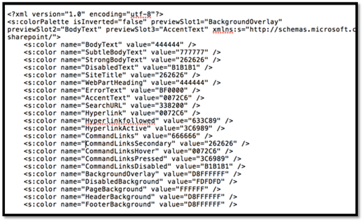
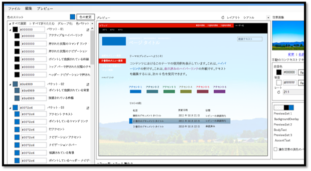
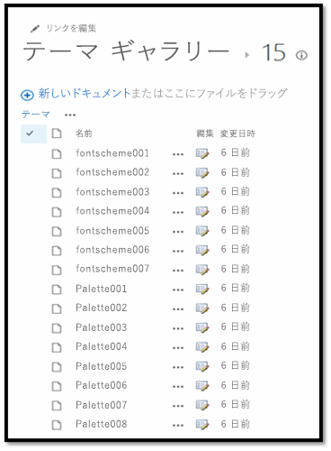
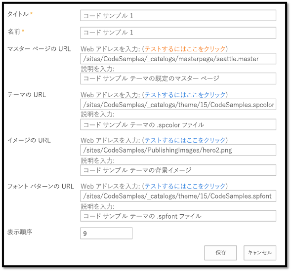

# 構成済みの外観を使用して SharePoint サイトをブランド化する

SharePoint テーマ設定エンジンを使用すると、SharePoint 2013 サイトや SharePoint Online サイトに、色、フォント、背景画像など、構成済みの外観を適用することができます。

_**適用対象:** Office 365 | SharePoint 2013 | SharePoint Online_

構成済みの外観は、SharePoint サイトに適用できます。構成済みの外観は、SharePoint 2013 と SharePoint Online に同梱されている、すぐに利用可能なテーマです。SharePoint サイトに構成済み外観を適用するには、**[サイトの設定]**  >  **[外観]**  >  **[外観の変更]** を選択します。その後、[外観の変更] ウィザードを使用して構成済み外観の色、フォント、マスター ページ、背景画像をカスタマイズできます。[外観の変更] ウィザードは、CSS を SharePoint のコンテンツ データベースにコピーし、変換し、格納します。また、画像の色を変更して、コンテンツ データベースに格納します。 

## SharePoint テーマ設定エンジン
<a name="sectionSection0"> </a>

SharePoint 2013 テーマ設定エンジンを使用すると、色、フォント、および背景画像をサイトに適用するために、これらの要素をマスター ページに関連付けることができます。

SharePoint 2013 および SharePoint Online では、サイトにカスタム CSS を適用するために使用できる、関連する一連の XML 定義ファイル、画像ファイル、および関連付けられたマスター ページのことを、テーマと呼びます。次の XML ファイルは、スタイルを適用したときの特定の色やフォントの詳細を定義するカラー スロットとフォント スロットを定義します。 

- .spcolor
    
- .spfont
    
使い慣れた任意のテキスト エディターで、独自のカラー ファイルとフォント ファイルを作成できます。

次の表に、構成済みの外観の要素を示します。

|**要素**|**ファイル (1 つ以上)**|**格納場所**|**必須**|
|:-----|:-----|:-----|:-----|
|カラー パレット|.spcolor|テーマ ギャラリー\15 フォルダー|はい|
|フォント パターン|.spfont|テーマ ギャラリー\15 フォルダー|いいえ|
|サイト レイアウト|<p>.master</p><p>.preview</p>|マスター ページ ギャラリー|はい|
|背景画像|<p>.jpg</p><p>.bmp</p><p>.png</p><p>.gif</p>|サイトのリソースファイル|いいえ|
ユーザーが構成済みの外観を選択するには、[外観の変更] ウィザードを使用するか (**[サイトの設定]**  >  **[外観]**  >  **[外観の変更]**)、[作業の開始] UI を使用するか、またはサイト操作メニューで直接操作します。ユーザーが構成済みの外観を選択すると、テーマ設定エンジンによって、色、フォント、背景画像、関連付けたれた .master ページ、および .master ページに関連付けられた .preview ファイルがサイトに適用されます。 

### カラー パレット

テーマ設定エンジンは、.spcolor ファイル (図 1 を参照) によって定義されるカラー パレットに色を格納します。 カラー パレットは、ルート サイトのテーマ ギャラリーに格納されます。 カラー パレットは、カラー パレット定義とカラー スロットで構成される、編集可能な XML ファイルです。 カラー パレットのメタデータ (`<s:colorPalette>`) は、次の項目を定義します。

- 構成済みの外観のプレビューで使用するカラー スロットを定義する 3 つのプレビュー スロット。
    
- テーマが反転している (濃い背景に明るいテキスト) かどうかをパレット デザイナーが指定できる **isInverted** プロパティ。
    
- テーマに関連付けられている XML 名前空間。
    
カラー スロットは、色の名前と値という 2 つの属性 (色の名前とその RGB 値を定義する) によって定義されます。カラー スロットには、BodyText や SiteTitle など、各スロットが SharePoint ページのどの領域に対応するかを識別しやすい名前が付けられています。

`<s:color name="BodyText" value="444444" />`

**図 1. .spcolor ファイル**



.spcolor ファイルの 2 行目では、XML 名前空間、プレビュー スロット、および色が反転している (明るい背景に暗い前景ではなく、暗い背景に明るい前景になっている) かどうかを定義しています。 

.spcolor ファイルには 89 個のカラー スロットがあります。カラー スロットでは、色の豊かな表現を不透明度を含む 8 桁の 16 進数値で定義します。たとえば、緑が RRGGBB 00FF00 である場合に、不透明度が 70% の緑は AARRGGBB 7F00FF00 です。ユーザーが定義していないスロットを SharePoint が使用した場合は、そのスロットを参照する CSS があっても色は変更されません。CSS によって参照されないスロットを定義しても、その色が UI の中に表示されることはありません。

.spcolor ファイルはメモ帳で編集できますが、PowerPoint では編集できません。

### カラー パレット ツール

テーマの色と、ページ上で色がどのように表示されるかを視覚的に表示するには、[カラー パレット ツール](http://www.microsoft.com/en-us/download/details.aspx?id=38182)を使用できます。これを使用すると、.spcolor ファイルのカラー スロットで使用できる色の情報を識別し、プロセスの一部として CSS を変更することなく、SharePoint サイトに色を適用できます。

このツールでは色が 16 進数形式で表示されるため、色を簡単にコピーして .spcolor ファイル内の適切な要素に色の値を貼り付けることができます。また、カラー パレット ツールを使用すると、モックアップ画像に背景画像をはめ込み、seattle.master および oslo.master の各マスター ページを切り替えることもできます。 


**図 2. カラー パレット ツール**



新しいテーマのために必須のファイルは .spcolor だけですが、デザインの程度によっては、カスタム フォント宣言を追加する必要が生じることがあります。これを行うには、.spfont ファイルにアクセスする必要があります。

### フォント パターン

構成済みの外観での色の使用方法をカラー パレットで定義するのと同じようにして、フォント パターンでは構成済みの外観のフォントを定義します。 

フォント パターンは、テーマ ギャラリーに格納されている .spfont ファイルの中で定義します。.spfont ファイルに含まれる次のフォント スロットで、構成済みの外観の名前、フォント、およびスクリプトの値を定義します。

- タイトル
    
- ナビゲーション
    
- 小見出し
    
- 見出し
    
- 大見出し
    
- 本文
    
- 大きな本文
    
フォントは、さらにスクリプトの種類 (たとえば、ラテン文字、アラビア文字、キリル文字) によって分類されます。Web フォントのサポートには、次の 4 種類のファイルが含まれています。

- Embedded OpenType (EOT)
    
- Web Open Font Format (WOFF) ファイル

    
- TrueType フォント (TTF)
    
- スケーラブル ベクター グラフィックス (SVG)
    
フォント パターンでは、大きなプレビュー イメージと小さなプレビュー イメージを定義します。これらは Web フォントにのみ必要です。

**メモ** .spfont ファイルはメモ帳で編集できますが、PowerPoint では編集できません。

次に、.spfont ファイルの例を示します。

```XML
<?xml version="1.0" encoding="utf-8"?>
<s:fontScheme name="Georgia" previewSlot1="title" previewSlot2="body"
  xmlns:s=http://schemas.microsoft.com/sharepoint/>
    <s:fontSlots>
        <s:fontSlot name="title">
            <s:latin typeface="Georgia"/>
            <s:font script="Arab" typeface="Calibri" />
            <s:font script="Deva" typeface="Mangal" />
            . . . 
        </s:fontSlot>
    <s:fontSlot name="navigation">
        <s:latin typeface="Georgia"/>
        <s:font script="Arab" typeface="Calibri" />
        <s:font script="Deva" typeface="Mangal" />
        . . . 
        </s:fontSlot>
    </s:fontSlots>
</s:fontScheme>
```

### サイト レイアウト: マスター ページと対応するプレビュー ファイル

テーマ設定エンジンでは、構成済みの外観のサイト レイアウトを .master マスター ページとそれに対応する .preview ファイルに基づいて定義します。たとえば、構成済みの外観に対して定義したマスター ページが seattle.master であれば、そのマスター ページによってサイトのレイアウトが定義されます。


サイトのレイアウトは、任意のマスター ページのマスター ページ ギャラリーから取得します。これには .preview ファイルが付属しています。.preview ファイルは、**[外観の変更]** UI (**[サイトの設定]**  >  **[外観]**  >  **[外観の変更]**) にマスター ページをオプションとして表示するために必要です。

マスター ページを [サイトのレイアウト] ドロップダウン メニューから使用できるようにするには .master ページに対応する .preview ファイルを作成します。.preview ファイルは、designbuilder.aspx ページの **[外観の変更]** オプションの右側にある構成済みの外観とプレビューのセクションにサムネイル イメージとして表示されます。

### 背景画像

構成済みの外観の背景画像を変更するには、**[変更]** を選択します。アップロードのダイアログ ボックスが開きますので、画像ファイルをアップロードするために使用できます。または、背景のプレビューに独自の画像をドラッグすることもできます。

## カスタム テーマを作成する
<a name="sectionSection1"> </a>

カスタム テーマを作成するには、次の手順を実行します。

1. **[サイトの設定]** に移動し、[Web デザイナー ギャラリー] という見出しの下で、**[テーマ]**  >  **[15]** を選択します。図 3 に示すように、.spcolor ファイルと .spfont ファイルの一覧が表示されます。
    
    **図 3. テーマ ギャラリー**

    

2. .spcolor ファイルの 1 つ (たとえば、Palette001.spcolor) のコピーをダウンロードし、テキスト エディターで開きます。 
    
3. コピーした .spcolor ファイルを、デザインの方針に従って編集します。たとえば、メインの本文テキストを黒色のフォントに設定するには、ファイルを編集して `<s:color name="BodyText" value="444444" />` の行を `<s:color name="BodyText" value="000000" />` に変更します。
    
4. HTML 要素ごとに、色を追加します。 
    
5. 編集が終わったら、.spcolor ファイルを **[サイトの設定]**  >  **[テーマ]**  >  **[15]** フォルダーにアップロードします。
    
    
            **メモ:** ファイルを新しいファイル名 (custom_palette1.spcolor など) で保存します。

   次の表に、ページ要素および色と、.spcolor ファイル内のコードのマッピングを記載します。これは、.spcolor ファイルで利用できるマッピングの一部を抜き出したものです。
    

    |**要素**|**色**|**Code**|
    |:-----|:-----|:-----|
    |Body text|ブラック| `<s:color name="BodyText" value="000000" />`|
    |グローバル ナビゲーションの背景|青| `<s:color name="HeaderBackground" value="018dff" />`|
    |グローバル ナビゲーションのテキスト|ホワイト| `<s:color name="HeaderNavigationText" value="ffffff" />`|
    |現在のナビゲーションの背景|赤| `<s:color name="NavigationHoverBackground" value="e51400" />`|
    |現在のナビゲーションのテキスト|ホワイト| `<s:color name="Navigation" value="ffffff" />`|
    |タイトル|ホワイト| `<s:color name="SiteTitle" value="FFFFFF" />`|
    |Footer background|ブラック| `<s:color name="FooterBackground" value="000000" />`|

6. .spfont をカスタマイズするには、.spfont ファイルのコピーをダウンロードして、テキスト エディターで開きます。.spfont ファイルのレイアウトは .spcolor と少し異なりますが、どちらのファイルも似たような構造になっています。 
    
    **図 4. .spfont ファイル**

    

7. 各 `<s:fontSlot />` セクションを編集してフォントをカスタマイズします。このフォントは、ページ上の指定したフォント スロットに SharePoint が適用します。 たとえば、最初の項目 `<s:fontSlot name="title">` に注目してください。 この項目は、ページのタイトルをスタイル設定するために SharePoint が使用するフォントを説明しています。 このセクションでは、異なる言語に対して使用するフォントも指定します。
    
    
            **メモ:** カスタム フォントを SharePoint にアップロードして、各項目がカスタムの .eot ファイル、.woff ファイル、.ttf ファイル、.svg ファイルをポイントするようにします。 

8. ファイルを **[サイトの設定]**  >  **[テーマ]**  >  **[15]** フォルダーにアップロードします。
    
    
            **メモ:** ファイルを新しいファイル名 (custom_font.spfont など) で保存します。

    次のテーブルは、.spfont ファイルに定義されているようにページ要素をフォントにマップします。

|**要素**|**フォント**|**Code**|
|:-----|:-----|:-----|
|タイトル|Open Sans| `<s:cs typeface="Open Sans" />`|
|ナビゲーション|Roboto| `<s:cs typeface="Roboto" />`|
|見出し|Trajan Pro| `<s:cs typeface="Trajan Pro" />`|
|本文|Open Sans| `<s:cs typeface="Open Sans" />`|

カスタム フォントがユーザーのブラウザーで利用可能なことを確認する必要があります。 見出しに Trajan Pro フォントを指定した場合、このフォントはほとんどのユーザーのコンピューターに存在しないため、<s:fontSlot> 宣言の先頭に次のようなフォント宣言を追加する必要があります。 これにより、正しいフォントが表示されます。 

```XML
<s:latin typeface=" Trajan Pro" eotsrc="/SiteAssets/Trajan Pro.eot" woffsrc="/SiteAssets/Trajan Pro.woff" ttfsrc="/SiteAssets/Trajan Pro.ttf" svgsrc="/SiteAssets/Trajan Pro.svg"  />
```

## SharePoint にカスタム テーマを追加する
<a name="sectionSection2"> </a>

マスター ページ、.spcolor ファイル、および .spfont ファイルのカスタマイズが終わったら、これらを Composed Looks ディレクトリに追加して、SharePoint がアクセスできるようにします。 

1. **[サイトの設定]** に移動し、**[Web デザイナー ギャラリー]** の下で **[構成済みの外観]** を選択します。 
    
2. 左上にある **[新しいアイテム]** リンクを選択します。図 5 に示すようなウィンドウが開きます。
    
    **図 5. 構成された外観**

    

3. 構成済みの外観のタイトルと名前を追加します。
    
4. 残りのフィールドに情報を入力します。
    
    - **[マスター ページの URL]** フィールドには、テーマとして使用するマスター ページの URL を追加します。
    
    - **[テーマの URL]** フィールドには、.spcolor ファイルの URL を追加します。
    
    - **[イメージの URL]** フィールドには、背景として使用する画像の URL を指定します。背景画像を必要としないデザインの場合は、この項目を指定する必要はありません。
    
    - **[フォント パターンの URL]** フィールドには、.spfont ファイルの URL を指定します。
    
    - **[表示順]** フィールドには、構成済みの外観を表示する順序を指定します。
    
5. **[保存]** を選択します。作成した項目が **[構成済みの外観]** の一覧に表示されます。
    
カスタム テーマを構成済みの外観として追加すると、ユーザーはそのテーマにアクセスして、サイトに適用できます (**[サイトの設定]**  >  **[外観]**  >  **[外観の変更]** と進みます)。図 6 に、**[サイトの設定]** の **[外観の変更]** セクションの例を示します。

**図 6. [外観の変更] で利用可能な構成済みの外観**

![[サイトの設定] > [外観の変更] で利用できる構成済みの外観を示すスクリーンショット。](media/11acb4ea-cff6-483c-890f-8c574e14f29d.png)

## ユーザーが構成済みの外観を適用したときにテーマ設定エンジンが実行する処理
<a name="sectionSection3"> </a>

ユーザーが構成済みの外観を適用すると、SharePoint は、CSS をコピーおよび変換して、コンテンツ データベースに格納します。また、画像の色を変更してコンテンツ データベースに格納します。サイトにテーマを適用するプロセスの一部として、テーマ設定エンジンは、ルート サイトのテーマ ギャラリーにある指定されたカラー パレットおよびフォント パターンからの色やフォントの値を取得します。.master ページとマスター ページの .preview ファイル (サイトのレイアウト) を適用するために、テーマ設定エンジンは、対応する .preview ファイルを持つマスター ページをマスター ページ ギャラリー内から取得します。 

構成済みの外観を適用するとき、エンジンは、テーマ設定エンジンが定義した特定の CSS コメントによって指定されている設定をマップします。このとき、テーマ設定エンジンは背後で、背景画像をサイトのリソース ファイルに保存し、JPG および BMP 画像を拡大縮小して圧縮し、GIF および PNG 画像のサイズを制限します。 

構成済みの外観が SharePoint サイトに適用されると、SharePoint は CSS コメント トークンを検索し、構成済みの外観から取得した値を、CSS ファイル内でトークンの後にある次の行に埋め込んで置換します。この新しい値が、SharePoint サイトに適用されます。

次の表に、CSS コメント トークンを示します。

|**トークン**|**説明**|**対応する ApplyTheme パラメーター**|
|:-----|:-----|:-----|
|/* ReplaceBGImage */|現在の背景画像を、割り当てられた構成済みの外観の画像 URL にある画像と交換します。|backgroundImageUrl|
|/* ReplaceFont */|現在のフォントを、割り当てられた構成済みの外観のフォント パターン URL から見つかるフォントのいずれかと交換します。|fontSchemeUrl|
|/* ReplaceColor */|現在の色を、割り当てられた構成済みの外観のカラー パレット URL にあるカラー スロットで指定された色のいずれかと交換します。|colorPaletteUrl|
|/* RecolorImage */|色合いの変更または塗りつぶしを使用して画像の色を変更します。 ||

## その他のリソース
<a name="bk_addresources"> </a>

-  [SharePoint サイト ブランド化とページ カスタマイズのソリューション](SharePoint-site-branding-and-page-customization-solutions.md)
    
-  [SharePoint 2013 および SharePoint Online のブランディングおよびサイト プロビジョニング ソリューション](Branding-and-site-provisioning-solutions-for-SharePoint.md)
