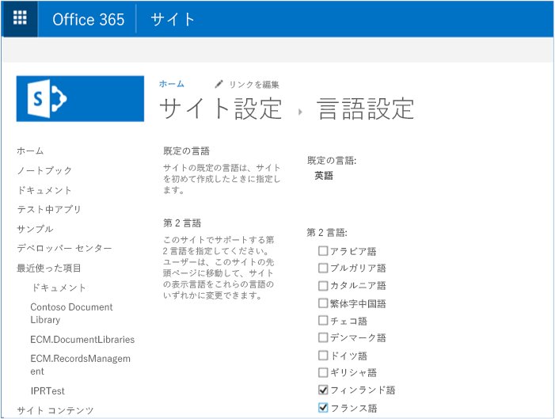
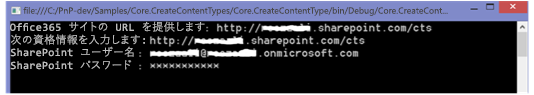
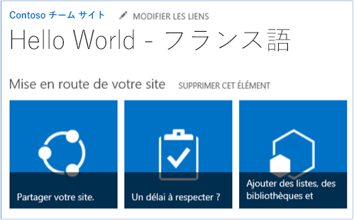

# Office 365 サンプル アドインのローカリゼーション機能の使用

Office 365 のローカライズ機能を使用して、SharePoint サイト、一覧、コンテンツ タイプ、サイト列の値をローカライズします。 
    
_**適用対象:** Office 365? | SharePoint 2013? | SharePoint Online_
    
[Core.CreateContentTypes](https://github.com/OfficeDev/PnP/tree/master/Samples/Core.CreateContentTypes) サンプルは、サイト、一覧、コンテンツ タイプ、サイト列にに対する Office 365 のローカリゼーション機能の使用法を示します。このサンプル コードは、コンソール アプリケーションを使用して以下の操作を実行します。

- コンテンツ タイプ、サイト列、一覧を作成し、サイト列をコンテンツ タイプに関連付けます。
    
- コンテンツ タイプ、サイト列、一覧、ユーザー指定のサイトをローカライズします。


                **メモ** この記事で説明しているローカライズ機能は、Office 365 のみで使用できます。 Office 365 専用またはオンプレミス SharePoint Server 2013 で使用できるローカライズ機能の詳細については、「[方法: SharePoint アドインをローカライズする](http://msdn.microsoft.com/library/907a9189-7ce3-469a-8c87-4cef26f03c73.aspx)」と「[SharePoint ソリューションのローカライズ](https://msdn.microsoft.com/en-us/library/ee696750.aspx)」を参照してください。

## 開始する前に
<a name="sectionSection0"> </a>

まず、[Core.CreateContentTypes](https://github.com/OfficeDev/PnP/tree/master/Samples/Core.CreateContentTypes) サンプル アドインを、GitHub の [Office 365 Developer Patterns and Practices](https://github.com/OfficeDev/PnP/tree/dev) プロジェクトからダウンロードします。

このコード サンプルを実行する前に、次の操作を実行してください。

1. サイトで言語設定を構成します。 これを実行するには、次の操作を実行します。
    
      a.  チーム サイトで、**[設定]** > **[サイトの設定]** を選択します。
    
      b.  **[サイトの管理]** で、**[言語設定]** を選択します。
    
      c.  **[言語設定]** ページの **[第 2 言語]** で、サイトでサポートする第 2 言語を選択します。 たとえば、図 1 のように、フランス語とフィンランド語を選択できます。
    
      d.  **[OK]** をクリックします。
     
2. ユーザーのプロファイル ページで表示言語を設定します。 これを実行するには、次の操作を実行します。
    
      a.  図 2 のように、Office 365 サイトのトップで、自分のプロファイル画像を選択してから **[自己紹介]** を選択します。
    
      b.  **[自己紹介]** ページで、**[プロファイルの編集]** を選択します。
    
      c.  追加オプションの省略記号 (**...**) を選択してから、**[言語と地域]** を選択します。
    
      d.  **[表示言語]** の **[新しい言語の選択]** ドロップダウンを使用してサイト上での設定と同様に新しい言語を選択してから、**[追加]** を選択します。 たとえば、図 3 のように、フランス語とフィンランド語を選択します。 上下の矢印ボタンを選択して、優先言語を上下に移動できます。
    
      e.  **[すべて保存して閉じる]** を選択します。

**メモ**  選択した言語でサイトが表示されるまでに数分かかる場合があります。 

**図 1.  サイトの言語設定**



**図 2. [自己紹介] を選択してユーザーのプロファイル ページに移動する**

![[自己紹介] が選択された状態のユーザー プロファイル ページのスクリーンショット](media/764b2ac2-155b-4ce9-b8eb-3ae04ad26593.png)

**図 3. ユーザーのプロファイル ページでユーザーの表示言語設定を変更する**

![ユーザーのプロファイル ページの [言語と地域] セクションのスクリーンショット](media/ae5f565d-c932-43dd-9dc3-87630cee3692.png)

## Core.CreateContentTypes サンプル アプリの使用
<a name="sectionSection1"> </a>

このコード サンプルを実行すると、コンソール アプリケーションは図 4 に示されているような画面を表示します。ローカライズするサイトと Office 365 管理者の資格情報を指定する必要があります。コンソール アプリケーションを実行すると、Program.cs 内の  **Main** メソッドは以下のタスクを実行します。

- **CreateContentTypeIfDoesNotExist** メソッドを呼び出して、 **Contoso Document** というコンテンツ タイプを作成します。
    
- **CreateSiteColumn** メソッドを呼び出して、 **Contoso String** というサイト列を作成します。
    
- **AddSiteColumnToContentType** メソッドを呼び出して、 **Contoso String** サイト列と **Contoso Document** コンテンツ タイプをリンクします。
    
- **CreateCustomList** メソッドを呼び出して、**MyList** という新しい一覧を作成します。

**図 4. Core.CreateContentTypes コンソール アプリケーション**



その後で、**Main** メソッドは **LocalizeSiteAndList** メソッドと **LocalizeContentTypeAndField** メソッドを呼び出します。 **LocalizeSiteAndList** メソッドは以下の処理を実行する方法を示します。

- **Web** オブジェクト上の **TitleResource** プロパティと **DescriptionResource** プロパティ上で **SetValueForUICulture** メソッドを使用して、サイトのタイトルと説明のローカライズされたさまざまな値を設定します。
    
- **Web** オブジェクト上の **TitleResource** プロパティと **DescriptionResource** プロパティ上で **SetValueForUICulture** メソッドを使用して、サイトのタイトルと説明のローカライズされたさまざまな値を設定します。
    
**LocalizeContentTypeAndField** メソッドは以下の処理を実行する方法を示します。

- **ContentType** オブジェクト上の **NameResource** プロパティと **DescriptionResource** プロパティ上で **SetValueForUICulture** メソッドを使用して、コンテンツ タイプの名前と説明のローカライズされたさまざまな値を設定します。
    
- **Field** オブジェクト上の **TitleResource** プロパティと **DescriptionResource** プロパティ上で **SetValueForUICulture** メソッドを使用して、サイトのタイトルと説明のローカライズされたさまざまな値を設定します。
    
**メモ**  この記事で提供されるコードは、明示または黙示のいかなる種類の保証なしに現状のまま提供されるものであり、特定目的への適合性、商品性、権利侵害の不存在についての暗黙的な保証は一切ありません。

```C#
private static void LocalizeSiteAndList(ClientContext cc, Web web)
        {
            // Localize the site title.
            web.TitleResource.SetValueForUICulture("en-US", "Hello World");
            web.TitleResource.SetValueForUICulture("fi-FI", "Hello World - Finnish");
            web.TitleResource.SetValueForUICulture("fr-FR", "Hello World - French");
            // Localize the site description.
            web.DescriptionResource.SetValueForUICulture("en-US", "Hello World site sample");
            web.DescriptionResource.SetValueForUICulture("fi-FI", " Hello World site sample - Finnish");
            web.DescriptionResource.SetValueForUICulture("fr-FR", " Hello World site sample - French");
            web.Update();
            cc.ExecuteQuery();

            // Localize the custom list that was created previously.
            List list = cc.Web.Lists.GetByTitle("MyList");
            cc.Load(list);
            cc.ExecuteQuery();
            // Localize the list title.
            list.TitleResource.SetValueForUICulture("en-US", "Hello World");
            list.TitleResource.SetValueForUICulture("fi-FI", "Hello World - Finnish");
            list.TitleResource.SetValueForUICulture("fr-FR", " Hello World - French");
            // Localize the list description.
            list.DescriptionResource.SetValueForUICulture("en-US", "This example localizes a list using CSOM.");
            list.DescriptionResource.SetValueForUICulture("fi-FI", "This example localizes a list using CSOM - Finnish.");
            list.DescriptionResource.SetValueForUICulture("fr-FR", "This example localizes a list using CSOM - French.");
            list.Update();
            cc.ExecuteQuery();
        }

private static void LocalizeContentTypeAndField(ClientContext cc, Web web)
        {
            ContentTypeCollection contentTypes = web.ContentTypes;
            ContentType myContentType = contentTypes.GetById("0x0101009189AB5D3D2647B580F011DA2F356FB2");
            cc.Load(contentTypes);
            cc.Load(myContentType);
            cc.ExecuteQuery();
            // Localize content type name.
            myContentType.NameResource.SetValueForUICulture("en-US", "Contoso Document");
            myContentType.NameResource.SetValueForUICulture("fi-FI", "Contoso Document - Finnish");
            myContentType.NameResource.SetValueForUICulture("fr-FR", "Contoso Document - French");
            // Localize content type description.
            myContentType.DescriptionResource.SetValueForUICulture("en-US", "This is the Contoso Document.");
            myContentType.DescriptionResource.SetValueForUICulture("fi-FI", " This is the Contoso Document - Finnish.");
            myContentType.DescriptionResource.SetValueForUICulture("fr-FR", " This is the Contoso Document - French.");
            myContentType.Update(true);
            cc.ExecuteQuery();

            // Localize the site column.
            FieldCollection fields = web.Fields;
            Field fld = fields.GetByInternalNameOrTitle("ContosoString");
            // Localize site column title.
            fld.TitleResource.SetValueForUICulture("en-US", "Contoso String");
            fld.TitleResource.SetValueForUICulture("fi-FI", "Contoso String - Finnish");
            fld.TitleResource.SetValueForUICulture("fr-FR", "Contoso String - French");
            // Localize site column description.
            fld.DescriptionResource.SetValueForUICulture("en-US", "Used to store Contoso specific metadata.");
            fld.DescriptionResource.SetValueForUICulture("fi-FI", "Used to store Contoso specific metadata - Finnish.");
            fld.DescriptionResource.SetValueForUICulture("fr-FR", "Used to store Contoso specific metadata - French.");
            fld.UpdateAndPushChanges(true);
            cc.ExecuteQuery();
        }
```

図 5 のように、サイトにカスタムのフランス語の「**Hello World - French**」というタイトルが表示されます。これは **LocalizeSiteAndList** メソッドを使用して設定した内容です。

**図 5. LocalizeSiteAndList メソッドにより更新されたカスタマイズ済みのページ タイトル**



## その他のリソース
<a name="bk_addresources"> </a>

-  [SharePoint 2013 と SharePoint Online のローカリゼーション ソリューション](localization-solutions-for-sharepoint-2013-and-sharepoint-online.md)
    
-  [Core.CreateContentTypes](https://github.com/OfficeDev/PnP/tree/master/Samples/Core.CreateContentTypes)
    
-  [SharePoint 2013 と SharePoint Online 用のエンタープライズ コンテンツ管理ソリューション](Enterprise-Content-Management-solutions-for-SharePoint-2013-and-SharePoint-Online.md)
